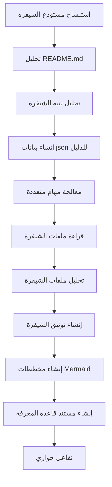

# OpenDeepWiki

[中文](README.zh-CN.md) | [English](README.md)

<div align="center">
  
  <h3>قاعدة معرفة برمجية مدفوعة بالذكاء الاصطناعي</h3>
</div>

# الراعي

[](https://share.302.ai/jXcaTv)

[302.AI](https://share.302.ai/jXcaTv) هي منصة تطبيقات ذكاء اصطناعي على مستوى المؤسسات بنظام الدفع حسب الاستخدام، توفر منصة مفتوحة ونظامًا بيئيًا مفتوح المصدر، مما يسمح للذكاء الاصطناعي بإيجاد حلول لكل احتياج. اضغط [هنا](https://share.302.ai/jXcaTv) للحصول على رصيد مجاني بقيمة 1 دولار!

## الوظائف

- **التحويل السريع:** يمكن تحويل جميع مستودعات الأكواد من Github وGitlab وGitee وGitea وغيرها إلى قواعد معرفة في غضون دقائق قليلة فقط.
- **دعم متعدد اللغات:** يدعم تحليل الأكواد وتوليد الوثائق لجميع لغات البرمجة.
- **هيكلية الكود:** يتم توليد مخططات Mermaid تلقائيًا لفهم هيكل الكود.
- **نماذج مخصصة:** يدعم النماذج المخصصة وواجهات برمجة التطبيقات المخصصة، مما يسمح بالتوسع حسب الحاجة.
- **تحليل ذكي بالذكاء الاصطناعي:** تحليل وفهم الأكواد وعلاقاتها بناءً على الذكاء الاصطناعي.
- **تحسين محركات البحث بسهولة:** توليد مستندات وقواعد معرفة صديقة لمحركات البحث باستخدام Next.js، مما يسهل فهرستها في محركات البحث.
- **تفاعل حواري:** يدعم التفاعل الحواري مع الذكاء الاصطناعي للحصول على معلومات مفصلة وطرق استخدام الكود، وفهمه بشكل معمق.

قائمة الميزات:
- [x] يدعم مستودعات أكواد متعددة (Github، Gitlab، Gitee، Gitea، إلخ)
- [x] يدعم لغات برمجة متعددة (Python، Java، C#، JavaScript، إلخ)
- [x] يدعم إدارة المستودعات، ويوفر وظائف الإضافة، الحذف، التعديل، والاستعلام عن المستودعات
- [x] يدعم مزودي ذكاء اصطناعي متعددين (OpenAI، AzureOpenAI، Anthropic، إلخ)
- [x] يدعم قواعد بيانات متعددة (SQLite، PostgreSQL، SqlServer، إلخ)
- [x] يدعم لغات متعددة (الصينية، الإنجليزية، الفرنسية، إلخ)
- [x] يدعم رفع ملفات ZIP ورفع الملفات المحلية
- [x] يوفر منصة ضبط بيانات لتوليد مجموعات بيانات الضبط الدقيق
- [x] يدعم إدارة المستودعات على مستوى الأدلة، مما يسمح بتوليد أدلة مخصصة وإنشاء وثائق ديناميكية
- [x] يدعم إدارة الأدلة الخاصة بالمستودعات، ويسمح بتعديل أدلة المستودع
- [x] يدعم إدارة المستخدمين على مستوى المستخدم، ويوفر وظائف إضافة، حذف، تعديل، واستعلام عن المستخدمين
- [ ] يدعم إدارة صلاحيات المستخدمين، ويوفر وظائف إدارة صلاحيات المستخدم (إضافة، حذف، تعديل، استعلام)
- [x] يدعم توليد مجموعات بيانات ضبط دقيق بإطارات عمل مختلفة على مستوى المستودع

# مقدمة المشروع

OpenDeepWiki هو مشروع مفتوح المصدر مستوحى من [DeepWiki](https://deepwiki.com/)، تم تطويره باستخدام .NET 9 وSemantic Kernel. يهدف إلى مساعدة المطورين على فهم واستخدام قواعد الأكواد بشكل أفضل من خلال توفير ميزات مثل تحليل الكود، توليد الوثائق، وإنشاء الرسوم البيانية للمعرفة.
- تحليل بنية الكود
- فهم المفاهيم الأساسية للمستودعات
- توليد وثائق الكود
- توليد README.md للكود تلقائيًا
  دعم MCP

يدعم OpenDeepWiki بروتوكول MCP (Model Context Protocol)
- يدعم توفير MCPServer لمستودع واحد وإجراء التحليل عليه.

الاستخدام: فيما يلي مثال على استخدام cursor:
```json
{
  "mcpServers": {
    "OpenDeepWiki":{
      "url": "http://عنوان خدمة OpenDeepWiki الخاص بك:المنفذ/sse?owner=AIDotNet&name=OpenDeepWiki"
    }
  }
}
```
- owner: اسم المنظمة أو مالك المستودع.
- name: اسم المستودع.

بعد إضافة المستودع، جرب طرح سؤال (يرجى التأكد من معالجة المستودع أولاً): ما هو OpenDeepWiki؟ النتيجة كما في الصورة: 

بهذه الطريقة، يمكنك استخدام OpenDeepWiki كـ MCPServer، ليكون متاحًا لاستدعاء نماذج الذكاء الاصطناعي الأخرى، مما يسهل تحليل وفهم مشروع مفتوح المصدر.

## 🚀 البدء السريع

1. استنساخ المستودع
```bash
git clone https://github.com/AIDotNet/OpenDeepWiki.git
cd OpenDeepWiki
```

2. افتح ملف `docker-compose.yml` وقم بتعديل متغيرات البيئة التالية:

Ollama:
```yaml
services:
  koalawiki:
    environment:
      - KOALAWIKI_REPOSITORIES=/repositories
      - TASK_MAX_SIZE_PER_USER=5 # الحد الأقصى لعدد مهام توليد الوثائق المتوازية لكل مستخدم بواسطة الذكاء الاصطناعي
      - CHAT_MODEL=qwen2.5:32b # يجب أن يدعم النموذج الوظائف
      - ANALYSIS_MODEL=qwen2.5:32b # نموذج التحليل المستخدم لتوليد بنية دليل المستودع
      - CHAT_API_KEY=sk-xxxxx # مفتاح API الخاص بك
      - LANGUAGE= # تعيين اللغة الافتراضية للتوليد إلى "الصينية"
      - ENDPOINT=https://عنوان Ollama الخاص بك: المنفذ/v1
      - DB_TYPE=sqlite
      - MODEL_PROVIDER=OpenAI # مزود النموذج، الافتراضي OpenAI، يدعم AzureOpenAI وAnthropic
      - DB_CONNECTION_STRING=Data Source=/data/KoalaWiki.db
      - EnableSmartFilter=true # تمكين التصفية الذكية قد يؤثر على قدرة الذكاء الاصطناعي في الحصول على دليل ملفات المستودع
      - UPDATE_INTERVAL # فترة التحديث المتزايد للمستودع، الوحدة: أيام
      - MAX_FILE_LIMIT=100 # الحد الأقصى لحجم الملفات المرفوعة، بالميجابايت
      - DEEP_RESEARCH_MODEL= # لإجراء بحث معمق حول النموذج واستخدام CHAT_MODEL إذا كان فارغًا
      - ENABLE_INCREMENTAL_UPDATE=true # هل يتم تمكين التحديثات المتزايدة
      - ENABLE_CODED_DEPENDENCY_ANALYSIS=false # هل يتم تمكين تحليل تبعيات الكود، قد يؤثر على جودة الكود
      - ENABLE_WAREHOUSE_FUNCTION_PROMPT_TASK=false # هل يتم تمكين توليد MCP Prompt
      - ENABLE_WAREHOUSE_DESCRIPTION_TASK=false # هل يتم تمكين توليد وصف المستودع
```

OpenAI:
```yaml
services:
  koalawiki:
    environment:
      - KOALAWIKI_REPOSITORIES=/repositories
      - TASK_MAX_SIZE_PER_USER=5 # الحد الأقصى لعدد مهام توليد الوثائق المتوازية لكل مستخدم بواسطة الذكاء الاصطناعي
      - CHAT_MODEL=DeepSeek-V3 # يجب أن يدعم النموذج الوظائف
      - ANALYSIS_MODEL= # نموذج التحليل المستخدم لتوليد بنية دليل المستودع
      - CHAT_API_KEY= # مفتاح API الخاص بك
      - LANGUAGE= # تعيين اللغة الافتراضية للتوليد إلى "الصينية"
      - ENDPOINT=https://api.token-ai.cn/v1
      - DB_TYPE=sqlite
      - MODEL_PROVIDER=OpenAI # مزود النموذج، الافتراضي OpenAI، يدعم AzureOpenAI وAnthropic
      - DB_CONNECTION_STRING=Data Source=/data/KoalaWiki.db
      - EnableSmartFilter=true # تمكين التصفية الذكية قد يؤثر على قدرة الذكاء الاصطناعي في الحصول على دليل ملفات المستودع
      - UPDATE_INTERVAL # فترة التحديث المتزايد للمستودع، الوحدة: أيام
      - MAX_FILE_LIMIT=100 # الحد الأقصى لحجم الملفات المرفوعة، بالميجابايت
      - DEEP_RESEARCH_MODEL= # لإجراء بحث معمق حول النموذج واستخدام CHAT_MODEL إذا كان فارغًا
      - ENABLE_INCREMENTAL_UPDATE=true # هل يتم تمكين التحديثات المتزايدة
      - ENABLE_CODED_DEPENDENCY_ANALYSIS=false # هل يتم تمكين تحليل تبعيات الكود، قد يؤثر على جودة الكود
      - ENABLE_WAREHOUSE_FUNCTION_PROMPT_TASK=false # هل يتم تمكين توليد MCP Prompt
      - ENABLE_WAREHOUSE_DESCRIPTION_TASK=false # هل يتم تمكين توليد وصف المستودع
```

AzureOpenAI:
```yaml
services:
  koalawiki:
    environment:
      - KOALAWIKI_REPOSITORIES=/repositories
      - TASK_MAX_SIZE_PER_USER=5 # الحد الأقصى لعدد مهام توليد الوثائق المتوازية لكل مستخدم بواسطة الذكاء الاصطناعي
      - CHAT_MODEL=DeepSeek-V3 # يجب أن يدعم النموذج الوظائف
      - ANALYSIS_MODEL= # نموذج التحليل المستخدم لتوليد بنية دليل المستودع
      - CHAT_API_KEY= # مفتاح API الخاص بك
      - LANGUAGE= # تعيين اللغة الافتراضية للتوليد إلى "الصينية"
      - ENDPOINT=https://your-azure-address.openai.azure.com/
      - DB_TYPE=sqlite
      - MODEL_PROVIDER=AzureOpenAI # مزود النموذج، الافتراضي OpenAI، يدعم AzureOpenAI وAnthropic
      - DB_CONNECTION_STRING=Data Source=/data/KoalaWiki.db
      - EnableSmartFilter=true # تمكين التصفية الذكية قد يؤثر على قدرة الذكاء الاصطناعي في الحصول على دليل ملفات المستودع
      - UPDATE_INTERVAL # فترة التحديث المتزايد للمستودع، الوحدة: أيام
      - MAX_FILE_LIMIT=100 # الحد الأقصى لحجم الملفات المرفوعة، بالميجابايت
      - DEEP_RESEARCH_MODEL= # لإجراء بحث معمق حول النموذج واستخدام CHAT_MODEL إذا كان فارغًا
      - ENABLE_INCREMENTAL_UPDATE=true # هل يتم تمكين التحديثات المتزايدة
      - ENABLE_CODED_DEPENDENCY_ANALYSIS=false # هل يتم تمكين تحليل تبعيات الكود، قد يؤثر على جودة الكود
      - ENABLE_WAREHOUSE_FUNCTION_PROMPT_TASK=false # هل يتم تمكين توليد MCP Prompt
      - ENABLE_WAREHOUSE_DESCRIPTION_TASK=false # هل يتم تمكين توليد وصف المستودع
```

Anthropic:
```yaml
services:
  koalawiki:
    environment:
      - KOALAWIKI_REPOSITORIES=/repositories
      - TASK_MAX_SIZE_PER_USER=5 # الحد الأقصى لعدد مهام توليد الوثائق المتوازية لكل مستخدم بواسطة الذكاء الاصطناعي
      - CHAT_MODEL=DeepSeek-V3 # يجب أن يدعم النموذج الوظائف
      - ANALYSIS_MODEL= # نموذج التحليل المستخدم لتوليد بنية دليل المستودع
      - CHAT_API_KEY= # مفتاح API الخاص بك
      - LANGUAGE= # تعيين اللغة الافتراضية للتوليد إلى "الصينية"
      - ENDPOINT=https://api.anthropic.com/
      - DB_TYPE=sqlite
      - MODEL_PROVIDER=Anthropic # مزود النموذج، الافتراضي OpenAI، يدعم AzureOpenAI وAnthropic
      - DB_CONNECTION_STRING=Data Source=/data/KoalaWiki.db
      - EnableSmartFilter=true # تمكين التصفية الذكية قد يؤثر على قدرة الذكاء الاصطناعي في الحصول على دليل ملفات المستودع
      - UPDATE_INTERVAL # فترة التحديث المتزايد للمستودع، الوحدة: أيام
      - MAX_FILE_LIMIT=100 # الحد الأقصى لحجم الملفات المرفوعة، بالميجابايت
      - DEEP_RESEARCH_MODEL= # لإجراء بحث معمق حول النموذج واستخدام CHAT_MODEL إذا كان فارغًا
      - ENABLE_INCREMENTAL_UPDATE=true # هل يتم تمكين التحديثات المتزايدة
      - ENABLE_CODED_DEPENDENCY_ANALYSIS=false # هل يتم تمكين تحليل تبعيات الكود، قد يؤثر على جودة الكود
      - ENABLE_WAREHOUSE_FUNCTION_PROMPT_TASK=false # هل يتم تمكين توليد MCP Prompt
      - ENABLE_WAREHOUSE_DESCRIPTION_TASK=false # هل يتم تمكين توليد وصف المستودع
```

> 💡 **كيفية الحصول على مفتاح API:**
> - احصل على مفتاح Google API من [Google AI Studio](https://makersuite.google.com/app/apikey)
> - احصل على مفتاح OpenAI API من [OpenAI Platform](https://platform.openai.com/api-keys)
> - احصل على CoresHub من [CoresHub](https://console.coreshub.cn/xb3/maas/global-keys) [اضغط هنا للحصول على 50 مليون توكن مجاني](https://account.coreshub.cn/signup?invite=ZmpMQlZxYVU=)
> - احصل على TokenAI من [TokenAI](https://api.token-ai.cn/)

3. بدء الخدمة

يمكنك استخدام أوامر Makefile المقدمة لإدارة التطبيق بسهولة:

```bash
# بناء جميع صور Docker
make build

# بدء جميع الخدمات في وضع الخلفية
make up

# أو البدء في وضع التطوير (مع ظهور السجلات)
```
make dev
```

ثم قم بزيارة http://localhost:8090 للوصول إلى قاعدة المعرفة.

للمزيد من الأوامر:
```bash
make help
```

### لمستخدمي ويندوز (بدون make)

إذا كنت تستخدم ويندوز ولا يتوفر لديك أمر `make`، يمكنك استخدام أوامر Docker Compose التالية مباشرة:

```bash
# بناء جميع صور Docker
docker-compose build

# بدء جميع الخدمات في وضع الخلفية
docker-compose up -d

# بدء في وضع التطوير (مع ظهور السجلات)
docker-compose up

# إيقاف جميع الخدمات
docker-compose down

# عرض السجلات
docker-compose logs -f
```

لبناء معماريات أو خدمات محددة، استخدم:

```bash
# بناء الواجهة الخلفية فقط
docker-compose build koalawiki

# بناء الواجهة الأمامية فقط
docker-compose build koalawiki-web

# البناء مع معاملات المعمارية
docker-compose build --build-arg ARCH=arm64
docker-compose build --build-arg ARCH=amd64
```


### النشر على Sealos مع وصول عام للإنترنت
[](https://bja.sealos.run/?openapp=system-template%3FtemplateName%3DOpenDeepWiki)
للحصول على خطوات مفصلة، راجع: [النشر بنقرة واحدة لـ OpenDeepWiki كتطبيق Sealos مكشوف على الشبكة العامة باستخدام القوالب](https://raw.githubusercontent.com/AIDotNet/OpenDeepWiki/main/scripts/sealos/README.zh-CN.md)

## 🔍 كيف يعمل

يستخدم OpenDeepWiki الذكاء الاصطناعي من أجل:
 - استنساخ مستودع الشيفرة محلياً
 - التحليل بناءً على ملف README.md الخاص بالمستودع
 - تحليل بنية الشيفرة وقراءة ملفات الشيفرة حسب الحاجة، ثم إنشاء بيانات json للدليل
 - معالجة المهام حسب الدليل، كل مهمة هي مستند
 - قراءة ملفات الشيفرة، تحليل ملفات الشيفرة، إنشاء توثيق للشيفرة، وإنشاء مخططات Mermaid تمثل تبعيات بنية الشيفرة
 - إنشاء مستند قاعدة المعرفة النهائي
 - تحليل المستودع من خلال التفاعل الحواري والاستجابة لاستفسارات المستخدم


## التكوين المتقدم

### متغيرات البيئة
  - KOALAWIKI_REPOSITORIES  مسار تخزين المستودعات
  - TASK_MAX_SIZE_PER_USER  الحد الأقصى للمهام المتوازية لإنشاء مستندات الذكاء الاصطناعي لكل مستخدم
  - CHAT_MODEL  يجب أن يدعم النموذج الوظائف
  - ENDPOINT  نقطة نهاية API
  - ANALYSIS_MODEL  نموذج التحليل لإنشاء بنية دليل المستودع
  - CHAT_API_KEY  مفتاح API الخاص بك
  - LANGUAGE  تغيير لغة المستندات المولدة
  - DB_TYPE  نوع قاعدة البيانات، الافتراضي sqlite
  - MODEL_PROVIDER  موفر النموذج، افتراضياً OpenAI، يدعم Azure وOpenAI وAnthropic
  - DB_CONNECTION_STRING  سلسلة اتصال قاعدة البيانات
  - EnableSmartFilter ما إذا كان التصفية الذكية مفعلة أو لا، قد يؤثر ذلك على كيفية حصول الذكاء الاصطناعي على دليل ملفات المستودع
  - UPDATE_INTERVAL فترة تحديث المستودع التدريجي، الوحدة: أيام
  - MAX_FILE_LIMIT الحد الأقصى لتحميل الملفات، بالميغابايت
  - DEEP_RESEARCH_MODEL إجراء بحث معمق على النموذج واستخدام CHAT_MODEL عند الفراغ
  - ENABLE_INCREMENTAL_UPDATE ما إذا كان تفعيل التحديث التدريجي
  - ENABLE_CODED_DEPENDENCY_ANALYSIS ما إذا كان تفعيل تحليل تبعيات الشيفرة، قد يؤثر ذلك على جودة الشيفرة.
  - ENABLE_WAREHOUSE_FUNCTION_PROMPT_TASK  # ما إذا كان تفعيل توليد MCP Prompt أم لا.
  - ENABLE_WAREHOUSE_DESCRIPTION_TASK # ما إذا كان تفعيل توليد وصف المستودع

### البناء لمعمارية مختلفة
يوفر ملف Makefile أوامر للبناء لمعالجات CPU مختلفة:

```bash
# بناء لمعمارية ARM
make build-arm

# بناء لمعمارية AMD
make build-amd

# بناء الواجهة الخلفية فقط لمعمارية ARM
make build-backend-arm

# بناء الواجهة الأمامية فقط لمعمارية AMD
make build-frontend-amd
```

## Discord

[انضم إلينا](https://discord.gg/8sxUNacv)

## WeChat 


## 📄 الرخصة
هذا المشروع مرخص بموجب رخصة MIT - راجع ملف [LICENSE](https://raw.githubusercontent.com/AIDotNet/OpenDeepWiki/main/LICENSE) للمزيد من التفاصيل.

## تاريخ النجوم

[](https://www.star-history.com/#AIDotNet/OpenDeepWiki&Date)



---


Tranlated By [Open Ai Tx](https://github.com/OpenAiTx/OpenAiTx) | Last indexed: 2025-06-11


---