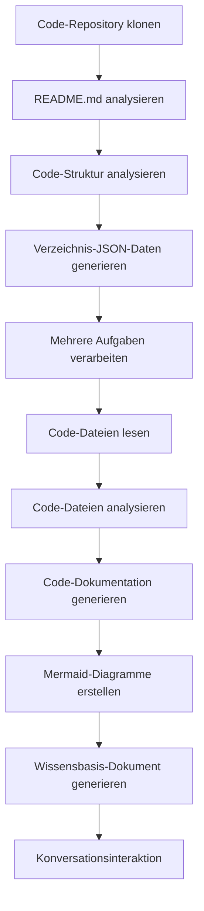

# OpenDeepWiki

[中文](https://raw.githubusercontent.com/AIDotNet/OpenDeepWiki/main/README.zh-CN.md) | [English](https://raw.githubusercontent.com/AIDotNet/OpenDeepWiki/main/README.md)

<div align="center">
  
  <h3>KI-gesteuerte Code-Wissensdatenbank</h3>
</div>

# Sponsor

[](https://share.302.ai/jXcaTv)

[302.AI](https://share.302.ai/jXcaTv) ist eine Pay-as-you-go, All-in-One-Unternehmensplattform für KI-Anwendungen. Sie bietet eine offene Plattform und ein Open-Source-Ökosystem, sodass KI für jede Anforderung Lösungen finden kann. Klicken Sie [hier](https://share.302.ai/jXcaTv), um 1$ Gratis-Guthaben zu erhalten!

## Funktion

- **Schnelle Umwandlung:** Alle Code-Repositories von Github, Gitlab, Gitee, Gitea und anderen können in nur wenigen Minuten in Wissensdatenbanken umgewandelt werden.
- **Mehrsprachige Unterstützung:** Codeanalyse und Dokumentationsgenerierung werden für alle Programmiersprachen unterstützt.
- **Code-Struktur:** Automatische Mermaid-Diagramme werden generiert, um die Code-Struktur zu verstehen.
- **Benutzerdefinierte Modelle:** Benutzerdefinierte Modelle und APIs werden unterstützt, sodass Erweiterungen nach Bedarf möglich sind.
- **KI-Intelligente Analyse:** Codeanalyse und Verständnis von Codebeziehungen auf KI-Basis.
- **Einfache SEO:** Mit Next.js SEO-freundliche Dokumente und Wissensdatenbanken generieren, damit Suchmaschinen die Inhalte leichter indexieren können.
- **Dialogische Interaktion:** Unterstützt dialogische Interaktion mit KI, um detaillierte Informationen und Nutzungsmethoden des Codes zu erhalten und um den Code tiefgehend zu verstehen.

Funktionsliste:
- [x] Unterstützung mehrerer Code-Repositories (Github, Gitlab, Gitee, Gitea, usw.)
- [x] Unterstützung mehrerer Programmiersprachen (Python, Java, C#, JavaScript, usw.)
- [x] Unterstützung für Repository-Verwaltung (Hinzufügen, Löschen, Bearbeiten und Abfragen von Repositories)
- [x] Unterstützung mehrerer KI-Anbieter (OpenAI, AzureOpenAI, Anthropic, usw.)
- [x] Unterstützung mehrerer Datenbanken (SQLite, PostgreSQL, SqlServer, usw.)
- [x] Unterstützung mehrerer Sprachen (Chinesisch, Englisch, Französisch, usw.)
- [x] Unterstützung für das Hochladen von ZIP-Dateien und lokalen Dateien
- [x] Bereitstellung einer Daten-Fine-Tuning-Plattform zum Generieren von Fine-Tuning-Datensätzen
- [x] Unterstützung für Management auf Verzeichnisebene, benutzerdefinierte Verzeichniserstellung und dynamische Dokumentationserstellung
- [x] Unterstützung für Verzeichnisverwaltung des Repositories, Modifikation von Repository-Verzeichnissen möglich
- [x] Unterstützung für Benutzerverwaltung (Hinzufügen, Löschen, Bearbeiten und Abfragen von Benutzern)
- [ ] Unterstützung für Benutzerberechtigungsverwaltung (Hinzufügen, Löschen, Bearbeiten und Abfragen von Benutzerberechtigungen)
- [x] Unterstützung für die Generierung verschiedener Fine-Tuning-Framework-Datensätze auf Repository-Ebene

# Projekteinführung

OpenDeepWiki ist ein Open-Source-Projekt, inspiriert von [DeepWiki](https://deepwiki.com/), entwickelt mit .NET 9 und Semantic Kernel. Ziel ist es, Entwicklern dabei zu helfen, Codebasen besser zu verstehen und zu nutzen, indem Funktionen wie Codeanalyse, Dokumentationsgenerierung und Wissensgraph-Erstellung bereitgestellt werden.
- Analyse der Codestruktur
- Verständnis der Kernkonzepte von Repositories
- Generierung von Codedokumentationen
- Automatische Erstellung von README.md für den Code
  MCP-Unterstützung

OpenDeepWiki unterstützt MCP (Model Context Protocol)
- Bietet einen MCPServer für ein einzelnes Repository und ermöglicht Analyse eines einzelnen Repositories.

Verwendung: Nachfolgend ein Beispiel für die Nutzung von cursor: 
```json
{
  "mcpServers": {
    "OpenDeepWiki":{
      "url": "http://Ihre OpenDeepWiki-Service-IP:Port/sse?owner=AIDotNet&name=OpenDeepWiki"
    }
  }
}
```
- owner: Name der Organisation oder des Besitzers des Repositories.
- name: Name des Repositories.

Nach dem Hinzufügen des Repositories testen Sie mit einer Frage (bitte beachten Sie, dass das Repository zuvor verarbeitet werden muss): Was ist OpenDeepWiki? Das Ergebnis sieht wie folgt aus: 

So können Sie OpenDeepWiki als MCPServer nutzen, sodass andere KI-Modelle darauf zugreifen und die Analyse und das Verständnis eines Open-Source-Projekts erleichtert wird.

## 🚀 Schnellstart

1. Repository klonen
```bash
git clone https://github.com/AIDotNet/OpenDeepWiki.git
cd OpenDeepWiki
```

2. Öffnen Sie die Datei `docker-compose.yml` und passen Sie die folgenden Umgebungsvariablen an:

Ollama:
```yaml
services:
  koalawiki:
    environment:
      - KOALAWIKI_REPOSITORIES=/repositories
      - TASK_MAX_SIZE_PER_USER=5 # Maximale Anzahl paralleler Dokumentationsgenerierungsaufgaben pro Benutzer durch KI
      - CHAT_MODEL=qwen2.5:32b # Modell muss Funktionen unterstützen
      - ANALYSIS_MODEL=qwen2.5:32b # Analysemodell zur Generierung der Repository-Verzeichnisstruktur
      - CHAT_API_KEY=sk-xxxxx # Ihr API-Key
      - LANGUAGE= # Standardsprache für die Generierung, z.B. "Chinese"
      - ENDPOINT=https://Ihre-Ollama-IP:Port/v1
      - DB_TYPE=sqlite
      - MODEL_PROVIDER=OpenAI # Modellanbieter, Standard ist OpenAI, unterstützt AzureOpenAI und Anthropic
      - DB_CONNECTION_STRING=Data Source=/data/KoalaWiki.db
      - EnableSmartFilter=true # Ob intelligentes Filtern aktiviert ist, kann beeinflussen, wie die KI das Dateiverzeichnis des Repositories erhält
      - UPDATE_INTERVAL # Intervall für inkrementelle Updates des Repositories, Einheit: Tage
      - MAX_FILE_LIMIT=100 # Maximales Limit für hochgeladene Dateien, in MB
      - DEEP_RESEARCH_MODEL= # Tiefgehende Analyse des Modells, bei leer wird CHAT_MODEL verwendet
      - ENABLE_INCREMENTAL_UPDATE=true # Ob inkrementelle Updates aktiviert werden sollen
      - ENABLE_CODED_DEPENDENCY_ANALYSIS=false # Ob Codeabhängigkeitsanalyse aktiviert wird, kann sich auf die Codequalität auswirken
      - ENABLE_WAREHOUSE_FUNCTION_PROMPT_TASK=false # Ob die MCP Prompt-Generierung aktiviert wird
      - ENABLE_WAREHOUSE_DESCRIPTION_TASK=false # Ob die Generierung einer Repository-Beschreibung aktiviert wird
```

OpenAI:
```yaml
services:
  koalawiki:
    environment:
      - KOALAWIKI_REPOSITORIES=/repositories
      - TASK_MAX_SIZE_PER_USER=5 # Maximale Anzahl paralleler Dokumentationsgenerierungsaufgaben pro Benutzer durch KI
      - CHAT_MODEL=DeepSeek-V3 # Modell muss Funktionen unterstützen
      - ANALYSIS_MODEL= # Analysemodell zur Generierung der Repository-Verzeichnisstruktur
      - CHAT_API_KEY= # Ihr API-Key
      - LANGUAGE= # Standardsprache für die Generierung, z.B. "Chinese"
      - ENDPOINT=https://api.token-ai.cn/v1
      - DB_TYPE=sqlite
      - MODEL_PROVIDER=OpenAI # Modellanbieter, Standard ist OpenAI, unterstützt AzureOpenAI und Anthropic
      - DB_CONNECTION_STRING=Data Source=/data/KoalaWiki.db
      - EnableSmartFilter=true # Ob intelligentes Filtern aktiviert ist, kann beeinflussen, wie die KI das Dateiverzeichnis des Repositories erhält
      - UPDATE_INTERVAL # Intervall für inkrementelle Updates des Repositories, Einheit: Tage
      - MAX_FILE_LIMIT=100 # Maximales Limit für hochgeladene Dateien, in MB
      - DEEP_RESEARCH_MODEL= # Tiefgehende Analyse des Modells, bei leer wird CHAT_MODEL verwendet
      - ENABLE_INCREMENTAL_UPDATE=true # Ob inkrementelle Updates aktiviert werden sollen
      - ENABLE_CODED_DEPENDENCY_ANALYSIS=false # Ob Codeabhängigkeitsanalyse aktiviert wird, kann sich auf die Codequalität auswirken
      - ENABLE_WAREHOUSE_FUNCTION_PROMPT_TASK=false # Ob die MCP Prompt-Generierung aktiviert wird
      - ENABLE_WAREHOUSE_DESCRIPTION_TASK=false # Ob die Generierung einer Repository-Beschreibung aktiviert wird
```

AzureOpenAI:
```yaml
services:
  koalawiki:
    environment:
      - KOALAWIKI_REPOSITORIES=/repositories
      - TASK_MAX_SIZE_PER_USER=5 # Maximale Anzahl paralleler Dokumentationsgenerierungsaufgaben pro Benutzer durch KI
      - CHAT_MODEL=DeepSeek-V3 # Modell muss Funktionen unterstützen
      - ANALYSIS_MODEL= # Analysemodell zur Generierung der Repository-Verzeichnisstruktur
      - CHAT_API_KEY= # Ihr API-Key
      - LANGUAGE= # Standardsprache für die Generierung, z.B. "Chinese"
      - ENDPOINT=https://ihre-azure-adresse.openai.azure.com/
      - DB_TYPE=sqlite
      - MODEL_PROVIDER=AzureOpenAI # Modellanbieter, Standard ist OpenAI, unterstützt AzureOpenAI und Anthropic
      - DB_CONNECTION_STRING=Data Source=/data/KoalaWiki.db
      - EnableSmartFilter=true # Ob intelligentes Filtern aktiviert ist, kann beeinflussen, wie die KI das Dateiverzeichnis des Repositories erhält
      - UPDATE_INTERVAL # Intervall für inkrementelle Updates des Repositories, Einheit: Tage
      - MAX_FILE_LIMIT=100 # Maximales Limit für hochgeladene Dateien, in MB
      - DEEP_RESEARCH_MODEL= # Tiefgehende Analyse des Modells, bei leer wird CHAT_MODEL verwendet
      - ENABLE_INCREMENTAL_UPDATE=true # Ob inkrementelle Updates aktiviert werden sollen
      - ENABLE_CODED_DEPENDENCY_ANALYSIS=false # Ob Codeabhängigkeitsanalyse aktiviert wird, kann sich auf die Codequalität auswirken
      - ENABLE_WAREHOUSE_FUNCTION_PROMPT_TASK=false # Ob die MCP Prompt-Generierung aktiviert wird
      - ENABLE_WAREHOUSE_DESCRIPTION_TASK=false # Ob die Generierung einer Repository-Beschreibung aktiviert wird
```

Anthropic:
```yaml
services:
  koalawiki:
    environment:
      - KOALAWIKI_REPOSITORIES=/repositories
      - TASK_MAX_SIZE_PER_USER=5 # Maximale Anzahl paralleler Dokumentationsgenerierungsaufgaben pro Benutzer durch KI
      - CHAT_MODEL=DeepSeek-V3 # Modell muss Funktionen unterstützen
      - ANALYSIS_MODEL= # Analysemodell zur Generierung der Repository-Verzeichnisstruktur
      - CHAT_API_KEY= # Ihr API-Key
      - LANGUAGE= # Standardsprache für die Generierung, z.B. "Chinese"
      - ENDPOINT=https://api.anthropic.com/
      - DB_TYPE=sqlite
      - MODEL_PROVIDER=Anthropic # Modellanbieter, Standard ist OpenAI, unterstützt AzureOpenAI und Anthropic
      - DB_CONNECTION_STRING=Data Source=/data/KoalaWiki.db
      - EnableSmartFilter=true # Ob intelligentes Filtern aktiviert ist, kann beeinflussen, wie die KI das Dateiverzeichnis des Repositories erhält
      - UPDATE_INTERVAL # Intervall für inkrementelle Updates des Repositories, Einheit: Tage
      - MAX_FILE_LIMIT=100 # Maximales Limit für hochgeladene Dateien, in MB
      - DEEP_RESEARCH_MODEL= # Tiefgehende Analyse des Modells, bei leer wird CHAT_MODEL verwendet
      - ENABLE_INCREMENTAL_UPDATE=true # Ob inkrementelle Updates aktiviert werden sollen
      - ENABLE_CODED_DEPENDENCY_ANALYSIS=false # Ob Codeabhängigkeitsanalyse aktiviert wird, kann sich auf die Codequalität auswirken
      - ENABLE_WAREHOUSE_FUNCTION_PROMPT_TASK=false # Ob die MCP Prompt-Generierung aktiviert wird
      - ENABLE_WAREHOUSE_DESCRIPTION_TASK=false # Ob die Generierung einer Repository-Beschreibung aktiviert wird
```

> 💡 **So erhalten Sie einen API-Key:**
> - Google API-Schlüssel erhalten [Google AI Studio](https://makersuite.google.com/app/apikey)
> - OpenAI API-Schlüssel erhalten [OpenAI Platform](https://platform.openai.com/api-keys)
> - CoresHub erhalten [CoresHub](https://console.coreshub.cn/xb3/maas/global-keys) [Hier klicken für 50 Millionen kostenlose Tokens](https://account.coreshub.cn/signup?invite=ZmpMQlZxYVU=)
> - TokenAI erhalten [TokenAI](https://api.token-ai.cn/)

3. Dienst starten

Sie können die bereitgestellten Makefile-Befehle verwenden, um die Anwendung einfach zu verwalten:

```bash
# Baue alle Docker-Images
make build

# Starte alle Services im Hintergrundmodus
make up

# Oder im Entwicklungsmodus starten (mit sichtbaren Logs)
```
make dev
```

Dann besuchen Sie http://localhost:8090, um auf die Wissensdatenbank zuzugreifen.

Für weitere Befehle:
```bash
make help
```

### Für Windows-Benutzer (ohne make)

Wenn Sie Windows verwenden und `make` nicht verfügbar ist, können Sie diese Docker Compose-Befehle direkt verwenden:

```bash
# Baue alle Docker-Images
docker-compose build

# Starte alle Dienste im Hintergrund
docker-compose up -d

# Starte im Entwicklungsmodus (mit sichtbaren Logs)
docker-compose up

# Stoppe alle Dienste
docker-compose down

# Logs anzeigen
docker-compose logs -f
```

Zum Bauen bestimmter Architekturen oder Dienste verwenden Sie:

```bash
# Nur Backend bauen
docker-compose build koalawiki

# Nur Frontend bauen
docker-compose build koalawiki-web

# Mit Architekturparametern bauen
docker-compose build --build-arg ARCH=arm64
docker-compose build --build-arg ARCH=amd64
```


### Deployment auf Sealos mit öffentlichem Internetzugang
[](https://bja.sealos.run/?openapp=system-template%3FtemplateName%3DOpenDeepWiki)
Für detaillierte Schritte siehe: [One-Click Deployment of OpenDeepWiki as a Sealos Application Exposed to the Public Network Using Templates](https://raw.githubusercontent.com/AIDotNet/OpenDeepWiki/main/scripts/sealos/README.zh-CN.md)

## 🔍 Funktionsweise

OpenDeepWiki verwendet KI, um:
 - Code-Repository lokal zu klonen
 - Analyse basierend auf Repository README.md
 - Code-Struktur analysieren und bei Bedarf Code-Dateien lesen, dann Verzeichnis-JSON-Daten generieren
 - Aufgaben entsprechend dem Verzeichnis verarbeiten, jede Aufgabe ist ein Dokument
 - Code-Dateien lesen, Code-Dateien analysieren, Code-Dokumentation generieren und Mermaid-Diagramme erstellen, die Code-Strukturabhängigkeiten darstellen
 - Das finale Wissensbasis-Dokument generieren
 - Repository durch Konversationsinteraktion analysieren und auf Benutzeranfragen antworten


## Erweiterte Konfiguration

### Umgebungsvariablen
  - KOALAWIKI_REPOSITORIES  Pfad zur Speicherung der Repositories
  - TASK_MAX_SIZE_PER_USER  Maximale parallele Aufgaben für KI-Dokumentgenerierung pro Benutzer
  - CHAT_MODEL  Modell muss Funktionen unterstützen
  - ENDPOINT  API-Endpunkt
  - ANALYSIS_MODEL  Analysemodell zur Generierung der Repository-Verzeichnisstruktur
  - CHAT_API_KEY  Ihr API-Schlüssel
  - LANGUAGE  Sprache der generierten Dokumente ändern
  - DB_TYPE  Datenbanktyp, Standard ist sqlite
  - MODEL_PROVIDER  Modell-Anbieter, standardmäßig OpenAI, unterstützt Azure, OpenAI und Anthropic
  - DB_CONNECTION_STRING  Datenbank-Verbindungszeichenfolge
  - EnableSmartFilter Ob intelligentes Filtern aktiviert ist, kann beeinflussen, wie die KI das Datei­verzeichnis des Repositories erhält
  - UPDATE_INTERVAL Intervall für inkrementelle Updates des Repositories, Einheit: Tage
  - MAX_FILE_LIMIT Maximale Grenze für das Hochladen von Dateien, in MB
  - DEEP_RESEARCH_MODEL Führe eingehende Recherche zum Modell durch und verwende CHAT_MODEL, falls leer
  - ENABLE_INCREMENTAL_UPDATE Ob inkrementelle Updates aktiviert werden
  - ENABLE_CODED_DEPENDENCY_ANALYSIS Ob Code-Abhängigkeitsanalyse aktiviert wird, dies könnte die Codequalität beeinflussen
  - ENABLE_WAREHOUSE_FUNCTION_PROMPT_TASK  # Ob MCP Prompt-Generierung aktiviert ist
  - ENABLE_WAREHOUSE_DESCRIPTION_TASK # Ob die Generierung von Repository-Beschreibungen aktiviert ist

### Build für verschiedene Architekturen
Das Makefile stellt Befehle zum Bauen für verschiedene CPU-Architekturen bereit:

```bash
# Build für ARM-Architektur
make build-arm

# Build für AMD-Architektur
make build-amd

# Nur Backend für ARM bauen
make build-backend-arm

# Nur Frontend für AMD bauen
make build-frontend-amd
```

## Discord

[join us](https://discord.gg/8sxUNacv)

## WeChat 


## 📄 Lizenz
Dieses Projekt steht unter der MIT-Lizenz – siehe die [LICENSE](https://raw.githubusercontent.com/AIDotNet/OpenDeepWiki/main/LICENSE)-Datei für Details.

## Star History

[](https://www.star-history.com/#AIDotNet/OpenDeepWiki&Date)



---


Tranlated By [Open Ai Tx](https://github.com/OpenAiTx/OpenAiTx) | Last indexed: 2025-06-11


---