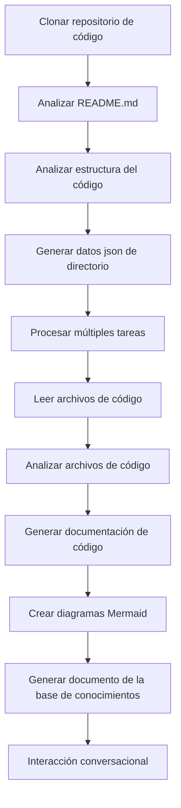

# OpenDeepWiki

[中文](README.zh-CN.md) | [English](README.md)

<div align="center">
  
  <h3>Base de Conocimiento de Código Impulsada por IA</h3>
</div>

# Patrocinador

[](https://share.302.ai/jXcaTv)

[302.AI](https://share.302.ai/jXcaTv) es una plataforma de aplicaciones de IA a nivel empresarial, todo en uno y de pago por uso. Ofrece una plataforma abierta y un ecosistema de código abierto, permitiendo que la IA encuentre soluciones para cada necesidad. ¡Haz clic [aquí](https://share.302.ai/jXcaTv) para obtener tu crédito gratuito de $1!

## Función

- **Conversión Rápida:** Todos los repositorios de código de Github, Gitlab, Gitee, Gitea y otros pueden convertirse en bases de conocimiento en solo unos minutos.
- **Soporte Multilenguaje:** Se admite el análisis de código y la generación de documentación para todos los lenguajes de programación.
- **Estructura de Código:** Se generan automáticamente diagramas Mermaid para entender la estructura del código.
- **Modelos Personalizados:** Se admiten modelos y API personalizados, permitiendo la expansión según sea necesario.
- **Análisis Inteligente IA:** Análisis de código y comprensión de relaciones de código basado en IA.
- **SEO Fácil:** Genera documentos y bases de conocimiento SEO-friendly utilizando Next.js, facilitando la indexación por motores de búsqueda.
- **Interacción Dialógica:** Soporta la interacción dialógica con IA para obtener información detallada y métodos de uso del código, y para comprender profundamente el código.

Lista de características:
- [x] Soporta múltiples repositorios de código (Github, Gitlab, Gitee, Gitea, etc.)
- [x] Soporta múltiples lenguajes de programación (Python, Java, C#, JavaScript, etc.)
- [x] Soporta gestión de repositorios, proporcionando funciones para agregar, eliminar, modificar y consultar repositorios
- [x] Soporta múltiples proveedores de IA (OpenAI, AzureOpenAI, Anthropic, etc.)
- [x] Soporta múltiples bases de datos (SQLite, PostgreSQL, SqlServer, etc.)
- [x] Soporta múltiples idiomas (chino, inglés, francés, etc.)
- [x] Soporta la carga de archivos ZIP y archivos locales
- [x] Proporciona una plataforma de ajuste fino de datos para generar conjuntos de datos de ajuste fino
- [x] Soporta la gestión a nivel de directorio de los repositorios, permitiendo la generación personalizada de directorios y la creación dinámica de documentación
- [x] Soporta la gestión del directorio de repositorios, permitiendo la modificación de los directorios del repositorio
- [x] Soporta la gestión a nivel de usuario, proporcionando funciones de gestión de usuarios para agregar, eliminar, modificar y consultar usuarios
- [ ] Soporta la gestión de permisos de usuario, proporcionando funciones de gestión de permisos para agregar, eliminar, modificar y consultar permisos de usuario
- [x] Soporta la generación de diferentes conjuntos de datos de ajuste fino a nivel de repositorio

# Introducción al Proyecto

OpenDeepWiki es un proyecto de código abierto inspirado en [DeepWiki](https://deepwiki.com/), desarrollado usando .NET 9 y Semantic Kernel. Su objetivo es ayudar a los desarrolladores a comprender y utilizar mejor las bases de código, proporcionando funciones como análisis de código, generación de documentación y creación de gráficos de conocimiento.
- Analizar la estructura del código
- Comprender los conceptos clave de los repositorios
- Generar documentación de código
- Crear automáticamente README.md para el código
  Soporte MCP

OpenDeepWiki soporta MCP (Model Context Protocol)
- Soporta proporcionar un MCPServer para un solo repositorio y realizar análisis sobre un único repositorio.

Uso: El siguiente es el uso de cursor:
```json
{
  "mcpServers": {
    "OpenDeepWiki":{
      "url": "http://Tu IP:puerto del servicio OpenDeepWiki/sse?owner=AIDotNet&name=OpenDeepWiki"
    }
  }
}
```
- owner: Es el nombre de la organización o propietario del repositorio.
- name: Es el nombre del repositorio.

Después de agregar el repositorio, prueba haciendo una pregunta (ten en cuenta que antes de esto el repositorio debe ser procesado primero): ¿Qué es OpenDeepWiki? El efecto se muestra en la imagen: 

De esta manera, puedes usar OpenDeepWiki como un MCPServer, haciéndolo disponible para que otros modelos de IA lo utilicen, facilitando el análisis y la comprensión de un proyecto de código abierto.

## 🚀 Inicio Rápido

1. Clona el repositorio
```bash
git clone https://github.com/AIDotNet/OpenDeepWiki.git
cd OpenDeepWiki
```

2. Abre el archivo `docker-compose.yml` y modifica las siguientes variables de entorno:

Ollama:
```yaml
services:
  koalawiki:
    environment:
      - KOALAWIKI_REPOSITORIES=/repositories
      - TASK_MAX_SIZE_PER_USER=5 # Número máximo de tareas paralelas de generación de documentos por usuario por IA
      - CHAT_MODEL=qwen2.5:32b # El modelo debe soportar funciones
      - ANALYSIS_MODEL=qwen2.5:32b # Modelo de análisis utilizado para generar la estructura del directorio del repositorio
      - CHAT_API_KEY=sk-xxxxx # Tu clave API
      - LANGUAGE= # Establece el idioma predeterminado para la generación como "chino"
      - ENDPOINT=https://La IP de tu Ollama: Puerto/v1
      - DB_TYPE=sqlite
      - MODEL_PROVIDER=OpenAI # Proveedor de modelo, por defecto es OpenAI, soporta AzureOpenAI y Anthropic
      - DB_CONNECTION_STRING=Data Source=/data/KoalaWiki.db
      - EnableSmartFilter=true # Si el filtrado inteligente está habilitado o no puede afectar cómo la IA obtiene el directorio de archivos del repositorio
      - UPDATE_INTERVAL # Intervalo de actualización incremental del repositorio, unidad: días
      - MAX_FILE_LIMIT=100 # Límite máximo para cargar archivos, en MB
      - DEEP_RESEARCH_MODEL= # Investigar en profundidad el modelo y usar CHAT_MODEL si está vacío
      - ENABLE_INCREMENTAL_UPDATE=true # Si se habilitan actualizaciones incrementales
      - ENABLE_CODED_DEPENDENCY_ANALYSIS=false # Si se habilita el análisis de dependencias de código, esto podría afectar la calidad del código.
      - ENABLE_WAREHOUSE_FUNCTION_PROMPT_TASK=false # Si se habilita o no la generación de MCP Prompt.
      - ENABLE_WAREHOUSE_DESCRIPTION_TASK=false # Si se habilita la generación de la descripción del repositorio
```

OpenAI:
```yaml
services:
  koalawiki:
    environment:
      - KOALAWIKI_REPOSITORIES=/repositories
      - TASK_MAX_SIZE_PER_USER=5 # Número máximo de tareas paralelas de generación de documentos por usuario por IA
      - CHAT_MODEL=DeepSeek-V3 # El modelo debe soportar funciones
      - ANALYSIS_MODEL= # Modelo de análisis utilizado para generar la estructura del directorio del repositorio
      - CHAT_API_KEY= # Tu clave API
      - LANGUAGE= # Establece el idioma predeterminado para la generación como "chino"
      - ENDPOINT=https://api.token-ai.cn/v1
      - DB_TYPE=sqlite
      - MODEL_PROVIDER=OpenAI # Proveedor de modelo, por defecto es OpenAI, soporta AzureOpenAI y Anthropic
      - DB_CONNECTION_STRING=Data Source=/data/KoalaWiki.db
      - EnableSmartFilter=true # Si el filtrado inteligente está habilitado o no puede afectar cómo la IA obtiene el directorio de archivos del repositorio
      - UPDATE_INTERVAL # Intervalo de actualización incremental del repositorio, unidad: días
      - MAX_FILE_LIMIT=100 # Límite máximo para cargar archivos, en MB
      - DEEP_RESEARCH_MODEL= # Investigar en profundidad el modelo y usar CHAT_MODEL si está vacío
      - ENABLE_INCREMENTAL_UPDATE=true # Si se habilitan actualizaciones incrementales
      - ENABLE_CODED_DEPENDENCY_ANALYSIS=false # Si se habilita el análisis de dependencias de código, esto podría afectar la calidad del código.
      - ENABLE_WAREHOUSE_FUNCTION_PROMPT_TASK=false # Si se habilita o no la generación de MCP Prompt.
      - ENABLE_WAREHOUSE_DESCRIPTION_TASK=false # Si se habilita la generación de la descripción del repositorio
```

AzureOpenAI:
```yaml
services:
  koalawiki:
    environment:
      - KOALAWIKI_REPOSITORIES=/repositories
      - TASK_MAX_SIZE_PER_USER=5 # Número máximo de tareas paralelas de generación de documentos por usuario por IA
      - CHAT_MODEL=DeepSeek-V3 # El modelo debe soportar funciones
      - ANALYSIS_MODEL= # Modelo de análisis utilizado para generar la estructura del directorio del repositorio
      - CHAT_API_KEY= # Tu clave API
      - LANGUAGE= # Establece el idioma predeterminado para la generación como "chino"
      - ENDPOINT=https://tu-direccion-azure.openai.azure.com/
      - DB_TYPE=sqlite
      - MODEL_PROVIDER=AzureOpenAI # Proveedor de modelo, por defecto es OpenAI, soporta AzureOpenAI y Anthropic
      - DB_CONNECTION_STRING=Data Source=/data/KoalaWiki.db
      - EnableSmartFilter=true # Si el filtrado inteligente está habilitado o no puede afectar cómo la IA obtiene el directorio de archivos del repositorio
      - UPDATE_INTERVAL # Intervalo de actualización incremental del repositorio, unidad: días
      - MAX_FILE_LIMIT=100 # Límite máximo para cargar archivos, en MB
      - DEEP_RESEARCH_MODEL= # Investigar en profundidad el modelo y usar CHAT_MODEL si está vacío
      - ENABLE_INCREMENTAL_UPDATE=true # Si se habilitan actualizaciones incrementales
      - ENABLE_CODED_DEPENDENCY_ANALYSIS=false # Si se habilita el análisis de dependencias de código, esto podría afectar la calidad del código.
      - ENABLE_WAREHOUSE_FUNCTION_PROMPT_TASK=false # Si se habilita o no la generación de MCP Prompt.
      - ENABLE_WAREHOUSE_DESCRIPTION_TASK=false # Si se habilita la generación de la descripción del repositorio
```

Anthropic:
```yaml
services:
  koalawiki:
    environment:
      - KOALAWIKI_REPOSITORIES=/repositories
      - TASK_MAX_SIZE_PER_USER=5 # Número máximo de tareas paralelas de generación de documentos por usuario por IA
      - CHAT_MODEL=DeepSeek-V3 # El modelo debe soportar funciones
      - ANALYSIS_MODEL= # Modelo de análisis utilizado para generar la estructura del directorio del repositorio
      - CHAT_API_KEY= # Tu clave API
      - LANGUAGE= # Establece el idioma predeterminado para la generación como "chino"
      - ENDPOINT=https://api.anthropic.com/
      - DB_TYPE=sqlite
      - MODEL_PROVIDER=Anthropic # Proveedor de modelo, por defecto es OpenAI, soporta AzureOpenAI y Anthropic
      - DB_CONNECTION_STRING=Data Source=/data/KoalaWiki.db
      - EnableSmartFilter=true # Si el filtrado inteligente está habilitado o no puede afectar cómo la IA obtiene el directorio de archivos del repositorio
      - UPDATE_INTERVAL # Intervalo de actualización incremental del repositorio, unidad: días
      - MAX_FILE_LIMIT=100 # Límite máximo para cargar archivos, en MB
      - DEEP_RESEARCH_MODEL= # Investigar en profundidad el modelo y usar CHAT_MODEL si está vacío
      - ENABLE_INCREMENTAL_UPDATE=true # Si se habilitan actualizaciones incrementales
      - ENABLE_CODED_DEPENDENCY_ANALYSIS=false # Si se habilita el análisis de dependencias de código, esto podría afectar la calidad del código.
      - ENABLE_WAREHOUSE_FUNCTION_PROMPT_TASK=false # Si se habilita o no la generación de MCP Prompt.
      - ENABLE_WAREHOUSE_DESCRIPTION_TASK=false # Si se habilita la generación de la descripción del repositorio
```

> 💡 **Cómo obtener una Clave API:**
> - Obtener clave API de Google [Google AI Studio](https://makersuite.google.com/app/apikey)
> - Obtener clave API de OpenAI [OpenAI Platform](https://platform.openai.com/api-keys)
> - Obtener CoresHub [CoresHub](https://console.coreshub.cn/xb3/maas/global-keys) [Haz clic aquí para 50 millones de tokens gratis](https://account.coreshub.cn/signup?invite=ZmpMQlZxYVU=)
> - Obtener TokenAI [TokenAI](https://api.token-ai.cn/)

3. Inicia el servicio

Puedes utilizar los comandos Makefile proporcionados para gestionar fácilmente la aplicación:

```bash
# Construir todas las imágenes de Docker
make build

# Iniciar todos los servicios en modo background
make up

# O iniciar en modo desarrollo (con logs visibles)
make dev
```

Luego visita http://localhost:8090 para acceder a la base de conocimientos.

Para más comandos:
```bash
make help
```

### Para usuarios de Windows (sin make)

Si usas Windows y no tienes `make` disponible, puedes utilizar directamente estos comandos de Docker Compose:

```bash
# Construir todas las imágenes de Docker
docker-compose build

# Iniciar todos los servicios en modo background
docker-compose up -d

# Iniciar en modo desarrollo (con logs visibles)
docker-compose up

# Detener todos los servicios
docker-compose down

# Ver los logs
docker-compose logs -f
```

Para construir arquitecturas o servicios específicos, utiliza:

```bash
# Construir solo el backend
docker-compose build koalawiki

# Construir solo el frontend
docker-compose build koalawiki-web

# Construir con parámetros de arquitectura
docker-compose build --build-arg ARCH=arm64
docker-compose build --build-arg ARCH=amd64
```


### Despliegue en Sealos con acceso público a Internet
[](https://bja.sealos.run/?openapp=system-template%3FtemplateName%3DOpenDeepWiki)
Para pasos detallados, consulta: [Despliegue con un solo clic de OpenDeepWiki como una aplicación de Sealos expuesta a la red pública utilizando plantillas](https://raw.githubusercontent.com/AIDotNet/OpenDeepWiki/main/scripts/sealos/README.zh-CN.md)

## 🔍 Cómo funciona

OpenDeepWiki usa IA para:
 - Clonar el repositorio de código localmente
 - Analizar en base al README.md del repositorio
 - Analizar la estructura del código y leer archivos de código según sea necesario, luego generar datos json de directorio
 - Procesar tareas según el directorio, cada tarea es un documento
 - Leer archivos de código, analizarlos, generar documentación de código y crear diagramas Mermaid que representen las dependencias de la estructura del código
 - Generar el documento final de la base de conocimientos
 - Analizar el repositorio mediante interacción conversacional y responder a las consultas de los usuarios


## Configuración avanzada

### Variables de entorno
  - KOALAWIKI_REPOSITORIES  Ruta para almacenar los repositorios
  - TASK_MAX_SIZE_PER_USER  Máximo de tareas paralelas para la generación de documentos IA por usuario
  - CHAT_MODEL  El modelo debe soportar funciones
  - ENDPOINT  Endpoint de la API
  - ANALYSIS_MODEL  Modelo de análisis para generar la estructura de directorio del repositorio
  - CHAT_API_KEY  Tu clave API
  - LANGUAGE  Cambia el idioma de los documentos generados
  - DB_TYPE  Tipo de base de datos, por defecto es sqlite
  - MODEL_PROVIDER  Proveedor del modelo, por defecto OpenAI, soporta Azure, OpenAI y Anthropic
  - DB_CONNECTION_STRING  Cadena de conexión de la base de datos
  - EnableSmartFilter Si el filtrado inteligente está habilitado o no puede afectar cómo la IA obtiene el directorio de archivos del repositorio
  - UPDATE_INTERVAL Intervalo de actualización incremental del repositorio, unidad: días
  - MAX_FILE_LIMIT El límite máximo para subir archivos, en MB
  - DEEP_RESEARCH_MODEL Realiza una investigación en profundidad sobre el modelo y utiliza CHAT_MODEL para el vacío
  - ENABLE_INCREMENTAL_UPDATE Si se habilitan o no las actualizaciones incrementales
  - ENABLE_CODED_DEPENDENCY_ANALYSIS Si se habilita el análisis de dependencias de código, esto podría tener un impacto en la calidad del código.
  - ENABLE_WAREHOUSE_FUNCTION_PROMPT_TASK  # Si habilitar o no la generación de MCP Prompt.
  - ENABLE_WAREHOUSE_DESCRIPTION_TASK # Si habilitar o no la generación de la Descripción del repositorio

### Compilar para diferentes arquitecturas
El Makefile proporciona comandos para compilar para diferentes arquitecturas de CPU:

```bash
# Compilar para arquitectura ARM
make build-arm

# Compilar para arquitectura AMD
make build-amd

# Compilar solo backend para ARM
make build-backend-arm

# Compilar solo frontend para AMD
make build-frontend-amd
```

## Discord

[únete a nosotros](https://discord.gg/8sxUNacv)

## WeChat 


## 📄 Licencia
Este proyecto está licenciado bajo la Licencia MIT - consulta el archivo [LICENSE](https://raw.githubusercontent.com/AIDotNet/OpenDeepWiki/main/LICENSE) para más detalles.

## Historial de estrellas

[](https://www.star-history.com/#AIDotNet/OpenDeepWiki&Date)



---


Tranlated By [Open Ai Tx](https://github.com/OpenAiTx/OpenAiTx) | Last indexed: 2025-06-11


---