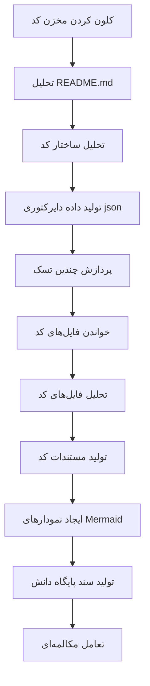

# OpenDeepWiki

[中文](https://raw.githubusercontent.com/AIDotNet/OpenDeepWiki/main/README.zh-CN.md) | [English](https://raw.githubusercontent.com/AIDotNet/OpenDeepWiki/main/README.md)

<div align="center">
  
  <h3>پایگاه دانش کد مبتنی بر هوش مصنوعی</h3>
</div>

# حمایت‌کننده

[](https://share.302.ai/jXcaTv)

[302.AI](https://share.302.ai/jXcaTv) یک پلتفرم هوش مصنوعی در سطح سازمانی، با مدل پرداخت به اندازه مصرف است. این پلتفرم یک اکوسیستم متن‌باز و بستری باز ارائه می‌دهد تا هوش مصنوعی بتواند برای هر نیازی راهکاری بیابد. برای دریافت ۱ دلار اعتبار رایگان، [اینجا کلیک کنید](https://share.302.ai/jXcaTv)!

## قابلیت‌ها

- **تبدیل سریع:** تمامی مخازن کد در Github، Gitlab، Gitee، Gitea و سایر پلتفرم‌ها را می‌توان تنها در چند دقیقه به پایگاه دانش تبدیل کرد.
- **پشتیبانی چندزبانه:** تحلیل کد و تولید مستندات برای تمام زبان‌های برنامه‌نویسی پشتیبانی می‌شود.
- **ساختار کد:** به طور خودکار نمودارهای Mermaid برای درک ساختار کد تولید می‌شود.
- **مدل‌های سفارشی:** مدل‌ها و APIهای سفارشی پشتیبانی می‌شوند و امکان توسعه را فراهم می‌کند.
- **تحلیل هوشمند مبتنی بر AI:** تحلیل کد و درک روابط کد بر اساس هوش مصنوعی انجام می‌گیرد.
- **سئوی آسان:** تولید مستندات و پایگاه دانش سئو-پسند با استفاده از Next.js، برای ایندکس بهتر توسط موتورهای جستجو.
- **تعامل گفتگومحور:** پشتیبانی از تعامل گفتگومحور با هوش مصنوعی برای دریافت اطلاعات جزئی و روش‌های استفاده از کد و درک عمیق آن.

لیست امکانات:
- [x] پشتیبانی از چندین مخزن کد (Github، Gitlab، Gitee، Gitea و ...)
- [x] پشتیبانی از چندین زبان برنامه‌نویسی (Python، Java، #C، JavaScript و ...)
- [x] پشتیبانی از مدیریت مخزن شامل افزودن، حذف، ویرایش و جستجو
- [x] پشتیبانی از چندین ارائه‌دهنده AI (OpenAI، AzureOpenAI، Anthropic و ...)
- [x] پشتیبانی از چندین پایگاه داده (SQLite، PostgreSQL، SqlServer و ...)
- [x] پشتیبانی از چندین زبان (چینی، انگلیسی، فرانسوی و ...)
- [x] پشتیبانی از بارگذاری فایل ZIP و بارگذاری فایل‌های محلی
- [x] ارائه پلتفرم ریزتنظیم داده برای تولید دیتاست‌های ریزتنظیم
- [x] پشتیبانی از مدیریت سطح دایرکتوری مخزن، امکان تولید دایرکتوری سفارشی و ایجاد مستندات پویا
- [x] پشتیبانی از مدیریت دایرکتوری مخزن، امکان ویرایش ساختار دایرکتوری
- [x] پشتیبانی از مدیریت سطح کاربر شامل افزودن، حذف، ویرایش و جستجوی کاربران
- [ ] پشتیبانی از مدیریت سطح دسترسی کاربر شامل افزودن، حذف، ویرایش و جستجوی مجوزها
- [x] پشتیبانی از تولید دیتاست‌های فریمورک ریزتنظیم در سطح مخزن

# معرفی پروژه

OpenDeepWiki یک پروژه متن‌باز است که از [DeepWiki](https://deepwiki.com/) الهام گرفته و با استفاده از .NET 9 و Semantic Kernel توسعه یافته است. هدف آن کمک به توسعه‌دهندگان برای درک بهتر و استفاده بهینه از مخازن کد با ارائه قابلیت‌هایی مانند تحلیل کد، تولید مستندات و ایجاد گراف دانش است.
- تحلیل ساختار کد
- درک مفاهیم اصلی مخزن
- تولید مستندات کد
- تولید خودکار README.md برای کد
  پشتیبانی از MCP

OpenDeepWiki از MCP (Model Context Protocol) پشتیبانی می‌کند
- امکان ارائه یک MCPServer برای هر مخزن و انجام تحلیل روی همان مخزن.

روش استفاده: شیوه استفاده از cursor در زیر آمده است:
```json
{
  "mcpServers": {
    "OpenDeepWiki":{
      "url": "http://آی‌پی سرویس OpenDeepWiki شما:پورت/sse?owner=AIDotNet&name=OpenDeepWiki"
    }
  }
}
```
- owner: نام سازمان یا مالک مخزن است.
- name: نام مخزن است.

پس از افزودن مخزن، با پرسیدن یک سؤال تست کنید (توجه داشته باشید که قبل از آن باید مخزن پردازش شود): OpenDeepWiki چیست؟ نتیجه به صورت زیر خواهد بود: 

به این ترتیب می‌توانید از OpenDeepWiki به عنوان MCPServer استفاده کنید و آن را در اختیار مدل‌های هوش مصنوعی دیگر قرار دهید تا تحلیل و درک پروژه‌های متن‌باز را تسهیل کنید.

## 🚀 شروع سریع

1. مخزن را کلون کنید
```bash
git clone https://github.com/AIDotNet/OpenDeepWiki.git
cd OpenDeepWiki
```

2. فایل `docker-compose.yml` را باز کرده و متغیرهای محیطی زیر را ویرایش کنید:

Ollama:
```yaml
services:
  koalawiki:
    environment:
      - KOALAWIKI_REPOSITORIES=/repositories
      - TASK_MAX_SIZE_PER_USER=5 # حداکثر تعداد همزمان تولید مستندات برای هر کاربر توسط AI
      - CHAT_MODEL=qwen2.5:32b # مدل باید از توابع پشتیبانی کند
      - ANALYSIS_MODEL=qwen2.5:32b # مدل تحلیل جهت تولید ساختار دایرکتوری مخزن
      - CHAT_API_KEY=sk-xxxxx # کلید API شما
      - LANGUAGE= # زبان پیش‌فرض تولید را "چینی" تنظیم کنید
      - ENDPOINT=https://آی‌پی Ollama شما:پورت/v1
      - DB_TYPE=sqlite
      - MODEL_PROVIDER=OpenAI # ارائه‌دهنده مدل، پیش‌فرض OpenAI است، AzureOpenAI و Anthropic نیز پشتیبانی می‌شود
      - DB_CONNECTION_STRING=Data Source=/data/KoalaWiki.db
      - EnableSmartFilter=true # فعال بودن فیلتر هوشمند، می‌تواند روی نحوه دریافت لیست فایل‌های مخزن تاثیر بگذارد
      - UPDATE_INTERVAL # بازه زمانی بروزرسانی افزایشی مخزن، واحد: روز
      - MAX_FILE_LIMIT=100 # حداکثر حجم مجاز برای بارگذاری فایل‌ها (MB)
      - DEEP_RESEARCH_MODEL= # مدل برای پژوهش عمیق، در صورت خالی بودن از CHAT_MODEL استفاده می‌شود
      - ENABLE_INCREMENTAL_UPDATE=true # فعال‌سازی بروزرسانی افزایشی
      - ENABLE_CODED_DEPENDENCY_ANALYSIS=false # فعال‌سازی تحلیل وابستگی کد، ممکن است روی کیفیت کد تاثیر بگذارد
      - ENABLE_WAREHOUSE_FUNCTION_PROMPT_TASK=false # فعال‌سازی تولید MCP Prompt
      - ENABLE_WAREHOUSE_DESCRIPTION_TASK=false # فعال‌سازی تولید توضیحات مخزن
```

OpenAI:
```yaml
services:
  koalawiki:
    environment:
      - KOALAWIKI_REPOSITORIES=/repositories
      - TASK_MAX_SIZE_PER_USER=5 # حداکثر تعداد همزمان تولید مستندات برای هر کاربر توسط AI
      - CHAT_MODEL=DeepSeek-V3 # مدل باید از توابع پشتیبانی کند
      - ANALYSIS_MODEL= # مدل تحلیل جهت تولید ساختار دایرکتوری مخزن
      - CHAT_API_KEY= # کلید API شما
      - LANGUAGE= # زبان پیش‌فرض تولید را "چینی" تنظیم کنید
      - ENDPOINT=https://api.token-ai.cn/v1
      - DB_TYPE=sqlite
      - MODEL_PROVIDER=OpenAI # ارائه‌دهنده مدل، پیش‌فرض OpenAI است، AzureOpenAI و Anthropic نیز پشتیبانی می‌شود
      - DB_CONNECTION_STRING=Data Source=/data/KoalaWiki.db
      - EnableSmartFilter=true # فعال بودن فیلتر هوشمند، می‌تواند روی نحوه دریافت لیست فایل‌های مخزن تاثیر بگذارد
      - UPDATE_INTERVAL # بازه زمانی بروزرسانی افزایشی مخزن، واحد: روز
      - MAX_FILE_LIMIT=100 # حداکثر حجم مجاز برای بارگذاری فایل‌ها (MB)
      - DEEP_RESEARCH_MODEL= # مدل برای پژوهش عمیق، در صورت خالی بودن از CHAT_MODEL استفاده می‌شود
      - ENABLE_INCREMENTAL_UPDATE=true # فعال‌سازی بروزرسانی افزایشی
      - ENABLE_CODED_DEPENDENCY_ANALYSIS=false # فعال‌سازی تحلیل وابستگی کد، ممکن است روی کیفیت کد تاثیر بگذارد
      - ENABLE_WAREHOUSE_FUNCTION_PROMPT_TASK=false # فعال‌سازی تولید MCP Prompt
      - ENABLE_WAREHOUSE_DESCRIPTION_TASK=false # فعال‌سازی تولید توضیحات مخزن
```

AzureOpenAI:
```yaml
services:
  koalawiki:
    environment:
      - KOALAWIKI_REPOSITORIES=/repositories
      - TASK_MAX_SIZE_PER_USER=5 # حداکثر تعداد همزمان تولید مستندات برای هر کاربر توسط AI
      - CHAT_MODEL=DeepSeek-V3 # مدل باید از توابع پشتیبانی کند
      - ANALYSIS_MODEL= # مدل تحلیل جهت تولید ساختار دایرکتوری مخزن
      - CHAT_API_KEY= # کلید API شما
      - LANGUAGE= # زبان پیش‌فرض تولید را "چینی" تنظیم کنید
      - ENDPOINT=https://your-azure-address.openai.azure.com/
      - DB_TYPE=sqlite
      - MODEL_PROVIDER=AzureOpenAI # ارائه‌دهنده مدل، پیش‌فرض OpenAI است، AzureOpenAI و Anthropic نیز پشتیبانی می‌شود
      - DB_CONNECTION_STRING=Data Source=/data/KoalaWiki.db
      - EnableSmartFilter=true # فعال بودن فیلتر هوشمند، می‌تواند روی نحوه دریافت لیست فایل‌های مخزن تاثیر بگذارد
      - UPDATE_INTERVAL # بازه زمانی بروزرسانی افزایشی مخزن، واحد: روز
      - MAX_FILE_LIMIT=100 # حداکثر حجم مجاز برای بارگذاری فایل‌ها (MB)
      - DEEP_RESEARCH_MODEL= # مدل برای پژوهش عمیق، در صورت خالی بودن از CHAT_MODEL استفاده می‌شود
      - ENABLE_INCREMENTAL_UPDATE=true # فعال‌سازی بروزرسانی افزایشی
      - ENABLE_CODED_DEPENDENCY_ANALYSIS=false # فعال‌سازی تحلیل وابستگی کد، ممکن است روی کیفیت کد تاثیر بگذارد
      - ENABLE_WAREHOUSE_FUNCTION_PROMPT_TASK=false # فعال‌سازی تولید MCP Prompt
      - ENABLE_WAREHOUSE_DESCRIPTION_TASK=false # فعال‌سازی تولید توضیحات مخزن
```

Anthropic:
```yaml
services:
  koalawiki:
    environment:
      - KOALAWIKI_REPOSITORIES=/repositories
      - TASK_MAX_SIZE_PER_USER=5 # حداکثر تعداد همزمان تولید مستندات برای هر کاربر توسط AI
      - CHAT_MODEL=DeepSeek-V3 # مدل باید از توابع پشتیبانی کند
      - ANALYSIS_MODEL= # مدل تحلیل جهت تولید ساختار دایرکتوری مخزن
      - CHAT_API_KEY= # کلید API شما
      - LANGUAGE= # زبان پیش‌فرض تولید را "چینی" تنظیم کنید
      - ENDPOINT=https://api.anthropic.com/
      - DB_TYPE=sqlite
      - MODEL_PROVIDER=Anthropic # ارائه‌دهنده مدل، پیش‌فرض OpenAI است، AzureOpenAI و Anthropic نیز پشتیبانی می‌شود
      - DB_CONNECTION_STRING=Data Source=/data/KoalaWiki.db
      - EnableSmartFilter=true # فعال بودن فیلتر هوشمند، می‌تواند روی نحوه دریافت لیست فایل‌های مخزن تاثیر بگذارد
      - UPDATE_INTERVAL # بازه زمانی بروزرسانی افزایشی مخزن، واحد: روز
      - MAX_FILE_LIMIT=100 # حداکثر حجم مجاز برای بارگذاری فایل‌ها (MB)
      - DEEP_RESEARCH_MODEL= # مدل برای پژوهش عمیق، در صورت خالی بودن از CHAT_MODEL استفاده می‌شود
      - ENABLE_INCREMENTAL_UPDATE=true # فعال‌سازی بروزرسانی افزایشی
      - ENABLE_CODED_DEPENDENCY_ANALYSIS=false # فعال‌سازی تحلیل وابستگی کد، ممکن است روی کیفیت کد تاثیر بگذارد
      - ENABLE_WAREHOUSE_FUNCTION_PROMPT_TASK=false # فعال‌سازی تولید MCP Prompt
      - ENABLE_WAREHOUSE_DESCRIPTION_TASK=false # فعال‌سازی تولید توضیحات مخزن
```

> 💡 **نحوه دریافت کلید API:**
> - دریافت کلید API گوگل [Google AI Studio](https://makersuite.google.com/app/apikey)
> - دریافت کلید API OpenAI [OpenAI Platform](https://platform.openai.com/api-keys)
> - دریافت CoresHub [CoresHub](https://console.coreshub.cn/xb3/maas/global-keys) [اینجا برای ۵۰ میلیون توکن رایگان کلیک کنید](https://account.coreshub.cn/signup?invite=ZmpMQlZxYVU=)
> - دریافت TokenAI [TokenAI](https://api.token-ai.cn/)

3. سرویس را راه‌اندازی کنید

می‌توانید با استفاده از دستورات Makefile ارائه‌شده، برنامه را به راحتی مدیریت کنید:

```bash
# ساخت همه ایمیج‌های داکر
make build

# راه‌اندازی همه سرویس‌ها در حالت پس‌زمینه
make up

# یا راه‌اندازی در حالت توسعه (با نمایش لاگ‌ها)
```
make dev
```

سپس به آدرس http://localhost:8090 مراجعه کنید تا به پایگاه دانش دسترسی پیدا کنید.

برای دستورات بیشتر:
```bash
make help
```

### برای کاربران ویندوز (بدون make)

اگر از ویندوز استفاده می‌کنید و `make` در دسترس ندارید، می‌توانید این دستورات Docker Compose را مستقیماً اجرا کنید:

```bash
# ساخت همه ایمیج‌های داکر
docker-compose build

# اجرای همه سرویس‌ها در حالت پس‌زمینه
docker-compose up -d

# اجرای سرویس‌ها در حالت توسعه (با مشاهده لاگ‌ها)
docker-compose up

# توقف همه سرویس‌ها
docker-compose down

# مشاهده لاگ‌ها
docker-compose logs -f
```

برای ساخت معماری‌ها یا سرویس‌های خاص، از این دستورات استفاده کنید:

```bash
# ساخت فقط backend
docker-compose build koalawiki

# ساخت فقط frontend
docker-compose build koalawiki-web

# ساخت با پارامتر معماری
docker-compose build --build-arg ARCH=arm64
docker-compose build --build-arg ARCH=amd64
```


### استقرار روی Sealos با دسترسی اینترنت عمومی
[](https://bja.sealos.run/?openapp=system-template%3FtemplateName%3DOpenDeepWiki)
برای مراحل دقیق‌تر، به این راهنما مراجعه کنید: [استقرار یک‌کلیکی OpenDeepWiki به عنوان یک اپلیکیشن Sealos در شبکه عمومی با استفاده از قالب‌ها](https://raw.githubusercontent.com/AIDotNet/OpenDeepWiki/main/scripts/sealos/README.zh-CN.md)

## 🔍 نحوه عملکرد

OpenDeepWiki با استفاده از هوش مصنوعی:
 - مخزن کد را به صورت محلی کلون می‌کند
 - بر اساس README.md مخزن تحلیل انجام می‌دهد
 - ساختار کد را تحلیل کرده و در صورت نیاز فایل‌های کد را می‌خواند، سپس داده دایرکتوری به صورت json تولید می‌کند
 - بر اساس دایرکتوری، هر تسک را به عنوان یک سند پردازش می‌کند
 - فایل‌های کد را می‌خواند، تحلیل می‌کند، مستندات کد تولید می‌کند و نمودارهای Mermaid نمایانگر وابستگی ساختاری کد را ایجاد می‌کند
 - سند نهایی پایگاه دانش را تولید می‌کند
 - مخزن را از طریق تعامل مکالمه‌ای تحلیل کرده و به سوالات کاربر پاسخ می‌دهد


## پیکربندی پیشرفته

### متغیرهای محیطی
  - KOALAWIKI_REPOSITORIES  مسیر ذخیره‌سازی مخازن
  - TASK_MAX_SIZE_PER_USER  حداکثر تسک‌های موازی برای تولید اسناد هوش مصنوعی به ازای هر کاربر
  - CHAT_MODEL  مدل باید از توابع پشتیبانی کند
  - ENDPOINT  نقطه پایانی API
  - ANALYSIS_MODEL  مدل تحلیل برای تولید ساختار دایرکتوری مخزن
  - CHAT_API_KEY  کلید API شما
  - LANGUAGE  تغییر زبان اسناد تولید شده
  - DB_TYPE  نوع پایگاه داده، پیش‌فرض sqlite است
  - MODEL_PROVIDER  ارائه‌دهنده مدل، به طور پیش‌فرض OpenAI، پشتیبانی از Azure، OpenAI و Anthropic
  - DB_CONNECTION_STRING  رشته اتصال پایگاه داده
  - EnableSmartFilter فعال یا غیرفعال بودن فیلتر هوشمند که ممکن است بر نحوه دسترسی AI به دایرکتوری فایل مخزن تاثیر بگذارد
  - UPDATE_INTERVAL بازه به‌روزرسانی افزایشی مخزن، واحد: روز
  - MAX_FILE_LIMIT حداکثر محدودیت بارگذاری فایل، بر حسب مگابایت
  - DEEP_RESEARCH_MODEL انجام تحقیق عمیق روی مدل و استفاده از CHAT_MODEL برای حالت خالی
  - ENABLE_INCREMENTAL_UPDATE فعال‌سازی به‌روزرسانی افزایشی
  - ENABLE_CODED_DEPENDENCY_ANALYSIS فعال‌سازی تحلیل وابستگی کد، این مورد ممکن است بر کیفیت کد تاثیر بگذارد.
  - ENABLE_WAREHOUSE_FUNCTION_PROMPT_TASK  # فعال‌سازی یا غیرفعال‌سازی تولید MCP Prompt
  - ENABLE_WAREHOUSE_DESCRIPTION_TASK # فعال‌سازی یا غیرفعال‌سازی تولید توضیحات مخزن

### ساخت برای معماری‌های مختلف
فایل Makefile دستورات لازم برای ساخت روی معماری‌های مختلف CPU را فراهم می‌کند:

```bash
# ساخت برای معماری ARM
make build-arm

# ساخت برای معماری AMD
make build-amd

# ساخت فقط backend برای ARM
make build-backend-arm

# ساخت فقط frontend برای AMD
make build-frontend-amd
```

## دیسکورد

[به ما بپیوندید](https://discord.gg/8sxUNacv)

## وی‌چت


## 📄 مجوز
این پروژه تحت مجوز MIT منتشر شده است – برای جزییات به فایل [LICENSE](https://raw.githubusercontent.com/AIDotNet/OpenDeepWiki/main/LICENSE) مراجعه نمایید.

## تاریخچه ستاره‌ها

[](https://www.star-history.com/#AIDotNet/OpenDeepWiki&Date)



---


Tranlated By [Open Ai Tx](https://github.com/OpenAiTx/OpenAiTx) | Last indexed: 2025-06-11


---