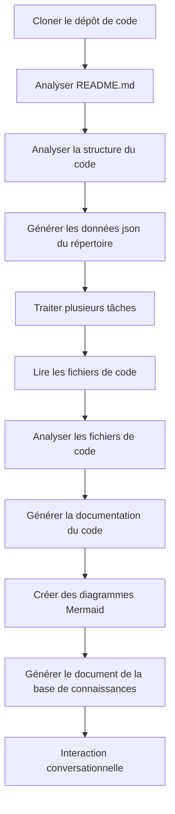

# OpenDeepWiki

[中文](https://raw.githubusercontent.com/AIDotNet/OpenDeepWiki/main/README.zh-CN.md) | [English](https://raw.githubusercontent.com/AIDotNet/OpenDeepWiki/main/README.md)

<div align="center">
  
  <h3>Base de Connaissances de Code Pilotée par l’IA</h3>
</div>

# Sponsor

[](https://share.302.ai/jXcaTv)

[302.AI](https://share.302.ai/jXcaTv) est une plateforme d'application IA d'entreprise tout-en-un, à la consommation. Elle propose une plateforme ouverte et un écosystème open source, permettant à l'IA de trouver des solutions à tous les besoins. Cliquez [ici](https://share.302.ai/jXcaTv) pour obtenir votre crédit gratuit de 1 $ !

## Fonctionnalités

- **Conversion Rapide :** Tous les dépôts de code Github, Gitlab, Gitee, Gitea et autres peuvent être convertis en bases de connaissances en quelques minutes.
- **Support Multilingue :** L’analyse de code et la génération de documentation sont prises en charge pour tous les langages de programmation.
- **Structure du Code :** Des diagrammes Mermaid automatiques sont générés pour comprendre la structure du code.
- **Modèles Personnalisés :** Les modèles personnalisés et les API personnalisées sont supportés, permettant une extension selon les besoins.
- **Analyse Intelligente par IA :** Analyse de code et compréhension des relations dans le code grâce à l’IA.
- **SEO Facile :** Générez des documents et bases de connaissances adaptés au SEO avec Next.js, facilitant l’indexation par les moteurs de recherche.
- **Interaction Dialogique :** Prend en charge l’interaction dialogique avec l’IA pour obtenir des informations détaillées et des méthodes d’utilisation du code, et pour comprendre en profondeur le code.

Liste des fonctionnalités :
- [x] Supporte plusieurs dépôts de code (Github, Gitlab, Gitee, Gitea, etc.)
- [x] Supporte plusieurs langages de programmation (Python, Java, C#, JavaScript, etc.)
- [x] Supporte la gestion des dépôts, offrant des fonctions pour ajouter, supprimer, modifier et interroger les dépôts
- [x] Supporte plusieurs fournisseurs IA (OpenAI, AzureOpenAI, Anthropic, etc.)
- [x] Supporte plusieurs bases de données (SQLite, PostgreSQL, SqlServer, etc.)
- [x] Supporte plusieurs langues (Chinois, Anglais, Français, etc.)
- [x] Supporte le téléchargement de fichiers ZIP et de fichiers locaux
- [x] Propose une plateforme de fine-tuning des données pour générer des jeux de données de fine-tuning
- [x] Supporte la gestion des répertoires des dépôts, permettant la génération personnalisée de répertoires et la création dynamique de documentation
- [x] Supporte la gestion des répertoires de dépôts, permettant la modification des répertoires de dépôt
- [x] Supporte la gestion au niveau utilisateur, offrant des fonctions de gestion des utilisateurs pour ajouter, supprimer, modifier et interroger les utilisateurs
- [ ] Supporte la gestion des permissions utilisateurs, offrant des fonctions de gestion des permissions pour ajouter, supprimer, modifier et interroger les permissions
- [x] Supporte la génération de différents jeux de données de fine-tuning au niveau du dépôt

# Présentation du Projet

OpenDeepWiki est un projet open source inspiré par [DeepWiki](https://deepwiki.com/), développé avec .NET 9 et Semantic Kernel. Il vise à aider les développeurs à mieux comprendre et utiliser les bases de code en fournissant des fonctionnalités telles que l’analyse de code, la génération de documentation et la création de graphes de connaissances.
- Analyse de la structure du code
- Comprendre les concepts clés des dépôts
- Générer la documentation du code
- Créer automatiquement un README.md pour le code
  Prise en charge MCP

OpenDeepWiki prend en charge MCP (Model Context Protocol)
- Prend en charge la fourniture d’un MCPServer pour un seul dépôt et l’analyse sur ce dépôt unique.

Utilisation : Voici l’utilisation du curseur :
```json
{
  "mcpServers": {
    "OpenDeepWiki":{
      "url": "http://Votre IP:port du service OpenDeepWiki/sse?owner=AIDotNet&name=OpenDeepWiki"
    }
  }
}
```
- owner : C’est le nom de l’organisation ou du propriétaire du dépôt.
- name : C’est le nom du dépôt.

Après avoir ajouté le dépôt, testez en posant une question (veuillez noter qu’avant de faire cela, le dépôt doit d’abord être traité) : Qu’est-ce qu’OpenDeepWiki ? Le résultat est illustré ci-dessous : 

De cette manière, vous pouvez utiliser OpenDeepWiki comme un MCPServer, le rendant disponible pour d’autres modèles IA, facilitant l’analyse et la compréhension d’un projet open source.

## 🚀 Démarrage Rapide

1. Clonez le dépôt
```bash
git clone https://github.com/AIDotNet/OpenDeepWiki.git
cd OpenDeepWiki
```

2. Ouvrez le fichier `docker-compose.yml` et modifiez les variables d’environnement suivantes :

Ollama :
```yaml
services:
  koalawiki:
    environment:
      - KOALAWIKI_REPOSITORIES=/repositories
      - TASK_MAX_SIZE_PER_USER=5 # Nombre maximum de tâches parallèles de génération de documents par utilisateur via l’IA
      - CHAT_MODEL=qwen2.5:32b # Le modèle doit prendre en charge les fonctions
      - ANALYSIS_MODEL=qwen2.5:32b # Modèle utilisé pour générer la structure du répertoire du dépôt
      - CHAT_API_KEY=sk-xxxxx # Votre clé API
      - LANGUAGE= # Définir la langue par défaut pour la génération sur "Chinois"
      - ENDPOINT=https://Votre IP Ollama:Port/v1
      - DB_TYPE=sqlite
      - MODEL_PROVIDER=OpenAI # Fournisseur du modèle, par défaut OpenAI, prend en charge AzureOpenAI et Anthropic
      - DB_CONNECTION_STRING=Data Source=/data/KoalaWiki.db
      - EnableSmartFilter=true # Si le filtrage intelligent est activé ou non peut affecter la manière dont l’IA obtient le répertoire du dépôt
      - UPDATE_INTERVAL # Intervalle de mise à jour incrémentielle du dépôt, unité : jours
      - MAX_FILE_LIMIT=100 # Limite maximale d’envoi de fichiers, en Mo
      - DEEP_RESEARCH_MODEL= # Recherche approfondie sur le modèle, utilise CHAT_MODEL si vide
      - ENABLE_INCREMENTAL_UPDATE=true # Activer ou non les mises à jour incrémentielles
      - ENABLE_CODED_DEPENDENCY_ANALYSIS=false # Activer ou non l’analyse de dépendance du code. Cela peut avoir un impact sur la qualité du code.
      - ENABLE_WAREHOUSE_FUNCTION_PROMPT_TASK=false # Activer ou non la génération du prompt MCP.
      - ENABLE_WAREHOUSE_DESCRIPTION_TASK=false # Activer ou non la génération de la Description du dépôt
```

OpenAI :
```yaml
services:
  koalawiki:
    environment:
      - KOALAWIKI_REPOSITORIES=/repositories
      - TASK_MAX_SIZE_PER_USER=5 # Nombre maximum de tâches parallèles de génération de documents par utilisateur via l’IA
      - CHAT_MODEL=DeepSeek-V3 # Le modèle doit prendre en charge les fonctions
      - ANALYSIS_MODEL= # Modèle utilisé pour générer la structure du répertoire du dépôt
      - CHAT_API_KEY= # Votre clé API
      - LANGUAGE= # Définir la langue par défaut pour la génération sur "Chinois"
      - ENDPOINT=https://api.token-ai.cn/v1
      - DB_TYPE=sqlite
      - MODEL_PROVIDER=OpenAI # Fournisseur du modèle, par défaut OpenAI, prend en charge AzureOpenAI et Anthropic
      - DB_CONNECTION_STRING=Data Source=/data/KoalaWiki.db
      - EnableSmartFilter=true # Si le filtrage intelligent est activé ou non peut affecter la manière dont l’IA obtient le répertoire du dépôt
      - UPDATE_INTERVAL # Intervalle de mise à jour incrémentielle du dépôt, unité : jours
      - MAX_FILE_LIMIT=100 # Limite maximale d’envoi de fichiers, en Mo
      - DEEP_RESEARCH_MODEL= # Recherche approfondie sur le modèle, utilise CHAT_MODEL si vide
      - ENABLE_INCREMENTAL_UPDATE=true # Activer ou non les mises à jour incrémentielles
      - ENABLE_CODED_DEPENDENCY_ANALYSIS=false # Activer ou non l’analyse de dépendance du code. Cela peut avoir un impact sur la qualité du code.
      - ENABLE_WAREHOUSE_FUNCTION_PROMPT_TASK=false # Activer ou non la génération du prompt MCP.
      - ENABLE_WAREHOUSE_DESCRIPTION_TASK=false # Activer ou non la génération de la Description du dépôt
```

AzureOpenAI :
```yaml
services:
  koalawiki:
    environment:
      - KOALAWIKI_REPOSITORIES=/repositories
      - TASK_MAX_SIZE_PER_USER=5 # Nombre maximum de tâches parallèles de génération de documents par utilisateur via l’IA
      - CHAT_MODEL=DeepSeek-V3 # Le modèle doit prendre en charge les fonctions
      - ANALYSIS_MODEL= # Modèle utilisé pour générer la structure du répertoire du dépôt
      - CHAT_API_KEY= # Votre clé API
      - LANGUAGE= # Définir la langue par défaut pour la génération sur "Chinois"
      - ENDPOINT=https://your-azure-address.openai.azure.com/
      - DB_TYPE=sqlite
      - MODEL_PROVIDER=AzureOpenAI # Fournisseur du modèle, par défaut OpenAI, prend en charge AzureOpenAI et Anthropic
      - DB_CONNECTION_STRING=Data Source=/data/KoalaWiki.db
      - EnableSmartFilter=true # Si le filtrage intelligent est activé ou non peut affecter la manière dont l’IA obtient le répertoire du dépôt
      - UPDATE_INTERVAL # Intervalle de mise à jour incrémentielle du dépôt, unité : jours
      - MAX_FILE_LIMIT=100 # Limite maximale d’envoi de fichiers, en Mo
      - DEEP_RESEARCH_MODEL= # Recherche approfondie sur le modèle, utilise CHAT_MODEL si vide
      - ENABLE_INCREMENTAL_UPDATE=true # Activer ou non les mises à jour incrémentielles
      - ENABLE_CODED_DEPENDENCY_ANALYSIS=false # Activer ou non l’analyse de dépendance du code. Cela peut avoir un impact sur la qualité du code.
      - ENABLE_WAREHOUSE_FUNCTION_PROMPT_TASK=false # Activer ou non la génération du prompt MCP.
      - ENABLE_WAREHOUSE_DESCRIPTION_TASK=false # Activer ou non la génération de la Description du dépôt
```

Anthropic :
```yaml
services:
  koalawiki:
    environment:
      - KOALAWIKI_REPOSITORIES=/repositories
      - TASK_MAX_SIZE_PER_USER=5 # Nombre maximum de tâches parallèles de génération de documents par utilisateur via l’IA
      - CHAT_MODEL=DeepSeek-V3 # Le modèle doit prendre en charge les fonctions
      - ANALYSIS_MODEL= # Modèle utilisé pour générer la structure du répertoire du dépôt
      - CHAT_API_KEY= # Votre clé API
      - LANGUAGE= # Définir la langue par défaut pour la génération sur "Chinois"
      - ENDPOINT=https://api.anthropic.com/
      - DB_TYPE=sqlite
      - MODEL_PROVIDER=Anthropic # Fournisseur du modèle, par défaut OpenAI, prend en charge AzureOpenAI et Anthropic
      - DB_CONNECTION_STRING=Data Source=/data/KoalaWiki.db
      - EnableSmartFilter=true # Si le filtrage intelligent est activé ou non peut affecter la manière dont l’IA obtient le répertoire du dépôt
      - UPDATE_INTERVAL # Intervalle de mise à jour incrémentielle du dépôt, unité : jours
      - MAX_FILE_LIMIT=100 # Limite maximale d’envoi de fichiers, en Mo
      - DEEP_RESEARCH_MODEL= # Recherche approfondie sur le modèle, utilise CHAT_MODEL si vide
      - ENABLE_INCREMENTAL_UPDATE=true # Activer ou non les mises à jour incrémentielles
      - ENABLE_CODED_DEPENDENCY_ANALYSIS=false # Activer ou non l’analyse de dépendance du code. Cela peut avoir un impact sur la qualité du code.
      - ENABLE_WAREHOUSE_FUNCTION_PROMPT_TASK=false # Activer ou non la génération du prompt MCP.
      - ENABLE_WAREHOUSE_DESCRIPTION_TASK=false # Activer ou non la génération de la Description du dépôt
```

> 💡 **Comment obtenir une clé API :**
> - Obtenez une clé Google API sur [Google AI Studio](https://makersuite.google.com/app/apikey)
> - Obtenez une clé OpenAI sur [OpenAI Platform](https://platform.openai.com/api-keys)
> - Obtenez une clé CoresHub sur [CoresHub](https://console.coreshub.cn/xb3/maas/global-keys) [Cliquez ici pour 50 millions de tokens gratuits](https://account.coreshub.cn/signup?invite=ZmpMQlZxYVU=)
> - Obtenez une clé TokenAI sur [TokenAI](https://api.token-ai.cn/)

3. Démarrer le service

Vous pouvez utiliser les commandes Makefile fournies pour gérer facilement l’application :

```bash
# Construire toutes les images Docker
make build

# Démarrer tous les services en mode arrière-plan
make up

# Ou démarrer en mode développement (avec logs visibles)
```
make dev
```

Puis rendez-vous sur http://localhost:8090 pour accéder à la base de connaissances.

Pour plus de commandes :
```bash
make help
```

### Pour les utilisateurs Windows (sans make)

Si vous utilisez Windows et que vous n'avez pas `make` disponible, vous pouvez utiliser directement ces commandes Docker Compose :

```bash
# Construire toutes les images Docker
docker-compose build

# Démarrer tous les services en mode arrière-plan
docker-compose up -d

# Démarrer en mode développement (avec logs visibles)
docker-compose up

# Arrêter tous les services
docker-compose down

# Afficher les logs
docker-compose logs -f
```

Pour construire des architectures ou services spécifiques, utilisez :

```bash
# Construire uniquement le backend
docker-compose build koalawiki

# Construire uniquement le frontend
docker-compose build koalawiki-web

# Construire avec des paramètres d’architecture
docker-compose build --build-arg ARCH=arm64
docker-compose build --build-arg ARCH=amd64
```


### Déployer sur Sealos avec accès Internet public
[](https://bja.sealos.run/?openapp=system-template%3FtemplateName%3DOpenDeepWiki)
Pour des étapes détaillées, référez-vous à : [Déploiement en un clic d’OpenDeepWiki en tant qu’application Sealos exposée au réseau public à l’aide de templates](scripts/sealos/README.zh-CN.md)

## 🔍 Fonctionnement

OpenDeepWiki utilise l’IA pour :
 - Cloner le dépôt de code localement
 - Analyser à partir du fichier README.md du dépôt
 - Analyser la structure du code et lire les fichiers de code selon les besoins, puis générer les données json du répertoire
 - Traiter les tâches selon le répertoire, chaque tâche étant un document
 - Lire les fichiers de code, analyser les fichiers de code, générer la documentation du code, et créer des schémas Mermaid représentant les dépendances de structure du code
 - Générer le document final de la base de connaissances
 - Analyser le dépôt par interaction conversationnelle et répondre aux questions des utilisateurs


## Configuration avancée

### Variables d’environnement
  - KOALAWIKI_REPOSITORIES  Chemin de stockage des dépôts
  - TASK_MAX_SIZE_PER_USER  Nombre maximum de tâches parallèles de génération de documents IA par utilisateur
  - CHAT_MODEL  Le modèle doit supporter les fonctions
  - ENDPOINT  Point d’accès API
  - ANALYSIS_MODEL  Modèle d’analyse pour générer la structure de répertoire du dépôt
  - CHAT_API_KEY  Votre clé API
  - LANGUAGE  Changer la langue des documents générés
  - DB_TYPE  Type de base de données, par défaut sqlite
  - MODEL_PROVIDER  Fournisseur de modèle, par défaut OpenAI, supporte Azure, OpenAI et Anthropic
  - DB_CONNECTION_STRING  Chaîne de connexion à la base de données
  - EnableSmartFilter Activer ou non le filtrage intelligent peut affecter la façon dont l’IA obtient l’arborescence des fichiers du dépôt
  - UPDATE_INTERVAL Intervalle de mise à jour incrémentielle du dépôt, unité : jours
  - MAX_FILE_LIMIT Limite maximale de téléchargement de fichiers, en Mo
  - DEEP_RESEARCH_MODEL Effectuer une recherche approfondie sur le modèle et utiliser CHAT_MODEL pour l’absence de valeur
  - ENABLE_INCREMENTAL_UPDATE Activer ou non les mises à jour incrémentielles
  - ENABLE_CODED_DEPENDENCY_ANALYSIS Activer ou non l’analyse des dépendances du code, cela peut avoir un impact sur la qualité du code.
  - ENABLE_WAREHOUSE_FUNCTION_PROMPT_TASK  # Activer ou non la génération de MCP Prompt.
  - ENABLE_WAREHOUSE_DESCRIPTION_TASK # Activer ou non la génération de la description du dépôt

### Compilation pour différentes architectures
Le Makefile propose des commandes pour compiler pour différentes architectures CPU :

```bash
# Compiler pour l’architecture ARM
make build-arm

# Compiler pour l’architecture AMD
make build-amd

# Compiler uniquement le backend pour ARM
make build-backend-arm

# Compiler uniquement le frontend pour AMD
make build-frontend-amd
```

## Discord

[rejoignez-nous](https://discord.gg/8sxUNacv)

## WeChat 


## 📄 Licence
Ce projet est sous licence MIT - voir le fichier [LICENSE](./LICENSE) pour plus de détails.

## Historique des étoiles

[](https://www.star-history.com/#AIDotNet/OpenDeepWiki&Date)



---


Tranlated By [Open Ai Tx](https://github.com/OpenAiTx/OpenAiTx) | Last indexed: 2025-06-11


---