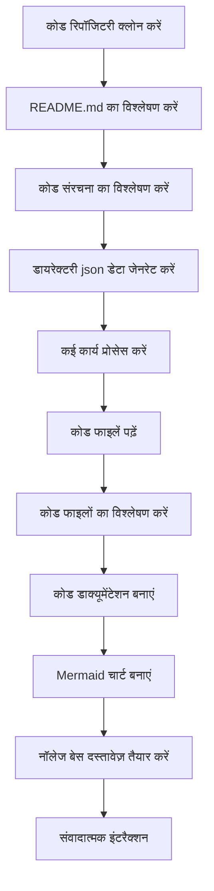

# OpenDeepWiki

[中文](README.zh-CN.md) | [English](README.md)

<div align="center">
  
  <h3>एआई-संचालित कोड नॉलेज बेस</h3>
</div>

# प्रायोजक

[](https://share.302.ai/jXcaTv)

[302.AI](https://share.302.ai/jXcaTv) एक पे-एज़-यू-गो, वन-स्टॉप एंटरप्राइज-लेवल एआई एप्लिकेशन प्लेटफ़ॉर्म है। यह एक ओपन प्लेटफ़ॉर्म और ओपन-सोर्स इकोसिस्टम प्रदान करता है, जिससे एआई हर आवश्यकता के लिए समाधान ढूंढ सकता है। अपना $1 फ्री क्रेडिट पाने के लिए [यहां क्लिक करें](https://share.302.ai/jXcaTv)!

## फ़ंक्शन

- **तेज़ रूपांतरण:** सभी Github, Gitlab, Gitee, Gitea और अन्य कोड रिपॉजिटरी को कुछ ही मिनटों में नॉलेज बेस में बदला जा सकता है।
- **मल्टी-लैंग्वेज सपोर्ट:** सभी प्रोग्रामिंग भाषाओं के लिए कोड विश्लेषण और दस्तावेज़ निर्माण समर्थित है।
- **कोड संरचना:** कोड संरचना को समझने के लिए अपने आप मर्मेड डायग्राम जेनरेट होते हैं।
- **कस्टम मॉडल:** कस्टम मॉडल और कस्टम एपीआई समर्थित हैं, जिससे आवश्यकता अनुसार विस्तार संभव है।
- **एआई बुद्धिमान विश्लेषण:** एआई पर आधारित कोड विश्लेषण और कोड संबंधों की समझ।
- **आसान एसईओ:** Next.js का उपयोग करके एसईओ-फ्रेंडली दस्तावेज़ और नॉलेज बेस बनाएँ, जिससे सर्च इंजन के लिए इंडेक्सिंग आसान हो जाती है।
- **डायलॉगिक इंटरैक्शन:** एआई के साथ संवादात्मक इंटरैक्शन को सपोर्ट करता है, जिससे कोड की विस्तृत जानकारी और उपयोग विधियाँ प्राप्त की जा सकती हैं, और कोड को गहराई से समझा जा सकता है।

फ़ीचर सूची:
- [x] कई कोड रिपॉजिटरी का समर्थन (Github, Gitlab, Gitee, Gitea, आदि)
- [x] कई प्रोग्रामिंग भाषाओं का समर्थन (Python, Java, C#, JavaScript, आदि)
- [x] रिपॉजिटरी प्रबंधन का समर्थन, जिसमें जोड़ने, हटाने, संशोधित करने और क्वेरी करने के फंक्शन शामिल हैं
- [x] कई एआई प्रदाताओं का समर्थन (OpenAI, AzureOpenAI, Anthropic, आदि)
- [x] कई डेटाबेस का समर्थन (SQLite, PostgreSQL, SqlServer, आदि)
- [x] कई भाषाओं का समर्थन (चीनी, अंग्रेज़ी, फ्रेंच, आदि)
- [x] ZIP फाइल अपलोडिंग और लोकल फाइल अपलोडिंग का समर्थन करता है
- [x] फाइन-ट्यूनिंग डेटा बनाने के लिए एक डेटा फाइन-ट्यूनिंग प्लेटफ़ॉर्म प्रदान करता है
- [x] रिपॉजिटरी के डायरेक्टरी-स्तरीय प्रबंधन का समर्थन, जिससे कस्टम डायरेक्टरी निर्माण और डायनामिक डाक्यूमेंटेशन बनाया जा सकता है
- [x] रिपॉजिटरी डायरेक्टरी प्रबंधन का समर्थन, जिससे रिपॉजिटरी डायरेक्टरी को संशोधित किया जा सकता है
- [x] यूजर-लेवल प्रबंधन का समर्थन, जिसमें यूजर जोड़ने, हटाने, संशोधित करने और क्वेरी करने के फंक्शन शामिल हैं
- [ ] यूजर परमिशन प्रबंधन का समर्थन, जिसमें यूजर परमिशन जोड़ने, हटाने, संशोधित करने और क्वेरी करने के फंक्शन शामिल हैं
- [x] रिपॉजिटरी स्तर पर विभिन्न फाइन-ट्यूनिंग फ्रेमवर्क डेटा सेट जेनरेट करने का समर्थन करता है

# परियोजना परिचय

OpenDeepWiki एक ओपन-सोर्स परियोजना है जो [DeepWiki](https://deepwiki.com/) से प्रेरित है, और .NET 9 और Semantic Kernel का उपयोग करके विकसित की गई है। इसका उद्देश्य डेवलपर्स को कोडबेस को बेहतर समझने और उपयोग करने में मदद करना है, जिसमें कोड विश्लेषण, दस्तावेज़ निर्माण और नॉलेज ग्राफ निर्माण जैसी सुविधाएँ उपलब्ध हैं।
- कोड संरचना का विश्लेषण करें
- रिपॉजिटरी के मुख्य अवधारणाओं को समझें
- कोड दस्तावेज़ तैयार करें
- कोड के लिए अपने आप README.md बनाएँ
  MCP सपोर्ट

OpenDeepWiki MCP (Model Context Protocol) को सपोर्ट करता है
- एकल रिपॉजिटरी के लिए MCPServer प्रदान करने और एकल रिपॉजिटरी पर विश्लेषण करने का समर्थन करता है।

उपयोग: निम्नलिखित कर्सर का उपयोग है:
```json
{
  "mcpServers": {
    "OpenDeepWiki":{
      "url": "http://Your OpenDeepWiki service IP:port/sse?owner=AIDotNet&name=OpenDeepWiki"
    }
  }
}
```
- owner: यह रिपॉजिटरी के संगठन या मालिक का नाम है।
- name: यह रिपॉजिटरी का नाम है।

रिपॉजिटरी जोड़ने के बाद, एक प्रश्न पूछकर परीक्षण करें (कृपया ध्यान दें कि इससे पहले रिपॉजिटरी को प्रोसेस करना आवश्यक है): OpenDeepWiki क्या है? प्रभाव नीचे दिए गए चित्र के अनुसार है: 

इस प्रकार, आप OpenDeepWiki को एक MCPServer के रूप में उपयोग कर सकते हैं, जिससे अन्य एआई मॉडल इसे कॉल कर सकते हैं, और किसी ओपन-सोर्स प्रोजेक्ट के विश्लेषण और समझ को आसान बना सकते हैं।

## 🚀 त्वरित प्रारंभ

1. रिपॉजिटरी क्लोन करें
```bash
git clone https://github.com/AIDotNet/OpenDeepWiki.git
cd OpenDeepWiki
```

2. `docker-compose.yml` फ़ाइल खोलें और निम्नलिखित एनवायरनमेंट वेरिएबल्स को संशोधित करें:

Ollama:
```yaml
services:
  koalawiki:
    environment:
      - KOALAWIKI_REPOSITORIES=/repositories
      - TASK_MAX_SIZE_PER_USER=5 # एआई द्वारा प्रति यूज़र अधिकतम समानांतर डाक्यूमेंटेशन जनरेशन टास्क की संख्या
      - CHAT_MODEL=qwen2.5:32b # मॉडल को फंक्शन सपोर्ट करना चाहिए
      - ANALYSIS_MODEL=qwen2.5:32b # रिपॉजिटरी डायरेक्टरी संरचना जनरेट करने हेतु विश्लेषण मॉडल
      - CHAT_API_KEY=sk-xxxxx # आपका एपीआई की
      - LANGUAGE= # जनरेशन के लिए डिफ़ॉल्ट भाषा "चीनी" सेट करें
      - ENDPOINT=https://Your Ollama's IP: Port/v1
      - DB_TYPE=sqlite
      - MODEL_PROVIDER=OpenAI # मॉडल प्रदाता, डिफ़ॉल्ट OpenAI है, AzureOpenAI और Anthropic भी सपोर्टेड हैं
      - DB_CONNECTION_STRING=Data Source=/data/KoalaWiki.db
      - EnableSmartFilter=true # इंटेलिजेंट फ़िल्टरिंग सक्षम है या नहीं, यह प्रभावित कर सकता है कि एआई रिपॉजिटरी की फाइल डायरेक्टरी कैसे प्राप्त करता है
      - UPDATE_INTERVAL # वेयरहाउस वृद्धि अपडेट अंतराल, इकाई: दिन
      - MAX_FILE_LIMIT=100 # फाइल अपलोड की अधिकतम सीमा, MB में
      - DEEP_RESEARCH_MODEL= # मॉडल पर गहन अनुसंधान करें, खाली होने पर CHAT_MODEL का उपयोग करें
      - ENABLE_INCREMENTAL_UPDATE=true # इंक्रीमेंटल अपडेट सक्षम है या नहीं
      - ENABLE_CODED_DEPENDENCY_ANALYSIS=false # कोड डिपेंडेंसी विश्लेषण सक्षम है या नहीं, यह कोड की गुणवत्ता पर असर डाल सकता है
      - ENABLE_WAREHOUSE_FUNCTION_PROMPT_TASK=false # MCP प्रॉम्प्ट जनरेशन सक्षम है या नहीं
      - ENABLE_WAREHOUSE_DESCRIPTION_TASK=false # वेयरहाउस विवरण जनरेशन सक्षम है या नहीं
```

OpenAI:
```yaml
services:
  koalawiki:
    environment:
      - KOALAWIKI_REPOSITORIES=/repositories
      - TASK_MAX_SIZE_PER_USER=5 # एआई द्वारा प्रति यूज़र अधिकतम समानांतर डाक्यूमेंटेशन जनरेशन टास्क की संख्या
      - CHAT_MODEL=DeepSeek-V3 # मॉडल को फंक्शन सपोर्ट करना चाहिए
      - ANALYSIS_MODEL= # रिपॉजिटरी डायरेक्टरी संरचना जनरेट करने हेतु विश्लेषण मॉडल
      - CHAT_API_KEY= # आपका एपीआई की
      - LANGUAGE= # जनरेशन के लिए डिफ़ॉल्ट भाषा "चीनी" सेट करें
      - ENDPOINT=https://api.token-ai.cn/v1
      - DB_TYPE=sqlite
      - MODEL_PROVIDER=OpenAI # मॉडल प्रदाता, डिफ़ॉल्ट OpenAI है, AzureOpenAI और Anthropic भी सपोर्टेड हैं
      - DB_CONNECTION_STRING=Data Source=/data/KoalaWiki.db
      - EnableSmartFilter=true # इंटेलिजेंट फ़िल्टरिंग सक्षम है या नहीं, यह प्रभावित कर सकता है कि एआई रिपॉजिटरी की फाइल डायरेक्टरी कैसे प्राप्त करता है
      - UPDATE_INTERVAL # वेयरहाउस वृद्धि अपडेट अंतराल, इकाई: दिन
      - MAX_FILE_LIMIT=100 # फाइल अपलोड की अधिकतम सीमा, MB में
      - DEEP_RESEARCH_MODEL= # मॉडल पर गहन अनुसंधान करें, खाली होने पर CHAT_MODEL का उपयोग करें
      - ENABLE_INCREMENTAL_UPDATE=true # इंक्रीमेंटल अपडेट सक्षम है या नहीं
      - ENABLE_CODED_DEPENDENCY_ANALYSIS=false # कोड डिपेंडेंसी विश्लेषण सक्षम है या नहीं, यह कोड की गुणवत्ता पर असर डाल सकता है
      - ENABLE_WAREHOUSE_FUNCTION_PROMPT_TASK=false # MCP प्रॉम्प्ट जनरेशन सक्षम है या नहीं
      - ENABLE_WAREHOUSE_DESCRIPTION_TASK=false # वेयरहाउस विवरण जनरेशन सक्षम है या नहीं
```

AzureOpenAI:
```yaml
services:
  koalawiki:
    environment:
      - KOALAWIKI_REPOSITORIES=/repositories
      - TASK_MAX_SIZE_PER_USER=5 # एआई द्वारा प्रति यूज़र अधिकतम समानांतर डाक्यूमेंटेशन जनरेशन टास्क की संख्या
      - CHAT_MODEL=DeepSeek-V3 # मॉडल को फंक्शन सपोर्ट करना चाहिए
      - ANALYSIS_MODEL= # रिपॉजिटरी डायरेक्टरी संरचना जनरेट करने हेतु विश्लेषण मॉडल
      - CHAT_API_KEY= # आपका एपीआई की
      - LANGUAGE= # जनरेशन के लिए डिफ़ॉल्ट भाषा "चीनी" सेट करें
      - ENDPOINT=https://your-azure-address.openai.azure.com/
      - DB_TYPE=sqlite
      - MODEL_PROVIDER=AzureOpenAI # मॉडल प्रदाता, डिफ़ॉल्ट OpenAI है, AzureOpenAI और Anthropic भी सपोर्टेड हैं
      - DB_CONNECTION_STRING=Data Source=/data/KoalaWiki.db
      - EnableSmartFilter=true # इंटेलिजेंट फ़िल्टरिंग सक्षम है या नहीं, यह प्रभावित कर सकता है कि एआई रिपॉजिटरी की फाइल डायरेक्टरी कैसे प्राप्त करता है
      - UPDATE_INTERVAL # वेयरहाउस वृद्धि अपडेट अंतराल, इकाई: दिन
      - MAX_FILE_LIMIT=100 # फाइल अपलोड की अधिकतम सीमा, MB में
      - DEEP_RESEARCH_MODEL= # मॉडल पर गहन अनुसंधान करें, खाली होने पर CHAT_MODEL का उपयोग करें
      - ENABLE_INCREMENTAL_UPDATE=true # इंक्रीमेंटल अपडेट सक्षम है या नहीं
      - ENABLE_CODED_DEPENDENCY_ANALYSIS=false # कोड डिपेंडेंसी विश्लेषण सक्षम है या नहीं, यह कोड की गुणवत्ता पर असर डाल सकता है
      - ENABLE_WAREHOUSE_FUNCTION_PROMPT_TASK=false # MCP प्रॉम्प्ट जनरेशन सक्षम है या नहीं
      - ENABLE_WAREHOUSE_DESCRIPTION_TASK=false # वेयरहाउस विवरण जनरेशन सक्षम है या नहीं
```

Anthropic:
```yaml
services:
  koalawiki:
    environment:
      - KOALAWIKI_REPOSITORIES=/repositories
      - TASK_MAX_SIZE_PER_USER=5 # एआई द्वारा प्रति यूज़र अधिकतम समानांतर डाक्यूमेंटेशन जनरेशन टास्क की संख्या
      - CHAT_MODEL=DeepSeek-V3 # मॉडल को फंक्शन सपोर्ट करना चाहिए
      - ANALYSIS_MODEL= # रिपॉजिटरी डायरेक्टरी संरचना जनरेट करने हेतु विश्लेषण मॉडल
      - CHAT_API_KEY= # आपका एपीआई की
      - LANGUAGE= # जनरेशन के लिए डिफ़ॉल्ट भाषा "चीनी" सेट करें
      - ENDPOINT=https://api.anthropic.com/
      - DB_TYPE=sqlite
      - MODEL_PROVIDER=Anthropic # मॉडल प्रदाता, डिफ़ॉल्ट OpenAI है, AzureOpenAI और Anthropic भी सपोर्टेड हैं
      - DB_CONNECTION_STRING=Data Source=/data/KoalaWiki.db
      - EnableSmartFilter=true # इंटेलिजेंट फ़िल्टरिंग सक्षम है या नहीं, यह प्रभावित कर सकता है कि एआई रिपॉजिटरी की फाइल डायरेक्टरी कैसे प्राप्त करता है
      - UPDATE_INTERVAL # वेयरहाउस वृद्धि अपडेट अंतराल, इकाई: दिन
      - MAX_FILE_LIMIT=100 # फाइल अपलोड की अधिकतम सीमा, MB में
      - DEEP_RESEARCH_MODEL= # मॉडल पर गहन अनुसंधान करें, खाली होने पर CHAT_MODEL का उपयोग करें
      - ENABLE_INCREMENTAL_UPDATE=true # इंक्रीमेंटल अपडेट सक्षम है या नहीं
      - ENABLE_CODED_DEPENDENCY_ANALYSIS=false # कोड डिपेंडेंसी विश्लेषण सक्षम है या नहीं, यह कोड की गुणवत्ता पर असर डाल सकता है
      - ENABLE_WAREHOUSE_FUNCTION_PROMPT_TASK=false # MCP प्रॉम्प्ट जनरेशन सक्षम है या नहीं
      - ENABLE_WAREHOUSE_DESCRIPTION_TASK=false # वेयरहाउस विवरण जनरेशन सक्षम है या नहीं
```

> 💡 **API Key कैसे प्राप्त करें:**
> - Google API key प्राप्त करें [Google AI Studio](https://makersuite.google.com/app/apikey)
> - OpenAI API key प्राप्त करें [OpenAI Platform](https://platform.openai.com/api-keys)
> - CoresHub प्राप्त करें [CoresHub](https://console.coreshub.cn/xb3/maas/global-keys) [यहां क्लिक करें 50 मिलियन फ्री टोकन के लिए](https://account.coreshub.cn/signup?invite=ZmpMQlZxYVU=)
> - TokenAI प्राप्त करें [TokenAI](https://api.token-ai.cn/)

3. सेवा प्रारंभ करें

आप दिए गए Makefile कमांड्स का उपयोग करके एप्लिकेशन को आसानी से प्रबंधित कर सकते हैं:

```bash
# सभी डॉकर इमेज बनाएं
make build

# सभी सेवाओं को बैकग्राउंड मोड में प्रारंभ करें
make up

# या डेवलपमेंट मोड में प्रारंभ करें (लॉग्स दृश्यमान होंगे)
```
```
make dev
```

फिर http://localhost:8090 पर जाएं और नॉलेज बेस एक्सेस करें।

अधिक कमांड्स के लिए:
```bash
make help
```

### विंडोज यूज़र्स के लिए (बिना make के)

अगर आप Windows का उपयोग कर रहे हैं और आपके पास `make` उपलब्ध नहीं है, तो आप सीधे ये Docker Compose कमांड्स चला सकते हैं:

```bash
# सभी Docker इमेजेज़ को बिल्ड करें
docker-compose build

# सभी सर्विसेज़ को बैकग्राउंड मोड में शुरू करें
docker-compose up -d

# डेवलपमेंट मोड में शुरू करें (लॉग्स दिखेंगे)
docker-compose up

# सभी सर्विसेज़ को बंद करें
docker-compose down

# लॉग्स देखें
docker-compose logs -f
```

विशिष्ट आर्किटेक्चर या सर्विसेज़ को बिल्ड करने के लिए:

```bash
# केवल बैकएंड को बिल्ड करें
docker-compose build koalawiki

# केवल फ्रंटएंड को बिल्ड करें
docker-compose build koalawiki-web

# आर्किटेक्चर पैरामीटर्स के साथ बिल्ड करें
docker-compose build --build-arg ARCH=arm64
docker-compose build --build-arg ARCH=amd64
```


### Sealos पर सार्वजनिक इंटरनेट एक्सेस के साथ डिप्लॉय करें
[](https://bja.sealos.run/?openapp=system-template%3FtemplateName%3DOpenDeepWiki)
विस्तृत चरणों के लिए देखें: [टेम्प्लेट्स का उपयोग करके OpenDeepWiki को सार्वजनिक नेटवर्क पर एक्सपोज़ Sealos एप्लिकेशन के रूप में वन-क्लिक डिप्लॉयमेंट](scripts/sealos/README.zh-CN.md)

## 🔍 यह कैसे काम करता है

OpenDeepWiki AI का उपयोग करता है:
 - कोड रिपॉजिटरी को लोकली क्लोन करता है
 - रिपॉजिटरी के README.md के आधार पर विश्लेषण करता है
 - कोड संरचना का विश्लेषण करता है और आवश्यकता अनुसार कोड फाइलें पढ़ता है, फिर डायरेक्टरी json डेटा जेनरेट करता है
 - डायरेक्टरी के अनुसार कार्यों को प्रोसेस करता है, प्रत्येक कार्य एक दस्तावेज़ है
 - कोड फाइलें पढ़ता है, उनका विश्लेषण करता है, कोड डाक्यूमेंटेशन जेनरेट करता है, और कोड संरचना डिपेंडेंसी दर्शाने वाले Mermaid चार्ट बनाता है
 - अंतिम नॉलेज बेस दस्तावेज़ तैयार करता है
 - संवादात्मक इंटरैक्शन के माध्यम से रिपॉजिटरी का विश्लेषण करता है और उपयोगकर्ता की पूछताछ का उत्तर देता है


## एडवांस्ड कॉन्फ़िगरेशन

### एन्वायरमेंट वेरिएबल्स
  - KOALAWIKI_REPOSITORIES  रिपॉजिटरीज़ को स्टोर करने का पथ
  - TASK_MAX_SIZE_PER_USER  प्रति यूज़र AI डाक्यूमेंट जनरेशन के लिए अधिकतम समांतर कार्य
  - CHAT_MODEL  मॉडल को फंक्शन्स सपोर्ट करना चाहिए
  - ENDPOINT  API एंडपॉइंट
  - ANALYSIS_MODEL  रिपॉजिटरी डायरेक्टरी संरचना जेनरेट करने के लिए विश्लेषण मॉडल
  - CHAT_API_KEY  आपका API कुंजी
  - LANGUAGE  जेनरेट किए गए दस्तावेज़ों की भाषा बदलें
  - DB_TYPE  डेटाबेस प्रकार, डिफ़ॉल्ट sqlite है
  - MODEL_PROVIDER  मॉडल प्रदाता, डिफ़ॉल्ट रूप से OpenAI, Azure, OpenAI और Anthropic को सपोर्ट करता है
  - DB_CONNECTION_STRING  डेटाबेस कनेक्शन स्ट्रिंग
  - EnableSmartFilter  इंटेलिजेंट फ़िल्टरिंग सक्षम है या नहीं, यह प्रभावित कर सकता है कि AI रिपॉजिटरी की फाइल डायरेक्टरी कैसे प्राप्त कर सकता है
  - UPDATE_INTERVAL  वेयरहाउस इंक्रीमेंट अपडेट अंतराल, इकाई: दिन
  - MAX_FILE_LIMIT  फाइल अपलोड की अधिकतम सीमा, MB में
  - DEEP_RESEARCH_MODEL  मॉडल पर गहन शोध करें और खाली होने पर CHAT_MODEL का उपयोग करें
  - ENABLE_INCREMENTAL_UPDATE  इंक्रीमेंटल अपडेट सक्षम करें या नहीं
  - ENABLE_CODED_DEPENDENCY_ANALYSIS  कोड डिपेंडेंसी एनालिसिस सक्षम करें या नहीं, इससे कोड की गुणवत्ता पर प्रभाव पड़ सकता है
  - ENABLE_WAREHOUSE_FUNCTION_PROMPT_TASK  # MCP Prompt जनरेशन सक्षम करें या नहीं
  - ENABLE_WAREHOUSE_DESCRIPTION_TASK # वेयरहाउस विवरण जनरेशन सक्षम करें या नहीं

### विभिन्न आर्किटेक्चर के लिए बिल्ड करें
Makefile विभिन्न CPU आर्किटेक्चर के लिए बिल्ड करने के कमांड्स प्रदान करता है:

```bash
# ARM आर्किटेक्चर के लिए बिल्ड करें
make build-arm

# AMD आर्किटेक्चर के लिए बिल्ड करें
make build-amd

# केवल बैकएंड को ARM के लिए बिल्ड करें
make build-backend-arm

# केवल फ्रंटएंड को AMD के लिए बिल्ड करें
make build-frontend-amd
```

## डिस्कॉर्ड

[हमसे जुड़ें](https://discord.gg/8sxUNacv)

## WeChat 


## 📄 लाइसेंस
यह प्रोजेक्ट MIT लाइसेंस के अंतर्गत लाइसेंस प्राप्त है - विवरण के लिए [LICENSE](./LICENSE) फ़ाइल देखें।

## स्टार हिस्ट्री

[](https://www.star-history.com/#AIDotNet/OpenDeepWiki&Date)
```


---


Tranlated By [Open Ai Tx](https://github.com/OpenAiTx/OpenAiTx) | Last indexed: 2025-06-11


---