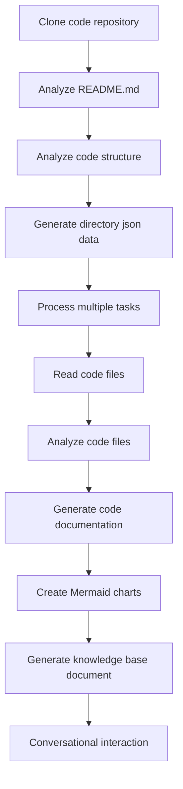

# OpenDeepWiki

[中文](README.zh-CN.md) | [English](README.md)

<div align="center">
  
  <h3>Basis Pengetahuan Kode Berbasis AI</h3>
</div>

# Sponsor

[](https://share.302.ai/jXcaTv)

[302.AI](https://share.302.ai/jXcaTv) adalah platform aplikasi AI tingkat perusahaan satu atap dengan sistem bayar sesuai penggunaan. Platform ini menawarkan ekosistem terbuka dan open-source, memungkinkan AI menemukan solusi untuk setiap kebutuhan. Klik [di sini](https://share.302.ai/jXcaTv) untuk mendapatkan kredit gratis $1!

## Fungsi

- **Konversi Cepat:** Semua repositori kode di Github, Gitlab, Gitee, Gitea, dan lainnya dapat diubah menjadi basis pengetahuan hanya dalam beberapa menit.
- **Dukungan Multi-bahasa:** Analisis kode dan pembuatan dokumentasi didukung untuk semua bahasa pemrograman.
- **Struktur Kode:** Diagram Mermaid otomatis dihasilkan untuk memahami struktur kode.
- **Model Kustom:** Mendukung model kustom dan API kustom, memungkinkan ekspansi sesuai kebutuhan.
- **Analisis Cerdas AI:** Analisis kode dan pemahaman hubungan kode berbasis AI.
- **SEO Mudah:** Menghasilkan dokumen dan basis pengetahuan ramah SEO menggunakan Next.js, memudahkan mesin pencari untuk mengindeks.
- **Interaksi Dialogis:** Mendukung interaksi dialogis dengan AI untuk memperoleh informasi detail dan metode penggunaan kode, serta memahami kode secara mendalam.

Daftar fitur:
- [x] Mendukung beberapa repositori kode (Github, Gitlab, Gitee, Gitea, dll.)
- [x] Mendukung banyak bahasa pemrograman (Python, Java, C#, JavaScript, dll.)
- [x] Mendukung manajemen repositori, menyediakan fungsi untuk menambah, menghapus, mengubah, dan mencari repositori
- [x] Mendukung beberapa penyedia AI (OpenAI, AzureOpenAI, Anthropic, dll.)
- [x] Mendukung beberapa basis data (SQLite, PostgreSQL, SqlServer, dll.)
- [x] Mendukung multi bahasa (Mandarin, Inggris, Prancis, dll.)
- [x] Mendukung upload file ZIP dan upload file lokal
- [x] Menyediakan platform fine-tuning data untuk menghasilkan dataset fine-tuning
- [x] Mendukung manajemen repositori tingkat direktori, memungkinkan pembuatan direktori kustom dan pembuatan dokumentasi dinamis
- [x] Mendukung manajemen direktori repositori, memungkinkan modifikasi direktori repositori
- [x] Mendukung manajemen tingkat pengguna, menyediakan fungsi manajemen pengguna untuk menambah, menghapus, mengubah, dan mencari pengguna
- [ ] Mendukung manajemen hak akses pengguna, menyediakan fungsi manajemen hak akses pengguna untuk menambah, menghapus, mengubah, dan mencari hak akses pengguna
- [x] Mendukung pembuatan dataset framework fine-tuning yang berbeda di tingkat repositori

# Pengantar Proyek

OpenDeepWiki adalah proyek open-source yang terinspirasi oleh [DeepWiki](https://deepwiki.com/), dikembangkan menggunakan .NET 9 dan Semantic Kernel. Proyek ini bertujuan membantu pengembang lebih memahami dan memanfaatkan basis kode dengan menyediakan fitur seperti analisis kode, pembuatan dokumentasi, dan pembuatan knowledge graph.
- Menganalisis struktur kode
- Memahami konsep inti repositori
- Menghasilkan dokumentasi kode
- Membuat README.md otomatis untuk kode
  Dukungan MCP

OpenDeepWiki mendukung MCP (Model Context Protocol)
- Mendukung penyediaan MCPServer untuk satu repositori dan melakukan analisis pada satu repositori.

Penggunaan: Berikut adalah contoh penggunaan cursor:
```json
{
  "mcpServers": {
    "OpenDeepWiki":{
      "url": "http://IP Layanan OpenDeepWiki Anda:port/sse?owner=AIDotNet&name=OpenDeepWiki"
    }
  }
}
```
- owner: Nama organisasi atau pemilik repositori.
- name: Nama dari repositori.

Setelah menambahkan repositori, lakukan pengujian dengan mengajukan pertanyaan (harap dicatat bahwa sebelum melakukan ini, repositori harus diproses terlebih dahulu): Apa itu OpenDeepWiki? Hasilnya seperti pada gambar: 

Dengan cara ini, Anda dapat menggunakan OpenDeepWiki sebagai MCPServer, sehingga dapat digunakan oleh model AI lain untuk membantu analisis dan pemahaman sebuah proyek open-source.

## 🚀 Mulai Cepat

1. Kloning repositori
```bash
git clone https://github.com/AIDotNet/OpenDeepWiki.git
cd OpenDeepWiki
```

2. Buka file `docker-compose.yml` dan ubah variabel lingkungan berikut:

Ollama:
```yaml
services:
  koalawiki:
    environment:
      - KOALAWIKI_REPOSITORIES=/repositories
      - TASK_MAX_SIZE_PER_USER=5 # Jumlah maksimum tugas pembuatan dokumen paralel per pengguna oleh AI
      - CHAT_MODEL=qwen2.5:32b # Model harus mendukung fungsi
      - ANALYSIS_MODEL=qwen2.5:32b # Model analisis yang digunakan untuk menghasilkan struktur direktori repositori
      - CHAT_API_KEY=sk-xxxxx # API key Anda
      - LANGUAGE= # Atur bahasa default untuk generasi sebagai "Chinese"
      - ENDPOINT=https://IP Ollama Anda:Port/v1
      - DB_TYPE=sqlite
      - MODEL_PROVIDER=OpenAI # Penyedia model, default OpenAI, mendukung AzureOpenAI dan Anthropic
      - DB_CONNECTION_STRING=Data Source=/data/KoalaWiki.db
      - EnableSmartFilter=true # Apakah filter cerdas diaktifkan atau tidak, dapat memengaruhi bagaimana AI mendapatkan direktori file repositori
      - UPDATE_INTERVAL # Interval update inkremental repositori, satuan: hari
      - MAX_FILE_LIMIT=100 # Batas maksimum upload file, dalam MB
      - DEEP_RESEARCH_MODEL= # Melakukan riset mendalam pada model dan gunakan CHAT_MODEL jika kosong
      - ENABLE_INCREMENTAL_UPDATE=true # Apakah akan mengaktifkan update inkremental
      - ENABLE_CODED_DEPENDENCY_ANALYSIS=false # Apakah akan mengaktifkan analisis dependensi kode, dapat memengaruhi kualitas kode.
      - ENABLE_WAREHOUSE_FUNCTION_PROMPT_TASK=false # Apakah akan mengaktifkan pembuatan MCP Prompt.
      - ENABLE_WAREHOUSE_DESCRIPTION_TASK=false # Apakah akan mengaktifkan pembuatan Deskripsi repositori
```

OpenAI:
```yaml
services:
  koalawiki:
    environment:
      - KOALAWIKI_REPOSITORIES=/repositories
      - TASK_MAX_SIZE_PER_USER=5 # Jumlah maksimum tugas pembuatan dokumen paralel per pengguna oleh AI
      - CHAT_MODEL=DeepSeek-V3 # Model harus mendukung fungsi
      - ANALYSIS_MODEL= # Model analisis yang digunakan untuk menghasilkan struktur direktori repositori
      - CHAT_API_KEY= # API key Anda
      - LANGUAGE= # Atur bahasa default untuk generasi sebagai "Chinese"
      - ENDPOINT=https://api.token-ai.cn/v1
      - DB_TYPE=sqlite
      - MODEL_PROVIDER=OpenAI # Penyedia model, default OpenAI, mendukung AzureOpenAI dan Anthropic
      - DB_CONNECTION_STRING=Data Source=/data/KoalaWiki.db
      - EnableSmartFilter=true # Apakah filter cerdas diaktifkan atau tidak, dapat memengaruhi bagaimana AI mendapatkan direktori file repositori
      - UPDATE_INTERVAL # Interval update inkremental repositori, satuan: hari
      - MAX_FILE_LIMIT=100 # Batas maksimum upload file, dalam MB
      - DEEP_RESEARCH_MODEL= # Melakukan riset mendalam pada model dan gunakan CHAT_MODEL jika kosong
      - ENABLE_INCREMENTAL_UPDATE=true # Apakah akan mengaktifkan update inkremental
      - ENABLE_CODED_DEPENDENCY_ANALYSIS=false # Apakah akan mengaktifkan analisis dependensi kode, dapat memengaruhi kualitas kode.
      - ENABLE_WAREHOUSE_FUNCTION_PROMPT_TASK=false # Apakah akan mengaktifkan pembuatan MCP Prompt.
      - ENABLE_WAREHOUSE_DESCRIPTION_TASK=false # Apakah akan mengaktifkan pembuatan Deskripsi repositori
```

AzureOpenAI:
```yaml
services:
  koalawiki:
    environment:
      - KOALAWIKI_REPOSITORIES=/repositories
      - TASK_MAX_SIZE_PER_USER=5 # Jumlah maksimum tugas pembuatan dokumen paralel per pengguna oleh AI
      - CHAT_MODEL=DeepSeek-V3 # Model harus mendukung fungsi
      - ANALYSIS_MODEL= # Model analisis yang digunakan untuk menghasilkan struktur direktori repositori
      - CHAT_API_KEY= # API key Anda
      - LANGUAGE= # Atur bahasa default untuk generasi sebagai "Chinese"
      - ENDPOINT=https://your-azure-address.openai.azure.com/
      - DB_TYPE=sqlite
      - MODEL_PROVIDER=AzureOpenAI # Penyedia model, default OpenAI, mendukung AzureOpenAI dan Anthropic
      - DB_CONNECTION_STRING=Data Source=/data/KoalaWiki.db
      - EnableSmartFilter=true # Apakah filter cerdas diaktifkan atau tidak, dapat memengaruhi bagaimana AI mendapatkan direktori file repositori
      - UPDATE_INTERVAL # Interval update inkremental repositori, satuan: hari
      - MAX_FILE_LIMIT=100 # Batas maksimum upload file, dalam MB
      - DEEP_RESEARCH_MODEL= # Melakukan riset mendalam pada model dan gunakan CHAT_MODEL jika kosong
      - ENABLE_INCREMENTAL_UPDATE=true # Apakah akan mengaktifkan update inkremental
      - ENABLE_CODED_DEPENDENCY_ANALYSIS=false # Apakah akan mengaktifkan analisis dependensi kode, dapat memengaruhi kualitas kode.
      - ENABLE_WAREHOUSE_FUNCTION_PROMPT_TASK=false # Apakah akan mengaktifkan pembuatan MCP Prompt.
      - ENABLE_WAREHOUSE_DESCRIPTION_TASK=false # Apakah akan mengaktifkan pembuatan Deskripsi repositori
```

Anthropic:
```yaml
services:
  koalawiki:
    environment:
      - KOALAWIKI_REPOSITORIES=/repositories
      - TASK_MAX_SIZE_PER_USER=5 # Jumlah maksimum tugas pembuatan dokumen paralel per pengguna oleh AI
      - CHAT_MODEL=DeepSeek-V3 # Model harus mendukung fungsi
      - ANALYSIS_MODEL= # Model analisis yang digunakan untuk menghasilkan struktur direktori repositori
      - CHAT_API_KEY= # API key Anda
      - LANGUAGE= # Atur bahasa default untuk generasi sebagai "Chinese"
      - ENDPOINT=https://api.anthropic.com/
      - DB_TYPE=sqlite
      - MODEL_PROVIDER=Anthropic # Penyedia model, default OpenAI, mendukung AzureOpenAI dan Anthropic
      - DB_CONNECTION_STRING=Data Source=/data/KoalaWiki.db
      - EnableSmartFilter=true # Apakah filter cerdas diaktifkan atau tidak, dapat memengaruhi bagaimana AI mendapatkan direktori file repositori
      - UPDATE_INTERVAL # Interval update inkremental repositori, satuan: hari
      - MAX_FILE_LIMIT=100 # Batas maksimum upload file, dalam MB
      - DEEP_RESEARCH_MODEL= # Melakukan riset mendalam pada model dan gunakan CHAT_MODEL jika kosong
      - ENABLE_INCREMENTAL_UPDATE=true # Apakah akan mengaktifkan update inkremental
      - ENABLE_CODED_DEPENDENCY_ANALYSIS=false # Apakah akan mengaktifkan analisis dependensi kode, dapat memengaruhi kualitas kode.
      - ENABLE_WAREHOUSE_FUNCTION_PROMPT_TASK=false # Apakah akan mengaktifkan pembuatan MCP Prompt.
      - ENABLE_WAREHOUSE_DESCRIPTION_TASK=false # Apakah akan mengaktifkan pembuatan Deskripsi repositori
```

> 💡 **Cara mendapatkan API Key:**
> - Dapatkan API key Google di [Google AI Studio](https://makersuite.google.com/app/apikey)
> - Dapatkan API key OpenAI di [OpenAI Platform](https://platform.openai.com/api-keys)
> - Dapatkan CoresHub di [CoresHub](https://console.coreshub.cn/xb3/maas/global-keys) [Klik di sini untuk 50 juta token gratis](https://account.coreshub.cn/signup?invite=ZmpMQlZxYVU=)
> - Dapatkan TokenAI di [TokenAI](https://api.token-ai.cn/)

3. Mulai layanan

Anda dapat menggunakan perintah Makefile yang telah disediakan untuk mengelola aplikasi dengan mudah:

```bash
# Build semua image Docker
make build

# Mulai semua layanan dalam mode background
make up

# Atau mulai dalam mode pengembangan (dengan log terlihat)
```
make dev
```

Lalu kunjungi http://localhost:8090 untuk mengakses basis pengetahuan.

Untuk perintah lain:
```bash
make help
```

### Untuk Pengguna Windows (tanpa make)

Jika Anda menggunakan Windows dan tidak memiliki `make`, Anda dapat menggunakan perintah Docker Compose berikut secara langsung:

```bash
# Build semua Docker image
docker-compose build

# Mulai semua layanan dalam mode latar belakang
docker-compose up -d

# Mulai dalam mode pengembangan (dengan log terlihat)
docker-compose up

# Hentikan semua layanan
docker-compose down

# Lihat log
docker-compose logs -f
```

Untuk membangun arsitektur atau layanan tertentu, gunakan:

```bash
# Build hanya backend
docker-compose build koalawiki

# Build hanya frontend
docker-compose build koalawiki-web

# Build dengan parameter arsitektur
docker-compose build --build-arg ARCH=arm64
docker-compose build --build-arg ARCH=amd64
```


### Deploy ke Sealos dengan Akses Internet Publik
[](https://bja.sealos.run/?openapp=system-template%3FtemplateName%3DOpenDeepWiki)
Untuk langkah detail, lihat: [Deploy Sekali Klik OpenDeepWiki sebagai Aplikasi Sealos yang Terbuka ke Jaringan Publik Menggunakan Template](https://raw.githubusercontent.com/AIDotNet/OpenDeepWiki/main/scripts/sealos/README.zh-CN.md)

## 🔍 Cara Kerjanya

OpenDeepWiki menggunakan AI untuk:
 - Mengkloning repositori kode secara lokal
 - Menganalisis berdasarkan repository README.md
 - Menganalisis struktur kode dan membaca file kode sesuai kebutuhan, lalu menghasilkan data json direktori
 - Memproses tugas berdasarkan direktori, setiap tugas adalah satu dokumen
 - Membaca file kode, menganalisis file kode, menghasilkan dokumentasi kode, dan membuat diagram Mermaid yang merepresentasikan dependensi struktur kode
 - Menghasilkan dokumen basis pengetahuan akhir
 - Menganalisis repositori melalui interaksi percakapan dan merespon pertanyaan pengguna


## Konfigurasi Lanjutan

### Variabel Lingkungan
  - KOALAWIKI_REPOSITORIES  Path untuk menyimpan repositori
  - TASK_MAX_SIZE_PER_USER  Maksimum tugas paralel untuk pembuatan dokumen AI per pengguna
  - CHAT_MODEL  Model harus mendukung fungsi
  - ENDPOINT  API Endpoint
  - ANALYSIS_MODEL  Model analisis untuk menghasilkan struktur direktori repositori
  - CHAT_API_KEY  API key Anda
  - LANGUAGE  Mengubah bahasa dokumen yang dihasilkan
  - DB_TYPE  Jenis database, default adalah sqlite
  - MODEL_PROVIDER  Penyedia model, secara default OpenAI, mendukung Azure, OpenAI, dan Anthropic
  - DB_CONNECTION_STRING  String koneksi database
  - EnableSmartFilter Apakah filter cerdas diaktifkan atau tidak dapat mempengaruhi bagaimana AI mendapatkan direktori file repositori
  - UPDATE_INTERVAL Interval pembaruan inkremen repositori, satuan: hari
  - MAX_FILE_LIMIT Batas maksimum untuk mengunggah file, dalam MB
  - DEEP_RESEARCH_MODEL Melakukan riset mendalam pada model dan gunakan CHAT_MODEL jika kosong
  - ENABLE_INCREMENTAL_UPDATE Apakah akan mengaktifkan pembaruan inkremental
  - ENABLE_CODED_DEPENDENCY_ANALYSIS Apakah akan mengaktifkan analisis dependensi kode, Ini dapat mempengaruhi kualitas kode.
  - ENABLE_WAREHOUSE_FUNCTION_PROMPT_TASK  # Apakah akan mengaktifkan pembuatan MCP Prompt atau tidak.
  - ENABLE_WAREHOUSE_DESCRIPTION_TASK # Apakah akan mengaktifkan pembuatan Deskripsi repositori

### Build untuk Arsitektur Berbeda
Makefile menyediakan perintah untuk build pada arsitektur CPU yang berbeda:

```bash
# Build untuk arsitektur ARM
make build-arm

# Build untuk arsitektur AMD
make build-amd

# Build hanya backend untuk ARM
make build-backend-arm

# Build hanya frontend untuk AMD
make build-frontend-amd
```

## Discord

[bergabunglah dengan kami](https://discord.gg/8sxUNacv)

## WeChat 


## 📄 Lisensi
Proyek ini dilisensikan di bawah MIT License - lihat file [LICENSE](https://raw.githubusercontent.com/AIDotNet/OpenDeepWiki/main/LICENSE) untuk detail.

## Riwayat Bintang

[](https://www.star-history.com/#AIDotNet/OpenDeepWiki&Date)



---


Tranlated By [Open Ai Tx](https://github.com/OpenAiTx/OpenAiTx) | Last indexed: 2025-06-11


---