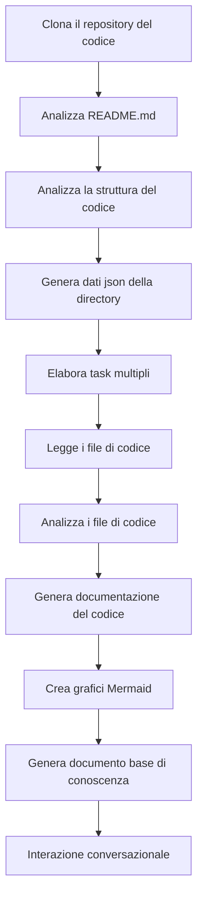

# OpenDeepWiki

[中文](https://raw.githubusercontent.com/AIDotNet/OpenDeepWiki/main/README.zh-CN.md) | [English](https://raw.githubusercontent.com/AIDotNet/OpenDeepWiki/main/README.md)

<div align="center">
  
  <h3>Base di Conoscenza del Codice Guidata dall’AI</h3>
</div>

# Sponsor

[](https://share.302.ai/jXcaTv)

[302.AI](https://share.302.ai/jXcaTv) è una piattaforma AI aziendale all-in-one a pagamento secondo l'uso. Offre una piattaforma aperta e un ecosistema open-source, permettendo all’AI di trovare soluzioni per ogni esigenza. Clicca [qui](https://share.302.ai/jXcaTv) per ottenere $1 di credito gratuito!

## Funzionalità

- **Conversione Rapida:** Tutti i repository di codice di Github, Gitlab, Gitee, Gitea e altri possono essere convertiti in basi di conoscenza in pochi minuti.
- **Supporto Multilingue:** Analisi del codice e generazione di documentazione supportate per tutti i linguaggi di programmazione.
- **Struttura del Codice:** Generazione automatica di diagrammi Mermaid per comprendere la struttura del codice.
- **Modelli Personalizzati:** Supporta modelli e API personalizzati, consentendo espansione secondo necessità.
- **Analisi Intelligente AI:** Analisi del codice e comprensione delle relazioni basate sull’AI.
- **SEO Facile:** Genera documenti e basi di conoscenza ottimizzate per SEO con Next.js, facilitando l’indicizzazione sui motori di ricerca.
- **Interazione Dialogica:** Supporta l’interazione dialogica con l’AI per ottenere informazioni dettagliate e modalità d’uso del codice, approfondendo la comprensione.

Elenco funzionalità:
- [x] Supporta molteplici repository di codice (Github, Gitlab, Gitee, Gitea, ecc.)
- [x] Supporta molti linguaggi di programmazione (Python, Java, C#, JavaScript, ecc.)
- [x] Supporta la gestione dei repository, fornendo funzioni per aggiungere, eliminare, modificare e consultare i repository
- [x] Supporta diversi provider AI (OpenAI, AzureOpenAI, Anthropic, ecc.)
- [x] Supporta diversi database (SQLite, PostgreSQL, SqlServer, ecc.)
- [x] Supporta molte lingue (Cinese, Inglese, Francese, ecc.)
- [x] Supporta il caricamento di file ZIP e file locali
- [x] Fornisce una piattaforma per la generazione di dataset di fine-tuning
- [x] Supporta la gestione a livello di directory dei repository, consentendo la generazione di directory personalizzate e la creazione dinamica di documentazione
- [x] Supporta la gestione delle directory dei repository, consentendo la modifica delle directory
- [x] Supporta la gestione a livello utente, fornendo funzioni per aggiungere, eliminare, modificare e consultare utenti
- [ ] Supporta la gestione dei permessi utente, fornendo funzioni per aggiungere, eliminare, modificare e consultare permessi utente
- [x] Supporta la generazione di diversi dataset di fine-tuning a livello di repository

# Introduzione al Progetto

OpenDeepWiki è un progetto open-source ispirato a [DeepWiki](https://deepwiki.com/), sviluppato con .NET 9 e Semantic Kernel. Mira ad aiutare gli sviluppatori a comprendere e utilizzare meglio i codebase fornendo funzionalità come analisi del codice, generazione di documentazione e creazione di grafi di conoscenza.
- Analizza la struttura del codice
- Comprende i concetti fondamentali dei repository
- Genera la documentazione del codice
- Crea automaticamente README.md per il codice
  Supporto MCP

OpenDeepWiki supporta MCP (Model Context Protocol)
- Supporta la fornitura di un MCPServer per un singolo repository e l’analisi su un singolo repository.

Utilizzo: Di seguito è riportato l’uso di cursor:
```json
{
  "mcpServers": {
    "OpenDeepWiki":{
      "url": "http://Il tuo IP servizio OpenDeepWiki:porta/sse?owner=AIDotNet&name=OpenDeepWiki"
    }
  }
}
```
- owner: È il nome dell’organizzazione o del proprietario del repository.
- name: È il nome del repository.

Dopo aver aggiunto il repository, prova a fare una domanda (nota che prima di ciò il repository deve essere processato): Cos’è OpenDeepWiki? L’effetto è come mostrato in figura: 

In questo modo puoi usare OpenDeepWiki come MCPServer, rendendolo disponibile per la chiamata da altri modelli AI, facilitando l’analisi e la comprensione di un progetto open-source.

## 🚀 Avvio Rapido

1. Clona il repository
```bash
git clone https://github.com/AIDotNet/OpenDeepWiki.git
cd OpenDeepWiki
```

2. Apri il file `docker-compose.yml` e modifica le seguenti variabili d’ambiente:

Ollama:
```yaml
services:
  koalawiki:
    environment:
      - KOALAWIKI_REPOSITORIES=/repositories
      - TASK_MAX_SIZE_PER_USER=5 # Numero massimo di task di generazione documenti in parallelo per utente tramite AI
      - CHAT_MODEL=qwen2.5:32b # Il modello deve supportare le funzioni
      - ANALYSIS_MODEL=qwen2.5:32b # Modello di analisi utilizzato per generare la struttura della directory del repository
      - CHAT_API_KEY=sk-xxxxx # La tua API key
      - LANGUAGE= # Imposta la lingua predefinita di generazione su "Chinese"
      - ENDPOINT=https://IP di Ollama: Porta/v1
      - DB_TYPE=sqlite
      - MODEL_PROVIDER=OpenAI # Provider del modello, predefinito OpenAI, supporta AzureOpenAI e Anthropic
      - DB_CONNECTION_STRING=Data Source=/data/KoalaWiki.db
      - EnableSmartFilter=true # Se abilitare il filtro intelligente può influire su come l’AI ottiene la directory dei file del repository
      - UPDATE_INTERVAL # Intervallo di aggiornamento incrementale del repository, unità: giorni
      - MAX_FILE_LIMIT=100 # Limite massimo per il caricamento dei file, in MB
      - DEEP_RESEARCH_MODEL= # Ricerca approfondita sul modello, usa CHAT_MODEL se vuoto
      - ENABLE_INCREMENTAL_UPDATE=true # Se abilitare gli aggiornamenti incrementali
      - ENABLE_CODED_DEPENDENCY_ANALYSIS=false # Se abilitare l’analisi delle dipendenze del codice, può influire sulla qualità del codice
      - ENABLE_WAREHOUSE_FUNCTION_PROMPT_TASK=false # Se abilitare la generazione di prompt MCP
      - ENABLE_WAREHOUSE_DESCRIPTION_TASK=false # Se abilitare la generazione della descrizione del repository
```

OpenAI:
```yaml
services:
  koalawiki:
    environment:
      - KOALAWIKI_REPOSITORIES=/repositories
      - TASK_MAX_SIZE_PER_USER=5 # Numero massimo di task di generazione documenti in parallelo per utente tramite AI
      - CHAT_MODEL=DeepSeek-V3 # Il modello deve supportare le funzioni
      - ANALYSIS_MODEL= # Modello di analisi utilizzato per generare la struttura della directory del repository
      - CHAT_API_KEY= # La tua API key
      - LANGUAGE= # Imposta la lingua predefinita di generazione su "Chinese"
      - ENDPOINT=https://api.token-ai.cn/v1
      - DB_TYPE=sqlite
      - MODEL_PROVIDER=OpenAI # Provider del modello, predefinito OpenAI, supporta AzureOpenAI e Anthropic
      - DB_CONNECTION_STRING=Data Source=/data/KoalaWiki.db
      - EnableSmartFilter=true # Se abilitare il filtro intelligente può influire su come l’AI ottiene la directory dei file del repository
      - UPDATE_INTERVAL # Intervallo di aggiornamento incrementale del repository, unità: giorni
      - MAX_FILE_LIMIT=100 # Limite massimo per il caricamento dei file, in MB
      - DEEP_RESEARCH_MODEL= # Ricerca approfondita sul modello, usa CHAT_MODEL se vuoto
      - ENABLE_INCREMENTAL_UPDATE=true # Se abilitare gli aggiornamenti incrementali
      - ENABLE_CODED_DEPENDENCY_ANALYSIS=false # Se abilitare l’analisi delle dipendenze del codice, può influire sulla qualità del codice
      - ENABLE_WAREHOUSE_FUNCTION_PROMPT_TASK=false # Se abilitare la generazione di prompt MCP
      - ENABLE_WAREHOUSE_DESCRIPTION_TASK=false # Se abilitare la generazione della descrizione del repository
```

AzureOpenAI:
```yaml
services:
  koalawiki:
    environment:
      - KOALAWIKI_REPOSITORIES=/repositories
      - TASK_MAX_SIZE_PER_USER=5 # Numero massimo di task di generazione documenti in parallelo per utente tramite AI
      - CHAT_MODEL=DeepSeek-V3 # Il modello deve supportare le funzioni
      - ANALYSIS_MODEL= # Modello di analisi utilizzato per generare la struttura della directory del repository
      - CHAT_API_KEY= # La tua API key
      - LANGUAGE= # Imposta la lingua predefinita di generazione su "Chinese"
      - ENDPOINT=https://your-azure-address.openai.azure.com/
      - DB_TYPE=sqlite
      - MODEL_PROVIDER=AzureOpenAI # Provider del modello, predefinito OpenAI, supporta AzureOpenAI e Anthropic
      - DB_CONNECTION_STRING=Data Source=/data/KoalaWiki.db
      - EnableSmartFilter=true # Se abilitare il filtro intelligente può influire su come l’AI ottiene la directory dei file del repository
      - UPDATE_INTERVAL # Intervallo di aggiornamento incrementale del repository, unità: giorni
      - MAX_FILE_LIMIT=100 # Limite massimo per il caricamento dei file, in MB
      - DEEP_RESEARCH_MODEL= # Ricerca approfondita sul modello, usa CHAT_MODEL se vuoto
      - ENABLE_INCREMENTAL_UPDATE=true # Se abilitare gli aggiornamenti incrementali
      - ENABLE_CODED_DEPENDENCY_ANALYSIS=false # Se abilitare l’analisi delle dipendenze del codice, può influire sulla qualità del codice
      - ENABLE_WAREHOUSE_FUNCTION_PROMPT_TASK=false # Se abilitare la generazione di prompt MCP
      - ENABLE_WAREHOUSE_DESCRIPTION_TASK=false # Se abilitare la generazione della descrizione del repository
```

Anthropic:
```yaml
services:
  koalawiki:
    environment:
      - KOALAWIKI_REPOSITORIES=/repositories
      - TASK_MAX_SIZE_PER_USER=5 # Numero massimo di task di generazione documenti in parallelo per utente tramite AI
      - CHAT_MODEL=DeepSeek-V3 # Il modello deve supportare le funzioni
      - ANALYSIS_MODEL= # Modello di analisi utilizzato per generare la struttura della directory del repository
      - CHAT_API_KEY= # La tua API key
      - LANGUAGE= # Imposta la lingua predefinita di generazione su "Chinese"
      - ENDPOINT=https://api.anthropic.com/
      - DB_TYPE=sqlite
      - MODEL_PROVIDER=Anthropic # Provider del modello, predefinito OpenAI, supporta AzureOpenAI e Anthropic
      - DB_CONNECTION_STRING=Data Source=/data/KoalaWiki.db
      - EnableSmartFilter=true # Se abilitare il filtro intelligente può influire su come l’AI ottiene la directory dei file del repository
      - UPDATE_INTERVAL # Intervallo di aggiornamento incrementale del repository, unità: giorni
      - MAX_FILE_LIMIT=100 # Limite massimo per il caricamento dei file, in MB
      - DEEP_RESEARCH_MODEL= # Ricerca approfondita sul modello, usa CHAT_MODEL se vuoto
      - ENABLE_INCREMENTAL_UPDATE=true # Se abilitare gli aggiornamenti incrementali
      - ENABLE_CODED_DEPENDENCY_ANALYSIS=false # Se abilitare l’analisi delle dipendenze del codice, può influire sulla qualità del codice
      - ENABLE_WAREHOUSE_FUNCTION_PROMPT_TASK=false # Se abilitare la generazione di prompt MCP
      - ENABLE_WAREHOUSE_DESCRIPTION_TASK=false # Se abilitare la generazione della descrizione del repository
```

> 💡 **Come ottenere una API Key:**
> - Ottieni la Google API key [Google AI Studio](https://makersuite.google.com/app/apikey)
> - Ottieni la OpenAI API key [OpenAI Platform](https://platform.openai.com/api-keys)
> - Ottieni CoresHub [CoresHub](https://console.coreshub.cn/xb3/maas/global-keys) [Clicca qui per 50 milioni di token gratis](https://account.coreshub.cn/signup?invite=ZmpMQlZxYVU=)
> - Ottieni TokenAI [TokenAI](https://api.token-ai.cn/)

3. Avvia il servizio

Puoi utilizzare i comandi Makefile forniti per gestire facilmente l’applicazione:

```bash
# Costruisci tutte le immagini Docker
make build

# Avvia tutti i servizi in modalità background
make up

# O avvia in modalità sviluppo (con log visibili)
```
make dev
```

Quindi visita http://localhost:8090 per accedere alla base di conoscenza.

Per altri comandi:
```bash
make help
```

### Per Utenti Windows (senza make)

Se utilizzi Windows e non hai `make` disponibile, puoi usare direttamente questi comandi Docker Compose:

```bash
# Costruisci tutte le immagini Docker
docker-compose build

# Avvia tutti i servizi in modalità background
docker-compose up -d

# Avvia in modalità sviluppo (con log visibili)
docker-compose up

# Ferma tutti i servizi
docker-compose down

# Visualizza i log
docker-compose logs -f
```

Per compilare architetture o servizi specifici, usa:

```bash
# Compila solo il backend
docker-compose build koalawiki

# Compila solo il frontend
docker-compose build koalawiki-web

# Compila con parametri di architettura
docker-compose build --build-arg ARCH=arm64
docker-compose build --build-arg ARCH=amd64
```


### Deploy su Sealos con Accesso Internet Pubblico
[](https://bja.sealos.run/?openapp=system-template%3FtemplateName%3DOpenDeepWiki)
Per i passaggi dettagliati, fare riferimento a: [Distribuzione con un click di OpenDeepWiki come applicazione Sealos esposta alla rete pubblica utilizzando Template](https://raw.githubusercontent.com/AIDotNet/OpenDeepWiki/main/scripts/sealos/README.zh-CN.md)

## 🔍 Come Funziona

OpenDeepWiki utilizza l’AI per:
 - Clonare il repository del codice in locale
 - Analizzare in base al README.md del repository
 - Analizzare la struttura del codice e leggere i file di codice se necessario, poi generare dati json della directory
 - Elaborare i task secondo la directory, ogni task è un documento
 - Leggere i file di codice, analizzare i file di codice, generare la documentazione del codice e creare grafici Mermaid che rappresentano le dipendenze della struttura del codice
 - Generare il documento finale della base di conoscenza
 - Analizzare il repository tramite interazione conversazionale e rispondere alle richieste degli utenti


## Configurazione Avanzata

### Variabili d’Ambiente
  - KOALAWIKI_REPOSITORIES  Percorso per la memorizzazione dei repository
  - TASK_MAX_SIZE_PER_USER  Numero massimo di task paralleli per la generazione di documenti AI per utente
  - CHAT_MODEL  Il modello deve supportare le funzioni
  - ENDPOINT  Endpoint API
  - ANALYSIS_MODEL  Modello di analisi per la generazione della struttura della directory del repository
  - CHAT_API_KEY  La tua API key
  - LANGUAGE  Cambia la lingua dei documenti generati
  - DB_TYPE  Tipo di database, il valore predefinito è sqlite
  - MODEL_PROVIDER  Fornitore del modello, predefinito OpenAI, supporta Azure, OpenAI e Anthropic
  - DB_CONNECTION_STRING  Stringa di connessione al database
  - EnableSmartFilter  Se il filtro intelligente è abilitato o meno può influire su come l’AI può ottenere la directory dei file del repository
  - UPDATE_INTERVAL  Intervallo di aggiornamento incrementale del repository, unità: giorni
  - MAX_FILE_LIMIT  Limite massimo per il caricamento dei file, in MB
  - DEEP_RESEARCH_MODEL  Esegui ricerca approfondita sul modello e usa CHAT_MODEL per il vuoto
  - ENABLE_INCREMENTAL_UPDATE  Se abilitare l’aggiornamento incrementale
  - ENABLE_CODED_DEPENDENCY_ANALYSIS  Se abilitare l’analisi delle dipendenze del codice, questo potrebbe avere un impatto sulla qualità del codice.
  - ENABLE_WAREHOUSE_FUNCTION_PROMPT_TASK  # Se abilitare o meno la generazione del prompt MCP.
  - ENABLE_WAREHOUSE_DESCRIPTION_TASK # Se abilitare la generazione della Descrizione del repository

### Compilazione per Diverse Architetture
Il Makefile fornisce comandi per compilare per diverse architetture CPU:

```bash
# Compila per architettura ARM
make build-arm

# Compila per architettura AMD
make build-amd

# Compila solo il backend per ARM
make build-backend-arm

# Compila solo il frontend per AMD
make build-frontend-amd
```

## Discord

[unisciti a noi](https://discord.gg/8sxUNacv)

## WeChat 


## 📄 Licenza
Questo progetto è rilasciato sotto licenza MIT - vedi il file [LICENSE](https://raw.githubusercontent.com/AIDotNet/OpenDeepWiki/main/LICENSE) per i dettagli.

## Star History

[](https://www.star-history.com/#AIDotNet/OpenDeepWiki&Date)



---


Tranlated By [Open Ai Tx](https://github.com/OpenAiTx/OpenAiTx) | Last indexed: 2025-06-11


---