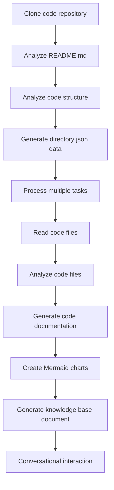

# OpenDeepWiki

[中文](https://raw.githubusercontent.com/AIDotNet/OpenDeepWiki/main/README.zh-CN.md) | [English](https://raw.githubusercontent.com/AIDotNet/OpenDeepWiki/main/README.md)

<div align="center">
  
  <h3>AI駆動型コードナレッジベース</h3>
</div>

# スポンサー

[](https://share.302.ai/jXcaTv)

[302.AI](https://share.302.ai/jXcaTv)は、従量課金制のワンストップエンタープライズレベルAIアプリケーションプラットフォームです。オープンプラットフォームとオープンソースエコシステムを提供し、AIがあらゆるニーズに対するソリューションを見つけることを可能にします。[こちら](https://share.302.ai/jXcaTv)をクリックして、$1分の無料クレジットを獲得しましょう！

## 機能

- **クイック変換:** Github、Gitlab、Gitee、Giteaなど、すべてのコードリポジトリを数分でナレッジベースに変換可能。
- **多言語サポート:** すべてのプログラミング言語に対応したコード解析とドキュメント生成をサポート。
- **コード構造:** コード構造を理解するため、自動でMermaidダイアグラムを生成。
- **カスタムモデル:** カスタムモデルとカスタムAPIをサポートし、必要に応じて拡張可能。
- **AI知能解析:** AIを用いたコード解析とコード間の関係性理解。
- **簡単SEO:** Next.jsを利用してSEOに適したドキュメントやナレッジベースを生成し、検索エンジンによるインデックス化を容易に。
- **対話型インタラクション:** AIとの対話によりコードの詳細情報や利用方法を取得し、コードを深く理解可能。

機能リスト:
- [x] 複数のコードリポジトリ（Github、Gitlab、Gitee、Gitea等）対応
- [x] 複数のプログラミング言語（Python、Java、C#、JavaScript等）対応
- [x] リポジトリ管理機能（追加・削除・修正・検索）
- [x] 複数のAIプロバイダー（OpenAI、AzureOpenAI、Anthropic等）対応
- [x] 複数のデータベース（SQLite、PostgreSQL、SqlServer等）対応
- [x] 複数言語（中国語、英語、フランス語等）対応
- [x] ZIPファイルアップロード・ローカルファイルアップロード対応
- [x] データファインチューニングプラットフォームでファインチューニングデータセット生成
- [x] ディレクトリレベルでのリポジトリ管理、カスタムディレクトリ生成や動的ドキュメント生成対応
- [x] リポジトリディレクトリ管理機能、ディレクトリの修正対応
- [x] ユーザーレベル管理機能（ユーザーの追加・削除・修正・検索）
- [ ] ユーザー権限管理機能（権限の追加・削除・修正・検索）
- [x] リポジトリレベルで異なるファインチューニングフレームワーク用データセット生成対応

# プロジェクト紹介

OpenDeepWikiは、[DeepWiki](https://deepwiki.com/)にインスパイアされたオープンソースプロジェクトであり、.NET 9およびSemantic Kernelを用いて開発されています。コード解析、ドキュメント生成、ナレッジグラフ作成などの機能を提供し、開発者がコードベースをより理解し活用できることを目指しています。
- コード構造の解析
- リポジトリのコアコンセプトの把握
- コードドキュメントの生成
- コード用README.mdの自動生成
  MCPサポート


OpenDeepWikiはMCP（Model Context Protocol）をサポート
- 単一リポジトリ用にMCPServerを提供し、リポジトリ単位での解析が可能です。

利用方法: 以下はcursorでの利用例です:
```json
{
  "mcpServers": {
    "OpenDeepWiki":{
      "url": "http://Your OpenDeepWiki service IP:port/sse?owner=AIDotNet&name=OpenDeepWiki"
    }
  }
}
```
- owner: リポジトリの組織名または所有者名です。
- name: リポジトリ名です。

リポジトリを追加した後、テストとして質問してみてください（その前に必ずリポジトリを処理しておく必要があります）: What is OpenDeepWiki? 実際の効果は以下の画像の通りです: 

このように、OpenDeepWikiをMCPServerとして活用することで、他のAIモデルからも呼び出しが可能となり、オープンソースプロジェクトの解析や理解を促進します。

## 🚀 クイックスタート

1. リポジトリをクローン
```bash
git clone https://github.com/AIDotNet/OpenDeepWiki.git
cd OpenDeepWiki
```

2. `docker-compose.yml`ファイルを開き、以下の環境変数を修正してください:

Ollama:
```yaml
services:
  koalawiki:
    environment:
      - KOALAWIKI_REPOSITORIES=/repositories
      - TASK_MAX_SIZE_PER_USER=5 # AIによるユーザーごとの並列ドキュメント生成タスクの最大数
      - CHAT_MODEL=qwen2.5:32b # モデルは関数対応必須
      - ANALYSIS_MODEL=qwen2.5:32b # リポジトリディレクトリ構造生成に使う解析モデル
      - CHAT_API_KEY=sk-xxxxx # あなたのAPIキー
      - LANGUAGE= # 生成のデフォルト言語（例："Chinese"）
      - ENDPOINT=https://Your Ollama's IP: Port/v1
      - DB_TYPE=sqlite
      - MODEL_PROVIDER=OpenAI # モデルプロバイダー。デフォルトはOpenAI。AzureOpenAIやAnthropicもサポート
      - DB_CONNECTION_STRING=Data Source=/data/KoalaWiki.db
      - EnableSmartFilter=true # スマートフィルター有効化。AIによるリポジトリファイルディレクトリ取得の挙動に影響します
      - UPDATE_INTERVAL # リポジトリ増分更新間隔（単位：日）
      - MAX_FILE_LIMIT=100 # アップロードファイルの最大サイズ（MB）
      - DEEP_RESEARCH_MODEL= # モデルの詳細調査用。空の場合はCHAT_MODELを使用
      - ENABLE_INCREMENTAL_UPDATE=true # 増分更新の有効化
      - ENABLE_CODED_DEPENDENCY_ANALYSIS=false # コード依存性解析の有効化。コード品質に影響する可能性があります
      - ENABLE_WAREHOUSE_FUNCTION_PROMPT_TASK=false # MCP Prompt生成の有効化
      - ENABLE_WAREHOUSE_DESCRIPTION_TASK=false # リポジトリ説明生成の有効化
```

OpenAI:
```yaml
services:
  koalawiki:
    environment:
      - KOALAWIKI_REPOSITORIES=/repositories
      - TASK_MAX_SIZE_PER_USER=5 # AIによるユーザーごとの並列ドキュメント生成タスクの最大数
      - CHAT_MODEL=DeepSeek-V3 # モデルは関数対応必須
      - ANALYSIS_MODEL= # リポジトリディレクトリ構造生成に使う解析モデル
      - CHAT_API_KEY= # あなたのAPIキー
      - LANGUAGE= # 生成のデフォルト言語（例："Chinese"）
      - ENDPOINT=https://api.token-ai.cn/v1
      - DB_TYPE=sqlite
      - MODEL_PROVIDER=OpenAI # モデルプロバイダー。デフォルトはOpenAI。AzureOpenAIやAnthropicもサポート
      - DB_CONNECTION_STRING=Data Source=/data/KoalaWiki.db
      - EnableSmartFilter=true # スマートフィルター有効化。AIによるリポジトリファイルディレクトリ取得の挙動に影響します
      - UPDATE_INTERVAL # リポジトリ増分更新間隔（単位：日）
      - MAX_FILE_LIMIT=100 # アップロードファイルの最大サイズ（MB）
      - DEEP_RESEARCH_MODEL= # モデルの詳細調査用。空の場合はCHAT_MODELを使用
      - ENABLE_INCREMENTAL_UPDATE=true # 増分更新の有効化
      - ENABLE_CODED_DEPENDENCY_ANALYSIS=false # コード依存性解析の有効化。コード品質に影響する可能性があります
      - ENABLE_WAREHOUSE_FUNCTION_PROMPT_TASK=false # MCP Prompt生成の有効化
      - ENABLE_WAREHOUSE_DESCRIPTION_TASK=false # リポジトリ説明生成の有効化
```

AzureOpenAI:
```yaml
services:
  koalawiki:
    environment:
      - KOALAWIKI_REPOSITORIES=/repositories
      - TASK_MAX_SIZE_PER_USER=5 # AIによるユーザーごとの並列ドキュメント生成タスクの最大数
      - CHAT_MODEL=DeepSeek-V3 # モデルは関数対応必須
      - ANALYSIS_MODEL= # リポジトリディレクトリ構造生成に使う解析モデル
      - CHAT_API_KEY= # あなたのAPIキー
      - LANGUAGE= # 生成のデフォルト言語（例："Chinese"）
      - ENDPOINT=https://your-azure-address.openai.azure.com/
      - DB_TYPE=sqlite
      - MODEL_PROVIDER=AzureOpenAI # モデルプロバイダー。デフォルトはOpenAI。AzureOpenAIやAnthropicもサポート
      - DB_CONNECTION_STRING=Data Source=/data/KoalaWiki.db
      - EnableSmartFilter=true # スマートフィルター有効化。AIによるリポジトリファイルディレクトリ取得の挙動に影響します
      - UPDATE_INTERVAL # リポジトリ増分更新間隔（単位：日）
      - MAX_FILE_LIMIT=100 # アップロードファイルの最大サイズ（MB）
      - DEEP_RESEARCH_MODEL= # モデルの詳細調査用。空の場合はCHAT_MODELを使用
      - ENABLE_INCREMENTAL_UPDATE=true # 増分更新の有効化
      - ENABLE_CODED_DEPENDENCY_ANALYSIS=false # コード依存性解析の有効化。コード品質に影響する可能性があります
      - ENABLE_WAREHOUSE_FUNCTION_PROMPT_TASK=false # MCP Prompt生成の有効化
      - ENABLE_WAREHOUSE_DESCRIPTION_TASK=false # リポジトリ説明生成の有効化
```

Anthropic:
```yaml
services:
  koalawiki:
    environment:
      - KOALAWIKI_REPOSITORIES=/repositories
      - TASK_MAX_SIZE_PER_USER=5 # AIによるユーザーごとの並列ドキュメント生成タスクの最大数
      - CHAT_MODEL=DeepSeek-V3 # モデルは関数対応必須
      - ANALYSIS_MODEL= # リポジトリディレクトリ構造生成に使う解析モデル
      - CHAT_API_KEY= # あなたのAPIキー
      - LANGUAGE= # 生成のデフォルト言語（例："Chinese"）
      - ENDPOINT=https://api.anthropic.com/
      - DB_TYPE=sqlite
      - MODEL_PROVIDER=Anthropic # モデルプロバイダー。デフォルトはOpenAI。AzureOpenAIやAnthropicもサポート
      - DB_CONNECTION_STRING=Data Source=/data/KoalaWiki.db
      - EnableSmartFilter=true # スマートフィルター有効化。AIによるリポジトリファイルディレクトリ取得の挙動に影響します
      - UPDATE_INTERVAL # リポジトリ増分更新間隔（単位：日）
      - MAX_FILE_LIMIT=100 # アップロードファイルの最大サイズ（MB）
      - DEEP_RESEARCH_MODEL= # モデルの詳細調査用。空の場合はCHAT_MODELを使用
      - ENABLE_INCREMENTAL_UPDATE=true # 増分更新の有効化
      - ENABLE_CODED_DEPENDENCY_ANALYSIS=false # コード依存性解析の有効化。コード品質に影響する可能性があります
      - ENABLE_WAREHOUSE_FUNCTION_PROMPT_TASK=false # MCP Prompt生成の有効化
      - ENABLE_WAREHOUSE_DESCRIPTION_TASK=false # リポジトリ説明生成の有効化
```

> 💡 **APIキーの取得方法:**
> - Google APIキー取得 [Google AI Studio](https://makersuite.google.com/app/apikey)
> - OpenAI APIキー取得 [OpenAI Platform](https://platform.openai.com/api-keys)
> - CoresHub取得 [CoresHub](https://console.coreshub.cn/xb3/maas/global-keys) [5000万無料トークンはこちら](https://account.coreshub.cn/signup?invite=ZmpMQlZxYVU=)
> - TokenAI取得 [TokenAI](https://api.token-ai.cn/)

3. サービスを起動

提供されているMakefileコマンドを使って、アプリケーションの管理が簡単に行えます:

```bash
# すべてのDockerイメージをビルド
make build

# すべてのサービスをバックグラウンドで起動
make up

# または開発モードで起動（ログ表示あり）
```
make dev
```

その後、http://localhost:8090 にアクセスしてナレッジベースを利用できます。

その他のコマンドについては:
```bash
make help
```

### Windowsユーザー向け（make無し）

Windowsを使用していて `make` が利用できない場合は、以下のDocker Composeコマンドを直接ご利用ください。

```bash
# すべてのDockerイメージをビルド
docker-compose build

# すべてのサービスをバックグラウンドで起動
docker-compose up -d

# 開発モードで起動（ログ表示あり）
docker-compose up

# すべてのサービスを停止
docker-compose down

# ログの表示
docker-compose logs -f
```

特定のアーキテクチャまたはサービスをビルドするには、以下を使用してください。

```bash
# バックエンドのみビルド
docker-compose build koalawiki

# フロントエンドのみビルド
docker-compose build koalawiki-web

# アーキテクチャパラメータ付きでビルド
docker-compose build --build-arg ARCH=arm64
docker-compose build --build-arg ARCH=amd64
```


### Sealosへの公開インターネットアクセス付きデプロイ
[](https://bja.sealos.run/?openapp=system-template%3FtemplateName%3DOpenDeepWiki)
詳細手順については、[テンプレートを利用したOpenDeepWikiのワンクリック公開デプロイ方法](scripts/sealos/README.zh-CN.md)をご参照ください。

## 🔍 仕組み

OpenDeepWikiはAIを活用して以下を実行します：
 - コードリポジトリをローカルにクローン
 - リポジトリのREADME.mdをもとに解析
 - コード構造を解析し、必要に応じてコードファイルを読み込み、ディレクトリのjsonデータを生成
 - ディレクトリごとにタスクを処理し、各タスクはドキュメントです
 - コードファイルを読み込み、解析し、コードドキュメントを生成、コード構造依存関係を表すMermaidチャートを作成
 - 最終的なナレッジベースドキュメントを生成
 - 会話型インタラクションによるリポジトリ解析、ユーザーからの問い合わせに応答


## 高度な設定

### 環境変数
  - KOALAWIKI_REPOSITORIES  リポジトリの保存パス
  - TASK_MAX_SIZE_PER_USER  AIドキュメント生成のユーザーごとの最大並列タスク数
  - CHAT_MODEL  関数をサポートするモデルが必要
  - ENDPOINT  APIエンドポイント
  - ANALYSIS_MODEL  リポジトリディレクトリ構造生成用の解析モデル
  - CHAT_API_KEY  ご自身のAPIキー
  - LANGUAGE  生成されるドキュメントの言語を変更
  - DB_TYPE  データベース種別、デフォルトはsqlite
  - MODEL_PROVIDER  モデルプロバイダ。デフォルトはOpenAIで、Azure、OpenAI、Anthropicをサポート
  - DB_CONNECTION_STRING  データベース接続文字列
  - EnableSmartFilter インテリジェントフィルタリングの有効/無効。AIがリポジトリのファイルディレクトリを取得する方法に影響する場合があります
  - UPDATE_INTERVAL リポジトリの増分アップデート間隔（単位：日）
  - MAX_FILE_LIMIT ファイルアップロードの最大制限（MB単位）
  - DEEP_RESEARCH_MODEL モデルの詳細調査。空の場合はCHAT_MODELを使用
  - ENABLE_INCREMENTAL_UPDATE 増分アップデートの有効/無効
  - ENABLE_CODED_DEPENDENCY_ANALYSIS コード依存性解析の有効/無効。コード品質に影響する場合があります
  - ENABLE_WAREHOUSE_FUNCTION_PROMPT_TASK  # MCPプロンプト生成の有効/無効
  - ENABLE_WAREHOUSE_DESCRIPTION_TASK # リポジトリ説明生成の有効/無効

### 各種アーキテクチャ向けビルド
Makefileでは各CPUアーキテクチャ向けのビルドコマンドが用意されています：

```bash
# ARMアーキテクチャ向けビルド
make build-arm

# AMDアーキテクチャ向けビルド
make build-amd

# ARM向けバックエンドのみビルド
make build-backend-arm

# AMD向けフロントエンドのみビルド
make build-frontend-amd
```

## Discord

[join us](https://discord.gg/8sxUNacv)

## WeChat 


## 📄 ライセンス
このプロジェクトはMITライセンスの下で提供されています。詳細は [LICENSE](./LICENSE) ファイルをご確認ください。

## Star History

[](https://www.star-history.com/#AIDotNet/OpenDeepWiki&Date)



---


Tranlated By [Open Ai Tx](https://github.com/OpenAiTx/OpenAiTx) | Last indexed: 2025-06-10


---