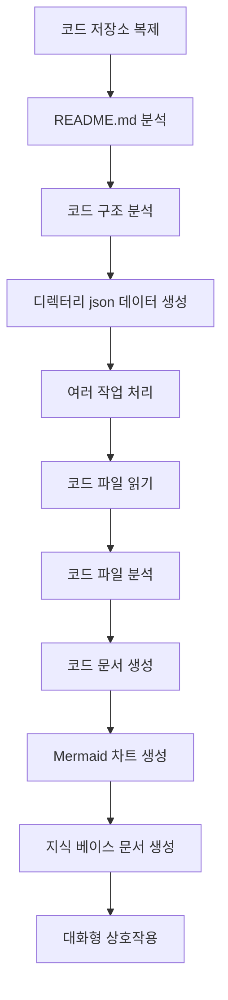

# OpenDeepWiki

[中文](README.zh-CN.md) | [English](README.md)

<div align="center">
  
  <h3>AI 기반 코드 지식 베이스</h3>
</div>

# 스폰서

[](https://share.302.ai/jXcaTv)

[302.AI](https://share.302.ai/jXcaTv)는 종량제, 원스톱 엔터프라이즈급 AI 애플리케이션 플랫폼입니다. 오픈 플랫폼과 오픈소스 생태계를 제공하며, 모든 요구에 AI 솔루션을 제공합니다. [여기](https://share.302.ai/jXcaTv)를 클릭해 $1 무료 크레딧을 받으세요!

## 기능

- **빠른 변환:** 모든 Github, Gitlab, Gitee, Gitea 등 코드 저장소를 단 몇 분 만에 지식 베이스로 변환할 수 있습니다.
- **다국어 지원:** 모든 프로그래밍 언어에 대한 코드 분석 및 문서 생성 지원.
- **코드 구조:** 코드 구조를 이해할 수 있도록 자동 Mermaid 다이어그램 생성.
- **커스텀 모델:** 커스텀 모델 및 커스텀 API 지원, 필요에 따라 확장 가능.
- **AI 지능형 분석:** AI 기반 코드 분석 및 코드 관계 이해.
- **간편한 SEO:** Next.js를 사용해 SEO 친화적인 문서 및 지식 베이스를 생성, 검색 엔진의 색인화가 더 쉬워집니다.
- **대화형 인터랙션:** AI와의 대화형 인터랙션을 통해 코드의 상세 정보 및 사용법을 얻고, 코드를 깊이 있게 이해할 수 있습니다.

기능 목록:
- [x] 여러 코드 저장소 지원(Github, Gitlab, Gitee, Gitea 등)
- [x] 여러 프로그래밍 언어 지원(Python, Java, C#, JavaScript 등)
- [x] 저장소 관리 지원(저장소 추가, 삭제, 수정, 조회 기능 제공)
- [x] 여러 AI 제공자 지원(OpenAI, AzureOpenAI, Anthropic 등)
- [x] 여러 데이터베이스 지원(SQLite, PostgreSQL, SqlServer 등)
- [x] 여러 언어 지원(중국어, 영어, 프랑스어 등)
- [x] ZIP 파일 업로드, 로컬 파일 업로드 지원
- [x] 데이터 파인튜닝 플랫폼 제공, 파인튜닝 데이터셋 생성
- [x] 저장소의 디렉토리 단위 관리 지원, 커스텀 디렉토리 생성 및 동적 문서 생성 지원
- [x] 저장소 디렉토리 관리 지원, 저장소 디렉토리 수정 가능
- [x] 사용자 단위 관리 지원, 사용자 추가, 삭제, 수정, 조회 기능 제공
- [ ] 사용자 권한 관리 지원, 사용자 권한 추가, 삭제, 수정, 조회 기능 제공
- [x] 저장소 단위로 다양한 파인튜닝 프레임워크 데이터셋 생성 지원

# 프로젝트 소개

OpenDeepWiki는 [DeepWiki](https://deepwiki.com/)에서 영감을 받은 오픈소스 프로젝트로, .NET 9 및 Semantic Kernel로 개발되었습니다. 코드 분석, 문서 생성, 지식 그래프 생성을 통해 개발자가 코드베이스를 더 잘 이해하고 활용할 수 있도록 지원하는 것이 목표입니다.
- 코드 구조 분석
- 저장소의 핵심 개념 이해
- 코드 문서화 생성
- 코드용 README.md 자동 생성
  MCP 지원

OpenDeepWiki는 MCP(Model Context Protocol)를 지원합니다.
- 단일 저장소에 대해 MCPServer 제공 및 해당 저장소 분석이 가능합니다.

사용법: 아래는 커서 사용 예시입니다:
```json
{
  "mcpServers": {
    "OpenDeepWiki":{
      "url": "http://Your OpenDeepWiki service IP:port/sse?owner=AIDotNet&name=OpenDeepWiki"
    }
  }
}
```
- owner: 저장소의 조직명 또는 소유자명입니다.
- name: 저장소의 이름입니다.

저장소를 추가한 후, 질문을 하여 테스트할 수 있습니다(이전에 저장소 처리가 완료되어야 합니다): What is OpenDeepWiki? 효과는 아래 그림과 같습니다: 


이와 같이 OpenDeepWiki를 MCPServer로 사용할 수 있으며, 다른 AI 모델이 호출하여 오픈소스 프로젝트 분석과 이해에 활용할 수 있습니다.

## 🚀 빠른 시작

1. 저장소 클론
```bash
git clone https://github.com/AIDotNet/OpenDeepWiki.git
cd OpenDeepWiki
```

2. `docker-compose.yml` 파일을 열고 아래 환경 변수를 수정하세요:

Ollama:
```yaml
services:
  koalawiki:
    environment:
      - KOALAWIKI_REPOSITORIES=/repositories
      - TASK_MAX_SIZE_PER_USER=5 # AI가 사용자별로 병렬로 생성할 수 있는 문서 작업 최대 개수
      - CHAT_MODEL=qwen2.5:32b # 모델은 함수 지원 필수
      - ANALYSIS_MODEL=qwen2.5:32b # 저장소 디렉토리 구조 생성을 위한 분석 모델
      - CHAT_API_KEY=sk-xxxxx # 본인의 API 키
      - LANGUAGE= # 기본 문서 생성 언어(예: "Chinese")
      - ENDPOINT=https://Your Ollama's IP: Port/v1
      - DB_TYPE=sqlite
      - MODEL_PROVIDER=OpenAI # 모델 제공자, 기본값은 OpenAI, AzureOpenAI 및 Anthropic 지원
      - DB_CONNECTION_STRING=Data Source=/data/KoalaWiki.db
      - EnableSmartFilter=true # 지능형 필터링 활성화 여부(저장소 파일 디렉토리 획득에 영향)
      - UPDATE_INTERVAL # 저장소 증분 업데이트 주기(단위: 일)
      - MAX_FILE_LIMIT=100 # 파일 업로드 최대 제한(MB 단위)
      - DEEP_RESEARCH_MODEL= # 모델에 대한 심층 연구, 비어있으면 CHAT_MODEL 사용
      - ENABLE_INCREMENTAL_UPDATE=true # 증분 업데이트 활성화 여부
      - ENABLE_CODED_DEPENDENCY_ANALYSIS=false # 코드 종속성 분석 활성화 여부(코드 품질에 영향 가능)
      - ENABLE_WAREHOUSE_FUNCTION_PROMPT_TASK=false # MCP 프롬프트 생성 활성화 여부
      - ENABLE_WAREHOUSE_DESCRIPTION_TASK=false # 저장소 설명 생성 활성화 여부
```


OpenAI:
```yaml
services:
  koalawiki:
    environment:
      - KOALAWIKI_REPOSITORIES=/repositories
      - TASK_MAX_SIZE_PER_USER=5 # AI가 사용자별로 병렬로 생성할 수 있는 문서 작업 최대 개수
      - CHAT_MODEL=DeepSeek-V3 # 모델은 함수 지원 필수
      - ANALYSIS_MODEL= # 저장소 디렉토리 구조 생성을 위한 분석 모델
      - CHAT_API_KEY= # 본인의 API 키
      - LANGUAGE= # 기본 문서 생성 언어(예: "Chinese")
      - ENDPOINT=https://api.token-ai.cn/v1
      - DB_TYPE=sqlite
      - MODEL_PROVIDER=OpenAI # 모델 제공자, 기본값은 OpenAI, AzureOpenAI 및 Anthropic 지원
      - DB_CONNECTION_STRING=Data Source=/data/KoalaWiki.db
      - EnableSmartFilter=true # 지능형 필터링 활성화 여부(저장소 파일 디렉토리 획득에 영향)
      - UPDATE_INTERVAL # 저장소 증분 업데이트 주기(단위: 일)
      - MAX_FILE_LIMIT=100 # 파일 업로드 최대 제한(MB 단위)
      - DEEP_RESEARCH_MODEL= # 모델에 대한 심층 연구, 비어있으면 CHAT_MODEL 사용
      - ENABLE_INCREMENTAL_UPDATE=true # 증분 업데이트 활성화 여부
      - ENABLE_CODED_DEPENDENCY_ANALYSIS=false # 코드 종속성 분석 활성화 여부(코드 품질에 영향 가능)
      - ENABLE_WAREHOUSE_FUNCTION_PROMPT_TASK=false # MCP 프롬프트 생성 활성화 여부
      - ENABLE_WAREHOUSE_DESCRIPTION_TASK=false # 저장소 설명 생성 활성화 여부
```

AzureOpenAI:
```yaml
services:
  koalawiki:
    environment:
      - KOALAWIKI_REPOSITORIES=/repositories
      - TASK_MAX_SIZE_PER_USER=5 # AI가 사용자별로 병렬로 생성할 수 있는 문서 작업 최대 개수
      - CHAT_MODEL=DeepSeek-V3 # 모델은 함수 지원 필수
      - ANALYSIS_MODEL= # 저장소 디렉토리 구조 생성을 위한 분석 모델
      - CHAT_API_KEY= # 본인의 API 키
      - LANGUAGE= # 기본 문서 생성 언어(예: "Chinese")
      - ENDPOINT=https://your-azure-address.openai.azure.com/
      - DB_TYPE=sqlite
      - MODEL_PROVIDER=AzureOpenAI # 모델 제공자, 기본값은 OpenAI, AzureOpenAI 및 Anthropic 지원
      - DB_CONNECTION_STRING=Data Source=/data/KoalaWiki.db
      - EnableSmartFilter=true # 지능형 필터링 활성화 여부(저장소 파일 디렉토리 획득에 영향)
      - UPDATE_INTERVAL # 저장소 증분 업데이트 주기(단위: 일)
      - MAX_FILE_LIMIT=100 # 파일 업로드 최대 제한(MB 단위)
      - DEEP_RESEARCH_MODEL= # 모델에 대한 심층 연구, 비어있으면 CHAT_MODEL 사용
      - ENABLE_INCREMENTAL_UPDATE=true # 증분 업데이트 활성화 여부
      - ENABLE_CODED_DEPENDENCY_ANALYSIS=false # 코드 종속성 분석 활성화 여부(코드 품질에 영향 가능)
      - ENABLE_WAREHOUSE_FUNCTION_PROMPT_TASK=false # MCP 프롬프트 생성 활성화 여부
      - ENABLE_WAREHOUSE_DESCRIPTION_TASK=false # 저장소 설명 생성 활성화 여부
```

Anthropic:
```yaml
services:
  koalawiki:
    environment:
      - KOALAWIKI_REPOSITORIES=/repositories
      - TASK_MAX_SIZE_PER_USER=5 # AI가 사용자별로 병렬로 생성할 수 있는 문서 작업 최대 개수
      - CHAT_MODEL=DeepSeek-V3 # 모델은 함수 지원 필수
      - ANALYSIS_MODEL= # 저장소 디렉토리 구조 생성을 위한 분석 모델
      - CHAT_API_KEY= # 본인의 API 키
      - LANGUAGE= # 기본 문서 생성 언어(예: "Chinese")
      - ENDPOINT=https://api.anthropic.com/
      - DB_TYPE=sqlite
      - MODEL_PROVIDER=Anthropic # 모델 제공자, 기본값은 OpenAI, AzureOpenAI 및 Anthropic 지원
      - DB_CONNECTION_STRING=Data Source=/data/KoalaWiki.db
      - EnableSmartFilter=true # 지능형 필터링 활성화 여부(저장소 파일 디렉토리 획득에 영향)
      - UPDATE_INTERVAL # 저장소 증분 업데이트 주기(단위: 일)
      - MAX_FILE_LIMIT=100 # 파일 업로드 최대 제한(MB 단위)
      - DEEP_RESEARCH_MODEL= # 모델에 대한 심층 연구, 비어있으면 CHAT_MODEL 사용
      - ENABLE_INCREMENTAL_UPDATE=true # 증분 업데이트 활성화 여부
      - ENABLE_CODED_DEPENDENCY_ANALYSIS=false # 코드 종속성 분석 활성화 여부(코드 품질에 영향 가능)
      - ENABLE_WAREHOUSE_FUNCTION_PROMPT_TASK=false # MCP 프롬프트 생성 활성화 여부
      - ENABLE_WAREHOUSE_DESCRIPTION_TASK=false # 저장소 설명 생성 활성화 여부
```

> 💡 **API Key 발급 방법:**
> - Google API 키 받기 [Google AI Studio](https://makersuite.google.com/app/apikey)
> - OpenAI API 키 받기 [OpenAI Platform](https://platform.openai.com/api-keys)
> - CoresHub 키 받기 [CoresHub](https://console.coreshub.cn/xb3/maas/global-keys) [여기 클릭 시 5천만 토큰 무료 제공](https://account.coreshub.cn/signup?invite=ZmpMQlZxYVU=)
> - TokenAI 키 받기 [TokenAI](https://api.token-ai.cn/)

3. 서비스 시작

제공된 Makefile 명령어로 애플리케이션을 쉽게 관리할 수 있습니다:

```bash
# 모든 Docker 이미지 빌드
make build

# 모든 서비스를 백그라운드 모드로 시작
make up

# 또는 개발 모드로 시작(로그 표시)
make dev
```

그런 다음 http://localhost:8090 에 접속하여 지식 베이스를 이용할 수 있습니다.

더 많은 명령어는 다음과 같습니다:
```bash
make help
```

### Windows 사용자를 위한 안내 (make 없이)

Windows를 사용 중이며 `make`를 사용할 수 없는 경우, 아래 Docker Compose 명령어를 직접 사용할 수 있습니다:

```bash
# 모든 Docker 이미지 빌드
docker-compose build

# 모든 서비스를 백그라운드 모드로 시작
docker-compose up -d

# 개발 모드로 시작 (로그 표시)
docker-compose up

# 모든 서비스 중지
docker-compose down

# 로그 확인
docker-compose logs -f
```

특정 아키텍처 또는 서비스만 빌드하려면 다음을 사용하세요:

```bash
# 백엔드만 빌드
docker-compose build koalawiki

# 프론트엔드만 빌드
docker-compose build koalawiki-web

# 아키텍처 파라미터와 함께 빌드
docker-compose build --build-arg ARCH=arm64
docker-compose build --build-arg ARCH=amd64
```


### Sealos에 공용 인터넷으로 배포하기
[](https://bja.sealos.run/?openapp=system-template%3FtemplateName%3DOpenDeepWiki)
자세한 단계는 다음을 참고하세요: [템플릿을 사용한 OpenDeepWiki Sealos 애플리케이션 원클릭 공용 네트워크 노출 배포](https://raw.githubusercontent.com/AIDotNet/OpenDeepWiki/main/scripts/sealos/README.zh-CN.md)

## 🔍 작동 방식

OpenDeepWiki는 AI를 사용하여 다음과 같이 동작합니다:
 - 코드 저장소를 로컬에 복제
 - 저장소의 README.md를 기반으로 분석
 - 코드 구조를 분석하고 필요에 따라 코드 파일을 읽어 디렉터리 json 데이터 생성
 - 디렉터리별로 작업 처리, 각 작업은 하나의 문서
 - 코드 파일을 읽고, 코드 파일을 분석하여 코드 문서 생성, 코드 구조 의존성을 나타내는 Mermaid 차트 생성
 - 최종적으로 지식 베이스 문서 생성
 - 대화형 상호작용을 통해 저장소를 분석하고 사용자 질문에 응답


## 고급 설정

### 환경 변수
  - KOALAWIKI_REPOSITORIES  저장소를 저장할 경로
  - TASK_MAX_SIZE_PER_USER  사용자별 AI 문서 생성 최대 병렬 작업 수
  - CHAT_MODEL  함수 지원이 필요한 모델
  - ENDPOINT  API 엔드포인트
  - ANALYSIS_MODEL  저장소 디렉터리 구조 생성용 분석 모델
  - CHAT_API_KEY  본인의 API 키
  - LANGUAGE  생성 문서의 언어 변경
  - DB_TYPE  데이터베이스 타입, 기본값은 sqlite
  - MODEL_PROVIDER  모델 공급자, 기본값은 OpenAI, Azure, OpenAI, Anthropic 지원
  - DB_CONNECTION_STRING  데이터베이스 연결 문자열
  - EnableSmartFilter 지능형 필터 활성화 여부, AI가 저장소의 파일 디렉터리를 얻는 방식에 영향
  - UPDATE_INTERVAL 저장소 증분 업데이트 간격, 단위: 일
  - MAX_FILE_LIMIT 업로드 파일 최대 크기 제한, 단위: MB
  - DEEP_RESEARCH_MODEL 모델에 대한 심층 연구, 값이 비어 있으면 CHAT_MODEL 사용
  - ENABLE_INCREMENTAL_UPDATE 증분 업데이트 활성화 여부
  - ENABLE_CODED_DEPENDENCY_ANALYSIS 코드 의존성 분석 활성화 여부, 코드 품질에 영향 가능
  - ENABLE_WAREHOUSE_FUNCTION_PROMPT_TASK  # MCP 프롬프트 생성 활성화 여부
  - ENABLE_WAREHOUSE_DESCRIPTION_TASK # 저장소 설명 생성 활성화 여부

### 다양한 아키텍처용 빌드
Makefile은 다양한 CPU 아키텍처용 빌드 명령을 제공합니다:

```bash
# ARM 아키텍처용 빌드
make build-arm

# AMD 아키텍처용 빌드
make build-amd

# ARM용 백엔드만 빌드
make build-backend-arm

# AMD용 프론트엔드만 빌드
make build-frontend-amd
```

## Discord

[참여하기](https://discord.gg/8sxUNacv)

## WeChat 


## 📄 라이선스
이 프로젝트는 MIT 라이선스 하에 제공됩니다. 자세한 내용은 [LICENSE](https://raw.githubusercontent.com/AIDotNet/OpenDeepWiki/main/LICENSE) 파일을 확인하세요.

## Star History

[](https://www.star-history.com/#AIDotNet/OpenDeepWiki&Date)



---


Tranlated By [Open Ai Tx](https://github.com/OpenAiTx/OpenAiTx) | Last indexed: 2025-06-10


---