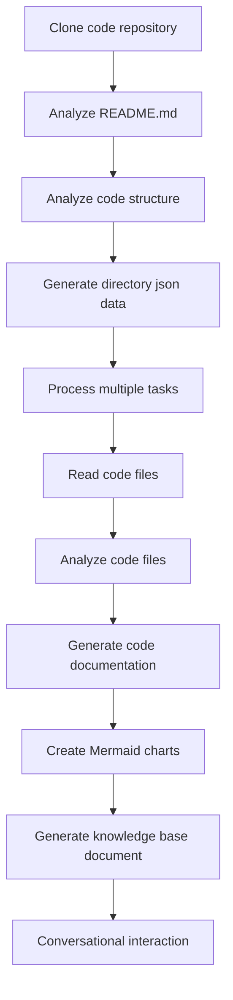

# OpenDeepWiki

[中文](README.zh-CN.md) | [English](README.md)

<div align="center">
  
  <h3>AI-Aangedreven Code Kennisbank</h3>
</div>

# Sponsor

[](https://share.302.ai/jXcaTv)

[302.AI](https://share.302.ai/jXcaTv) is een pay-as-you-go, alles-in-één AI-applicatieplatform op ondernemingsniveau. Het biedt een open platform en open-source ecosysteem, waardoor AI oplossingen kan vinden voor elke behoefte. Klik [hier](https://share.302.ai/jXcaTv) om je $1 gratis tegoed te krijgen!

## Functie

- **Snelle Conversie:** Alle Github, Gitlab, Gitee, Gitea en andere code repositories kunnen in slechts enkele minuten worden omgezet in kennisbanken.
- **Meertalige Ondersteuning:** Code-analyse en documentatiegeneratie worden ondersteund voor alle programmeertalen.
- **Code-structuur:** Automatische Mermaid-diagrammen worden gegenereerd om de code-structuur te begrijpen.
- **Aangepaste Modellen:** Aangepaste modellen en aangepaste API's worden ondersteund, waardoor uitbreiding mogelijk is naar behoefte.
- **AI Intelligente Analyse:** Code-analyse en begrip van coderelaties op basis van AI.
- **Eenvoudige SEO:** Genereer SEO-vriendelijke documenten en kennisbanken met Next.js, waardoor het gemakkelijker is voor zoekmachines om te indexeren.
- **Dialogische Interactie:** Ondersteunt dialogische interactie met AI om gedetailleerde informatie en gebruiksmethoden van de code te verkrijgen, en om de code diepgaand te begrijpen.

Functielijst:
- [x] Ondersteunt meerdere code repositories (Github, Gitlab, Gitee, Gitea, enz.)
- [x] Ondersteunt meerdere programmeertalen (Python, Java, C#, JavaScript, enz.)
- [x] Ondersteunt repositorybeheer, biedt functies voor het toevoegen, verwijderen, wijzigen en opvragen van repositories
- [x] Ondersteunt meerdere AI-providers (OpenAI, AzureOpenAI, Anthropic, enz.)
- [x] Ondersteunt meerdere databases (SQLite, PostgreSQL, SqlServer, enz.)
- [x] Ondersteunt meerdere talen (Chinees, Engels, Frans, enz.)
- [x] Ondersteunt het uploaden van ZIP-bestanden en het uploaden van lokale bestanden
- [x] Biedt een data fine-tuning platform om fine-tuning datasets te genereren
- [x] Ondersteunt directory-niveau beheer van repositories, waardoor aangepaste directorygeneratie en dynamische documentatie mogelijk is
- [x] Ondersteunt repository directorybeheer, waarmee repository directories kunnen worden aangepast
- [x] Ondersteunt gebruikersniveau beheer, biedt gebruikersbeheerfuncties voor toevoegen, verwijderen, wijzigen en opvragen van gebruikers
- [ ] Ondersteunt gebruikersrechtenbeheer, biedt functies voor het beheren van gebruikersrechten voor toevoegen, verwijderen, wijzigen en opvragen van gebruikersrechten
- [x] Ondersteunt het genereren van verschillende fine-tuning framework datasets op repository-niveau

# Projectintroductie

OpenDeepWiki is een open-source project geïnspireerd door [DeepWiki](https://deepwiki.com/), ontwikkeld met .NET 9 en Semantic Kernel. Het is bedoeld om ontwikkelaars te helpen codebases beter te begrijpen en te gebruiken door functies te bieden zoals code-analyse, documentatiegeneratie en het aanmaken van kennisgrafieken.
- Analyseer de code-structuur
- Begrijp de kernconcepten van repositories
- Genereer codedocumentatie
- Maak automatisch README.md voor code
  MCP Ondersteuning

OpenDeepWiki ondersteunt MCP (Model Context Protocol)
- Ondersteunt het aanbieden van een MCPServer voor een enkele repository en het uitvoeren van analyse op één repository.

Gebruik: Het volgende is het gebruik van cursor:
```json
{
  "mcpServers": {
    "OpenDeepWiki":{
      "url": "http://Jouw OpenDeepWiki service IP:poort/sse?owner=AIDotNet&name=OpenDeepWiki"
    }
  }
}
```
- owner: Dit is de naam van de organisatie of eigenaar van de repository.
- name: Dit is de naam van de repository.

Na het toevoegen van de repository, test door een vraag te stellen (let op: voordat je dit doet, moet de repository eerst worden verwerkt): Wat is OpenDeepWiki? Het resultaat is als volgt te zien op de afbeelding: 

Op deze manier kun je OpenDeepWiki gebruiken als een MCPServer, waardoor het beschikbaar wordt voor andere AI-modellen om te raadplegen, wat het analyseren en begrijpen van een open-source project vergemakkelijkt.

## 🚀 Snelstart

1. Clone de repository
```bash
git clone https://github.com/AIDotNet/OpenDeepWiki.git
cd OpenDeepWiki
```

2. Open het `docker-compose.yml` bestand en pas de volgende omgevingsvariabelen aan:

Ollama:
```yaml
services:
  koalawiki:
    environment:
      - KOALAWIKI_REPOSITORIES=/repositories
      - TASK_MAX_SIZE_PER_USER=5 # Maximaal aantal parallelle documentgeneratietaken per gebruiker door AI
      - CHAT_MODEL=qwen2.5:32b # Model moet functies ondersteunen
      - ANALYSIS_MODEL=qwen2.5:32b # Analysemodel gebruikt voor het genereren van repository directory structuur
      - CHAT_API_KEY=sk-xxxxx # Jouw API-sleutel
      - LANGUAGE= # Stel de standaardtaal voor generatie in als "Chinees"
      - ENDPOINT=https://Jouw Ollama's IP: Poort/v1
      - DB_TYPE=sqlite
      - MODEL_PROVIDER=OpenAI # Modelprovider, standaard is OpenAI, ondersteunt AzureOpenAI en Anthropic
      - DB_CONNECTION_STRING=Data Source=/data/KoalaWiki.db
      - EnableSmartFilter=true # Of intelligente filtering is ingeschakeld, dit kan invloed hebben op hoe de AI de bestandsdirectory van de repository kan verkrijgen
      - UPDATE_INTERVAL # Warehouse incrementele update-interval, eenheid: dagen
      - MAX_FILE_LIMIT=100 # De maximale limiet voor het uploaden van bestanden, in MB
      - DEEP_RESEARCH_MODEL= # Voer diepgaand onderzoek uit op het model en gebruik CHAT_MODEL indien leeg
      - ENABLE_INCREMENTAL_UPDATE=true # Of incrementele updates zijn ingeschakeld
      - ENABLE_CODED_DEPENDENCY_ANALYSIS=false # Of code-afhankelijkheidsanalyse is ingeschakeld, dit kan invloed hebben op de kwaliteit van de code.
      - ENABLE_WAREHOUSE_FUNCTION_PROMPT_TASK=false # Of MCP Prompt generatie is ingeschakeld.
      - ENABLE_WAREHOUSE_DESCRIPTION_TASK=false # Of het genereren van warehouse Description is ingeschakeld
```

OpenAI:
```yaml
services:
  koalawiki:
    environment:
      - KOALAWIKI_REPOSITORIES=/repositories
      - TASK_MAX_SIZE_PER_USER=5 # Maximaal aantal parallelle documentgeneratietaken per gebruiker door AI
      - CHAT_MODEL=DeepSeek-V3 # Model moet functies ondersteunen
      - ANALYSIS_MODEL= # Analysemodel gebruikt voor het genereren van repository directory structuur
      - CHAT_API_KEY= # Jouw API-sleutel
      - LANGUAGE= # Stel de standaardtaal voor generatie in als "Chinees"
      - ENDPOINT=https://api.token-ai.cn/v1
      - DB_TYPE=sqlite
      - MODEL_PROVIDER=OpenAI # Modelprovider, standaard is OpenAI, ondersteunt AzureOpenAI en Anthropic
      - DB_CONNECTION_STRING=Data Source=/data/KoalaWiki.db
      - EnableSmartFilter=true # Of intelligente filtering is ingeschakeld, dit kan invloed hebben op hoe de AI de bestandsdirectory van de repository kan verkrijgen
      - UPDATE_INTERVAL # Warehouse incrementele update-interval, eenheid: dagen
      - MAX_FILE_LIMIT=100 # De maximale limiet voor het uploaden van bestanden, in MB
      - DEEP_RESEARCH_MODEL= # Voer diepgaand onderzoek uit op het model en gebruik CHAT_MODEL indien leeg
      - ENABLE_INCREMENTAL_UPDATE=true # Of incrementele updates zijn ingeschakeld
      - ENABLE_CODED_DEPENDENCY_ANALYSIS=false # Of code-afhankelijkheidsanalyse is ingeschakeld, dit kan invloed hebben op de kwaliteit van de code.
      - ENABLE_WAREHOUSE_FUNCTION_PROMPT_TASK=false # Of MCP Prompt generatie is ingeschakeld.
      - ENABLE_WAREHOUSE_DESCRIPTION_TASK=false # Of het genereren van warehouse Description is ingeschakeld
```

AzureOpenAI:
```yaml
services:
  koalawiki:
    environment:
      - KOALAWIKI_REPOSITORIES=/repositories
      - TASK_MAX_SIZE_PER_USER=5 # Maximaal aantal parallelle documentgeneratietaken per gebruiker door AI
      - CHAT_MODEL=DeepSeek-V3 # Model moet functies ondersteunen
      - ANALYSIS_MODEL= # Analysemodel gebruikt voor het genereren van repository directory structuur
      - CHAT_API_KEY= # Jouw API-sleutel
      - LANGUAGE= # Stel de standaardtaal voor generatie in als "Chinees"
      - ENDPOINT=https://jouw-azure-adres.openai.azure.com/
      - DB_TYPE=sqlite
      - MODEL_PROVIDER=AzureOpenAI # Modelprovider, standaard is OpenAI, ondersteunt AzureOpenAI en Anthropic
      - DB_CONNECTION_STRING=Data Source=/data/KoalaWiki.db
      - EnableSmartFilter=true # Of intelligente filtering is ingeschakeld, dit kan invloed hebben op hoe de AI de bestandsdirectory van de repository kan verkrijgen
      - UPDATE_INTERVAL # Warehouse incrementele update-interval, eenheid: dagen
      - MAX_FILE_LIMIT=100 # De maximale limiet voor het uploaden van bestanden, in MB
      - DEEP_RESEARCH_MODEL= # Voer diepgaand onderzoek uit op het model en gebruik CHAT_MODEL indien leeg
      - ENABLE_INCREMENTAL_UPDATE=true # Of incrementele updates zijn ingeschakeld
      - ENABLE_CODED_DEPENDENCY_ANALYSIS=false # Of code-afhankelijkheidsanalyse is ingeschakeld, dit kan invloed hebben op de kwaliteit van de code.
      - ENABLE_WAREHOUSE_FUNCTION_PROMPT_TASK=false # Of MCP Prompt generatie is ingeschakeld.
      - ENABLE_WAREHOUSE_DESCRIPTION_TASK=false # Of het genereren van warehouse Description is ingeschakeld
```

Anthropic:
```yaml
services:
  koalawiki:
    environment:
      - KOALAWIKI_REPOSITORIES=/repositories
      - TASK_MAX_SIZE_PER_USER=5 # Maximaal aantal parallelle documentgeneratietaken per gebruiker door AI
      - CHAT_MODEL=DeepSeek-V3 # Model moet functies ondersteunen
      - ANALYSIS_MODEL= # Analysemodel gebruikt voor het genereren van repository directory structuur
      - CHAT_API_KEY= # Jouw API-sleutel
      - LANGUAGE= # Stel de standaardtaal voor generatie in als "Chinees"
      - ENDPOINT=https://api.anthropic.com/
      - DB_TYPE=sqlite
      - MODEL_PROVIDER=Anthropic # Modelprovider, standaard is OpenAI, ondersteunt AzureOpenAI en Anthropic
      - DB_CONNECTION_STRING=Data Source=/data/KoalaWiki.db
      - EnableSmartFilter=true # Of intelligente filtering is ingeschakeld, dit kan invloed hebben op hoe de AI de bestandsdirectory van de repository kan verkrijgen
      - UPDATE_INTERVAL # Warehouse incrementele update-interval, eenheid: dagen
      - MAX_FILE_LIMIT=100 # De maximale limiet voor het uploaden van bestanden, in MB
      - DEEP_RESEARCH_MODEL= # Voer diepgaand onderzoek uit op het model en gebruik CHAT_MODEL indien leeg
      - ENABLE_INCREMENTAL_UPDATE=true # Of incrementele updates zijn ingeschakeld
      - ENABLE_CODED_DEPENDENCY_ANALYSIS=false # Of code-afhankelijkheidsanalyse is ingeschakeld, dit kan invloed hebben op de kwaliteit van de code.
      - ENABLE_WAREHOUSE_FUNCTION_PROMPT_TASK=false # Of MCP Prompt generatie is ingeschakeld.
      - ENABLE_WAREHOUSE_DESCRIPTION_TASK=false # Of het genereren van warehouse Description is ingeschakeld
```

> 💡 **Hoe krijg je een API-sleutel:**
> - Verkrijg Google API-sleutel [Google AI Studio](https://makersuite.google.com/app/apikey)
> - Verkrijg OpenAI API-sleutel [OpenAI Platform](https://platform.openai.com/api-keys)
> - Verkrijg CoresHub [CoresHub](https://console.coreshub.cn/xb3/maas/global-keys) [Klik hier voor 50 miljoen gratis tokens](https://account.coreshub.cn/signup?invite=ZmpMQlZxYVU=)
> - Verkrijg TokenAI [TokenAI](https://api.token-ai.cn/)

3. Start de service

Je kunt de meegeleverde Makefile-commando's gebruiken om de applicatie eenvoudig te beheren:

```bash
# Bouw alle Docker-images
make build

# Start alle services in de achtergrondmodus
make up

# Of start in ontwikkelmodus (met zichtbare logs)
```
make dev
```

Bezoek daarna http://localhost:8090 om toegang te krijgen tot de kennisbank.

Voor meer commando's:
```bash
make help
```

### Voor Windows-gebruikers (zonder make)

Als je Windows gebruikt en `make` niet beschikbaar is, kun je deze Docker Compose-commando's direct gebruiken:

```bash
# Bouw alle Docker-images
docker-compose build

# Start alle services in de achtergrondmodus
docker-compose up -d

# Start in ontwikkelmodus (met zichtbare logs)
docker-compose up

# Stop alle services
docker-compose down

# Bekijk logs
docker-compose logs -f
```

Voor het bouwen van specifieke architecturen of services, gebruik:

```bash
# Bouw alleen de backend
docker-compose build koalawiki

# Bouw alleen de frontend
docker-compose build koalawiki-web

# Bouw met architectuurparameters
docker-compose build --build-arg ARCH=arm64
docker-compose build --build-arg ARCH=amd64
```


### Deploy naar Sealos met Publieke Internettoegang
[](https://bja.sealos.run/?openapp=system-template%3FtemplateName%3DOpenDeepWiki)
Voor gedetailleerde stappen, zie: [One-Click Deployment of OpenDeepWiki as a Sealos Application Exposed to the Public Network Using Templates](scripts/sealos/README.zh-CN.md)

## 🔍 Hoe werkt het

OpenDeepWiki gebruikt AI om:
 - Code repository lokaal te klonen
 - Analyseren op basis van repository README.md
 - Code-structuur analyseren en codebestanden lezen indien nodig, vervolgens directory-jsondata genereren
 - Taken verwerken volgens de directory, elke taak is een document
 - Codebestanden lezen, analyseren, coddocumentatie genereren en Mermaid-diagrammen maken die afhankelijkheden van de codestructuur voorstellen
 - Het uiteindelijke kennisbankdocument genereren
 - Repository analyseren via conversatiële interactie en reageren op gebruikersvragen


## Geavanceerde configuratie

### Omgevingsvariabelen
  - KOALAWIKI_REPOSITORIES  Pad voor het opslaan van repositories
  - TASK_MAX_SIZE_PER_USER  Maximale parallelle taken voor AI-documentgeneratie per gebruiker
  - CHAT_MODEL  Model moet functies ondersteunen
  - ENDPOINT  API-endpoint
  - ANALYSIS_MODEL  Analysemodel voor het genereren van de directorystructuur van de repository
  - CHAT_API_KEY  Jouw API-sleutel
  - LANGUAGE  Wijzig de taal van de gegenereerde documenten
  - DB_TYPE  Databasetype, standaard is sqlite
  - MODEL_PROVIDER  Modelprovider, standaard OpenAI, ondersteunt Azure, OpenAI en Anthropic
  - DB_CONNECTION_STRING  Database-verbindingstring
  - EnableSmartFilter Of intelligente filtering is ingeschakeld kan van invloed zijn op hoe de AI de directory van de repository kan verkrijgen
  - UPDATE_INTERVAL Interval voor incrementele update van de repository, eenheid: dagen
  - MAX_FILE_LIMIT De maximale limiet voor het uploaden van bestanden, in MB
  - DEEP_RESEARCH_MODEL Voer diepgaand onderzoek uit op het model en gebruik CHAT_MODEL voor leeg
  - ENABLE_INCREMENTAL_UPDATE Of incrementele updates ingeschakeld zijn
  - ENABLE_CODED_DEPENDENCY_ANALYSIS Of code-afhankelijkheidsanalyse ingeschakeld is, dit kan invloed hebben op de kwaliteit van de code.
  - ENABLE_WAREHOUSE_FUNCTION_PROMPT_TASK  # Of MCP Prompt generatie ingeschakeld is.
  - ENABLE_WAREHOUSE_DESCRIPTION_TASK # Of de generatie van warehouse Description ingeschakeld is

### Bouwen voor verschillende architecturen
Het Makefile biedt commando's om te bouwen voor verschillende CPU-architecturen:

```bash
# Bouw voor ARM-architectuur
make build-arm

# Bouw voor AMD-architectuur
make build-amd

# Bouw alleen backend voor ARM
make build-backend-arm

# Bouw alleen frontend voor AMD
make build-frontend-amd
```

## Discord

[doe mee](https://discord.gg/8sxUNacv)

## WeChat 


## 📄 Licentie
Dit project is gelicentieerd onder de MIT-licentie - zie het [LICENSE](./LICENSE) bestand voor details.

## Stergeschiedenis

[](https://www.star-history.com/#AIDotNet/OpenDeepWiki&Date)



---


Tranlated By [Open Ai Tx](https://github.com/OpenAiTx/OpenAiTx) | Last indexed: 2025-06-11


---