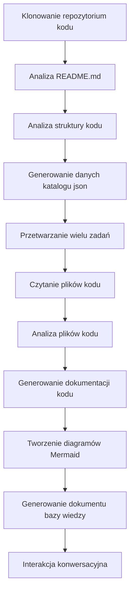

# OpenDeepWiki

[中文](https://raw.githubusercontent.com/AIDotNet/OpenDeepWiki/main/README.zh-CN.md) | [English](https://raw.githubusercontent.com/AIDotNet/OpenDeepWiki/main/README.md)

<div align="center">
  
  <h3>Baza Wiedzy o Kodzie Napędzana Sztuczną Inteligencją</h3>
</div>

# Sponsor

[](https://share.302.ai/jXcaTv)

[302.AI](https://share.302.ai/jXcaTv) to platforma AI klasy enterprise typu pay-as-you-go, oferująca otwartą platformę oraz ekosystem open-source, pozwalając AI znaleźć rozwiązania dla każdego problemu. Kliknij [tutaj](https://share.302.ai/jXcaTv), aby otrzymać $1 darmowego kredytu!

## Funkcje

- **Szybka konwersja:** Wszystkie repozytoria kodu Github, Gitlab, Gitee, Gitea i inne mogą zostać przekształcone w bazy wiedzy w zaledwie kilka minut.
- **Obsługa wielu języków:** Analiza kodu i generowanie dokumentacji są obsługiwane dla wszystkich języków programowania.
- **Struktura kodu:** Automatycznie generowane diagramy Mermaid pozwalają zrozumieć strukturę kodu.
- **Modele niestandardowe:** Obsługa modeli niestandardowych i własnych API, umożliwiając rozbudowę w razie potrzeby.
- **Inteligentna analiza AI:** Analiza kodu i zrozumienie zależności w kodzie na podstawie AI.
- **Łatwa optymalizacja SEO:** Generowanie dokumentów oraz baz wiedzy przyjaznych SEO z użyciem Next.js, ułatwiając indeksowanie przez wyszukiwarki.
- **Dialogowa interakcja:** Obsługa interakcji dialogowej z AI w celu uzyskania szczegółowych informacji i sposobów użycia kodu oraz głębszego zrozumienia kodu.

Lista funkcji:
- [x] Obsługa wielu repozytoriów kodu (Github, Gitlab, Gitee, Gitea itp.)
- [x] Obsługa wielu języków programowania (Python, Java, C#, JavaScript itd.)
- [x] Obsługa zarządzania repozytoriami — dodawanie, usuwanie, modyfikowanie i przeszukiwanie repozytoriów
- [x] Obsługa wielu dostawców AI (OpenAI, AzureOpenAI, Anthropic itd.)
- [x] Obsługa wielu baz danych (SQLite, PostgreSQL, SqlServer itd.)
- [x] Obsługa wielu języków (chiński, angielski, francuski itd.)
- [x] Obsługa przesyłania plików ZIP oraz lokalnych plików
- [x] Platforma do generowania zbiorów danych do fine-tuningu
- [x] Obsługa zarządzania repozytoriami na poziomie katalogów, umożliwiając niestandardowe generowanie katalogów i dynamiczne tworzenie dokumentacji
- [x] Obsługa zarządzania katalogami repozytoriów — umożliwia modyfikację katalogów repozytoriów
- [x] Obsługa zarządzania użytkownikami — dodawanie, usuwanie, modyfikowanie i przeszukiwanie użytkowników
- [ ] Obsługa zarządzania uprawnieniami użytkowników — dodawanie, usuwanie, modyfikowanie i przeszukiwanie uprawnień użytkowników
- [x] Obsługa generowania różnych zbiorów danych do fine-tuningu na poziomie repozytorium

# Wprowadzenie do projektu

OpenDeepWiki to projekt open-source inspirowany [DeepWiki](https://deepwiki.com/), rozwijany w technologii .NET 9 i Semantic Kernel. Celem jest pomoc programistom w lepszym zrozumieniu i wykorzystaniu baz kodu poprzez takie funkcje jak analiza kodu, generowanie dokumentacji oraz tworzenie grafu wiedzy.
- Analiza struktury kodu
- Zrozumienie kluczowych koncepcji repozytoriów
- Generowanie dokumentacji kodu
- Automatyczne tworzenie README.md dla kodu
  Obsługa MCP

OpenDeepWiki obsługuje MCP (Model Context Protocol)
- Obsługa dostarczania MCPServer dla pojedynczego repozytorium i przeprowadzania analizy pojedynczego repozytorium.

Użycie: Poniżej znajduje się przykład użycia kursora:
```json
{
  "mcpServers": {
    "OpenDeepWiki":{
      "url": "http://Twój IP usługi OpenDeepWiki:port/sse?owner=AIDotNet&name=OpenDeepWiki"
    }
  }
}
```
- owner: Nazwa organizacji lub właściciela repozytorium.
- name: Nazwa repozytorium.

Po dodaniu repozytorium, przetestuj zadając pytanie (pamiętaj, aby przed tym przetworzyć repozytorium): Czym jest OpenDeepWiki? Efekt pokazano na obrazku: 

W ten sposób możesz używać OpenDeepWiki jako MCPServer, czyniąc go dostępnym do wywołań przez inne modele AI, ułatwiając analizę i zrozumienie projektu open-source.

## 🚀 Szybki Start

1. Sklonuj repozytorium
```bash
git clone https://github.com/AIDotNet/OpenDeepWiki.git
cd OpenDeepWiki
```

2. Otwórz plik `docker-compose.yml` i zmodyfikuj poniższe zmienne środowiskowe:

Ollama:
```yaml
services:
  koalawiki:
    environment:
      - KOALAWIKI_REPOSITORIES=/repositories
      - TASK_MAX_SIZE_PER_USER=5 # Maksymalna liczba równoległych zadań generowania dokumentacji przez AI dla jednego użytkownika
      - CHAT_MODEL=qwen2.5:32b # Model musi obsługiwać funkcje
      - ANALYSIS_MODEL=qwen2.5:32b # Model analityczny używany do generowania struktury katalogów repozytorium
      - CHAT_API_KEY=sk-xxxxx # Twój klucz API
      - LANGUAGE= # Ustaw domyślny język generowania na "chiński"
      - ENDPOINT=https://IP Twojego Ollama:Port/v1
      - DB_TYPE=sqlite
      - MODEL_PROVIDER=OpenAI # Dostawca modelu, domyślnie OpenAI, obsługuje także AzureOpenAI oraz Anthropic
      - DB_CONNECTION_STRING=Data Source=/data/KoalaWiki.db
      - EnableSmartFilter=true # Czy włączyć inteligentne filtrowanie (może wpłynąć na sposób pozyskiwania katalogu repozytorium przez AI)
      - UPDATE_INTERVAL # Interwał aktualizacji przyrostowej repozytorium, jednostka: dni
      - MAX_FILE_LIMIT=100 # Maksymalny limit przesyłanych plików, w MB
      - DEEP_RESEARCH_MODEL= # Prowadź dogłębne badania modelu, jeśli puste użyj CHAT_MODEL
      - ENABLE_INCREMENTAL_UPDATE=true # Czy włączyć aktualizacje przyrostowe
      - ENABLE_CODED_DEPENDENCY_ANALYSIS=false # Czy włączyć analizę zależności kodu (może wpłynąć na jakość kodu)
      - ENABLE_WAREHOUSE_FUNCTION_PROMPT_TASK=false # Czy włączyć generowanie MCP Prompt
      - ENABLE_WAREHOUSE_DESCRIPTION_TASK=false # Czy włączyć generowanie opisu repozytorium
```

OpenAI:
```yaml
services:
  koalawiki:
    environment:
      - KOALAWIKI_REPOSITORIES=/repositories
      - TASK_MAX_SIZE_PER_USER=5 # Maksymalna liczba równoległych zadań generowania dokumentacji przez AI dla jednego użytkownika
      - CHAT_MODEL=DeepSeek-V3 # Model musi obsługiwać funkcje
      - ANALYSIS_MODEL= # Model analityczny używany do generowania struktury katalogów repozytorium
      - CHAT_API_KEY= # Twój klucz API
      - LANGUAGE= # Ustaw domyślny język generowania na "chiński"
      - ENDPOINT=https://api.token-ai.cn/v1
      - DB_TYPE=sqlite
      - MODEL_PROVIDER=OpenAI # Dostawca modelu, domyślnie OpenAI, obsługuje także AzureOpenAI oraz Anthropic
      - DB_CONNECTION_STRING=Data Source=/data/KoalaWiki.db
      - EnableSmartFilter=true # Czy włączyć inteligentne filtrowanie (może wpłynąć na sposób pozyskiwania katalogu repozytorium przez AI)
      - UPDATE_INTERVAL # Interwał aktualizacji przyrostowej repozytorium, jednostka: dni
      - MAX_FILE_LIMIT=100 # Maksymalny limit przesyłanych plików, w MB
      - DEEP_RESEARCH_MODEL= # Prowadź dogłębne badania modelu, jeśli puste użyj CHAT_MODEL
      - ENABLE_INCREMENTAL_UPDATE=true # Czy włączyć aktualizacje przyrostowe
      - ENABLE_CODED_DEPENDENCY_ANALYSIS=false # Czy włączyć analizę zależności kodu (może wpłynąć na jakość kodu)
      - ENABLE_WAREHOUSE_FUNCTION_PROMPT_TASK=false # Czy włączyć generowanie MCP Prompt
      - ENABLE_WAREHOUSE_DESCRIPTION_TASK=false # Czy włączyć generowanie opisu repozytorium
```

AzureOpenAI:
```yaml
services:
  koalawiki:
    environment:
      - KOALAWIKI_REPOSITORIES=/repositories
      - TASK_MAX_SIZE_PER_USER=5 # Maksymalna liczba równoległych zadań generowania dokumentacji przez AI dla jednego użytkownika
      - CHAT_MODEL=DeepSeek-V3 # Model musi obsługiwać funkcje
      - ANALYSIS_MODEL= # Model analityczny używany do generowania struktury katalogów repozytorium
      - CHAT_API_KEY= # Twój klucz API
      - LANGUAGE= # Ustaw domyślny język generowania na "chiński"
      - ENDPOINT=https://your-azure-address.openai.azure.com/
      - DB_TYPE=sqlite
      - MODEL_PROVIDER=AzureOpenAI # Dostawca modelu, domyślnie OpenAI, obsługuje także AzureOpenAI oraz Anthropic
      - DB_CONNECTION_STRING=Data Source=/data/KoalaWiki.db
      - EnableSmartFilter=true # Czy włączyć inteligentne filtrowanie (może wpłynąć na sposób pozyskiwania katalogu repozytorium przez AI)
      - UPDATE_INTERVAL # Interwał aktualizacji przyrostowej repozytorium, jednostka: dni
      - MAX_FILE_LIMIT=100 # Maksymalny limit przesyłanych plików, w MB
      - DEEP_RESEARCH_MODEL= # Prowadź dogłębne badania modelu, jeśli puste użyj CHAT_MODEL
      - ENABLE_INCREMENTAL_UPDATE=true # Czy włączyć aktualizacje przyrostowe
      - ENABLE_CODED_DEPENDENCY_ANALYSIS=false # Czy włączyć analizę zależności kodu (może wpłynąć na jakość kodu)
      - ENABLE_WAREHOUSE_FUNCTION_PROMPT_TASK=false # Czy włączyć generowanie MCP Prompt
      - ENABLE_WAREHOUSE_DESCRIPTION_TASK=false # Czy włączyć generowanie opisu repozytorium
```

Anthropic:
```yaml
services:
  koalawiki:
    environment:
      - KOALAWIKI_REPOSITORIES=/repositories
      - TASK_MAX_SIZE_PER_USER=5 # Maksymalna liczba równoległych zadań generowania dokumentacji przez AI dla jednego użytkownika
      - CHAT_MODEL=DeepSeek-V3 # Model musi obsługiwać funkcje
      - ANALYSIS_MODEL= # Model analityczny używany do generowania struktury katalogów repozytorium
      - CHAT_API_KEY= # Twój klucz API
      - LANGUAGE= # Ustaw domyślny język generowania na "chiński"
      - ENDPOINT=https://api.anthropic.com/
      - DB_TYPE=sqlite
      - MODEL_PROVIDER=Anthropic # Dostawca modelu, domyślnie OpenAI, obsługuje także AzureOpenAI oraz Anthropic
      - DB_CONNECTION_STRING=Data Source=/data/KoalaWiki.db
      - EnableSmartFilter=true # Czy włączyć inteligentne filtrowanie (może wpłynąć na sposób pozyskiwania katalogu repozytorium przez AI)
      - UPDATE_INTERVAL # Interwał aktualizacji przyrostowej repozytorium, jednostka: dni
      - MAX_FILE_LIMIT=100 # Maksymalny limit przesyłanych plików, w MB
      - DEEP_RESEARCH_MODEL= # Prowadź dogłębne badania modelu, jeśli puste użyj CHAT_MODEL
      - ENABLE_INCREMENTAL_UPDATE=true # Czy włączyć aktualizacje przyrostowe
      - ENABLE_CODED_DEPENDENCY_ANALYSIS=false # Czy włączyć analizę zależności kodu (może wpłynąć na jakość kodu)
      - ENABLE_WAREHOUSE_FUNCTION_PROMPT_TASK=false # Czy włączyć generowanie MCP Prompt
      - ENABLE_WAREHOUSE_DESCRIPTION_TASK=false # Czy włączyć generowanie opisu repozytorium
```

> 💡 **Jak zdobyć klucz API:**
> - Uzyskaj klucz Google API [Google AI Studio](https://makersuite.google.com/app/apikey)
> - Uzyskaj klucz OpenAI API [OpenAI Platform](https://platform.openai.com/api-keys)
> - Uzyskaj CoresHub [CoresHub](https://console.coreshub.cn/xb3/maas/global-keys) [Kliknij tutaj po 50 milionów darmowych tokenów](https://account.coreshub.cn/signup?invite=ZmpMQlZxYVU=)
> - Uzyskaj TokenAI [TokenAI](https://api.token-ai.cn/)

3. Uruchom usługę

Możesz użyć dostarczonych poleceń Makefile do łatwego zarządzania aplikacją:

```bash
# Buduj wszystkie obrazy Docker
make build

# Uruchom wszystkie usługi w trybie tła
make up

# Lub uruchom w trybie deweloperskim (z widocznymi logami)
```
make dev
```

Następnie odwiedź http://localhost:8090, aby uzyskać dostęp do bazy wiedzy.

Więcej poleceń:
```bash
make help
```

### Dla użytkowników Windows (bez make)

Jeśli używasz systemu Windows i nie masz dostępnego `make`, możesz użyć tych poleceń Docker Compose bezpośrednio:

```bash
# Buduj wszystkie obrazy Dockera
docker-compose build

# Uruchom wszystkie usługi w tle
docker-compose up -d

# Uruchom w trybie deweloperskim (z widocznymi logami)
docker-compose up

# Zatrzymaj wszystkie usługi
docker-compose down

# Wyświetl logi
docker-compose logs -f
```

Aby budować określone architektury lub usługi, użyj:

```bash
# Buduj tylko backend
docker-compose build koalawiki

# Buduj tylko frontend
docker-compose build koalawiki-web

# Buduj z parametrami architektury
docker-compose build --build-arg ARCH=arm64
docker-compose build --build-arg ARCH=amd64
```


### Wdrażanie do Sealos z publicznym dostępem do Internetu
[](https://bja.sealos.run/?openapp=system-template%3FtemplateName%3DOpenDeepWiki)
Szczegółowe kroki znajdziesz tutaj: [Jednoklikowe wdrożenie OpenDeepWiki jako aplikacji Sealos udostępnionej w sieci publicznej przy użyciu szablonów](https://raw.githubusercontent.com/AIDotNet/OpenDeepWiki/main/scripts/sealos/README.zh-CN.md)

## 🔍 Jak to działa

OpenDeepWiki wykorzystuje AI do:
 - Klonowania repozytorium kodu lokalnie
 - Analizy na podstawie README.md repozytorium
 - Analizy struktury kodu i czytania plików kodu w razie potrzeby, następnie generowania danych katalogu w formacie json
 - Przetwarzania zadań według katalogu, każde zadanie to dokument
 - Czytania plików kodu, analizy plików kodu, generowania dokumentacji kodu i tworzenia diagramów Mermaid przedstawiających zależności struktury kodu
 - Generowania końcowego dokumentu bazy wiedzy
 - Analizy repozytorium poprzez interakcję konwersacyjną i odpowiadania na zapytania użytkowników


## Zaawansowana konfiguracja

### Zmienne środowiskowe
  - KOALAWIKI_REPOSITORIES  Ścieżka do przechowywania repozytoriów
  - TASK_MAX_SIZE_PER_USER  Maksymalna liczba równoległych zadań generowania dokumentów AI na użytkownika
  - CHAT_MODEL  Model musi obsługiwać funkcje
  - ENDPOINT  Punkt końcowy API
  - ANALYSIS_MODEL  Model analizy do generowania struktury katalogu repozytorium
  - CHAT_API_KEY  Twój klucz API
  - LANGUAGE  Zmień język generowanych dokumentów
  - DB_TYPE  Typ bazy danych, domyślnie sqlite
  - MODEL_PROVIDER  Dostawca modelu, domyślnie OpenAI, obsługuje Azure, OpenAI i Anthropic
  - DB_CONNECTION_STRING  Łańcuch połączenia z bazą danych
  - EnableSmartFilter Czy inteligentne filtrowanie jest włączone, może wpływać na sposób, w jaki AI uzyskuje katalog plików repozytorium
  - UPDATE_INTERVAL Interwał aktualizacji przyrostowej repozytorium, jednostka: dni
  - MAX_FILE_LIMIT Maksymalny limit przesyłania plików, w MB
  - DEEP_RESEARCH_MODEL Przeprowadź dogłębne badania modelu i użyj CHAT_MODEL dla pustych
  - ENABLE_INCREMENTAL_UPDATE Czy włączyć aktualizacje przyrostowe
  - ENABLE_CODED_DEPENDENCY_ANALYSIS Czy włączyć analizę zależności kodu, może to mieć wpływ na jakość kodu
  - ENABLE_WAREHOUSE_FUNCTION_PROMPT_TASK  # Czy włączyć generowanie MCP Prompt
  - ENABLE_WAREHOUSE_DESCRIPTION_TASK # Czy włączyć generowanie opisu repozytorium

### Budowanie dla różnych architektur
Makefile udostępnia polecenia do budowania dla różnych architektur CPU:

```bash
# Buduj dla architektury ARM
make build-arm

# Buduj dla architektury AMD
make build-amd

# Buduj tylko backend dla ARM
make build-backend-arm

# Buduj tylko frontend dla AMD
make build-frontend-amd
```

## Discord

[dołącz do nas](https://discord.gg/8sxUNacv)

## WeChat 


## 📄 Licencja
Ten projekt jest licencjonowany na podstawie licencji MIT - zobacz plik [LICENSE](https://raw.githubusercontent.com/AIDotNet/OpenDeepWiki/main/LICENSE) po szczegóły.

## Historia gwiazdek

[](https://www.star-history.com/#AIDotNet/OpenDeepWiki&Date)



---


Tranlated By [Open Ai Tx](https://github.com/OpenAiTx/OpenAiTx) | Last indexed: 2025-06-11


---