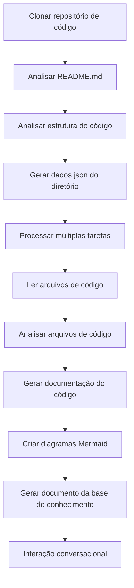

# OpenDeepWiki

[中文](README.zh-CN.md) | [English](README.md)

<div align="center">
  
  <h3>Base de Conhecimento de Código Orientada por IA</h3>
</div>

# Patrocinador

[](https://share.302.ai/jXcaTv)

[302.AI](https://share.302.ai/jXcaTv) é uma plataforma de aplicação de IA empresarial all-in-one, com pagamento conforme o uso. Oferece uma plataforma aberta e um ecossistema open-source, permitindo que a IA encontre soluções para todas as necessidades. Clique [aqui](https://share.302.ai/jXcaTv) para obter $1 de crédito gratuito!

## Funções

- **Conversão Rápida:** Todos os repositórios de código do Github, Gitlab, Gitee, Gitea e outros podem ser convertidos em bases de conhecimento em apenas alguns minutos.
- **Suporte Multi-idioma:** Suporta análise de código e geração de documentação para todas as linguagens de programação.
- **Estrutura do Código:** Diagramas automáticos em Mermaid são gerados para entender a estrutura do código.
- **Modelos Personalizados:** Suporte para modelos personalizados e APIs customizadas, permitindo expansão conforme a necessidade.
- **Análise Inteligente por IA:** Análise de código e compreensão das relações de código baseada em IA.
- **SEO Fácil:** Geração de documentos e bases de conhecimento otimizadas para SEO utilizando Next.js, facilitando a indexação por motores de busca.
- **Interação Dialogal:** Suporta interação dialogal com IA para obter informações detalhadas e métodos de uso do código, possibilitando compreensão aprofundada do código.

Lista de funcionalidades:
- [x] Suporta múltiplos repositórios de código (Github, Gitlab, Gitee, Gitea, etc.)
- [x] Suporta múltiplas linguagens de programação (Python, Java, C#, JavaScript, etc.)
- [x] Suporta gerenciamento de repositórios, fornecendo funções para adicionar, deletar, modificar e consultar repositórios
- [x] Suporta múltiplos provedores de IA (OpenAI, AzureOpenAI, Anthropic, etc.)
- [x] Suporta múltiplos bancos de dados (SQLite, PostgreSQL, SqlServer, etc.)
- [x] Suporta múltiplos idiomas (Chinês, Inglês, Francês, etc.)
- [x] Suporta upload de arquivos ZIP e arquivos locais
- [x] Fornece uma plataforma de fine-tuning de dados para gerar conjuntos de dados de ajuste fino
- [x] Suporta gerenciamento de repositórios em nível de diretório, permitindo geração de diretórios personalizados e criação dinâmica de documentação
- [x] Suporta gerenciamento de diretórios de repositórios, permitindo modificação dos diretórios dos repositórios
- [x] Suporta gerenciamento em nível de usuário, fornecendo funções de gerenciamento de usuários para adicionar, deletar, modificar e consultar usuários
- [ ] Suporta gerenciamento de permissões de usuário, fornecendo funções de gerenciamento de permissões de usuário para adicionar, deletar, modificar e consultar permissões de usuário
- [x] Suporta geração de diferentes conjuntos de dados de fine-tuning em nível de repositório

# Introdução ao Projeto

O OpenDeepWiki é um projeto open-source inspirado no [DeepWiki](https://deepwiki.com/), desenvolvido usando .NET 9 e Semantic Kernel. Tem como objetivo ajudar desenvolvedores a entender e utilizar melhor os repositórios de código, fornecendo recursos como análise de código, geração de documentação e criação de grafos de conhecimento.
- Analisa a estrutura do código
- Compreende conceitos centrais dos repositórios
- Gera documentação do código
- Cria automaticamente README.md para o código
  Suporte MCP


OpenDeepWiki suporta MCP (Model Context Protocol)
- Suporta fornecimento de um MCPServer para um repositório individual e realização de análise em um único repositório.

Uso: O seguinte é o uso do cursor:
```json
{
  "mcpServers": {
    "OpenDeepWiki":{
      "url": "http://Seu IP de serviço OpenDeepWiki:porta/sse?owner=AIDotNet&name=OpenDeepWiki"
    }
  }
}
```
- owner: Nome da organização ou proprietário do repositório.
- name: Nome do repositório.

Após adicionar o repositório, teste fazendo uma pergunta (por favor, note que antes disso o repositório deve ser processado): O que é OpenDeepWiki? O efeito é mostrado na imagem: 

Desta forma, você pode usar o OpenDeepWiki como um MCPServer, tornando-o disponível para outros modelos de IA, facilitando a análise e compreensão de um projeto open-source.

## 🚀 Início Rápido

1. Clone o repositório
```bash
git clone https://github.com/AIDotNet/OpenDeepWiki.git
cd OpenDeepWiki
```

2. Abra o arquivo `docker-compose.yml` e modifique as seguintes variáveis de ambiente:

Ollama:
```yaml
services:
  koalawiki:
    environment:
      - KOALAWIKI_REPOSITORIES=/repositories
      - TASK_MAX_SIZE_PER_USER=5 # Número máximo de tarefas de geração de documentos em paralelo por usuário via IA
      - CHAT_MODEL=qwen2.5:32b # O modelo deve suportar funções
      - ANALYSIS_MODEL=qwen2.5:32b # Modelo de análise usado para gerar a estrutura do diretório do repositório
      - CHAT_API_KEY=sk-xxxxx # Sua chave de API
      - LANGUAGE= # Defina o idioma padrão para geração como "Chinês"
      - ENDPOINT=https://IP do seu Ollama: Porta/v1
      - DB_TYPE=sqlite
      - MODEL_PROVIDER=OpenAI # Provedor do modelo, padrão é OpenAI, suporta AzureOpenAI e Anthropic
      - DB_CONNECTION_STRING=Data Source=/data/KoalaWiki.db
      - EnableSmartFilter=true # Se o filtro inteligente está habilitado ou não pode afetar como a IA obtém o diretório de arquivos do repositório
      - UPDATE_INTERVAL # Intervalo de atualização incremental do repositório, unidade: dias
      - MAX_FILE_LIMIT=100 # Limite máximo para upload de arquivos, em MB
      - DEEP_RESEARCH_MODEL= # Realiza pesquisa aprofundada no modelo e usa CHAT_MODEL se estiver vazio
      - ENABLE_INCREMENTAL_UPDATE=true # Se ativa atualizações incrementais
      - ENABLE_CODED_DEPENDENCY_ANALYSIS=false # Se ativa análise de dependência de código. Pode impactar a qualidade do código.
      - ENABLE_WAREHOUSE_FUNCTION_PROMPT_TASK=false # Se ativa a geração de Prompt MCP ou não.
      - ENABLE_WAREHOUSE_DESCRIPTION_TASK=false # Se ativa a geração de descrição do repositório
```

OpenAI:
```yaml
services:
  koalawiki:
    environment:
      - KOALAWIKI_REPOSITORIES=/repositories
      - TASK_MAX_SIZE_PER_USER=5 # Número máximo de tarefas de geração de documentos em paralelo por usuário via IA
      - CHAT_MODEL=DeepSeek-V3 # O modelo deve suportar funções
      - ANALYSIS_MODEL= # Modelo de análise usado para gerar a estrutura do diretório do repositório
      - CHAT_API_KEY= # Sua chave de API
      - LANGUAGE= # Defina o idioma padrão para geração como "Chinês"
      - ENDPOINT=https://api.token-ai.cn/v1
      - DB_TYPE=sqlite
      - MODEL_PROVIDER=OpenAI # Provedor do modelo, padrão é OpenAI, suporta AzureOpenAI e Anthropic
      - DB_CONNECTION_STRING=Data Source=/data/KoalaWiki.db
      - EnableSmartFilter=true # Se o filtro inteligente está habilitado ou não pode afetar como a IA obtém o diretório de arquivos do repositório
      - UPDATE_INTERVAL # Intervalo de atualização incremental do repositório, unidade: dias
      - MAX_FILE_LIMIT=100 # Limite máximo para upload de arquivos, em MB
      - DEEP_RESEARCH_MODEL= # Realiza pesquisa aprofundada no modelo e usa CHAT_MODEL se estiver vazio
      - ENABLE_INCREMENTAL_UPDATE=true # Se ativa atualizações incrementais
      - ENABLE_CODED_DEPENDENCY_ANALYSIS=false # Se ativa análise de dependência de código. Pode impactar a qualidade do código.
      - ENABLE_WAREHOUSE_FUNCTION_PROMPT_TASK=false # Se ativa a geração de Prompt MCP ou não.
      - ENABLE_WAREHOUSE_DESCRIPTION_TASK=false # Se ativa a geração de descrição do repositório
```

AzureOpenAI:
```yaml
services:
  koalawiki:
    environment:
      - KOALAWIKI_REPOSITORIES=/repositories
      - TASK_MAX_SIZE_PER_USER=5 # Número máximo de tarefas de geração de documentos em paralelo por usuário via IA
      - CHAT_MODEL=DeepSeek-V3 # O modelo deve suportar funções
      - ANALYSIS_MODEL= # Modelo de análise usado para gerar a estrutura do diretório do repositório
      - CHAT_API_KEY= # Sua chave de API
      - LANGUAGE= # Defina o idioma padrão para geração como "Chinês"
      - ENDPOINT=https://seu-endereco-azure.openai.azure.com/
      - DB_TYPE=sqlite
      - MODEL_PROVIDER=AzureOpenAI # Provedor do modelo, padrão é OpenAI, suporta AzureOpenAI e Anthropic
      - DB_CONNECTION_STRING=Data Source=/data/KoalaWiki.db
      - EnableSmartFilter=true # Se o filtro inteligente está habilitado ou não pode afetar como a IA obtém o diretório de arquivos do repositório
      - UPDATE_INTERVAL # Intervalo de atualização incremental do repositório, unidade: dias
      - MAX_FILE_LIMIT=100 # Limite máximo para upload de arquivos, em MB
      - DEEP_RESEARCH_MODEL= # Realiza pesquisa aprofundada no modelo e usa CHAT_MODEL se estiver vazio
      - ENABLE_INCREMENTAL_UPDATE=true # Se ativa atualizações incrementais
      - ENABLE_CODED_DEPENDENCY_ANALYSIS=false # Se ativa análise de dependência de código. Pode impactar a qualidade do código.
      - ENABLE_WAREHOUSE_FUNCTION_PROMPT_TASK=false # Se ativa a geração de Prompt MCP ou não.
      - ENABLE_WAREHOUSE_DESCRIPTION_TASK=false # Se ativa a geração de descrição do repositório
```

Anthropic:
```yaml
services:
  koalawiki:
    environment:
      - KOALAWIKI_REPOSITORIES=/repositories
      - TASK_MAX_SIZE_PER_USER=5 # Número máximo de tarefas de geração de documentos em paralelo por usuário via IA
      - CHAT_MODEL=DeepSeek-V3 # O modelo deve suportar funções
      - ANALYSIS_MODEL= # Modelo de análise usado para gerar a estrutura do diretório do repositório
      - CHAT_API_KEY= # Sua chave de API
      - LANGUAGE= # Defina o idioma padrão para geração como "Chinês"
      - ENDPOINT=https://api.anthropic.com/
      - DB_TYPE=sqlite
      - MODEL_PROVIDER=Anthropic # Provedor do modelo, padrão é OpenAI, suporta AzureOpenAI e Anthropic
      - DB_CONNECTION_STRING=Data Source=/data/KoalaWiki.db
      - EnableSmartFilter=true # Se o filtro inteligente está habilitado ou não pode afetar como a IA obtém o diretório de arquivos do repositório
      - UPDATE_INTERVAL # Intervalo de atualização incremental do repositório, unidade: dias
      - MAX_FILE_LIMIT=100 # Limite máximo para upload de arquivos, em MB
      - DEEP_RESEARCH_MODEL= # Realiza pesquisa aprofundada no modelo e usa CHAT_MODEL se estiver vazio
      - ENABLE_INCREMENTAL_UPDATE=true # Se ativa atualizações incrementais
      - ENABLE_CODED_DEPENDENCY_ANALYSIS=false # Se ativa análise de dependência de código. Pode impactar a qualidade do código.
      - ENABLE_WAREHOUSE_FUNCTION_PROMPT_TASK=false # Se ativa a geração de Prompt MCP ou não.
      - ENABLE_WAREHOUSE_DESCRIPTION_TASK=false # Se ativa a geração de descrição do repositório
```

> 💡 **Como obter uma chave de API:**
> - Obtenha a chave da API do Google [Google AI Studio](https://makersuite.google.com/app/apikey)
> - Obtenha a chave da API do OpenAI [OpenAI Platform](https://platform.openai.com/api-keys)
> - Obtenha CoresHub [CoresHub](https://console.coreshub.cn/xb3/maas/global-keys) [Clique aqui para 50 milhões de tokens gratuitos](https://account.coreshub.cn/signup?invite=ZmpMQlZxYVU=)
> - Obtenha TokenAI [TokenAI](https://api.token-ai.cn/)

3. Inicie o serviço

Você pode usar os comandos fornecidos no Makefile para gerenciar facilmente a aplicação:

```bash
# Construa todas as imagens Docker
make build

# Inicie todos os serviços em modo background
make up

# Ou inicie em modo de desenvolvimento (com logs visíveis)
```
make dev
```

Depois, acesse http://localhost:8090 para acessar a base de conhecimento.

Para mais comandos:
```bash
make help
```

### Para Usuários do Windows (sem make)

Se você está usando Windows e não possui o `make` disponível, pode usar estes comandos do Docker Compose diretamente:

```bash
# Construir todas as imagens Docker
docker-compose build

# Iniciar todos os serviços em modo background
docker-compose up -d

# Iniciar em modo de desenvolvimento (com logs visíveis)
docker-compose up

# Parar todos os serviços
docker-compose down

# Visualizar logs
docker-compose logs -f
```

Para construir arquiteturas ou serviços específicos, use:

```bash
# Construir apenas o backend
docker-compose build koalawiki

# Construir apenas o frontend
docker-compose build koalawiki-web

# Construir com parâmetros de arquitetura
docker-compose build --build-arg ARCH=arm64
docker-compose build --build-arg ARCH=amd64
```


### Deploy no Sealos com Acesso Público à Internet
[](https://bja.sealos.run/?openapp=system-template%3FtemplateName%3DOpenDeepWiki)
Para etapas detalhadas, consulte: [Implantação com Um Clique do OpenDeepWiki como Aplicação Sealos Exposta à Rede Pública Usando Templates](https://raw.githubusercontent.com/AIDotNet/OpenDeepWiki/main/scripts/sealos/README.zh-CN.md)

## 🔍 Como Funciona

O OpenDeepWiki utiliza IA para:
 - Clonar o repositório de código localmente
 - Analisar com base no README.md do repositório
 - Analisar a estrutura do código e ler arquivos de código conforme necessário, depois gerar dados json de diretório
 - Processar tarefas de acordo com o diretório, cada tarefa é um documento
 - Ler arquivos de código, analisar arquivos de código, gerar documentação de código e criar diagramas Mermaid representando dependências da estrutura do código
 - Gerar o documento final da base de conhecimento
 - Analisar o repositório por meio de interação conversacional e responder às dúvidas dos usuários


## Configuração Avançada

### Variáveis de Ambiente
  - KOALAWIKI_REPOSITORIES  Caminho para armazenar os repositórios
  - TASK_MAX_SIZE_PER_USER  Máximo de tarefas paralelas para geração de documentos IA por usuário
  - CHAT_MODEL  O modelo deve suportar funções
  - ENDPOINT  Endpoint da API
  - ANALYSIS_MODEL  Modelo de análise para geração da estrutura do diretório do repositório
  - CHAT_API_KEY  Sua chave de API
  - LANGUAGE  Alterar o idioma dos documentos gerados
  - DB_TYPE  Tipo de banco de dados, padrão é sqlite
  - MODEL_PROVIDER  Provedor do modelo, padrão OpenAI, suporta Azure, OpenAI e Anthropic
  - DB_CONNECTION_STRING  String de conexão do banco de dados
  - EnableSmartFilter Se o filtro inteligente está ativado ou não pode afetar como a IA obtém o diretório de arquivos do repositório
  - UPDATE_INTERVAL Intervalo de atualização incremental do repositório, unidade: dias
  - MAX_FILE_LIMIT Limite máximo para upload de arquivos, em MB
  - DEEP_RESEARCH_MODEL Realizar pesquisa aprofundada no modelo e usar CHAT_MODEL para o vazio
  - ENABLE_INCREMENTAL_UPDATE Se deve habilitar atualizações incrementais
  - ENABLE_CODED_DEPENDENCY_ANALYSIS Se deve habilitar análise de dependência de código, isso pode impactar a qualidade do código.
  - ENABLE_WAREHOUSE_FUNCTION_PROMPT_TASK  # Se deve habilitar geração de Prompt MCP ou não.
  - ENABLE_WAREHOUSE_DESCRIPTION_TASK # Se deve habilitar a geração de Description do repositório

### Build para Diferentes Arquiteturas
O Makefile fornece comandos para compilar para diferentes arquiteturas de CPU:

```bash
# Build para arquitetura ARM
make build-arm

# Build para arquitetura AMD
make build-amd

# Build apenas backend para ARM
make build-backend-arm

# Build apenas frontend para AMD
make build-frontend-amd
```

## Discord

[junte-se a nós](https://discord.gg/8sxUNacv)

## WeChat 


## 📄 Licença
Este projeto está licenciado sob a Licença MIT - veja o arquivo [LICENSE](https://raw.githubusercontent.com/AIDotNet/OpenDeepWiki/main/LICENSE) para detalhes.

## Histórico de Stars

[](https://www.star-history.com/#AIDotNet/OpenDeepWiki&Date)



---


Tranlated By [Open Ai Tx](https://github.com/OpenAiTx/OpenAiTx) | Last indexed: 2025-06-11


---