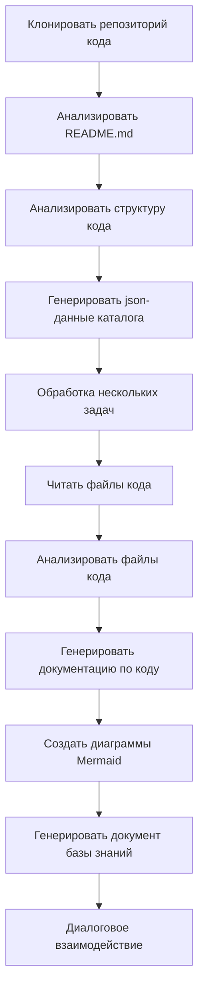

# OpenDeepWiki

[中文](https://raw.githubusercontent.com/AIDotNet/OpenDeepWiki/main/README.zh-CN.md) | [English](https://raw.githubusercontent.com/AIDotNet/OpenDeepWiki/main/README.md)

<div align="center">
  
  <h3>AI-Управляемая База Знаний по Коду</h3>
</div>

# Спонсор

[](https://share.302.ai/jXcaTv)

[302.AI](https://share.302.ai/jXcaTv) — это облачная, универсальная AI-платформа корпоративного уровня с оплатой по мере использования. Она предлагает открытую платформу и open-source экосистему, позволяя AI находить решения для любых задач. Нажмите [здесь](https://share.302.ai/jXcaTv), чтобы получить бесплатный кредит $1!

## Функционал

- **Быстрое преобразование:** Все репозитории кода Github, Gitlab, Gitee, Gitea и других платформ могут быть преобразованы в базы знаний всего за несколько минут.
- **Многоязычная поддержка:** Поддерживается анализ кода и генерация документации для всех языков программирования.
- **Структура кода:** Автоматически генерируются диаграммы Mermaid для понимания структуры кода.
- **Пользовательские модели:** Поддержка пользовательских моделей и API, с возможностью расширения по необходимости.
- **AI-интеллектуальный анализ:** Анализ кода и понимание связей в коде на основе AI.
- **SEO-оптимизация:** Генерация SEO-дружественных документов и баз знаний с помощью Next.js, что облегчает индексацию поисковыми системами.
- **Диалоговое взаимодействие:** Поддержка диалогового общения с AI для получения подробной информации и способов использования кода, а также для глубокого понимания кода.

Список возможностей:
- [x] Поддержка множества репозиториев кода (Github, Gitlab, Gitee, Gitea и др.)
- [x] Поддержка множества языков программирования (Python, Java, C#, JavaScript и др.)
- [x] Поддержка управления репозиториями: добавление, удаление, изменение и поиск репозиториев
- [x] Поддержка различных AI-провайдеров (OpenAI, AzureOpenAI, Anthropic и др.)
- [x] Поддержка различных баз данных (SQLite, PostgreSQL, SqlServer и др.)
- [x] Поддержка различных языков (китайский, английский, французский и др.)
- [x] Поддержка загрузки ZIP-файлов и локальных файлов
- [x] Предоставляет платформу для дообучения данных и генерации датасетов для дообучения
- [x] Поддержка управления репозиториями на уровне директорий, позволяет создавать пользовательские директории и динамическую документацию
- [x] Поддержка управления директориями репозиториев, позволяет изменять директории репозиториев
- [x] Поддержка управления пользователями: добавление, удаление, изменение и поиск пользователей
- [ ] Поддержка управления правами пользователей: добавление, удаление, изменение и поиск прав пользователей
- [x] Поддержка генерации различных датасетов для дообучения на уровне репозитория

# Описание проекта

OpenDeepWiki — это open-source проект, вдохновленный [DeepWiki](https://deepwiki.com/), разработанный с использованием .NET 9 и Semantic Kernel. Его цель — помочь разработчикам лучше понимать и использовать кодовые базы, предоставляя такие возможности, как анализ кода, генерация документации и создание графа знаний.
- Анализ структуры кода
- Понимание ключевых концепций репозиториев
- Генерация документации по коду
- Автоматическое создание README.md для кода

  Поддержка MCP

OpenDeepWiki поддерживает MCP (Model Context Protocol)
- Поддерживает предоставление MCPServer для отдельного репозитория и проведение анализа по отдельному репозиторию.

Использование: ниже приведен пример использования cursor:
```json
{
  "mcpServers": {
    "OpenDeepWiki":{
      "url": "http://Ваш IP-адрес и порт сервиса OpenDeepWiki/sse?owner=AIDotNet&name=OpenDeepWiki"
    }
  }
}
```
- owner: Имя организации или владельца репозитория.
- name: Имя репозитория.

После добавления репозитория протестируйте его, задав вопрос (обратите внимание, что предварительно репозиторий должен быть обработан): What is OpenDeepWiki? Результат показан на рисунке: 

Таким образом, вы можете использовать OpenDeepWiki как MCPServer, предоставляя другим AI-моделям возможность анализа и понимания open-source проекта.

## 🚀 Быстрый старт

1. Клонируйте репозиторий
```bash
git clone https://github.com/AIDotNet/OpenDeepWiki.git
cd OpenDeepWiki
```

2. Откройте файл `docker-compose.yml` и измените следующие переменные окружения:

Ollama:
```yaml
services:
  koalawiki:
    environment:
      - KOALAWIKI_REPOSITORIES=/repositories
      - TASK_MAX_SIZE_PER_USER=5 # Максимальное количество параллельных задач генерации документации на одного пользователя через AI
      - CHAT_MODEL=qwen2.5:32b # Модель должна поддерживать функции
      - ANALYSIS_MODEL=qwen2.5:32b # Модель анализа, используемая для генерации структуры директории репозитория
      - CHAT_API_KEY=sk-xxxxx # Ваш API-ключ
      - LANGUAGE= # Установите язык генерации по умолчанию, например, "Chinese"
      - ENDPOINT=https://IP_вашего_Ollama:Порт/v1
      - DB_TYPE=sqlite
      - MODEL_PROVIDER=OpenAI # Провайдер модели, по умолчанию OpenAI, поддерживает AzureOpenAI и Anthropic
      - DB_CONNECTION_STRING=Data Source=/data/KoalaWiki.db
      - EnableSmartFilter=true # Включен ли интеллектуальный фильтр (может повлиять на доступ AI к файловой структуре репозитория)
      - UPDATE_INTERVAL # Интервал инкрементных обновлений репозитория, ед. изм. — дни
      - MAX_FILE_LIMIT=100 # Максимальный лимит загрузки файлов, МБ
      - DEEP_RESEARCH_MODEL= # Для глубокого исследования модели, если пусто — используется CHAT_MODEL
      - ENABLE_INCREMENTAL_UPDATE=true # Включить ли инкрементные обновления
      - ENABLE_CODED_DEPENDENCY_ANALYSIS=false # Включить ли анализ зависимостей кода (может повлиять на качество кода)
      - ENABLE_WAREHOUSE_FUNCTION_PROMPT_TASK=false # Включить ли генерацию MCP Prompt
      - ENABLE_WAREHOUSE_DESCRIPTION_TASK=false # Включить ли генерацию описания репозитория
```

OpenAI:
```yaml
services:
  koalawiki:
    environment:
      - KOALAWIKI_REPOSITORIES=/repositories
      - TASK_MAX_SIZE_PER_USER=5 # Максимальное количество параллельных задач генерации документации на одного пользователя через AI
      - CHAT_MODEL=DeepSeek-V3 # Модель должна поддерживать функции
      - ANALYSIS_MODEL= # Модель анализа, используемая для генерации структуры директории репозитория
      - CHAT_API_KEY= # Ваш API-ключ
      - LANGUAGE= # Установите язык генерации по умолчанию, например, "Chinese"
      - ENDPOINT=https://api.token-ai.cn/v1
      - DB_TYPE=sqlite
      - MODEL_PROVIDER=OpenAI # Провайдер модели, по умолчанию OpenAI, поддерживает AzureOpenAI и Anthropic
      - DB_CONNECTION_STRING=Data Source=/data/KoalaWiki.db
      - EnableSmartFilter=true # Включен ли интеллектуальный фильтр (может повлиять на доступ AI к файловой структуре репозитория)
      - UPDATE_INTERVAL # Интервал инкрементных обновлений репозитория, ед. изм. — дни
      - MAX_FILE_LIMIT=100 # Максимальный лимит загрузки файлов, МБ
      - DEEP_RESEARCH_MODEL= # Для глубокого исследования модели, если пусто — используется CHAT_MODEL
      - ENABLE_INCREMENTAL_UPDATE=true # Включить ли инкрементные обновления
      - ENABLE_CODED_DEPENDENCY_ANALYSIS=false # Включить ли анализ зависимостей кода (может повлиять на качество кода)
      - ENABLE_WAREHOUSE_FUNCTION_PROMPT_TASK=false # Включить ли генерацию MCP Prompt
      - ENABLE_WAREHOUSE_DESCRIPTION_TASK=false # Включить ли генерацию описания репозитория
```

AzureOpenAI:
```yaml
services:
  koalawiki:
    environment:
      - KOALAWIKI_REPOSITORIES=/repositories
      - TASK_MAX_SIZE_PER_USER=5 # Максимальное количество параллельных задач генерации документации на одного пользователя через AI
      - CHAT_MODEL=DeepSeek-V3 # Модель должна поддерживать функции
      - ANALYSIS_MODEL= # Модель анализа, используемая для генерации структуры директории репозитория
      - CHAT_API_KEY= # Ваш API-ключ
      - LANGUAGE= # Установите язык генерации по умолчанию, например, "Chinese"
      - ENDPOINT=https://your-azure-address.openai.azure.com/
      - DB_TYPE=sqlite
      - MODEL_PROVIDER=AzureOpenAI # Провайдер модели, по умолчанию OpenAI, поддерживает AzureOpenAI и Anthropic
      - DB_CONNECTION_STRING=Data Source=/data/KoalaWiki.db
      - EnableSmartFilter=true # Включен ли интеллектуальный фильтр (может повлиять на доступ AI к файловой структуре репозитория)
      - UPDATE_INTERVAL # Интервал инкрементных обновлений репозитория, ед. изм. — дни
      - MAX_FILE_LIMIT=100 # Максимальный лимит загрузки файлов, МБ
      - DEEP_RESEARCH_MODEL= # Для глубокого исследования модели, если пусто — используется CHAT_MODEL
      - ENABLE_INCREMENTAL_UPDATE=true # Включить ли инкрементные обновления
      - ENABLE_CODED_DEPENDENCY_ANALYSIS=false # Включить ли анализ зависимостей кода (может повлиять на качество кода)
      - ENABLE_WAREHOUSE_FUNCTION_PROMPT_TASK=false # Включить ли генерацию MCP Prompt
      - ENABLE_WAREHOUSE_DESCRIPTION_TASK=false # Включить ли генерацию описания репозитория
```

Anthropic:
```yaml
services:
  koalawiki:
    environment:
      - KOALAWIKI_REPOSITORIES=/repositories
      - TASK_MAX_SIZE_PER_USER=5 # Максимальное количество параллельных задач генерации документации на одного пользователя через AI
      - CHAT_MODEL=DeepSeek-V3 # Модель должна поддерживать функции
      - ANALYSIS_MODEL= # Модель анализа, используемая для генерации структуры директории репозитория
      - CHAT_API_KEY= # Ваш API-ключ
      - LANGUAGE= # Установите язык генерации по умолчанию, например, "Chinese"
      - ENDPOINT=https://api.anthropic.com/
      - DB_TYPE=sqlite
      - MODEL_PROVIDER=Anthropic # Провайдер модели, по умолчанию OpenAI, поддерживает AzureOpenAI и Anthropic
      - DB_CONNECTION_STRING=Data Source=/data/KoalaWiki.db
      - EnableSmartFilter=true # Включен ли интеллектуальный фильтр (может повлиять на доступ AI к файловой структуре репозитория)
      - UPDATE_INTERVAL # Интервал инкрементных обновлений репозитория, ед. изм. — дни
      - MAX_FILE_LIMIT=100 # Максимальный лимит загрузки файлов, МБ
      - DEEP_RESEARCH_MODEL= # Для глубокого исследования модели, если пусто — используется CHAT_MODEL
      - ENABLE_INCREMENTAL_UPDATE=true # Включить ли инкрементные обновления
      - ENABLE_CODED_DEPENDENCY_ANALYSIS=false # Включить ли анализ зависимостей кода (может повлиять на качество кода)
      - ENABLE_WAREHOUSE_FUNCTION_PROMPT_TASK=false # Включить ли генерацию MCP Prompt
      - ENABLE_WAREHOUSE_DESCRIPTION_TASK=false # Включить ли генерацию описания репозитория
```

> 💡 **Как получить API-ключ:**
> - Получить Google API-ключ [Google AI Studio](https://makersuite.google.com/app/apikey)
> - Получить OpenAI API-ключ [OpenAI Platform](https://platform.openai.com/api-keys)
> - Получить CoresHub [CoresHub](https://console.coreshub.cn/xb3/maas/global-keys) [50 миллионов бесплатных токенов по ссылке](https://account.coreshub.cn/signup?invite=ZmpMQlZxYVU=)
> - Получить TokenAI [TokenAI](https://api.token-ai.cn/)

3. Запустите сервис

Вы можете использовать предоставленные команды Makefile для удобного управления приложением:

```bash
# Собрать все Docker-образы
make build

# Запустить все сервисы в фоновом режиме
make up

# Или запустить в режиме разработки (видно логи)
make dev
```

Затем перейдите по адресу http://localhost:8090 для доступа к базе знаний.

Для получения дополнительной информации о командах:
```bash
make help
```

### Для пользователей Windows (без make)

Если вы используете Windows и у вас нет `make`, вы можете использовать эти команды Docker Compose напрямую:

```bash
# Собрать все Docker-образы
docker-compose build

# Запустить все сервисы в фоновом режиме
docker-compose up -d

# Запустить в режиме разработки (с видимыми логами)
docker-compose up

# Остановить все сервисы
docker-compose down

# Просмотреть логи
docker-compose logs -f
```

Для сборки определённых архитектур или сервисов используйте:

```bash
# Собрать только backend
docker-compose build koalawiki

# Собрать только frontend
docker-compose build koalawiki-web

# Собрать с параметрами архитектуры
docker-compose build --build-arg ARCH=arm64
docker-compose build --build-arg ARCH=amd64
```


### Деплой на Sealos с доступом из интернета
[](https://bja.sealos.run/?openapp=system-template%3FtemplateName%3DOpenDeepWiki)
Для подробных шагов см.: [One-Click Deployment of OpenDeepWiki as a Sealos Application Exposed to the Public Network Using Templates](https://raw.githubusercontent.com/AIDotNet/OpenDeepWiki/main/scripts/sealos/README.zh-CN.md)

## 🔍 Как это работает

OpenDeepWiki использует ИИ для:
 - Клонирования репозитория кода локально
 - Анализа на основе README.md репозитория
 - Анализа структуры кода и чтения файлов кода по мере необходимости, затем генерации json-данных каталога
 - Обработки задач по каталогам, каждая задача — это отдельный документ
 - Чтения файлов кода, анализа файлов кода, генерации документации по коду и создания диаграмм Mermaid, отображающих зависимости структуры кода
 - Генерации итогового документа базы знаний
 - Анализа репозитория через диалоговое взаимодействие и ответа на запросы пользователя


## Расширенная конфигурация

### Переменные окружения
  - KOALAWIKI_REPOSITORIES  Путь для хранения репозиториев
  - TASK_MAX_SIZE_PER_USER  Максимальное число параллельных задач генерации AI-документов на пользователя
  - CHAT_MODEL  Модель должна поддерживать функции
  - ENDPOINT  API Endpoint
  - ANALYSIS_MODEL  Модель для анализа и генерации структуры каталога репозитория
  - CHAT_API_KEY  Ваш API ключ
  - LANGUAGE  Изменить язык генерируемых документов
  - DB_TYPE  Тип базы данных, по умолчанию sqlite
  - MODEL_PROVIDER  Провайдер модели, по умолчанию OpenAI, поддерживаются Azure, OpenAI и Anthropic
  - DB_CONNECTION_STRING  Строка подключения к базе данных
  - EnableSmartFilter Включить интеллектуальную фильтрацию или нет (может повлиять на получение AI структуры файлов репозитория)
  - UPDATE_INTERVAL Интервал обновления репозитория, единица: дни
  - MAX_FILE_LIMIT Максимальный лимит загрузки файлов, в МБ
  - DEEP_RESEARCH_MODEL Провести углубленное исследование модели, использовать CHAT_MODEL для пустых значений
  - ENABLE_INCREMENTAL_UPDATE Включить ли инкрементальные обновления
  - ENABLE_CODED_DEPENDENCY_ANALYSIS Включить ли анализ зависимостей кода, это может повлиять на качество кода
  - ENABLE_WAREHOUSE_FUNCTION_PROMPT_TASK  # Включить ли генерацию MCP Prompt
  - ENABLE_WAREHOUSE_DESCRIPTION_TASK # Включить ли генерацию описания репозитория

### Сборка под разные архитектуры
Makefile предоставляет команды для сборки под различные архитектуры процессоров:

```bash
# Сборка для архитектуры ARM
make build-arm

# Сборка для архитектуры AMD
make build-amd

# Сборка только backend для ARM
make build-backend-arm

# Сборка только frontend для AMD
make build-frontend-amd
```

## Discord

[присоединяйтесь к нам](https://discord.gg/8sxUNacv)

## WeChat 


## 📄 Лицензия
Этот проект распространяется по лицензии MIT — подробности см. в файле [LICENSE](https://raw.githubusercontent.com/AIDotNet/OpenDeepWiki/main/LICENSE).

## История звёзд

[](https://www.star-history.com/#AIDotNet/OpenDeepWiki&Date)



---


Tranlated By [Open Ai Tx](https://github.com/OpenAiTx/OpenAiTx) | Last indexed: 2025-06-11


---