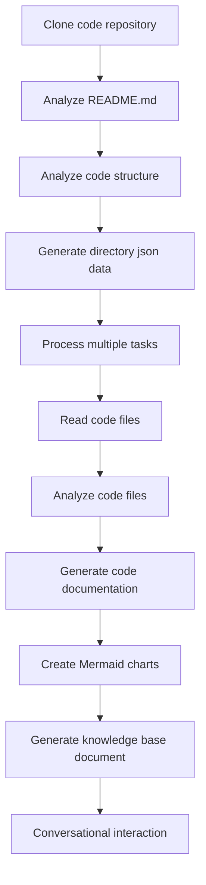

# OpenDeepWiki

[中文](https://raw.githubusercontent.com/AIDotNet/OpenDeepWiki/main/README.zh-CN.md) | [English](https://raw.githubusercontent.com/AIDotNet/OpenDeepWiki/main/README.md)

<div align="center">
  
  <h3>ฐานข้อมูลความรู้โค้ดขับเคลื่อนด้วย AI</h3>
</div>

# ผู้สนับสนุน

[](https://share.302.ai/jXcaTv)

[302.AI](https://share.302.ai/jXcaTv) คือแพลตฟอร์มแอปพลิเคชัน AI ระดับองค์กรแบบจ่ายตามการใช้งานที่ครบวงจร ให้บริการแพลตฟอร์มเปิดและระบบนิเวศโอเพ่นซอร์ส ทำให้ AI สามารถค้นหาวิธีแก้ปัญหาสำหรับทุกความต้องการ คลิก [ที่นี่](https://share.302.ai/jXcaTv) เพื่อรับเครดิตฟรี $1!

## ฟังก์ชัน

- **แปลงอย่างรวดเร็ว:** ที่เก็บโค้ดของ Github, Gitlab, Gitee, Gitea และอื่นๆ สามารถแปลงเป็นฐานข้อมูลความรู้ได้ภายในไม่กี่นาที
- **รองรับหลายภาษา:** รองรับการวิเคราะห์โค้ดและการสร้างเอกสารสำหรับทุกภาษาโปรแกรม
- **โครงสร้างโค้ด:** สร้างไดอะแกรม Mermaid อัตโนมัติเพื่อเข้าใจโครงสร้างของโค้ด
- **โมเดลแบบกำหนดเอง:** รองรับโมเดลและ API แบบกำหนดเอง สามารถขยายเพิ่มเติมได้ตามต้องการ
- **วิเคราะห์อัจฉริยะด้วย AI:** วิเคราะห์โค้ดและความสัมพันธ์ของโค้ดโดยอิงจาก AI
- **SEO ง่าย:** สร้างเอกสารและฐานข้อมูลความรู้ที่เป็นมิตรกับ SEO ด้วย Next.js ทำให้ Search Engine เข้าถึงข้อมูลได้ง่ายขึ้น
- **โต้ตอบแบบสนทนา:** รองรับการสนทนากับ AI เพื่อรับข้อมูลรายละเอียดและวิธีใช้งานของโค้ด รวมถึงเข้าใจโค้ดอย่างลึกซึ้ง

รายการฟีเจอร์:
- [x] รองรับหลายที่เก็บโค้ด (Github, Gitlab, Gitee, Gitea ฯลฯ)
- [x] รองรับหลายภาษาโปรแกรม (Python, Java, C#, JavaScript ฯลฯ)
- [x] รองรับการจัดการที่เก็บโค้ด มีฟังก์ชันเพิ่ม, ลบ, แก้ไข, ค้นหาที่เก็บโค้ด
- [x] รองรับผู้ให้บริการ AI หลายราย (OpenAI, AzureOpenAI, Anthropic ฯลฯ)
- [x] รองรับฐานข้อมูลหลายประเภท (SQLite, PostgreSQL, SqlServer ฯลฯ)
- [x] รองรับหลายภาษา (จีน, อังกฤษ, ฝรั่งเศส ฯลฯ)
- [x] รองรับการอัปโหลดไฟล์ ZIP และไฟล์ท้องถิ่น
- [x] มีแพลตฟอร์มสำหรับสร้างชุดข้อมูลเพื่อปรับแต่งโมเดล (fine-tuning)
- [x] รองรับการจัดการไดเรกทอรีที่เก็บโค้ดในระดับไดเรกทอรี สามารถกำหนดโครงสร้างไดเรกทอรีและสร้างเอกสารแบบไดนามิก
- [x] รองรับการจัดการไดเรกทอรีของที่เก็บโค้ด สามารถแก้ไขโครงสร้างไดเรกทอรีได้
- [x] รองรับการจัดการในระดับผู้ใช้ มีฟังก์ชันเพิ่ม, ลบ, แก้ไข, ค้นหาผู้ใช้
- [ ] รองรับการจัดการสิทธิ์ผู้ใช้ มีฟังก์ชันเพิ่ม, ลบ, แก้ไข, ค้นหาสิทธิ์ผู้ใช้
- [x] รองรับการสร้างชุดข้อมูล fine-tuning สำหรับแต่ละที่เก็บโค้ด

# แนะนำโปรเจกต์

OpenDeepWiki เป็นโปรเจกต์โอเพ่นซอร์สที่ได้รับแรงบันดาลใจจาก [DeepWiki](https://deepwiki.com/) พัฒนาโดยใช้ .NET 9 และ Semantic Kernel มีเป้าหมายเพื่อช่วยให้นักพัฒนาสามารถเข้าใจและใช้งานที่เก็บโค้ดได้ดียิ่งขึ้น ด้วยฟีเจอร์เช่น การวิเคราะห์โค้ด, สร้างเอกสาร และสร้างกราฟความรู้
- วิเคราะห์โครงสร้างโค้ด
- เข้าใจแนวคิดหลักของที่เก็บโค้ด
- สร้างเอกสารโค้ด
- สร้าง README.md สำหรับโค้ดโดยอัตโนมัติ
  รองรับ MCP

OpenDeepWiki รองรับ MCP (Model Context Protocol)
- รองรับการให้บริการ MCPServer สำหรับที่เก็บโค้ดเดี่ยว และสามารถวิเคราะห์ที่เก็บโค้ดแบบเดี่ยวได้

วิธีใช้งาน: ตัวอย่างการใช้ cursor:
```json
{
  "mcpServers": {
    "OpenDeepWiki":{
      "url": "http://Your OpenDeepWiki service IP:port/sse?owner=AIDotNet&name=OpenDeepWiki"
    }
  }
}
```
- owner: ชื่อองค์กรหรือเจ้าของที่เก็บโค้ด
- name: ชื่อที่เก็บโค้ด

หลังจากเพิ่มที่เก็บโค้ดแล้ว ทดสอบโดยถามคำถาม (โปรดทราบว่าต้องประมวลผลที่เก็บโค้ดก่อน): What is OpenDeepWiki? ผลลัพธ์แสดงดังภาพ: 

ด้วยวิธีนี้ คุณสามารถใช้ OpenDeepWiki เป็น MCPServer เพื่อให้โมเดล AI อื่นเรียกใช้งานได้ ช่วยอำนวยความสะดวกในการวิเคราะห์และเข้าใจโปรเจกต์โอเพ่นซอร์ส

## 🚀 เริ่มต้นอย่างรวดเร็ว

1. โคลนที่เก็บโค้ด
```bash
git clone https://github.com/AIDotNet/OpenDeepWiki.git
cd OpenDeepWiki
```

2. เปิดไฟล์ `docker-compose.yml` และแก้ไขตัวแปร environment ต่อไปนี้

Ollama:
```yaml
services:
  koalawiki:
    environment:
      - KOALAWIKI_REPOSITORIES=/repositories
      - TASK_MAX_SIZE_PER_USER=5 # จำนวนงานสร้างเอกสารพร้อมกันสูงสุดต่อผู้ใช้โดย AI
      - CHAT_MODEL=qwen2.5:32b # โมเดลต้องรองรับฟังก์ชัน
      - ANALYSIS_MODEL=qwen2.5:32b # โมเดลสำหรับวิเคราะห์โครงสร้างไดเรกทอรีของที่เก็บโค้ด
      - CHAT_API_KEY=sk-xxxxx # คีย์ API ของคุณ
      - LANGUAGE= # ตั้งค่าภาษาเริ่มต้นสำหรับการสร้างเป็น "Chinese"
      - ENDPOINT=https://Your Ollama's IP: Port/v1
      - DB_TYPE=sqlite
      - MODEL_PROVIDER=OpenAI # ผู้ให้บริการโมเดล ค่าเริ่มต้นคือ OpenAI รองรับ AzureOpenAI และ Anthropic
      - DB_CONNECTION_STRING=Data Source=/data/KoalaWiki.db
      - EnableSmartFilter=true # เปิดใช้งานการกรองอัจฉริยะหรือไม่ อาจมีผลต่อการที่ AI จะเข้าถึงไดเรกทอรีไฟล์ของที่เก็บโค้ด
      - UPDATE_INTERVAL # ช่วงเวลาการอัปเดตแบบเพิ่มทีละน้อย หน่วย: วัน
      - MAX_FILE_LIMIT=100 # ขนาดไฟล์สูงสุดสำหรับอัปโหลด หน่วย MB
      - DEEP_RESEARCH_MODEL= # โมเดลสำหรับการวิจัยเชิงลึก หากเว้นว่างจะใช้ CHAT_MODEL
      - ENABLE_INCREMENTAL_UPDATE=true # เปิดใช้งานการอัปเดตแบบเพิ่มทีละน้อยหรือไม่
      - ENABLE_CODED_DEPENDENCY_ANALYSIS=false # เปิดใช้งานการวิเคราะห์การพึ่งพาโค้ดหรือไม่ อาจส่งผลต่อคุณภาพโค้ด
      - ENABLE_WAREHOUSE_FUNCTION_PROMPT_TASK=false # เปิดใช้งานการสร้าง MCP Prompt หรือไม่
      - ENABLE_WAREHOUSE_DESCRIPTION_TASK=false # เปิดใช้งานการสร้างคำอธิบายที่เก็บโค้ดหรือไม่
```

OpenAI:
```yaml
services:
  koalawiki:
    environment:
      - KOALAWIKI_REPOSITORIES=/repositories
      - TASK_MAX_SIZE_PER_USER=5 # จำนวนงานสร้างเอกสารพร้อมกันสูงสุดต่อผู้ใช้โดย AI
      - CHAT_MODEL=DeepSeek-V3 # โมเดลต้องรองรับฟังก์ชัน
      - ANALYSIS_MODEL= # โมเดลสำหรับวิเคราะห์โครงสร้างไดเรกทอรีของที่เก็บโค้ด
      - CHAT_API_KEY= # คีย์ API ของคุณ
      - LANGUAGE= # ตั้งค่าภาษาเริ่มต้นสำหรับการสร้างเป็น "Chinese"
      - ENDPOINT=https://api.token-ai.cn/v1
      - DB_TYPE=sqlite
      - MODEL_PROVIDER=OpenAI # ผู้ให้บริการโมเดล ค่าเริ่มต้นคือ OpenAI รองรับ AzureOpenAI และ Anthropic
      - DB_CONNECTION_STRING=Data Source=/data/KoalaWiki.db
      - EnableSmartFilter=true # เปิดใช้งานการกรองอัจฉริยะหรือไม่ อาจมีผลต่อการที่ AI จะเข้าถึงไดเรกทอรีไฟล์ของที่เก็บโค้ด
      - UPDATE_INTERVAL # ช่วงเวลาการอัปเดตแบบเพิ่มทีละน้อย หน่วย: วัน
      - MAX_FILE_LIMIT=100 # ขนาดไฟล์สูงสุดสำหรับอัปโหลด หน่วย MB
      - DEEP_RESEARCH_MODEL= # โมเดลสำหรับการวิจัยเชิงลึก หากเว้นว่างจะใช้ CHAT_MODEL
      - ENABLE_INCREMENTAL_UPDATE=true # เปิดใช้งานการอัปเดตแบบเพิ่มทีละน้อยหรือไม่
      - ENABLE_CODED_DEPENDENCY_ANALYSIS=false # เปิดใช้งานการวิเคราะห์การพึ่งพาโค้ดหรือไม่ อาจส่งผลต่อคุณภาพโค้ด
      - ENABLE_WAREHOUSE_FUNCTION_PROMPT_TASK=false # เปิดใช้งานการสร้าง MCP Prompt หรือไม่
      - ENABLE_WAREHOUSE_DESCRIPTION_TASK=false # เปิดใช้งานการสร้างคำอธิบายที่เก็บโค้ดหรือไม่
```

AzureOpenAI:
```yaml
services:
  koalawiki:
    environment:
      - KOALAWIKI_REPOSITORIES=/repositories
      - TASK_MAX_SIZE_PER_USER=5 # จำนวนงานสร้างเอกสารพร้อมกันสูงสุดต่อผู้ใช้โดย AI
      - CHAT_MODEL=DeepSeek-V3 # โมเดลต้องรองรับฟังก์ชัน
      - ANALYSIS_MODEL= # โมเดลสำหรับวิเคราะห์โครงสร้างไดเรกทอรีของที่เก็บโค้ด
      - CHAT_API_KEY= # คีย์ API ของคุณ
      - LANGUAGE= # ตั้งค่าภาษาเริ่มต้นสำหรับการสร้างเป็น "Chinese"
      - ENDPOINT=https://your-azure-address.openai.azure.com/
      - DB_TYPE=sqlite
      - MODEL_PROVIDER=AzureOpenAI # ผู้ให้บริการโมเดล ค่าเริ่มต้นคือ OpenAI รองรับ AzureOpenAI และ Anthropic
      - DB_CONNECTION_STRING=Data Source=/data/KoalaWiki.db
      - EnableSmartFilter=true # เปิดใช้งานการกรองอัจฉริยะหรือไม่ อาจมีผลต่อการที่ AI จะเข้าถึงไดเรกทอรีไฟล์ของที่เก็บโค้ด
      - UPDATE_INTERVAL # ช่วงเวลาการอัปเดตแบบเพิ่มทีละน้อย หน่วย: วัน
      - MAX_FILE_LIMIT=100 # ขนาดไฟล์สูงสุดสำหรับอัปโหลด หน่วย MB
      - DEEP_RESEARCH_MODEL= # โมเดลสำหรับการวิจัยเชิงลึก หากเว้นว่างจะใช้ CHAT_MODEL
      - ENABLE_INCREMENTAL_UPDATE=true # เปิดใช้งานการอัปเดตแบบเพิ่มทีละน้อยหรือไม่
      - ENABLE_CODED_DEPENDENCY_ANALYSIS=false # เปิดใช้งานการวิเคราะห์การพึ่งพาโค้ดหรือไม่ อาจส่งผลต่อคุณภาพโค้ด
      - ENABLE_WAREHOUSE_FUNCTION_PROMPT_TASK=false # เปิดใช้งานการสร้าง MCP Prompt หรือไม่
      - ENABLE_WAREHOUSE_DESCRIPTION_TASK=false # เปิดใช้งานการสร้างคำอธิบายที่เก็บโค้ดหรือไม่
```

Anthropic:
```yaml
services:
  koalawiki:
    environment:
      - KOALAWIKI_REPOSITORIES=/repositories
      - TASK_MAX_SIZE_PER_USER=5 # จำนวนงานสร้างเอกสารพร้อมกันสูงสุดต่อผู้ใช้โดย AI
      - CHAT_MODEL=DeepSeek-V3 # โมเดลต้องรองรับฟังก์ชัน
      - ANALYSIS_MODEL= # โมเดลสำหรับวิเคราะห์โครงสร้างไดเรกทอรีของที่เก็บโค้ด
      - CHAT_API_KEY= # คีย์ API ของคุณ
      - LANGUAGE= # ตั้งค่าภาษาเริ่มต้นสำหรับการสร้างเป็น "Chinese"
      - ENDPOINT=https://api.anthropic.com/
      - DB_TYPE=sqlite
      - MODEL_PROVIDER=Anthropic # ผู้ให้บริการโมเดล ค่าเริ่มต้นคือ OpenAI รองรับ AzureOpenAI และ Anthropic
      - DB_CONNECTION_STRING=Data Source=/data/KoalaWiki.db
      - EnableSmartFilter=true # เปิดใช้งานการกรองอัจฉริยะหรือไม่ อาจมีผลต่อการที่ AI จะเข้าถึงไดเรกทอรีไฟล์ของที่เก็บโค้ด
      - UPDATE_INTERVAL # ช่วงเวลาการอัปเดตแบบเพิ่มทีละน้อย หน่วย: วัน
      - MAX_FILE_LIMIT=100 # ขนาดไฟล์สูงสุดสำหรับอัปโหลด หน่วย MB
      - DEEP_RESEARCH_MODEL= # โมเดลสำหรับการวิจัยเชิงลึก หากเว้นว่างจะใช้ CHAT_MODEL
      - ENABLE_INCREMENTAL_UPDATE=true # เปิดใช้งานการอัปเดตแบบเพิ่มทีละน้อยหรือไม่
      - ENABLE_CODED_DEPENDENCY_ANALYSIS=false # เปิดใช้งานการวิเคราะห์การพึ่งพาโค้ดหรือไม่ อาจส่งผลต่อคุณภาพโค้ด
      - ENABLE_WAREHOUSE_FUNCTION_PROMPT_TASK=false # เปิดใช้งานการสร้าง MCP Prompt หรือไม่
      - ENABLE_WAREHOUSE_DESCRIPTION_TASK=false # เปิดใช้งานการสร้างคำอธิบายที่เก็บโค้ดหรือไม่
```

> 💡 **วิธีรับ API Key:**
> - รับ Google API key ได้ที่ [Google AI Studio](https://makersuite.google.com/app/apikey)
> - รับ OpenAI API key ได้ที่ [OpenAI Platform](https://platform.openai.com/api-keys)
> - รับ CoresHub [CoresHub](https://console.coreshub.cn/xb3/maas/global-keys) [คลิกที่นี่เพื่อรับโทเคนฟรี 50 ล้านโทเคน](https://account.coreshub.cn/signup?invite=ZmpMQlZxYVU=)
> - รับ TokenAI [TokenAI](https://api.token-ai.cn/)

3. เริ่มต้นใช้งานบริการ

คุณสามารถใช้คำสั่ง Makefile ที่ให้มาเพื่อจัดการแอปพลิเคชันได้อย่างง่ายดาย:

```bash
# สร้างอิมเมจ Docker ทั้งหมด
make build

# เริ่มบริการทั้งหมดในโหมด background
make up

# หรือเริ่มในโหมดพัฒนา (แสดง log)
make dev
```

จากนั้นเข้าไปที่ http://localhost:8090 เพื่อเข้าถึงฐานข้อมูลความรู้

สำหรับคำสั่งเพิ่มเติม:
```bash
make help
```

### สำหรับผู้ใช้ Windows (ที่ไม่มี make)

หากคุณใช้ Windows และไม่มี `make` สามารถใช้คำสั่ง Docker Compose เหล่านี้ได้โดยตรง:

```bash
# สร้าง Docker images ทั้งหมด
docker-compose build

# เริ่มต้นบริการทั้งหมดในโหมด background
docker-compose up -d

# เริ่มในโหมดพัฒนา (แสดง log)
docker-compose up

# หยุดบริการทั้งหมด
docker-compose down

# ดู log
docker-compose logs -f
```

สำหรับการสร้างเฉพาะสถาปัตยกรรมหรือบริการ ใช้:

```bash
# สร้าง backend เท่านั้น
docker-compose build koalawiki

# สร้าง frontend เท่านั้น
docker-compose build koalawiki-web

# สร้างด้วย parameter สถาปัตยกรรม
docker-compose build --build-arg ARCH=arm64
docker-compose build --build-arg ARCH=amd64
```


### Deploy to Sealos พร้อม Public Internet Access
[](https://bja.sealos.run/?openapp=system-template%3FtemplateName%3DOpenDeepWiki)
สำหรับขั้นตอนโดยละเอียด ดูได้ที่: [การติดตั้ง OpenDeepWiki แบบ One-Click เป็นแอปพลิเคชัน Sealos ที่เปิดเผยสู่เครือข่ายสาธารณะด้วย Templates](scripts/sealos/README.zh-CN.md)

## 🔍 วิธีการทำงาน

OpenDeepWiki ใช้ AI เพื่อ:
 - โคลน repository โค้ดลงเครื่อง
 - วิเคราะห์จาก README.md ของ repository
 - วิเคราะห์โครงสร้างโค้ดและอ่านไฟล์โค้ดตามต้องการ จากนั้นสร้างข้อมูล json ของไดเรกทอรี
 - ประมวลผลงานตามไดเรกทอรี โดยแต่ละงานคือต้นฉบับเอกสารหนึ่งฉบับ
 - อ่านไฟล์โค้ด วิเคราะห์ไฟล์โค้ด สร้างเอกสารโค้ด และสร้างแผนผัง Mermaid เพื่อแสดงความสัมพันธ์โครงสร้างโค้ด
 - สร้างเอกสารฐานความรู้ขั้นสุดท้าย
 - วิเคราะห์ repository ผ่านการสนทนาโต้ตอบและตอบคำถามผู้ใช้


## การตั้งค่าขั้นสูง

### ตัวแปรสภาพแวดล้อม
  - KOALAWIKI_REPOSITORIES  ที่เก็บ repository
  - TASK_MAX_SIZE_PER_USER  จำนวนงาน AI ที่ประมวลผลพร้อมกันได้สูงสุดต่อผู้ใช้
  - CHAT_MODEL  โมเดลที่ต้องรองรับ function
  - ENDPOINT  API Endpoint
  - ANALYSIS_MODEL  โมเดลวิเคราะห์ที่ใช้สร้างโครงสร้างไดเรกทอรี repository
  - CHAT_API_KEY  API key ของคุณ
  - LANGUAGE  เปลี่ยนภาษาของเอกสารที่สร้างขึ้น
  - DB_TYPE  ชนิดฐานข้อมูล ค่าเริ่มต้นเป็น sqlite
  - MODEL_PROVIDER  ผู้ให้บริการโมเดล โดยค่าเริ่มต้นคือ OpenAI รองรับ Azure, OpenAI และ Anthropic
  - DB_CONNECTION_STRING  สตริงเชื่อมต่อฐานข้อมูล
  - EnableSmartFilter เปิดหรือปิดระบบกรองอัจฉริยะ อาจมีผลต่อวิธีที่ AI เข้าถึงไดเรกทอรีไฟล์ใน repository
  - UPDATE_INTERVAL ระยะเวลาการอัปเดตข้อมูล repository หน่วย: วัน
  - MAX_FILE_LIMIT ขนาดไฟล์สูงสุดที่อัปโหลดได้ หน่วย: MB
  - DEEP_RESEARCH_MODEL วิจัยเชิงลึกบนโมเดล ใช้ CHAT_MODEL หากเว้นว่าง
  - ENABLE_INCREMENTAL_UPDATE เปิดหรือปิด incremental update
  - ENABLE_CODED_DEPENDENCY_ANALYSIS เปิดหรือปิดการวิเคราะห์ dependency ของโค้ด อาจมีผลต่อคุณภาพของโค้ด
  - ENABLE_WAREHOUSE_FUNCTION_PROMPT_TASK  # เปิดหรือปิดการสร้าง MCP Prompt
  - ENABLE_WAREHOUSE_DESCRIPTION_TASK # เปิดหรือปิดการสร้าง Description ของ repository

### การ build สำหรับสถาปัตยกรรมที่แตกต่างกัน
Makefile มีคำสั่งสำหรับ build ให้รองรับ CPU หลายสถาปัตยกรรม:

```bash
# สร้างสำหรับสถาปัตยกรรม ARM
make build-arm

# สร้างสำหรับสถาปัตยกรรม AMD
make build-amd

# สร้างเฉพาะ backend สำหรับ ARM
make build-backend-arm

# สร้างเฉพาะ frontend สำหรับ AMD
make build-frontend-amd
```

## Discord

[เข้าร่วมกับเรา](https://discord.gg/8sxUNacv)

## WeChat 


## 📄 ใบอนุญาต
โปรเจกต์นี้ใช้สัญญาอนุญาตแบบ MIT - ดูรายละเอียดได้ที่ไฟล์ [LICENSE](./LICENSE)

## ประวัติการให้ดาว

[](https://www.star-history.com/#AIDotNet/OpenDeepWiki&Date)



---


Tranlated By [Open Ai Tx](https://github.com/OpenAiTx/OpenAiTx) | Last indexed: 2025-06-11


---