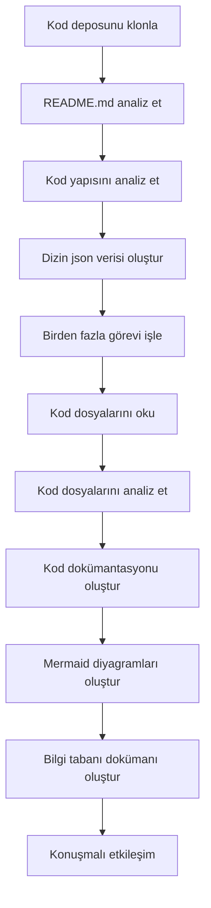

# OpenDeepWiki

[中文](https://raw.githubusercontent.com/AIDotNet/OpenDeepWiki/main/README.zh-CN.md) | [English](https://raw.githubusercontent.com/AIDotNet/OpenDeepWiki/main/README.md)

<div align="center">
  
  <h3>Yapay Zeka Destekli Kod Bilgi Tabanı</h3>
</div>

# Sponsor

[](https://share.302.ai/jXcaTv)

[302.AI](https://share.302.ai/jXcaTv), kullanıma göre ödeme yapılan, hepsi bir arada kurumsal seviye AI uygulama platformudur. Açık platform ve açık kaynak ekosistemi sunar, AI’nin her ihtiyaca çözüm bulmasını sağlar. $1 ücretsiz kredi almak için [buraya](https://share.302.ai/jXcaTv) tıklayın!

## Özellikler

- **Hızlı Dönüştürme:** Github, Gitlab, Gitee, Gitea ve diğer tüm kod depoları sadece birkaç dakikada bilgi tabanına dönüştürülebilir.
- **Çoklu Dil Desteği:** Tüm programlama dilleri için kod analizi ve dokümantasyon üretimi desteklenir.
- **Kod Yapısı:** Kod yapısını anlamak için otomatik Mermaid diyagramları oluşturulur.
- **Özel Modeller:** Özel modeller ve özel API’ler desteklenir, ihtiyaçlara göre genişletilebilir.
- **AI Akıllı Analiz:** Kodun yapay zeka ile analiz edilmesi ve kod ilişkilerinin anlaşılması.
- **Kolay SEO:** Next.js kullanarak SEO dostu dokümanlar ve bilgi tabanları üretir, arama motorlarının daha kolay indekslemesini sağlar.
- **Diyaloglu Etkileşim:** AI ile diyaloglu etkileşimi destekler; kodun detaylı bilgilerini, kullanım yöntemlerini ve derinlemesine anlaşılmasını sağlar.

Özellik listesi:
- [x] Birden fazla kod deposunu destekler (Github, Gitlab, Gitee, Gitea, vb.)
- [x] Birden fazla programlama dilini destekler (Python, Java, C#, JavaScript, vb.)
- [x] Depo yönetimini destekler; depo ekleme, silme, düzenleme ve sorgulama fonksiyonları sağlar
- [x] Birden fazla AI sağlayıcısını destekler (OpenAI, AzureOpenAI, Anthropic, vb.)
- [x] Birden fazla veritabanı destekler (SQLite, PostgreSQL, SqlServer, vb.)
- [x] Birden fazla dili destekler (Çince, İngilizce, Fransızca, vb.)
- [x] ZIP dosyalarını ve yerel dosyaları yüklemeyi destekler
- [x] İnce ayar veri kümesi oluşturmak için veri ince ayar platformu sunar
- [x] Depoların dizin seviyesinde yönetilmesini destekler; özel dizin oluşturma ve dinamik dokümantasyon oluşturma imkânı sunar
- [x] Depo dizin yönetimini destekler, depo dizinlerinin düzenlenmesini sağlar
- [x] Kullanıcı seviyesinde yönetimi destekler; kullanıcı ekleme, silme, düzenleme ve sorgulama fonksiyonları sunar
- [ ] Kullanıcı izin yönetimini destekler; kullanıcı izin ekleme, silme, düzenleme ve sorgulama fonksiyonları sunar
- [x] Depo seviyesinde farklı ince ayar çerçeve veri kümeleri oluşturmayı destekler

# Proje Tanıtımı

OpenDeepWiki, [DeepWiki](https://deepwiki.com/)'den ilham alınarak .NET 9 ve Semantic Kernel kullanılarak geliştirilen açık kaynaklı bir projedir. Kod analizi, dokümantasyon üretimi ve bilgi grafiği oluşturma gibi özelliklerle geliştiricilerin kod tabanlarını daha iyi anlamalarına ve kullanmalarına yardımcı olmayı amaçlar.
- Kod yapısını analiz etme
- Depoların temel kavramlarını anlama
- Kod dokümantasyonu oluşturma
- Kod için otomatik README.md oluşturma
  MCP Desteği

OpenDeepWiki, MCP (Model Context Protocol) destekler
- Tek bir depo için MCPServer sağlamayı ve tek bir depoda analiz yapmayı destekler.

Kullanım: Cursor için kullanım aşağıdaki gibidir:
```json
{
  "mcpServers": {
    "OpenDeepWiki":{
      "url": "http://Your OpenDeepWiki service IP:port/sse?owner=AIDotNet&name=OpenDeepWiki"
    }
  }
}
```
- owner: Depo sahibi ya da organizasyonun adıdır.
- name: Depo adıdır.

Depoyu ekledikten sonra, bir soru sorarak test edebilirsiniz (lütfen bundan önce deponun işlenmiş olması gerektiğine dikkat edin): OpenDeepWiki nedir? Etki aşağıdaki gibidir: ! [](https://raw.githubusercontent.com/AIDotNet/OpenDeepWiki/main/img/mcp.png)

Bu şekilde, OpenDeepWiki’yi bir MCPServer olarak kullanabilir, diğer AI modellerinin çağırmasına olanak tanıyabilir ve açık kaynaklı bir projenin analizini ve anlaşılmasını kolaylaştırabilirsiniz.

## 🚀 Hızlı Başlangıç

1. Repoyu klonlayın
```bash
git clone https://github.com/AIDotNet/OpenDeepWiki.git
cd OpenDeepWiki
```

2. `docker-compose.yml` dosyasını açın ve aşağıdaki ortam değişkenlerini düzenleyin:

Ollama:
```yaml
services:
  koalawiki:
    environment:
      - KOALAWIKI_REPOSITORIES=/repositories
      - TASK_MAX_SIZE_PER_USER=5 # AI tarafından kullanıcı başına eşzamanlı oluşturulabilecek maksimum belge sayısı
      - CHAT_MODEL=qwen2.5:32b # Model işlevleri desteklemelidir
      - ANALYSIS_MODEL=qwen2.5:32b # Depo dizin yapısı oluşturmak için kullanılan analiz modeli
      - CHAT_API_KEY=sk-xxxxx # API anahtarınız
      - LANGUAGE= # Varsayılan oluşturma dili "Çince" olarak ayarlanır
      - ENDPOINT=https://Your Ollama's IP: Port/v1
      - DB_TYPE=sqlite
      - MODEL_PROVIDER=OpenAI # Model sağlayıcı, varsayılan OpenAI; AzureOpenAI ve Anthropic destekler
      - DB_CONNECTION_STRING=Data Source=/data/KoalaWiki.db
      - EnableSmartFilter=true # Akıllı filtrelemenin etkin olup olmadığı, AI’nin depo dosya dizinini almasını etkileyebilir
      - UPDATE_INTERVAL # Depo artış güncelleme aralığı, birim: gün
      - MAX_FILE_LIMIT=100 # Dosya yükleme için maksimum sınır, MB cinsinden
      - DEEP_RESEARCH_MODEL= # Modelde derinlemesine araştırma yapılır, boşsa CHAT_MODEL kullanılır
      - ENABLE_INCREMENTAL_UPDATE=true # Artımlı güncellemelerin etkin olup olmadığı
      - ENABLE_CODED_DEPENDENCY_ANALYSIS=false # Kod bağımlılık analizinin etkin olup olmadığı, kod kalitesini etkileyebilir
      - ENABLE_WAREHOUSE_FUNCTION_PROMPT_TASK=false # MCP Prompt üretiminin etkin olup olmadığı
      - ENABLE_WAREHOUSE_DESCRIPTION_TASK=false # Depo açıklaması üretiminin etkin olup olmadığı
```

OpenAI:
```yaml
services:
  koalawiki:
    environment:
      - KOALAWIKI_REPOSITORIES=/repositories
      - TASK_MAX_SIZE_PER_USER=5 # AI tarafından kullanıcı başına eşzamanlı oluşturulabilecek maksimum belge sayısı
      - CHAT_MODEL=DeepSeek-V3 # Model işlevleri desteklemelidir
      - ANALYSIS_MODEL= # Depo dizin yapısı oluşturmak için kullanılan analiz modeli
      - CHAT_API_KEY= # API anahtarınız
      - LANGUAGE= # Varsayılan oluşturma dili "Çince" olarak ayarlanır
      - ENDPOINT=https://api.token-ai.cn/v1
      - DB_TYPE=sqlite
      - MODEL_PROVIDER=OpenAI # Model sağlayıcı, varsayılan OpenAI; AzureOpenAI ve Anthropic destekler
      - DB_CONNECTION_STRING=Data Source=/data/KoalaWiki.db
      - EnableSmartFilter=true # Akıllı filtrelemenin etkin olup olmadığı, AI’nin depo dosya dizinini almasını etkileyebilir
      - UPDATE_INTERVAL # Depo artış güncelleme aralığı, birim: gün
      - MAX_FILE_LIMIT=100 # Dosya yükleme için maksimum sınır, MB cinsinden
      - DEEP_RESEARCH_MODEL= # Modelde derinlemesine araştırma yapılır, boşsa CHAT_MODEL kullanılır
      - ENABLE_INCREMENTAL_UPDATE=true # Artımlı güncellemelerin etkin olup olmadığı
      - ENABLE_CODED_DEPENDENCY_ANALYSIS=false # Kod bağımlılık analizinin etkin olup olmadığı, kod kalitesini etkileyebilir
      - ENABLE_WAREHOUSE_FUNCTION_PROMPT_TASK=false # MCP Prompt üretiminin etkin olup olmadığı
      - ENABLE_WAREHOUSE_DESCRIPTION_TASK=false # Depo açıklaması üretiminin etkin olup olmadığı
```

AzureOpenAI:
```yaml
services:
  koalawiki:
    environment:
      - KOALAWIKI_REPOSITORIES=/repositories
      - TASK_MAX_SIZE_PER_USER=5 # AI tarafından kullanıcı başına eşzamanlı oluşturulabilecek maksimum belge sayısı
      - CHAT_MODEL=DeepSeek-V3 # Model işlevleri desteklemelidir
      - ANALYSIS_MODEL= # Depo dizin yapısı oluşturmak için kullanılan analiz modeli
      - CHAT_API_KEY= # API anahtarınız
      - LANGUAGE= # Varsayılan oluşturma dili "Çince" olarak ayarlanır
      - ENDPOINT=https://your-azure-address.openai.azure.com/
      - DB_TYPE=sqlite
      - MODEL_PROVIDER=AzureOpenAI # Model sağlayıcı, varsayılan OpenAI; AzureOpenAI ve Anthropic destekler
      - DB_CONNECTION_STRING=Data Source=/data/KoalaWiki.db
      - EnableSmartFilter=true # Akıllı filtrelemenin etkin olup olmadığı, AI’nin depo dosya dizinini almasını etkileyebilir
      - UPDATE_INTERVAL # Depo artış güncelleme aralığı, birim: gün
      - MAX_FILE_LIMIT=100 # Dosya yükleme için maksimum sınır, MB cinsinden
      - DEEP_RESEARCH_MODEL= # Modelde derinlemesine araştırma yapılır, boşsa CHAT_MODEL kullanılır
      - ENABLE_INCREMENTAL_UPDATE=true # Artımlı güncellemelerin etkin olup olmadığı
      - ENABLE_CODED_DEPENDENCY_ANALYSIS=false # Kod bağımlılık analizinin etkin olup olmadığı, kod kalitesini etkileyebilir
      - ENABLE_WAREHOUSE_FUNCTION_PROMPT_TASK=false # MCP Prompt üretiminin etkin olup olmadığı
      - ENABLE_WAREHOUSE_DESCRIPTION_TASK=false # Depo açıklaması üretiminin etkin olup olmadığı
```

Anthropic:
```yaml
services:
  koalawiki:
    environment:
      - KOALAWIKI_REPOSITORIES=/repositories
      - TASK_MAX_SIZE_PER_USER=5 # AI tarafından kullanıcı başına eşzamanlı oluşturulabilecek maksimum belge sayısı
      - CHAT_MODEL=DeepSeek-V3 # Model işlevleri desteklemelidir
      - ANALYSIS_MODEL= # Depo dizin yapısı oluşturmak için kullanılan analiz modeli
      - CHAT_API_KEY= # API anahtarınız
      - LANGUAGE= # Varsayılan oluşturma dili "Çince" olarak ayarlanır
      - ENDPOINT=https://api.anthropic.com/
      - DB_TYPE=sqlite
      - MODEL_PROVIDER=Anthropic # Model sağlayıcı, varsayılan OpenAI; AzureOpenAI ve Anthropic destekler
      - DB_CONNECTION_STRING=Data Source=/data/KoalaWiki.db
      - EnableSmartFilter=true # Akıllı filtrelemenin etkin olup olmadığı, AI’nin depo dosya dizinini almasını etkileyebilir
      - UPDATE_INTERVAL # Depo artış güncelleme aralığı, birim: gün
      - MAX_FILE_LIMIT=100 # Dosya yükleme için maksimum sınır, MB cinsinden
      - DEEP_RESEARCH_MODEL= # Modelde derinlemesine araştırma yapılır, boşsa CHAT_MODEL kullanılır
      - ENABLE_INCREMENTAL_UPDATE=true # Artımlı güncellemelerin etkin olup olmadığı
      - ENABLE_CODED_DEPENDENCY_ANALYSIS=false # Kod bağımlılık analizinin etkin olup olmadığı, kod kalitesini etkileyebilir
      - ENABLE_WAREHOUSE_FUNCTION_PROMPT_TASK=false # MCP Prompt üretiminin etkin olup olmadığı
      - ENABLE_WAREHOUSE_DESCRIPTION_TASK=false # Depo açıklaması üretiminin etkin olup olmadığı
```

> 💡 **API Anahtarı Nasıl Alınır:**
> - Google API anahtarı alın [Google AI Studio](https://makersuite.google.com/app/apikey)
> - OpenAI API anahtarı alın [OpenAI Platform](https://platform.openai.com/api-keys)
> - CoresHub anahtarı alın [CoresHub](https://console.coreshub.cn/xb3/maas/global-keys) [50 milyon ücretsiz token için tıklayın](https://account.coreshub.cn/signup?invite=ZmpMQlZxYVU=)
> - TokenAI alın [TokenAI](https://api.token-ai.cn/)

3. Servisi başlatın

Uygulamayı kolayca yönetmek için sağlanan Makefile komutlarını kullanabilirsiniz:

```bash
# Tüm Docker imajlarını oluştur
make build

# Tüm servisleri arka planda başlat
make up

# Veya geliştirme modunda başlatın (loglar görünür şekilde)
```
```
make dev
```

Sonrasında bilgi tabanına erişmek için http://localhost:8090 adresini ziyaret edin.

Diğer komutlar için:
```bash
make help
```

### Windows Kullanıcıları için (make olmadan)

Eğer Windows kullanıyorsanız ve `make` mevcut değilse, aşağıdaki Docker Compose komutlarını doğrudan kullanabilirsiniz:

```bash
# Tüm Docker imajlarını oluştur
docker-compose build

# Tüm servisleri arka planda başlat
docker-compose up -d

# Geliştirme modunda başlat (loglar görünür)
docker-compose up

# Tüm servisleri durdur
docker-compose down

# Logları görüntüle
docker-compose logs -f
```

Belirli mimariler veya servisler için:

```bash
# Sadece backend'i oluştur
docker-compose build koalawiki

# Sadece frontend'i oluştur
docker-compose build koalawiki-web

# Mimari parametreleri ile oluştur
docker-compose build --build-arg ARCH=arm64
docker-compose build --build-arg ARCH=amd64
```

### Genel Ağ Erişimi ile Sealos'a Dağıtım
[](https://bja.sealos.run/?openapp=system-template%3FtemplateName%3DOpenDeepWiki)
Detaylı adımlar için bakınız: [OpenDeepWiki'nin Şablonlar ile Genel Ağa Açık Olarak Sealos Uygulaması Olarak Tek Tıkla Dağıtılması](https://raw.githubusercontent.com/AIDotNet/OpenDeepWiki/main/scripts/sealos/README.zh-CN.md)

## 🔍 Nasıl Çalışır

OpenDeepWiki, yapay zekâyı kullanarak:
 - Kod deposunu yerel olarak klonlar
 - Depo README.md dosyasına göre analiz eder
 - Gerekirse kod yapısını analiz eder ve kod dosyalarını okur, ardından dizin json verisi üretir
 - Dizinlere göre görevleri işler, her görev bir dokümandır
 - Kod dosyalarını okur, analiz eder, kod dokümantasyonu oluşturur ve kod yapı bağımlılıklarını temsil eden Mermaid diyagramları üretir
 - Nihai bilgi tabanı dokümanını üretir
 - Depoyu konuşmalı etkileşimle analiz eder ve kullanıcı sorularını yanıtlar


## Gelişmiş Yapılandırma

### Ortam Değişkenleri
  - KOALAWIKI_REPOSITORIES  Depoların saklanacağı yol
  - TASK_MAX_SIZE_PER_USER  Kullanıcı başına AI doküman üretimi için maksimum paralel görev sayısı
  - CHAT_MODEL  Model fonksiyonları desteklemelidir
  - ENDPOINT  API Uç Noktası
  - ANALYSIS_MODEL  Depo dizin yapısını oluşturmak için analiz modeli
  - CHAT_API_KEY  API anahtarınız
  - LANGUAGE  Oluşturulan dokümanların dilini değiştirin
  - DB_TYPE  Veritabanı türü, varsayılan sqlite
  - MODEL_PROVIDER  Model sağlayıcı, varsayılan olarak OpenAI, Azure, OpenAI ve Anthropic desteklenir
  - DB_CONNECTION_STRING  Veritabanı bağlantı dizesi
  - EnableSmartFilter Akıllı filtrelemenin etkin olup olmadığı, AI'nın depo dosya dizinine nasıl erişeceğini etkileyebilir
  - UPDATE_INTERVAL Depo artımlı güncelleme aralığı, birim: gün
  - MAX_FILE_LIMIT Dosya yükleme için maksimum sınır, MB cinsinden
  - DEEP_RESEARCH_MODEL Model üzerinde derinlemesine araştırma yapar ve boşsa CHAT_MODEL kullanır
  - ENABLE_INCREMENTAL_UPDATE Artımlı güncellemeyi etkinleştirip etkinleştirmeyeceğiniz
  - ENABLE_CODED_DEPENDENCY_ANALYSIS Kod bağımlılık analizini etkinleştirip etkinleştirmeyeceğiniz, kodun kalitesini etkileyebilir.
  - ENABLE_WAREHOUSE_FUNCTION_PROMPT_TASK  # MCP Prompt üretimini etkinleştirip etkinleştirmeyeceğiniz
  - ENABLE_WAREHOUSE_DESCRIPTION_TASK # Depo Açıklaması üretimini etkinleştirip etkinleştirmeyeceğiniz

### Farklı Mimariler için Derleme
Makefile, farklı CPU mimarileri için derleme komutları sağlar:

```bash
# ARM mimarisi için derle
make build-arm

# AMD mimarisi için derle
make build-amd

# Sadece backend'i ARM için derle
make build-backend-arm

# Sadece frontend'i AMD için derle
make build-frontend-amd
```

## Discord

[bize katılın](https://discord.gg/8sxUNacv)

## WeChat 


## 📄 Lisans
Bu proje MIT Lisansı ile lisanslanmıştır - detaylar için [LICENSE](https://raw.githubusercontent.com/AIDotNet/OpenDeepWiki/main/LICENSE) dosyasına bakınız.

## Yıldız Geçmişi

[](https://www.star-history.com/#AIDotNet/OpenDeepWiki&Date)
```


---


Tranlated By [Open Ai Tx](https://github.com/OpenAiTx/OpenAiTx) | Last indexed: 2025-06-11


---