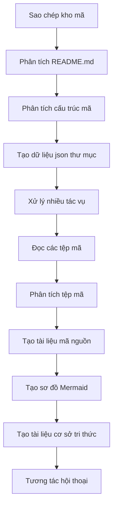

# OpenDeepWiki

[中文](https://raw.githubusercontent.com/AIDotNet/OpenDeepWiki/main/README.zh-CN.md) | [English](https://raw.githubusercontent.com/AIDotNet/OpenDeepWiki/main/README.md)

<div align="center">
  
  <h3>AI-Driven Code Knowledge Base</h3>
</div>

# Nhà tài trợ

[](https://share.302.ai/jXcaTv)

[302.AI](https://share.302.ai/jXcaTv) là nền tảng ứng dụng AI cấp doanh nghiệp tất cả trong một, tính phí theo mức sử dụng. Nền tảng này cung cấp một hệ sinh thái mã nguồn mở và mở, cho phép AI tìm giải pháp cho mọi nhu cầu. Nhấn [vào đây](https://share.302.ai/jXcaTv) để nhận $1 tín dụng miễn phí!

## Chức năng

- **Chuyển đổi nhanh:** Tất cả các kho mã như Github, Gitlab, Gitee, Gitea,... có thể được chuyển đổi thành cơ sở tri thức chỉ trong vài phút.
- **Hỗ trợ đa ngôn ngữ:** Hỗ trợ phân tích mã và sinh tài liệu cho tất cả các ngôn ngữ lập trình.
- **Cấu trúc mã:** Tự động sinh sơ đồ Mermaid để hiểu cấu trúc mã nguồn.
- **Mô hình tuỳ chỉnh:** Hỗ trợ mô hình tuỳ chỉnh và API tuỳ chỉnh, cho phép mở rộng khi cần thiết.
- **Phân tích AI thông minh:** Phân tích mã và hiểu các mối quan hệ mã dựa trên AI.
- **SEO dễ dàng:** Sinh tài liệu và cơ sở tri thức thân thiện với SEO bằng Next.js, giúp tối ưu cho các công cụ tìm kiếm.
- **Tương tác hội thoại:** Hỗ trợ tương tác hội thoại với AI để nhận thông tin chi tiết và cách sử dụng mã, từ đó hiểu sâu hơn về mã nguồn.

Danh sách tính năng:
- [x] Hỗ trợ nhiều kho mã (Github, Gitlab, Gitee, Gitea, v.v.)
- [x] Hỗ trợ nhiều ngôn ngữ lập trình (Python, Java, C#, JavaScript, v.v.)
- [x] Hỗ trợ quản lý kho, cung cấp chức năng thêm, xóa, sửa, tra cứu kho
- [x] Hỗ trợ nhiều nhà cung cấp AI (OpenAI, AzureOpenAI, Anthropic, v.v.)
- [x] Hỗ trợ nhiều cơ sở dữ liệu (SQLite, PostgreSQL, SqlServer, v.v.)
- [x] Hỗ trợ đa ngôn ngữ (Tiếng Trung, Tiếng Anh, Tiếng Pháp, v.v.)
- [x] Hỗ trợ tải lên file ZIP, và tải lên file nội bộ
- [x] Cung cấp nền tảng tinh chỉnh dữ liệu để sinh bộ dữ liệu tinh chỉnh
- [x] Hỗ trợ quản lý kho theo cấp thư mục, cho phép tuỳ chỉnh sinh thư mục và tạo tài liệu động
- [x] Hỗ trợ quản lý thư mục kho, cho phép sửa đổi thư mục kho
- [x] Hỗ trợ quản lý người dùng, cung cấp chức năng thêm, xóa, sửa, tra cứu người dùng
- [ ] Hỗ trợ quản lý phân quyền người dùng, cung cấp chức năng thêm, xóa, sửa, tra cứu quyền người dùng
- [x] Hỗ trợ sinh bộ dữ liệu framework tinh chỉnh khác nhau ở cấp kho

# Giới thiệu dự án

OpenDeepWiki là dự án mã nguồn mở lấy cảm hứng từ [DeepWiki](https://deepwiki.com/), phát triển bằng .NET 9 và Semantic Kernel. Mục tiêu nhằm giúp lập trình viên hiểu rõ và sử dụng kho mã tốt hơn thông qua các tính năng như phân tích mã, sinh tài liệu, tạo đồ thị tri thức.
- Phân tích cấu trúc mã nguồn
- Hiểu các khái niệm cốt lõi của kho
- Sinh tài liệu mã nguồn
- Tự động tạo README.md cho mã nguồn
  Hỗ trợ MCP


OpenDeepWiki hỗ trợ MCP (Model Context Protocol)
- Hỗ trợ cung cấp MCPServer cho một kho và thực hiện phân tích trên từng kho riêng biệt.

Cách sử dụng: Sau đây là ví dụ sử dụng cursor:
```json
{
  "mcpServers": {
    "OpenDeepWiki":{
      "url": "http://IP dịch vụ OpenDeepWiki của bạn:port/sse?owner=AIDotNet&name=OpenDeepWiki"
    }
  }
}
```
- owner: Tên tổ chức hoặc chủ sở hữu của kho mã.
- name: Tên của kho mã.

Sau khi thêm kho, thử đặt câu hỏi (lưu ý: kho phải được xử lý trước): What is OpenDeepWiki? Kết quả như hình minh họa: 


Bằng cách này, bạn có thể sử dụng OpenDeepWiki như một MCPServer, cho phép các mô hình AI khác gọi tới để phân tích và hiểu một dự án mã nguồn mở.

## 🚀 Bắt đầu nhanh

1. Clone kho mã
```bash
git clone https://github.com/AIDotNet/OpenDeepWiki.git
cd OpenDeepWiki
```

2. Mở file `docker-compose.yml` và sửa các biến môi trường sau:

Ollama:
```yaml
services:
  koalawiki:
    environment:
      - KOALAWIKI_REPOSITORIES=/repositories
      - TASK_MAX_SIZE_PER_USER=5 # Số tác vụ sinh tài liệu song song tối đa cho mỗi người dùng
      - CHAT_MODEL=qwen2.5:32b # Mô hình phải hỗ trợ chức năng
      - ANALYSIS_MODEL=qwen2.5:32b # Mô hình phân tích dùng để sinh cấu trúc thư mục kho
      - CHAT_API_KEY=sk-xxxxx # API key của bạn
      - LANGUAGE= # Đặt ngôn ngữ mặc định là "Chinese"
      - ENDPOINT=https://Địa chỉ IP Ollama của bạn:Port/v1
      - DB_TYPE=sqlite
      - MODEL_PROVIDER=OpenAI # Nhà cung cấp mô hình, mặc định là OpenAI, hỗ trợ AzureOpenAI và Anthropic
      - DB_CONNECTION_STRING=Data Source=/data/KoalaWiki.db
      - EnableSmartFilter=true # Bật lọc thông minh có thể ảnh hưởng đến việc AI truy xuất thư mục kho
      - UPDATE_INTERVAL # Khoảng thời gian cập nhật tăng dần, đơn vị: ngày
      - MAX_FILE_LIMIT=100 # Giới hạn dung lượng file tải lên, tính bằng MB
      - DEEP_RESEARCH_MODEL= # Nghiên cứu sâu mô hình, để trống sẽ dùng CHAT_MODEL
      - ENABLE_INCREMENTAL_UPDATE=true # Bật cập nhật tăng dần
      - ENABLE_CODED_DEPENDENCY_ANALYSIS=false # Bật phân tích phụ thuộc mã, có thể ảnh hưởng đến chất lượng mã
      - ENABLE_WAREHOUSE_FUNCTION_PROMPT_TASK=false # Bật/Tắt sinh MCP Prompt
      - ENABLE_WAREHOUSE_DESCRIPTION_TASK=false # Bật/Tắt sinh mô tả kho
```

OpenAI:
```yaml
services:
  koalawiki:
    environment:
      - KOALAWIKI_REPOSITORIES=/repositories
      - TASK_MAX_SIZE_PER_USER=5 # Số tác vụ sinh tài liệu song song tối đa cho mỗi người dùng
      - CHAT_MODEL=DeepSeek-V3 # Mô hình phải hỗ trợ chức năng
      - ANALYSIS_MODEL= # Mô hình phân tích dùng để sinh cấu trúc thư mục kho
      - CHAT_API_KEY= # API key của bạn
      - LANGUAGE= # Đặt ngôn ngữ mặc định là "Chinese"
      - ENDPOINT=https://api.token-ai.cn/v1
      - DB_TYPE=sqlite
      - MODEL_PROVIDER=OpenAI # Nhà cung cấp mô hình, mặc định là OpenAI, hỗ trợ AzureOpenAI và Anthropic
      - DB_CONNECTION_STRING=Data Source=/data/KoalaWiki.db
      - EnableSmartFilter=true # Bật lọc thông minh có thể ảnh hưởng đến việc AI truy xuất thư mục kho
      - UPDATE_INTERVAL # Khoảng thời gian cập nhật tăng dần, đơn vị: ngày
      - MAX_FILE_LIMIT=100 # Giới hạn dung lượng file tải lên, tính bằng MB
      - DEEP_RESEARCH_MODEL= # Nghiên cứu sâu mô hình, để trống sẽ dùng CHAT_MODEL
      - ENABLE_INCREMENTAL_UPDATE=true # Bật cập nhật tăng dần
      - ENABLE_CODED_DEPENDENCY_ANALYSIS=false # Bật phân tích phụ thuộc mã, có thể ảnh hưởng đến chất lượng mã
      - ENABLE_WAREHOUSE_FUNCTION_PROMPT_TASK=false # Bật/Tắt sinh MCP Prompt
      - ENABLE_WAREHOUSE_DESCRIPTION_TASK=false # Bật/Tắt sinh mô tả kho
```

AzureOpenAI:
```yaml
services:
  koalawiki:
    environment:
      - KOALAWIKI_REPOSITORIES=/repositories
      - TASK_MAX_SIZE_PER_USER=5 # Số tác vụ sinh tài liệu song song tối đa cho mỗi người dùng
      - CHAT_MODEL=DeepSeek-V3 # Mô hình phải hỗ trợ chức năng
      - ANALYSIS_MODEL= # Mô hình phân tích dùng để sinh cấu trúc thư mục kho
      - CHAT_API_KEY= # API key của bạn
      - LANGUAGE= # Đặt ngôn ngữ mặc định là "Chinese"
      - ENDPOINT=https://your-azure-address.openai.azure.com/
      - DB_TYPE=sqlite
      - MODEL_PROVIDER=AzureOpenAI # Nhà cung cấp mô hình, mặc định là OpenAI, hỗ trợ AzureOpenAI và Anthropic
      - DB_CONNECTION_STRING=Data Source=/data/KoalaWiki.db
      - EnableSmartFilter=true # Bật lọc thông minh có thể ảnh hưởng đến việc AI truy xuất thư mục kho
      - UPDATE_INTERVAL # Khoảng thời gian cập nhật tăng dần, đơn vị: ngày
      - MAX_FILE_LIMIT=100 # Giới hạn dung lượng file tải lên, tính bằng MB
      - DEEP_RESEARCH_MODEL= # Nghiên cứu sâu mô hình, để trống sẽ dùng CHAT_MODEL
      - ENABLE_INCREMENTAL_UPDATE=true # Bật cập nhật tăng dần
      - ENABLE_CODED_DEPENDENCY_ANALYSIS=false # Bật phân tích phụ thuộc mã, có thể ảnh hưởng đến chất lượng mã
      - ENABLE_WAREHOUSE_FUNCTION_PROMPT_TASK=false # Bật/Tắt sinh MCP Prompt
      - ENABLE_WAREHOUSE_DESCRIPTION_TASK=false # Bật/Tắt sinh mô tả kho
```

Anthropic:
```yaml
services:
  koalawiki:
    environment:
      - KOALAWIKI_REPOSITORIES=/repositories
      - TASK_MAX_SIZE_PER_USER=5 # Số tác vụ sinh tài liệu song song tối đa cho mỗi người dùng
      - CHAT_MODEL=DeepSeek-V3 # Mô hình phải hỗ trợ chức năng
      - ANALYSIS_MODEL= # Mô hình phân tích dùng để sinh cấu trúc thư mục kho
      - CHAT_API_KEY= # API key của bạn
      - LANGUAGE= # Đặt ngôn ngữ mặc định là "Chinese"
      - ENDPOINT=https://api.anthropic.com/
      - DB_TYPE=sqlite
      - MODEL_PROVIDER=Anthropic # Nhà cung cấp mô hình, mặc định là OpenAI, hỗ trợ AzureOpenAI và Anthropic
      - DB_CONNECTION_STRING=Data Source=/data/KoalaWiki.db
      - EnableSmartFilter=true # Bật lọc thông minh có thể ảnh hưởng đến việc AI truy xuất thư mục kho
      - UPDATE_INTERVAL # Khoảng thời gian cập nhật tăng dần, đơn vị: ngày
      - MAX_FILE_LIMIT=100 # Giới hạn dung lượng file tải lên, tính bằng MB
      - DEEP_RESEARCH_MODEL= # Nghiên cứu sâu mô hình, để trống sẽ dùng CHAT_MODEL
      - ENABLE_INCREMENTAL_UPDATE=true # Bật cập nhật tăng dần
      - ENABLE_CODED_DEPENDENCY_ANALYSIS=false # Bật phân tích phụ thuộc mã, có thể ảnh hưởng đến chất lượng mã
      - ENABLE_WAREHOUSE_FUNCTION_PROMPT_TASK=false # Bật/Tắt sinh MCP Prompt
      - ENABLE_WAREHOUSE_DESCRIPTION_TASK=false # Bật/Tắt sinh mô tả kho
```

> 💡 **Cách lấy API Key:**
> - Lấy Google API key [Google AI Studio](https://makersuite.google.com/app/apikey)
> - Lấy OpenAI API key [OpenAI Platform](https://platform.openai.com/api-keys)
> - Lấy CoresHub [CoresHub](https://console.coreshub.cn/xb3/maas/global-keys) [Nhấn vào đây để nhận 50 triệu token miễn phí](https://account.coreshub.cn/signup?invite=ZmpMQlZxYVU=)
> - Lấy TokenAI [TokenAI](https://api.token-ai.cn/)

3. Khởi động dịch vụ

Bạn có thể sử dụng các lệnh Makefile được cung cấp để quản lý ứng dụng dễ dàng:

```bash
# Build tất cả Docker images
make build

# Khởi động tất cả dịch vụ ở chế độ nền
make up

# Hoặc khởi động ở chế độ phát triển (xem log trực tiếp)
make dev
```

Sau đó truy cập http://localhost:8090 để truy cập cơ sở tri thức.

Để xem thêm các lệnh:
```bash
make help
```

### Dành cho người dùng Windows (không có make)

Nếu bạn đang sử dụng Windows và không có `make`, bạn có thể sử dụng trực tiếp các lệnh Docker Compose sau:

```bash
# Build tất cả các Docker image
docker-compose build

# Khởi động tất cả dịch vụ ở chế độ nền
docker-compose up -d

# Khởi động ở chế độ phát triển (hiển thị log)
docker-compose up

# Dừng tất cả dịch vụ
docker-compose down

# Xem log
docker-compose logs -f
```

Để build từng kiến trúc hoặc dịch vụ cụ thể, sử dụng:

```bash
# Chỉ build backend
docker-compose build koalawiki

# Chỉ build frontend
docker-compose build koalawiki-web

# Build với tham số kiến trúc
docker-compose build --build-arg ARCH=arm64
docker-compose build --build-arg ARCH=amd64
```


### Triển khai lên Sealos với truy cập Internet công cộng
[](https://bja.sealos.run/?openapp=system-template%3FtemplateName%3DOpenDeepWiki)
Để biết các bước chi tiết, tham khảo: [Triển khai OpenDeepWiki lên Sealos chỉ với một cú nhấp chuột và công khai qua Internet bằng Templates](https://raw.githubusercontent.com/AIDotNet/OpenDeepWiki/main/scripts/sealos/README.zh-CN.md)

## 🔍 Cách hoạt động

OpenDeepWiki sử dụng AI để:
 - Sao chép kho mã về máy cục bộ
 - Phân tích dựa trên tệp README.md của kho mã
 - Phân tích cấu trúc mã và đọc các tệp mã khi cần, sau đó tạo dữ liệu json thư mục
 - Xử lý tác vụ theo thư mục, mỗi tác vụ là một tài liệu
 - Đọc tệp mã, phân tích tệp mã, tạo tài liệu mã nguồn và tạo sơ đồ Mermaid thể hiện phụ thuộc cấu trúc mã
 - Sinh tài liệu cơ sở tri thức cuối cùng
 - Phân tích kho mã thông qua tương tác hội thoại và phản hồi các câu hỏi của người dùng


## Cấu hình nâng cao

### Biến môi trường
  - KOALAWIKI_REPOSITORIES  Đường dẫn lưu kho mã
  - TASK_MAX_SIZE_PER_USER  Số lượng tác vụ AI sinh tài liệu tối đa đồng thời cho mỗi người dùng
  - CHAT_MODEL  Mô hình phải hỗ trợ các chức năng
  - ENDPOINT  Địa chỉ API Endpoint
  - ANALYSIS_MODEL  Mô hình phân tích để tạo cấu trúc thư mục kho mã
  - CHAT_API_KEY  API key của bạn
  - LANGUAGE  Thay đổi ngôn ngữ của tài liệu được sinh ra
  - DB_TYPE  Loại cơ sở dữ liệu, mặc định là sqlite
  - MODEL_PROVIDER  Nhà cung cấp mô hình, mặc định là OpenAI, hỗ trợ Azure, OpenAI và Anthropic
  - DB_CONNECTION_STRING  Chuỗi kết nối cơ sở dữ liệu
  - EnableSmartFilter Bật/tắt lọc thông minh có thể ảnh hưởng đến khả năng lấy thư mục kho mã của AI
  - UPDATE_INTERVAL Khoảng thời gian cập nhật tăng dần của kho mã, đơn vị: ngày
  - MAX_FILE_LIMIT Giới hạn tối đa cho việc tải lên tệp, tính bằng MB
  - DEEP_RESEARCH_MODEL Nghiên cứu chuyên sâu về mô hình, sử dụng CHAT_MODEL cho trường hợp rỗng
  - ENABLE_INCREMENTAL_UPDATE Bật/tắt cập nhật tăng dần
  - ENABLE_CODED_DEPENDENCY_ANALYSIS Bật/tắt phân tích phụ thuộc mã, có thể ảnh hưởng đến chất lượng mã nguồn.
  - ENABLE_WAREHOUSE_FUNCTION_PROMPT_TASK  # Bật/tắt sinh MCP Prompt.
  - ENABLE_WAREHOUSE_DESCRIPTION_TASK # Bật/tắt sinh mô tả kho mã

### Build cho các kiến trúc khác nhau
Makefile cung cấp các lệnh build cho các kiến trúc CPU khác nhau:

```bash
# Build cho kiến trúc ARM
make build-arm

# Build cho kiến trúc AMD
make build-amd

# Chỉ build backend cho ARM
make build-backend-arm

# Chỉ build frontend cho AMD
make build-frontend-amd
```

## Discord

[tham gia với chúng tôi](https://discord.gg/8sxUNacv)

## WeChat 


## 📄 Giấy phép
Dự án này được cấp phép theo giấy phép MIT - xem tệp [LICENSE](https://raw.githubusercontent.com/AIDotNet/OpenDeepWiki/main/LICENSE) để biết chi tiết.

## Lịch sử Star

[](https://www.star-history.com/#AIDotNet/OpenDeepWiki&Date)



---


Tranlated By [Open Ai Tx](https://github.com/OpenAiTx/OpenAiTx) | Last indexed: 2025-06-11


---