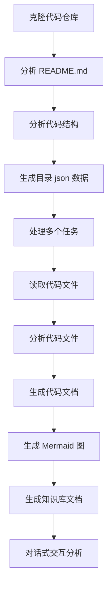

# OpenDeepWiki

[中文](README.zh-CN.md) | [English](README.md)

<div align="center">
  
  <h3>AI驱动的代码知识库</h3>
</div>

# 赞助

[](https://share.302.ai/jXcaTv)

[302.AI](https://share.302.ai/jXcaTv) 是一个按需付费的一站式企业级AI应用平台。它提供开放平台和开源生态，让AI为每个需求找到解决方案。点击[这里](https://share.302.ai/jXcaTv)获取1美元免费额度！

## 功能

- **快速转换：** 所有 Github、Gitlab、Gitee、Gitea 等代码仓库均可在几分钟内转换为知识库。
- **多语言支持：** 支持所有编程语言的代码分析和文档生成。
- **代码结构：** 自动生成Mermaid图表，帮助理解代码结构。
- **自定义模型：** 支持自定义模型和自定义API，方便扩展。
- **AI智能分析：** 基于AI进行代码分析与代码关系理解。
- **易于SEO：** 使用Next.js生成SEO友好的文档和知识库，更易于搜索引擎收录。
- **对话式交互：** 支持与AI对话式交互，获取代码详细信息和使用方法，深入理解代码。

功能清单：
- [x] 支持多种代码仓库（Github、Gitlab、Gitee、Gitea等）
- [x] 支持多种编程语言（Python、Java、C#、JavaScript等）
- [x] 支持仓库管理，提供新增、删除、修改、查询仓库的功能
- [x] 支持多AI提供商（OpenAI、AzureOpenAI、Anthropic等）
- [x] 支持多种数据库（SQLite、PostgreSQL、SqlServer等）
- [x] 支持多语言（中文、英文、法语等）
- [x] 支持上传ZIP文件、上传本地文件
- [x] 提供数据微调平台，生成微调数据集
- [x] 支持仓库目录级管理，可自定义目录生成、动态文档创建
- [x] 支持仓库目录管理，可对仓库目录进行修改
- [x] 支持用户级管理，提供新增、删除、修改、查询用户的功能
- [ ] 支持用户权限管理，提供新增、删除、修改、查询用户权限的功能
- [x] 支持仓库级别生成不同微调框架的数据集

# 项目介绍

OpenDeepWiki 是一个受 [DeepWiki](https://deepwiki.com/) 启发的开源项目，使用 .NET 9 和 Semantic Kernel 开发。其目标是通过代码分析、文档生成和知识图谱等功能，帮助开发者更好地理解和利用代码库。
- 分析代码结构
- 理解仓库核心概念
- 生成代码文档
- 为代码自动创建 README.md
  MCP 支持

OpenDeepWiki 支持 MCP（Model Context Protocol）
- 支持为单个仓库提供 MCPServer，并对单仓库进行分析。

用法：以下是 cursor 的用法示例：
```json
{
  "mcpServers": {
    "OpenDeepWiki":{
      "url": "http://Your OpenDeepWiki service IP:port/sse?owner=AIDotNet&name=OpenDeepWiki"
    }
  }
}
```
- owner：为仓库的组织名或所有者名称。
- name：为仓库名称。

添加仓库后，测试提问（注意在此之前需先处理该仓库）：What is OpenDeepWiki? 效果如图所示：

通过这种方式，可以将 OpenDeepWiki 作为 MCPServer，为其他AI模型调用，便于对开源项目进行分析与理解。

## 🚀 快速开始

1. 克隆仓库
```bash
git clone https://github.com/AIDotNet/OpenDeepWiki.git
cd OpenDeepWiki
```

2. 打开 `docker-compose.yml` 文件，修改以下环境变量：

Ollama:
```yaml
services:
  koalawiki:
    environment:
      - KOALAWIKI_REPOSITORIES=/repositories
      - TASK_MAX_SIZE_PER_USER=5 # 单用户AI并行生成文档的最大任务数
      - CHAT_MODEL=qwen2.5:32b # 模型需支持函数
      - ANALYSIS_MODEL=qwen2.5:32b # 用于生成仓库目录结构的分析模型
      - CHAT_API_KEY=sk-xxxxx # 你的API密钥
      - LANGUAGE= # 设置默认生成语言为“中文”
      - ENDPOINT=https://Your Ollama's IP: Port/v1
      - DB_TYPE=sqlite
      - MODEL_PROVIDER=OpenAI # 模型提供方，默认为OpenAI，支持AzureOpenAI和Anthropic
      - DB_CONNECTION_STRING=Data Source=/data/KoalaWiki.db
      - EnableSmartFilter=true # 是否启用智能过滤，可能影响AI对仓库文件目录的获取
      - UPDATE_INTERVAL # 仓库增量更新时间，单位：天
      - MAX_FILE_LIMIT=100 # 上传文件最大限制，单位MB
      - DEEP_RESEARCH_MODEL= # 针对模型进行深度研究，空则使用CHAT_MODEL
      - ENABLE_INCREMENTAL_UPDATE=true # 是否启用增量更新
      - ENABLE_CODED_DEPENDENCY_ANALYSIS=false # 是否启用代码依赖分析，可能影响代码质量
      - ENABLE_WAREHOUSE_FUNCTION_PROMPT_TASK=false # 是否启用MCP Prompt生成
      - ENABLE_WAREHOUSE_DESCRIPTION_TASK=false # 是否启用仓库描述生成
```

OpenAI:
```yaml
services:
  koalawiki:
    environment:
      - KOALAWIKI_REPOSITORIES=/repositories
      - TASK_MAX_SIZE_PER_USER=5 # 单用户AI并行生成文档的最大任务数
      - CHAT_MODEL=DeepSeek-V3 # 模型需支持函数
      - ANALYSIS_MODEL= # 用于生成仓库目录结构的分析模型
      - CHAT_API_KEY= # 你的API密钥
      - LANGUAGE= # 设置默认生成语言为“中文”
      - ENDPOINT=https://api.token-ai.cn/v1
      - DB_TYPE=sqlite
      - MODEL_PROVIDER=OpenAI # 模型提供方，默认为OpenAI，支持AzureOpenAI和Anthropic
      - DB_CONNECTION_STRING=Data Source=/data/KoalaWiki.db
      - EnableSmartFilter=true # 是否启用智能过滤，可能影响AI对仓库文件目录的获取
      - UPDATE_INTERVAL # 仓库增量更新时间，单位：天
      - MAX_FILE_LIMIT=100 # 上传文件最大限制，单位MB
      - DEEP_RESEARCH_MODEL= # 针对模型进行深度研究，空则使用CHAT_MODEL
      - ENABLE_INCREMENTAL_UPDATE=true # 是否启用增量更新
      - ENABLE_CODED_DEPENDENCY_ANALYSIS=false # 是否启用代码依赖分析，可能影响代码质量
      - ENABLE_WAREHOUSE_FUNCTION_PROMPT_TASK=false # 是否启用MCP Prompt生成
      - ENABLE_WAREHOUSE_DESCRIPTION_TASK=false # 是否启用仓库描述生成
```

AzureOpenAI:
```yaml
services:
  koalawiki:
    environment:
      - KOALAWIKI_REPOSITORIES=/repositories
      - TASK_MAX_SIZE_PER_USER=5 # 单用户AI并行生成文档的最大任务数
      - CHAT_MODEL=DeepSeek-V3 # 模型需支持函数
      - ANALYSIS_MODEL= # 用于生成仓库目录结构的分析模型
      - CHAT_API_KEY= # 你的API密钥
      - LANGUAGE= # 设置默认生成语言为“中文”
      - ENDPOINT=https://your-azure-address.openai.azure.com/
      - DB_TYPE=sqlite
      - MODEL_PROVIDER=AzureOpenAI # 模型提供方，默认为OpenAI，支持AzureOpenAI和Anthropic
      - DB_CONNECTION_STRING=Data Source=/data/KoalaWiki.db
      - EnableSmartFilter=true # 是否启用智能过滤，可能影响AI对仓库文件目录的获取
      - UPDATE_INTERVAL # 仓库增量更新时间，单位：天
      - MAX_FILE_LIMIT=100 # 上传文件最大限制，单位MB
      - DEEP_RESEARCH_MODEL= # 针对模型进行深度研究，空则使用CHAT_MODEL
      - ENABLE_INCREMENTAL_UPDATE=true # 是否启用增量更新
      - ENABLE_CODED_DEPENDENCY_ANALYSIS=false # 是否启用代码依赖分析，可能影响代码质量
      - ENABLE_WAREHOUSE_FUNCTION_PROMPT_TASK=false # 是否启用MCP Prompt生成
      - ENABLE_WAREHOUSE_DESCRIPTION_TASK=false # 是否启用仓库描述生成
```

Anthropic:
```yaml
services:
  koalawiki:
    environment:
      - KOALAWIKI_REPOSITORIES=/repositories
      - TASK_MAX_SIZE_PER_USER=5 # 单用户AI并行生成文档的最大任务数
      - CHAT_MODEL=DeepSeek-V3 # 模型需支持函数
      - ANALYSIS_MODEL= # 用于生成仓库目录结构的分析模型
      - CHAT_API_KEY= # 你的API密钥
      - LANGUAGE= # 设置默认生成语言为“中文”
      - ENDPOINT=https://api.anthropic.com/
      - DB_TYPE=sqlite
      - MODEL_PROVIDER=Anthropic # 模型提供方，默认为OpenAI，支持AzureOpenAI和Anthropic
      - DB_CONNECTION_STRING=Data Source=/data/KoalaWiki.db
      - EnableSmartFilter=true # 是否启用智能过滤，可能影响AI对仓库文件目录的获取
      - UPDATE_INTERVAL # 仓库增量更新时间，单位：天
      - MAX_FILE_LIMIT=100 # 上传文件最大限制，单位MB
      - DEEP_RESEARCH_MODEL= # 针对模型进行深度研究，空则使用CHAT_MODEL
      - ENABLE_INCREMENTAL_UPDATE=true # 是否启用增量更新
      - ENABLE_CODED_DEPENDENCY_ANALYSIS=false # 是否启用代码依赖分析，可能影响代码质量
      - ENABLE_WAREHOUSE_FUNCTION_PROMPT_TASK=false # 是否启用MCP Prompt生成
      - ENABLE_WAREHOUSE_DESCRIPTION_TASK=false # 是否启用仓库描述生成
```

> 💡 **如何获得API密钥：**
> - 获取Google API密钥 [Google AI Studio](https://makersuite.google.com/app/apikey)
> - 获取OpenAI API密钥 [OpenAI Platform](https://platform.openai.com/api-keys)
> - 获取CoresHub [CoresHub](https://console.coreshub.cn/xb3/maas/global-keys) [点此注册赠送5000万免费Token](https://account.coreshub.cn/signup?invite=ZmpMQlZxYVU=)
> - 获取TokenAI [TokenAI](https://api.token-ai.cn/)

3. 启动服务

你可以使用提供的 Makefile 命令轻松管理应用：

```bash
# 构建所有 Docker 镜像
make build

# 后台启动所有服务
make up

# 或以开发模式（可见日志）启动
```
```
make dev
```

然后访问 http://localhost:8090 以访问知识库。

更多命令请参考：
```bash
make help
```

### Windows 用户（无 make 工具）

如果你使用的是 Windows 且没有安装 `make`，可以直接使用以下 Docker Compose 命令：

```bash
# 构建所有 Docker 镜像
docker-compose build

# 后台启动所有服务
docker-compose up -d

# 以开发模式启动（可见日志）
docker-compose up

# 停止所有服务
docker-compose down

# 查看日志
docker-compose logs -f
```

如需构建特定架构或服务，可使用：

```bash
# 仅构建后端
docker-compose build koalawiki

# 仅构建前端
docker-compose build koalawiki-web

# 按架构参数构建
docker-compose build --build-arg ARCH=arm64
docker-compose build --build-arg ARCH=amd64
```


### 使用 Sealos 对公网部署
[](https://bja.sealos.run/?openapp=system-template%3FtemplateName%3DOpenDeepWiki)
详细步骤请参见：[使用模板一键部署 OpenDeepWiki 为对公网可访问 Sealos 应用](https://raw.githubusercontent.com/AIDotNet/OpenDeepWiki/main/scripts/sealos/README.zh-CN.md)

## 🔍 工作原理

OpenDeepWiki 使用 AI 实现以下功能：
 - 本地克隆代码仓库
 - 基于仓库的 README.md 进行分析
 - 分析代码结构，根据需要读取代码文件，生成目录 json 数据
 - 按目录处理任务，每个任务为一篇文档
 - 读取代码文件、分析代码文件、生成代码文档，并绘制代表代码结构依赖的 Mermaid 图
 - 生成最终知识库文档
 - 通过对话式交互分析仓库，并响应用户查询


## 高级配置

### 环境变量
  - KOALAWIKI_REPOSITORIES  仓库存储路径
  - TASK_MAX_SIZE_PER_USER  每个用户 AI 文档生成的最大并行任务数
  - CHAT_MODEL  必须支持函数的模型
  - ENDPOINT  API 接口地址
  - ANALYSIS_MODEL  用于生成仓库目录结构的分析模型
  - CHAT_API_KEY  你的 API Key
  - LANGUAGE  生成文档的语言
  - DB_TYPE  数据库类型，默认为 sqlite
  - MODEL_PROVIDER  模型提供商，默认为 OpenAI，支持 Azure、OpenAI 和 Anthropic
  - DB_CONNECTION_STRING  数据库连接字符串
  - EnableSmartFilter 是否开启智能过滤，可能影响 AI 获取仓库文件目录的方式
  - UPDATE_INTERVAL 仓库增量更新间隔，单位：天
  - MAX_FILE_LIMIT 上传文件的最大限制，单位 MB
  - DEEP_RESEARCH_MODEL 对模型进行深入研究，留空则使用 CHAT_MODEL
  - ENABLE_INCREMENTAL_UPDATE 是否开启增量更新
  - ENABLE_CODED_DEPENDENCY_ANALYSIS 是否启用代码依赖分析，可能影响代码质量
  - ENABLE_WAREHOUSE_FUNCTION_PROMPT_TASK  # 是否开启 MCP Prompt 生成
  - ENABLE_WAREHOUSE_DESCRIPTION_TASK # 是否启用仓库描述生成

### 针对不同架构构建
Makefile 提供了针对不同 CPU 架构的构建命令：

```bash
# 构建 ARM 架构
make build-arm

# 构建 AMD 架构
make build-amd

# 仅构建 ARM 架构后端
make build-backend-arm

# 仅构建 AMD 架构前端
make build-frontend-amd
```

## Discord

[加入我们](https://discord.gg/8sxUNacv)

## 微信


## 📄 许可证
本项目基于 MIT 许可证发布 - 详情请参阅 [LICENSE](https://raw.githubusercontent.com/AIDotNet/OpenDeepWiki/main/LICENSE) 文件。

## Star 历史

[](https://www.star-history.com/#AIDotNet/OpenDeepWiki&Date)
```


---


Tranlated By [Open Ai Tx](https://github.com/OpenAiTx/OpenAiTx) | Last indexed: 2025-06-10


---