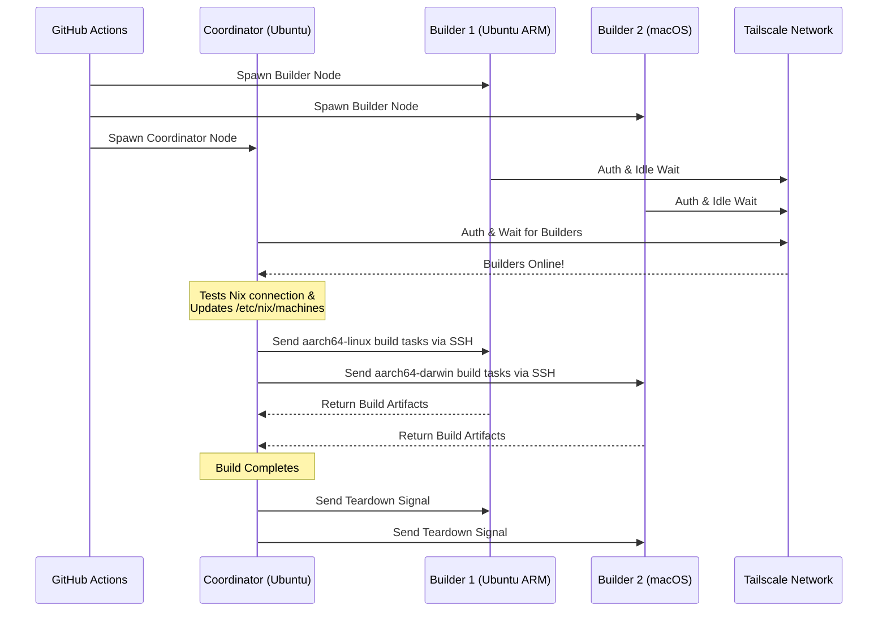

<div align="right">
  <details>
    <summary >🌐 اللغة</summary>
    <div>
      <div align="center">
        <a href="https://openaitx.github.io/view.html?user=Misaka13514&project=setup-distributed-nix-builds&lang=en">English</a>
        | <a href="https://openaitx.github.io/view.html?user=Misaka13514&project=setup-distributed-nix-builds&lang=zh-CN">简体中文</a>
        | <a href="https://openaitx.github.io/view.html?user=Misaka13514&project=setup-distributed-nix-builds&lang=zh-TW">繁體中文</a>
        | <a href="https://openaitx.github.io/view.html?user=Misaka13514&project=setup-distributed-nix-builds&lang=ja">日本語</a>
        | <a href="https://openaitx.github.io/view.html?user=Misaka13514&project=setup-distributed-nix-builds&lang=ko">한국어</a>
        | <a href="https://openaitx.github.io/view.html?user=Misaka13514&project=setup-distributed-nix-builds&lang=hi">हिन्दी</a>
        | <a href="https://openaitx.github.io/view.html?user=Misaka13514&project=setup-distributed-nix-builds&lang=th">ไทย</a>
        | <a href="https://openaitx.github.io/view.html?user=Misaka13514&project=setup-distributed-nix-builds&lang=fr">Français</a>
        | <a href="https://openaitx.github.io/view.html?user=Misaka13514&project=setup-distributed-nix-builds&lang=de">Deutsch</a>
        | <a href="https://openaitx.github.io/view.html?user=Misaka13514&project=setup-distributed-nix-builds&lang=es">Español</a>
        | <a href="https://openaitx.github.io/view.html?user=Misaka13514&project=setup-distributed-nix-builds&lang=it">Italiano</a>
        | <a href="https://openaitx.github.io/view.html?user=Misaka13514&project=setup-distributed-nix-builds&lang=ru">Русский</a>
        | <a href="https://openaitx.github.io/view.html?user=Misaka13514&project=setup-distributed-nix-builds&lang=pt">Português</a>
        | <a href="https://openaitx.github.io/view.html?user=Misaka13514&project=setup-distributed-nix-builds&lang=nl">Nederlands</a>
        | <a href="https://openaitx.github.io/view.html?user=Misaka13514&project=setup-distributed-nix-builds&lang=pl">Polski</a>
        | <a href="https://openaitx.github.io/view.html?user=Misaka13514&project=setup-distributed-nix-builds&lang=ar">العربية</a>
        | <a href="https://openaitx.github.io/view.html?user=Misaka13514&project=setup-distributed-nix-builds&lang=fa">فارسی</a>
        | <a href="https://openaitx.github.io/view.html?user=Misaka13514&project=setup-distributed-nix-builds&lang=tr">Türkçe</a>
        | <a href="https://openaitx.github.io/view.html?user=Misaka13514&project=setup-distributed-nix-builds&lang=vi">Tiếng Việt</a>
        | <a href="https://openaitx.github.io/view.html?user=Misaka13514&project=setup-distributed-nix-builds&lang=id">Bahasa Indonesia</a>
        | <a href="https://openaitx.github.io/view.html?user=Misaka13514&project=setup-distributed-nix-builds&lang=as">অসমীয়া</
      </div>
    </div>
  </details>
</div>

# ❄️ إعداد بناء Nix موزع

إجراء GitHub يتيح لك إنشاء مجموعة بناء Nix موزعة مؤقتة وعبر الأنظمة الأساسية [Distributed Nix Build](https://wiki.nixos.org/wiki/Distributed_build) باستخدام عدائين GitHub المستضافين القياسيين [GitHub Hosted Runners](https://docs.github.com/en/actions/reference/runners/github-hosted-runners) والمتصلة بأمان عبر Tailscale.

يتيح لك هذا الإجراء تشغيل مصفوفة من عدائي GitHub الثانويين (**البناؤون**) وربطهم بعداء أساسي (**المنسق**) بسلاسة عبر Tailscale SSH. يقوم المنسق تلقائيًا بإعداد Nix لاستخدام هذه العقد كبنائين عن بُعد، مما يزيد من أداء البناء المتزامن دون الحاجة لإدارة بنية تحتية خارجية! هذا مثالي لبناء حزم متعددة المعماريات أو لتوسيع إغلاق أنظمة NixOS الثقيلة أفقيًا عبر مجموعة من عدائي x86.

## الميزات

- 🚀 **بناة عن بُعد بدون إعداد مسبق:** يقوم تلقائيًا بتهيئة `/etc/nix/machines` ويربط العقد عبر Tailscale SSH (دون الحاجة لمفاتيح SSH اليدوية!).
- 🌍 **متعدد الأنظمة والمعماريات:** امزج وشغّل Ubuntu (x86، ARM) وmacOS (Intel، Apple Silicon) في نفس عملية البناء.
- ⚖️ **توسعة أفقية لنظام NixOS:** تحتاج إلى تقييم وبناء تكوين NixOS ضخم؟ شغّل مجموعة كاملة من العقد المتطابقة (مثل خمسة عدّادات `ubuntu-24.04`) ودع Nix يوزع عمليات البناء المتوازية تلقائيًا على جميع أنوية المعالج المتاحة في الكتلة.
- 🧹 **أقصى مساحة للقرص:** ينظف تلقائيًا البرامج المثبتة مسبقًا على عدّادات Linux (عبر [nothing-but-nix](https://github.com/wimpysworld/nothing-but-nix)) ليمنح مساحة أكبر لمخزن Nix الخاص بك.
- ⚡ **تخزين مؤقت مدمج:** يدمج [magic-nix-cache](https://github.com/DeterminateSystems/magic-nix-cache-action) لتسريع تقييمات flake وعمليات البناء المحلية.
- 🛑 **إيقاف تشغيل سلس:** ينتظر البناة المهام دون عمل ثم ينطفئون بسلاسة عند انتهاء المنسق.

## كيف يعمل

يفصل سير العمل العدّادات إلى دورين: `builder` و`coordinator`.



## المتطلبات الأساسية

قبل استخدام هذا الإجراء، تحتاج إلى تكوين شبكة Tailscale لتمكين التواصل الآمن بين أجهزة التشغيل.

1. **تكوين قوائم التحكم في الوصول (ACLs) لـ Tailscale:**
   تأكد من أن لديك مجموعات علامات مُنشأة في Tailscale وأن الـ ACLs تسمح للمنسق بالوصول إلى أجهزة الإنشاء عبر SSH باستخدام Tailscale SSH بسلاسة.
   أضف ما يلي إلى [عناصر التحكم في الوصول الخاصة بـ Tailscale](https://login.tailscale.com/admin/acls/file):

<details>
<summary>انقر لعرض تكوين ACL المطلوب لـ Tailscale</summary>

```json
{
  "grants": [
    {
      "src": ["tag:nix-ci-builder", "tag:nix-ci-coordinator"],
      "dst": ["tag:nix-ci-builder", "tag:nix-ci-coordinator"],
      "ip": ["*"]
    }
  ],
  "ssh": [
    {
      "src": ["tag:nix-ci-coordinator"],
      "dst": ["tag:nix-ci-builder"],
      "users": ["autogroup:nonroot", "root"],
      "action": "accept"
    }
  ],
  "tagOwners": {
    "tag:nix-ci-coordinator": ["autogroup:admin", "tag:nix-ci-coordinator"],
    "tag:nix-ci-builder": ["autogroup:admin", "tag:nix-ci-builder"]
  }
}
```
</details>

2. **إنشاء عميل OAuth لـ Tailscale:**
   أنشئ سر عميل OAuth في [لوحة إدارة Tailscale](https://login.tailscale.com/admin/settings/trust-credentials)، مع نطاق كتابة `auth_keys` والوسوم `nix-ci-builder` و `nix-ci-coordinator`.
   أضف هذا السر إلى أسرار مستودع GitHub الخاص بك تحت اسم `TS_OAUTH_SECRET`.

## المدخلات

| الإدخال                | الوصف                                                                                         | مطلوب    | الافتراضي   |
| ---------------------- | --------------------------------------------------------------------------------------------- | -------- | ----------- |
| `tailscale_authkey`    | سر عميل Tailscale OAuth أو مفتاح المصادقة.                                                     | **نعم**  | غير متوفر   |
| `tailscale_hostname`   | اسم المضيف للتسجيل في Tailscale.                                                              | **نعم**  | غير متوفر   |
| `tailscale_tags`       | الوسوم للإعلان عنها في Tailscale (مثال: `tag:nix-ci-builder`).                                 | **نعم**  | غير متوفر   |
| `role`                 | دور الوظيفة الحالية: `"builder"` أو `"coordinator"`.                                          | نعم      | `"builder"` |
| `builders`             | قائمة مفصولة بمسافة لأسماء جميع البناة المطلوب انتظارهم. (_مطلوب إذا كان الدور هو coordinator_) | لا       | `""`        |
| `builder_timeout`      | أقصى مدة (بالثواني) يجب أن ينتظرها الباني قبل الإنهاء الذاتي.                                 | لا       | `"300"`     |
| `extra_nix_config`     | إعدادات إضافية لـ Nix لإلحاقها بـ `/etc/nix/nix.conf`.                                        | لا       | `""`        |

## الاستخدام

### مثال كامل على البناء الموزع

فيما يلي سير عمل كامل (`nix-build.yml`) يقوم بتشغيل العديد من معماريات العداء ديناميكيًا (Ubuntu x86، Ubuntu ARM، macOS x86، macOS Apple Silicon)، يربطهم معًا، وينفذ بناء موزع باستخدام Nix.

إذا كنت تبني تهيئة NixOS ثقيلة وتريد فقط تسريعها باستخدام التوسيع الأفقي، يمكنك تغيير قيمة `BUILDER_COUNTS` لتشغيل عدة عدائين x86 متطابقين. على سبيل المثال:
`BUILDER_COUNTS: '{"ubuntu-24.04": 4}'`
سيوفر لك ذلك مباشرة مزرعة بناء تحتوي على 16 نواة CPU (4 عدائين × 4 أنوية) لمعالجة المشتقات بالتوازي.

نظرًا لأن عدائي GitHub المستضافين مؤقتون، ستضيع جميع القطع الناتجة في متجر Nix عند انتهاء سير العمل. للاستفادة من نتائج البناء الموزع في عمليات CI المستقبلية أو على أجهزتك المحلية، يوصى بشدة بدفع النتائج إلى ذاكرة تخزين ثنائية مثل [Cachix](https://www.cachix.org) أو [Attic](https://github.com/zhaofengli/attic).

```yaml
name: Distributed Nix Build

on:
  workflow_dispatch:

env:
  # Define exactly how many runners of each OS type you want
  BUILDER_COUNTS: '{"ubuntu-24.04": 1, "ubuntu-24.04-arm": 1, "macos-26-intel": 1, "macos-26": 1}'

jobs:
  config:
    runs-on: ubuntu-slim
    outputs:
      builder_matrix: ${{ steps.set.outputs.builder_matrix }}
      builders_list: ${{ steps.set.outputs.builders_list }}
      run_suffix: ${{ steps.set.outputs.run_suffix }}
    steps:
      - id: set
        run: |
          SUFFIX=$(openssl rand -hex 3)
          echo "run_suffix=$SUFFIX" >> "$GITHUB_OUTPUT"

          # Dynamically generate the Matrix JSON based on BUILDER_COUNTS
          MATRIX_JSON=$(echo '${{ env.BUILDER_COUNTS }}' | jq -c '[
              to_entries[] | .key as $os | .value as $count |
              range(1; $count + 1) | { os: $os, id: "\($os)-\(.)" }
            ]
          ')
          echo "builder_matrix=$MATRIX_JSON" >> "$GITHUB_OUTPUT"

          # Create a space-separated list of hostnames for the coordinator
          BUILDERS_LIST=$(echo "$MATRIX_JSON" | jq -r --arg suffix "$SUFFIX" 'map("nix-builder-\($suffix)-\(.id)") | join(" ")')
          echo "builders_list=$BUILDERS_LIST" >> "$GITHUB_OUTPUT"

  builder:
    needs: config
    name: Builder ${{ matrix.builder.id }} (${{ needs.config.outputs.run_suffix }})
    runs-on: ${{ matrix.builder.os }}
    strategy:
      fail-fast: false
      matrix:
        builder: ${{ fromJSON(needs.config.outputs.builder_matrix) }}
    steps:
      - name: Setup Distributed Nix Builder
        uses: Misaka13514/setup-distributed-nix-builds@main
        with:
          tailscale_authkey: ${{ secrets.TS_OAUTH_SECRET }}
          tailscale_hostname: nix-builder-${{ needs.config.outputs.run_suffix }}-${{ matrix.builder.id }}
          tailscale_tags: tag:nix-ci-builder
          role: builder

      # Optionally configure your Cachix/Attic or other caching here
      # - uses: cachix/cachix-action@v17

  coordinator:
    needs: config
    name: Coordinator (${{ needs.config.outputs.run_suffix }})
    runs-on: ubuntu-24.04
    steps:
      - name: Setup Coordinator & Connect Builders
        uses: Misaka13514/setup-distributed-nix-builds@main
        with:
          tailscale_authkey: ${{ secrets.TS_OAUTH_SECRET }}
          tailscale_hostname: nix-coordinator-${{ needs.config.outputs.run_suffix }}
          tailscale_tags: tag:nix-ci-coordinator
          role: coordinator
          builders: ${{ needs.config.outputs.builders_list }}

      # Optionally configure your Cachix/Attic or other caching here
      # - uses: cachix/cachix-action@v17

      - name: Execute Distributed Build
        run: |
          # Your build command here. Because builders are registered in /etc/nix/machines,
          # Nix will automatically offload tasks to the correct architecture node.
          nix build -L --max-jobs 0 .#my-package

      # Signal builders to terminate if they are not needed anymore
      - name: Teardown Builders
        run: stop-nix-builders

      # Push build results to Cachix/Attic or other cache here if desired
      # - name: Push to Cachix
      #   run: cachix push mycache --all
```

## الترخيص

هذا المشروع مرخص بموجب [رخصة MIT](LICENSE).



---


Tranlated By [Open Ai Tx](https://github.com/OpenAiTx/OpenAiTx) | Last indexed: 2026-03-27


---