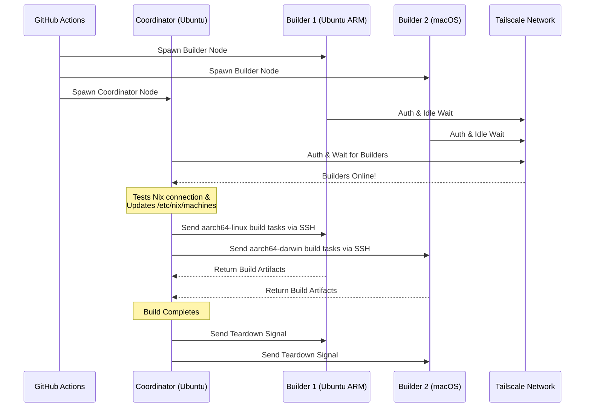

<div align="right">
  <details>
    <summary >🌐 ভাষা</summary>
    <div>
      <div align="center">
        <a href="https://openaitx.github.io/view.html?user=Misaka13514&project=setup-distributed-nix-builds&lang=en">English</a>
        | <a href="https://openaitx.github.io/view.html?user=Misaka13514&project=setup-distributed-nix-builds&lang=zh-CN">简体中文</a>
        | <a href="https://openaitx.github.io/view.html?user=Misaka13514&project=setup-distributed-nix-builds&lang=zh-TW">繁體中文</a>
        | <a href="https://openaitx.github.io/view.html?user=Misaka13514&project=setup-distributed-nix-builds&lang=ja">জাপানী</a>
        | <a href="https://openaitx.github.io/view.html?user=Misaka13514&project=setup-distributed-nix-builds&lang=ko">কোৰিয়ান</a>
        | <a href="https://openaitx.github.io/view.html?user=Misaka13514&project=setup-distributed-nix-builds&lang=hi">হিন্দী</a>
        | <a href="https://openaitx.github.io/view.html?user=Misaka13514&project=setup-distributed-nix-builds&lang=th">থাই</a>
        | <a href="https://openaitx.github.io/view.html?user=Misaka13514&project=setup-distributed-nix-builds&lang=fr">ফ্ৰেঞ্চ</a>
        | <a href="https://openaitx.github.io/view.html?user=Misaka13514&project=setup-distributed-nix-builds&lang=de">জাৰ্মান</a>
        | <a href="https://openaitx.github.io/view.html?user=Misaka13514&project=setup-distributed-nix-builds&lang=es">স্পেনিচ</a>
        | <a href="https://openaitx.github.io/view.html?user=Misaka13514&project=setup-distributed-nix-builds&lang=it">ইটালিয়ান</a>
        | <a href="https://openaitx.github.io/view.html?user=Misaka13514&project=setup-distributed-nix-builds&lang=ru">ৰাছিয়ান</a>
        | <a href="https://openaitx.github.io/view.html?user=Misaka13514&project=setup-distributed-nix-builds&lang=pt">পৰ্টুগীজ</a>
        | <a href="https://openaitx.github.io/view.html?user=Misaka13514&project=setup-distributed-nix-builds&lang=nl">নেদাৰলেণ্ডছ</a>
        | <a href="https://openaitx.github.io/view.html?user=Misaka13514&project=setup-distributed-nix-builds&lang=pl">পোলিশ</a>
        | <a href="https://openaitx.github.io/view.html?user=Misaka13514&project=setup-distributed-nix-builds&lang=ar">আৰবী</a>
        | <a href="https://openaitx.github.io/view.html?user=Misaka13514&project=setup-distributed-nix-builds&lang=fa">ফাৰ্ছী</a>
        | <a href="https://openaitx.github.io/view.html?user=Misaka13514&project=setup-distributed-nix-builds&lang=tr">তুৰ্কী</a>
        | <a href="https://openaitx.github.io/view.html?user=Misaka13514&project=setup-distributed-nix-builds&lang=vi">ভিয়েটনামী</a>
        | <a href="https://openaitx.github.io/view.html?user=Misaka13514&project=setup-distributed-nix-builds&lang=id">ইণ্ডোনেচিয়ান</a>
        | <a href="https://openaitx.github.io/view.html?user=Misaka13514&project=setup-distributed-nix-builds&lang=as">অসমীয়া</
      </div>
    </div>
  </details>
</div>

# ❄️ বিতৰণ কৰা Nix Build স্থাপন কৰক

এটা GitHub Action যিয়ে তৎক্ষণাত এটা ক্ষণস্থায়ী, বহু-প্লেটফৰ্ম [Distributed Nix Build](https://wiki.nixos.org/wiki/Distributed_build) ক্লাষ্টাৰ প্ৰভিজন কৰে, যিটো সাধাৰণ [GitHub Hosted Runners](https://docs.github.com/en/actions/reference/runners/github-hosted-runners) ব্যৱহাৰ কৰি নিৰাপদভাৱে Tailscale-এ সংযোগ কৰে।

এই Action-এ আপোনাক এটা মেট্ৰিক্সৰ ছেকেণ্ডাৰী GitHub runner (**Builder**বোৰ) তৎক্ষণাত আৰম্ভ কৰিবলৈ আৰু এগৰাকী প্ৰাইমাৰী runner (**Coordinator**)ৰ সৈতে Tailscale SSHৰ জৰিয়তে সুন্দৰভাৱে সংযোগ কৰিবলৈ সক্ষম কৰে। Coordinator-এ স্বয়ংক্ৰিয়ভাৱে Nix কনফিগাৰ কৰে যাতে এই নোডবোৰক ৰিম’ট বিল্ডাৰৰ ৰূপে ব্যৱহাৰ কৰিব পাৰি, বাহ্যিক ইন্ফ্ৰাষ্ট্ৰাকচাৰ ব্যৱস্থাপনা নকৰাকৈ একেলগে বহুবিধ বিল্ড পাৰফৰ্মেন্স বঢ়ায়! এইটো বহু-আৰ্হিটেকচাৰ পেকেজ বিল্ড কৰাৰ বাবে বা x86 runner ৰ বহুল ব্যৱহাৰ কৰি ভাৰী NixOS system closureবোৰ চাৰ্ভাৰ কৰিবলৈ উপযুক্ত।

## বৈশিষ্ট্যসমূহ

- 🚀 **শূন্য-সংৰূপণ ৰিম'ট বিল্ডাৰ:** স্বয়ংক্ৰিয়ভাৱে `/etc/nix/machines` সংৰূপ কৰে আৰু Tailscale SSH ৰ জৰিয়তে নোড সংযোগ কৰে (হস্তচালিত SSH চাবিৰ প্ৰয়োজন নাই!).
- 🌍 **ক্ৰছ-প্লেটফৰ্ম আৰু বহু-আৰ্খ:** একে বিল্ডত Ubuntu (x86, ARM) আৰু macOS (Intel, Apple Silicon) ৰানাৰ মিক্স আৰু মেচ কৰক।
- ⚖️ **NixOS ৰ বাবে অনুভূমিক স্কেলিং:** বৃহৎ NixOS সংৰূপ মূল্যায়ন আৰু বিল্ড কৰিব লাগিবনে? একেটা ধৰণৰ বহু নোড (উদাঃ, পাঁচটা `ubuntu-24.04` ৰানাৰ) স্পিন আপ কৰক আৰু Nix-এ স্বয়ংক্ৰিয়ভাৱে সকলো উপলব্ধ CPU কোৰত সমান্তৰাল ডেৰিভেশ্যন বিল্ড বিতৰণ কৰক।
- 🧹 **সৰ্বাধিক ডিস্ক স্থান:** Linux ৰানাৰত পূৰ্ব-ইনষ্টল হোৱা ছফ্টৱেৰৰ স্বয়ংক্ৰিয়ভাৱে পৰিষ্কাৰ কৰে ([nothing-but-nix](https://github.com/wimpysworld/nothing-but-nix) ৰ জৰিয়তে) যাতে আপোনাৰ Nix ষ্ট’ৰে সৰ্বাধিক স্থান পায়।
- ⚡ **অন্তৰ্নিহিত কেছিং:** [magic-nix-cache](https://github.com/DeterminateSystems/magic-nix-cache-action) সংহত কৰে যাতে ফ্লেক মূল্যায়ন আৰু স্থানীয় বিল্ড দ্ৰুত হয়।
- 🛑 **সুশৃঙ্খল ভঙগৰ:** বিল্ডাৰসমূহ টাস্কৰ বাবে অলসভাৱে অপেক্ষা কৰে আৰু ক’অৰ্ডিনেটৰে কাম শেষ কৰিলে সুশৃঙ্খলভাৱে নিজে-নিজে বন্ধ হয়।

## এইটো কেনেকৈ কাম কৰে

ওৱৰ্কফ্ল’ৱে ৰানাৰসমূহক দুটা ভূমিকাত বিভাজন কৰে: `builder` আৰু `coordinator`।



## প্ৰয়োজনীয়তা

এই কাৰ্যটো ব্যৱহাৰ কৰাৰ আগতে, আপুনি ৰানাৰসমূহে সুৰক্ষিতভাৱে যোগাযোগ কৰিবলৈ এটা Tailscale নেটৱৰ্ক কনফিগাৰ কৰিব লাগিব।

1. **Tailscale ACL কনফিগাৰ কৰক:**
   নিশ্চিত কৰক যে আপোনাৰ Tailscale-ত tag গ্ৰুপ সৃষ্টি কৰা হৈছে আৰু ACL-সমূহে coordinator-এ builders-সমূহত Tailscale SSH ব্যৱহাৰ কৰি SSH কৰিব পৰা যায়।
   আপোনাৰ [Tailscale Access Controls](https://login.tailscale.com/admin/acls/file)ত তলত দিয়া সংযোজন কৰক:

<details>
<summary>প্ৰয়োজনীয় Tailscale ACL কনফিগাৰেশ্বন চাবলৈ ক্লিক কৰক</summary>

```json
{
  "grants": [
    {
      "src": ["tag:nix-ci-builder", "tag:nix-ci-coordinator"],
      "dst": ["tag:nix-ci-builder", "tag:nix-ci-coordinator"],
      "ip": ["*"]
    }
  ],
  "ssh": [
    {
      "src": ["tag:nix-ci-coordinator"],
      "dst": ["tag:nix-ci-builder"],
      "users": ["autogroup:nonroot", "root"],
      "action": "accept"
    }
  ],
  "tagOwners": {
    "tag:nix-ci-coordinator": ["autogroup:admin", "tag:nix-ci-coordinator"],
    "tag:nix-ci-builder": ["autogroup:admin", "tag:nix-ci-builder"]
  }
}
```
</details>

2. **Tailscale OAuth ক্লায়েন্ট সৃষ্টি কৰক:**
   আপোনাৰ [Tailscale Admin panel](https://login.tailscale.com/admin/settings/trust-credentials)-ত `auth_keys` ৰাইট স্ক'প আৰু `nix-ci-builder` `nix-ci-coordinator` টেগৰ সৈতে এটা OAuth ক্লায়েন্ট চিক্ৰেট সৃষ্টি কৰক।
   এই চিক্ৰেটটো আপোনাৰ GitHub Repository Secrets-ত `TS_OAUTH_SECRET` হিচাপে সংযোজন কৰক।

## ইনপুটসমূহ

| ইনপুট                | বিৱৰণ                                                                                         | আৱশ্যক | ডিফ’ল্ট     |
| -------------------- | --------------------------------------------------------------------------------------------- | ------- | ----------- |
| `tailscale_authkey`  | Tailscale OAuth ক্লায়েন্ট চিক্ৰেট বা Auth Key.                                                | **হয়** | N/A         |
| `tailscale_hostname` | Tailscale-ত পঞ্জীয়ন কৰিবলৈ হোস্টনেম।                                                       | **হয়** | N/A         |
| `tailscale_tags`     | Tailscale-ত প্ৰকাশ কৰিবলৈ টেগসমূহ (উদাহৰণস্বৰূপে `tag:nix-ci-builder`)।                     | **হয়** | N/A         |
| `role`               | বৰ্তমান জবটোৰ ভূমিকা: `"builder"` বা `"coordinator"`।                                         | হয়     | `"builder"` |
| `builders`           | অপেক্ষা কৰিবলগীয়া সম্পূৰ্ণ বিল্ডাৰ হোস্টনেমসমূহৰ স্পেচেৰে বিভাজিত তালিকা। (_coordinator ভূমিকা হ’লে আৱশ্যক_) | নহয়   | `""`        |
| `builder_timeout`    | বিল্ডাৰে আত্ম-সমাপ্ত কৰাৰ আগত অপেক্ষা কৰিবলগীয়া সৰ্বাধিক সময় (ছেকেণ্ডত)।                     | নহয়   | `"300"`     |
| `extra_nix_config`   | `/etc/nix/nix.conf`-ত সংযোজন কৰিবলগীয়া অতিৰিক্ত Nix সংৰূপ।                                   | নহয়   | `""`        |

## ব্যৱহাৰ

### সম্পূৰ্ণ বিতৰণ বিল্ড উদাহৰণ

তলত এটা সম্পূৰ্ণ ৱৰ্কফ্ল’ (`nix-build.yml`) দিয়া হৈছে, যি ডাইনেমিকভাৱে বহুতো ৰানাৰ আৰ্হিচেকচাৰ (Ubuntu x86, Ubuntu ARM, macOS x86, macOS Apple Silicon) স্পিন আপ কৰে, ইহঁতক সংযোগ কৰে, আৰু এটা বিতৰণ Nix বিল্ড চলায়।

আপুনি যদি এটা বৃহৎ NixOS কনফিগাৰেচন বিল্ড কৰি আছে আৰু কেৱল ইয়াক হৰাইজণ্টেল স্কেলিং ব্যৱহাৰ কৰি দ্ৰুত কৰিব বিচাৰে, তেন্তে আপুনি `BUILDER_COUNTS` পৰিবৰ্তন কৰি বহুতো একেই x86 ৰানাৰ স্পন কৰিব পাৰে। উদাহৰণস্বৰূপে:
`BUILDER_COUNTS: '{"ubuntu-24.04": 4}'` 
ইয়ে মুহূৰ্ততে আপোনাক ১৬টা CPU কোৰ (৪টা ৰানাৰ × ৪ কোৰ) সহ এটা বিল্ড ফাৰ্ম দিব, যিয়ে ডেৰিভেচনসমূহ সমান্তৰালভাৱে প্ৰসেছ কৰিব পাৰে।

কাৰণ GitHub Hosted Runner-সমূহ ক্ষণস্থায়ী, সেয়া বুলি যেতিয়া ৱৰ্কফ্ল’টো সমাপ্ত হয় তেতিয়া Nix ষ্ট’ৰৰ সকলো বিল্ড অৰ্টিফেক্ট হেৰাই যাব। আপোনাৰ বিতৰণ বিল্ডসমূহৰ লাভ ভৱিষ্যতৰ CI ৰানসমূহত বা আপোনাৰ লোকেল মেচিনত পাবলৈ, ফলাফলসমূহ [Cachix](https://www.cachix.org) বা [Attic](https://github.com/zhaofengli/attic) যেনে এটা বাইনাৰী কেচলৈ পুশ কৰা অধিক সুপারিশযোগ্য।

```yaml
name: Distributed Nix Build

on:
  workflow_dispatch:

env:
  # Define exactly how many runners of each OS type you want
  BUILDER_COUNTS: '{"ubuntu-24.04": 1, "ubuntu-24.04-arm": 1, "macos-26-intel": 1, "macos-26": 1}'

jobs:
  config:
    runs-on: ubuntu-slim
    outputs:
      builder_matrix: ${{ steps.set.outputs.builder_matrix }}
      builders_list: ${{ steps.set.outputs.builders_list }}
      run_suffix: ${{ steps.set.outputs.run_suffix }}
    steps:
      - id: set
        run: |
          SUFFIX=$(openssl rand -hex 3)
          echo "run_suffix=$SUFFIX" >> "$GITHUB_OUTPUT"

          # Dynamically generate the Matrix JSON based on BUILDER_COUNTS
          MATRIX_JSON=$(echo '${{ env.BUILDER_COUNTS }}' | jq -c '[
              to_entries[] | .key as $os | .value as $count |
              range(1; $count + 1) | { os: $os, id: "\($os)-\(.)" }
            ]
          ')
          echo "builder_matrix=$MATRIX_JSON" >> "$GITHUB_OUTPUT"

          # Create a space-separated list of hostnames for the coordinator
          BUILDERS_LIST=$(echo "$MATRIX_JSON" | jq -r --arg suffix "$SUFFIX" 'map("nix-builder-\($suffix)-\(.id)") | join(" ")')
          echo "builders_list=$BUILDERS_LIST" >> "$GITHUB_OUTPUT"

  builder:
    needs: config
    name: Builder ${{ matrix.builder.id }} (${{ needs.config.outputs.run_suffix }})
    runs-on: ${{ matrix.builder.os }}
    strategy:
      fail-fast: false
      matrix:
        builder: ${{ fromJSON(needs.config.outputs.builder_matrix) }}
    steps:
      - name: Setup Distributed Nix Builder
        uses: Misaka13514/setup-distributed-nix-builds@main
        with:
          tailscale_authkey: ${{ secrets.TS_OAUTH_SECRET }}
          tailscale_hostname: nix-builder-${{ needs.config.outputs.run_suffix }}-${{ matrix.builder.id }}
          tailscale_tags: tag:nix-ci-builder
          role: builder

      # Optionally configure your Cachix/Attic or other caching here
      # - uses: cachix/cachix-action@v17

  coordinator:
    needs: config
    name: Coordinator (${{ needs.config.outputs.run_suffix }})
    runs-on: ubuntu-24.04
    steps:
      - name: Setup Coordinator & Connect Builders
        uses: Misaka13514/setup-distributed-nix-builds@main
        with:
          tailscale_authkey: ${{ secrets.TS_OAUTH_SECRET }}
          tailscale_hostname: nix-coordinator-${{ needs.config.outputs.run_suffix }}
          tailscale_tags: tag:nix-ci-coordinator
          role: coordinator
          builders: ${{ needs.config.outputs.builders_list }}

      # Optionally configure your Cachix/Attic or other caching here
      # - uses: cachix/cachix-action@v17

      - name: Execute Distributed Build
        run: |
          # Your build command here. Because builders are registered in /etc/nix/machines,
          # Nix will automatically offload tasks to the correct architecture node.
          nix build -L --max-jobs 0 .#my-package

      # Signal builders to terminate if they are not needed anymore
      - name: Teardown Builders
        run: stop-nix-builders

      # Push build results to Cachix/Attic or other cache here if desired
      # - name: Push to Cachix
      #   run: cachix push mycache --all
```

## লাইচেন্স

এই প্ৰকল্পটো [MIT লাইচেন্স](LICENSE)ৰ অধীনত লাইচেন্স কৰা হৈছে।



---


Tranlated By [Open Ai Tx](https://github.com/OpenAiTx/OpenAiTx) | Last indexed: 2026-03-27


---