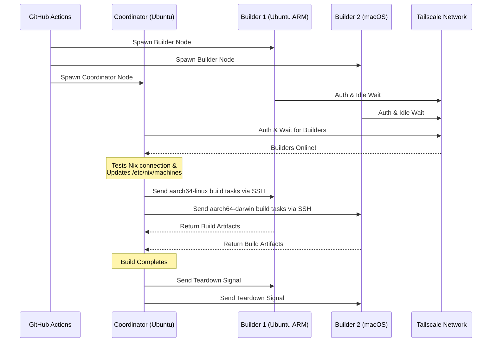

<div align="right">
  <details>
    <summary >🌐 Sprache</summary>
    <div>
      <div align="center">
        <a href="https://openaitx.github.io/view.html?user=Misaka13514&project=setup-distributed-nix-builds&lang=en">Englisch</a>
        | <a href="https://openaitx.github.io/view.html?user=Misaka13514&project=setup-distributed-nix-builds&lang=zh-CN">简体中文</a>
        | <a href="https://openaitx.github.io/view.html?user=Misaka13514&project=setup-distributed-nix-builds&lang=zh-TW">繁體中文</a>
        | <a href="https://openaitx.github.io/view.html?user=Misaka13514&project=setup-distributed-nix-builds&lang=ja">Japanisch</a>
        | <a href="https://openaitx.github.io/view.html?user=Misaka13514&project=setup-distributed-nix-builds&lang=ko">Koreanisch</a>
        | <a href="https://openaitx.github.io/view.html?user=Misaka13514&project=setup-distributed-nix-builds&lang=hi">Hindi</a>
        | <a href="https://openaitx.github.io/view.html?user=Misaka13514&project=setup-distributed-nix-builds&lang=th">Thailändisch</a>
        | <a href="https://openaitx.github.io/view.html?user=Misaka13514&project=setup-distributed-nix-builds&lang=fr">Französisch</a>
        | <a href="https://openaitx.github.io/view.html?user=Misaka13514&project=setup-distributed-nix-builds&lang=de">Deutsch</a>
        | <a href="https://openaitx.github.io/view.html?user=Misaka13514&project=setup-distributed-nix-builds&lang=es">Spanisch</a>
        | <a href="https://openaitx.github.io/view.html?user=Misaka13514&project=setup-distributed-nix-builds&lang=it">Italienisch</a>
        | <a href="https://openaitx.github.io/view.html?user=Misaka13514&project=setup-distributed-nix-builds&lang=ru">Russisch</a>
        | <a href="https://openaitx.github.io/view.html?user=Misaka13514&project=setup-distributed-nix-builds&lang=pt">Portugiesisch</a>
        | <a href="https://openaitx.github.io/view.html?user=Misaka13514&project=setup-distributed-nix-builds&lang=nl">Niederländisch</a>
        | <a href="https://openaitx.github.io/view.html?user=Misaka13514&project=setup-distributed-nix-builds&lang=pl">Polnisch</a>
        | <a href="https://openaitx.github.io/view.html?user=Misaka13514&project=setup-distributed-nix-builds&lang=ar">Arabisch</a>
        | <a href="https://openaitx.github.io/view.html?user=Misaka13514&project=setup-distributed-nix-builds&lang=fa">Persisch</a>
        | <a href="https://openaitx.github.io/view.html?user=Misaka13514&project=setup-distributed-nix-builds&lang=tr">Türkisch</a>
        | <a href="https://openaitx.github.io/view.html?user=Misaka13514&project=setup-distributed-nix-builds&lang=vi">Vietnamesisch</a>
        | <a href="https://openaitx.github.io/view.html?user=Misaka13514&project=setup-distributed-nix-builds&lang=id">Bahasa Indonesia</a>
        | <a href="https://openaitx.github.io/view.html?user=Misaka13514&project=setup-distributed-nix-builds&lang=as">অসমীয়া</
      </div>
    </div>
  </details>
</div>

# ❄️ Einrichtung von verteilten Nix-Builds

Eine GitHub Action, um sofort einen flüchtigen, plattformübergreifenden [Distributed Nix Build](https://wiki.nixos.org/wiki/Distributed_build) Cluster mit Standard-[GitHub Hosted Runners](https://docs.github.com/en/actions/reference/runners/github-hosted-runners) sicher über Tailscale bereitzustellen.

Mit dieser Action können Sie eine Matrix von sekundären GitHub Runnern (die **Builder**) starten und diese nahtlos über Tailscale SSH mit einem primären Runner (dem **Coordinator**) verbinden. Der Coordinator konfiguriert Nix automatisch so, dass diese Knoten als entfernte Builder verwendet werden, und maximiert so die gleichzeitige Build-Leistung, ohne dass externe Infrastruktur verwaltet werden muss! Sie ist perfekt geeignet, um Multi-Architektur-Pakete zu bauen oder das horizontale Skalieren von großen NixOS-System-Closures über eine Flotte von x86-Runnern zu ermöglichen.

## Funktionen

- 🚀 **Zero-Konfig-Remote-Builder:** Konfiguriert `/etc/nix/machines` automatisch und verbindet Knoten über Tailscale SSH (keine manuellen SSH-Schlüssel erforderlich!).
- 🌍 **Plattformübergreifend & Multi-Arch:** Kombinieren Sie Ubuntu (x86, ARM) und macOS (Intel, Apple Silicon) Runner in einem einzigen Build.
- ⚖️ **Horizontale Skalierung für NixOS:** Müssen Sie eine riesige NixOS-Konfiguration evaluieren und bauen? Starten Sie eine ganze Farm identischer Knoten (z.B. fünf `ubuntu-24.04` Runner) und lassen Sie Nix automatisch parallele Ableitungs-Builds auf alle verfügbaren CPU-Kerne im Cluster verteilen.
- 🧹 **Maximaler Festplattenspeicher:** Bereinigt automatisch vorinstallierte Software auf Linux-Runnern (über [nothing-but-nix](https://github.com/wimpysworld/nothing-but-nix)), um Ihrem Nix Store maximalen Speicherplatz zu verschaffen.
- ⚡ **Integriertes Caching:** Integriert [magic-nix-cache](https://github.com/DeterminateSystems/magic-nix-cache-action), um Flake-Auswertungen und lokale Builds zu beschleunigen.
- 🛑 **Sanfter Abbau:** Builder warten im Leerlauf auf Aufgaben und beenden sich selbstständig, wenn der Koordinator fertig ist.

## Funktionsweise

Der Workflow trennt Runner in zwei Rollen: `builder` und `coordinator`.



## Voraussetzungen

Bevor Sie diese Aktion verwenden, müssen Sie ein Tailscale-Netzwerk konfigurieren, damit die Runner sicher kommunizieren können.

1. **Tailscale-ACLs konfigurieren:**
   Stellen Sie sicher, dass Ihre Tailscale-Tag-Gruppen erstellt wurden und die ACLs es dem Koordinator ermöglichen, nahtlos per Tailscale SSH auf die Builder zuzugreifen.
   Fügen Sie Folgendes zu Ihren [Tailscale Access Controls](https://login.tailscale.com/admin/acls/file) hinzu:

<details>
<summary>Klicken Sie, um die erforderliche Tailscale-ACL-Konfiguration anzuzeigen</summary>

```json
{
  "grants": [
    {
      "src": ["tag:nix-ci-builder", "tag:nix-ci-coordinator"],
      "dst": ["tag:nix-ci-builder", "tag:nix-ci-coordinator"],
      "ip": ["*"]
    }
  ],
  "ssh": [
    {
      "src": ["tag:nix-ci-coordinator"],
      "dst": ["tag:nix-ci-builder"],
      "users": ["autogroup:nonroot", "root"],
      "action": "accept"
    }
  ],
  "tagOwners": {
    "tag:nix-ci-coordinator": ["autogroup:admin", "tag:nix-ci-coordinator"],
    "tag:nix-ci-builder": ["autogroup:admin", "tag:nix-ci-builder"]
  }
}
```
</details>

2. **Erstellen Sie einen Tailscale OAuth-Client:**
   Generieren Sie ein OAuth-Client-Secret in Ihrem [Tailscale Admin-Panel](https://login.tailscale.com/admin/settings/trust-credentials) mit `auth_keys` Schreibberechtigung und den Tags `nix-ci-builder` und `nix-ci-coordinator`.
   Fügen Sie dieses Secret als `TS_OAUTH_SECRET` zu Ihren GitHub Repository-Secrets hinzu.

## Eingaben

| Eingabe              | Beschreibung                                                                                       | Erforderlich | Standard    |
| -------------------- | -------------------------------------------------------------------------------------------------- | ------------ | ----------- |
| `tailscale_authkey`  | Tailscale OAuth-Client-Secret oder Auth Key.                                                       | **Ja**       | N/A         |
| `tailscale_hostname` | Hostname, der bei Tailscale registriert werden soll.                                               | **Ja**       | N/A         |
| `tailscale_tags`     | Tags, die bei Tailscale beworben werden sollen (z.B. `tag:nix-ci-builder`).                        | **Ja**       | N/A         |
| `role`               | Rolle des aktuellen Jobs: `"builder"` oder `"coordinator"`.                                        | Ja           | `"builder"` |
| `builders`           | Leerzeichengetrennte Liste von vollständigen Builder-Hostnames, auf die gewartet werden soll. (_Erforderlich, wenn Rolle Koordinator ist_) | Nein         | `""`        |
| `builder_timeout`    | Maximale Zeit (in Sekunden), die der Builder warten soll, bevor er sich selbst beendet.            | Nein         | `"300"`     |
| `extra_nix_config`   | Zusätzliche Nix-Konfiguration, die zu `/etc/nix/nix.conf` hinzugefügt wird.                        | Nein         | `""`        |

## Verwendung

### Beispiel für vollständigen verteilten Build

Nachfolgend finden Sie einen vollständigen Workflow (`nix-build.yml`), der dynamisch mehrere Runner-Architekturen (Ubuntu x86, Ubuntu ARM, macOS x86, macOS Apple Silicon) startet, sie miteinander verbindet und einen verteilten Nix-Build ausführt.

Wenn Sie eine umfangreiche NixOS-Konfiguration bauen und diese einfach durch horizontales Skalieren beschleunigen möchten, können Sie `BUILDER_COUNTS` ändern, um mehrere identische x86 Runner zu starten. Zum Beispiel:
`BUILDER_COUNTS: '{"ubuntu-24.04": 4}'` 
Dies gibt Ihnen sofort eine Build-Farm mit 16 CPU-Kernen (4 Runner × 4 Kerne), um Ableitungen parallel zu verarbeiten.

Da GitHub Hosted Runner flüchtig sind, gehen alle Build-Artefakte im Nix-Store verloren, wenn der Workflow beendet wird. Um die Vorteile Ihrer verteilten Builds in zukünftigen CI-Läufen oder auf Ihren lokalen Maschinen zu nutzen, wird dringend empfohlen, die Ergebnisse in einen Binary-Cache wie [Cachix](https://www.cachix.org) oder [Attic](https://github.com/zhaofengli/attic) zu pushen.

```yaml
name: Distributed Nix Build

on:
  workflow_dispatch:

env:
  # Define exactly how many runners of each OS type you want
  BUILDER_COUNTS: '{"ubuntu-24.04": 1, "ubuntu-24.04-arm": 1, "macos-26-intel": 1, "macos-26": 1}'

jobs:
  config:
    runs-on: ubuntu-slim
    outputs:
      builder_matrix: ${{ steps.set.outputs.builder_matrix }}
      builders_list: ${{ steps.set.outputs.builders_list }}
      run_suffix: ${{ steps.set.outputs.run_suffix }}
    steps:
      - id: set
        run: |
          SUFFIX=$(openssl rand -hex 3)
          echo "run_suffix=$SUFFIX" >> "$GITHUB_OUTPUT"

          # Dynamically generate the Matrix JSON based on BUILDER_COUNTS
          MATRIX_JSON=$(echo '${{ env.BUILDER_COUNTS }}' | jq -c '[
              to_entries[] | .key as $os | .value as $count |
              range(1; $count + 1) | { os: $os, id: "\($os)-\(.)" }
            ]
          ')
          echo "builder_matrix=$MATRIX_JSON" >> "$GITHUB_OUTPUT"

          # Create a space-separated list of hostnames for the coordinator
          BUILDERS_LIST=$(echo "$MATRIX_JSON" | jq -r --arg suffix "$SUFFIX" 'map("nix-builder-\($suffix)-\(.id)") | join(" ")')
          echo "builders_list=$BUILDERS_LIST" >> "$GITHUB_OUTPUT"

  builder:
    needs: config
    name: Builder ${{ matrix.builder.id }} (${{ needs.config.outputs.run_suffix }})
    runs-on: ${{ matrix.builder.os }}
    strategy:
      fail-fast: false
      matrix:
        builder: ${{ fromJSON(needs.config.outputs.builder_matrix) }}
    steps:
      - name: Setup Distributed Nix Builder
        uses: Misaka13514/setup-distributed-nix-builds@main
        with:
          tailscale_authkey: ${{ secrets.TS_OAUTH_SECRET }}
          tailscale_hostname: nix-builder-${{ needs.config.outputs.run_suffix }}-${{ matrix.builder.id }}
          tailscale_tags: tag:nix-ci-builder
          role: builder

      # Optionally configure your Cachix/Attic or other caching here
      # - uses: cachix/cachix-action@v17

  coordinator:
    needs: config
    name: Coordinator (${{ needs.config.outputs.run_suffix }})
    runs-on: ubuntu-24.04
    steps:
      - name: Setup Coordinator & Connect Builders
        uses: Misaka13514/setup-distributed-nix-builds@main
        with:
          tailscale_authkey: ${{ secrets.TS_OAUTH_SECRET }}
          tailscale_hostname: nix-coordinator-${{ needs.config.outputs.run_suffix }}
          tailscale_tags: tag:nix-ci-coordinator
          role: coordinator
          builders: ${{ needs.config.outputs.builders_list }}

      # Optionally configure your Cachix/Attic or other caching here
      # - uses: cachix/cachix-action@v17

      - name: Execute Distributed Build
        run: |
          # Your build command here. Because builders are registered in /etc/nix/machines,
          # Nix will automatically offload tasks to the correct architecture node.
          nix build -L --max-jobs 0 .#my-package

      # Signal builders to terminate if they are not needed anymore
      - name: Teardown Builders
        run: stop-nix-builders

      # Push build results to Cachix/Attic or other cache here if desired
      # - name: Push to Cachix
      #   run: cachix push mycache --all
```

## Lizenz

Dieses Projekt ist unter der [MIT-Lizenz](LICENSE) lizenziert.



---


Tranlated By [Open Ai Tx](https://github.com/OpenAiTx/OpenAiTx) | Last indexed: 2026-03-27


---