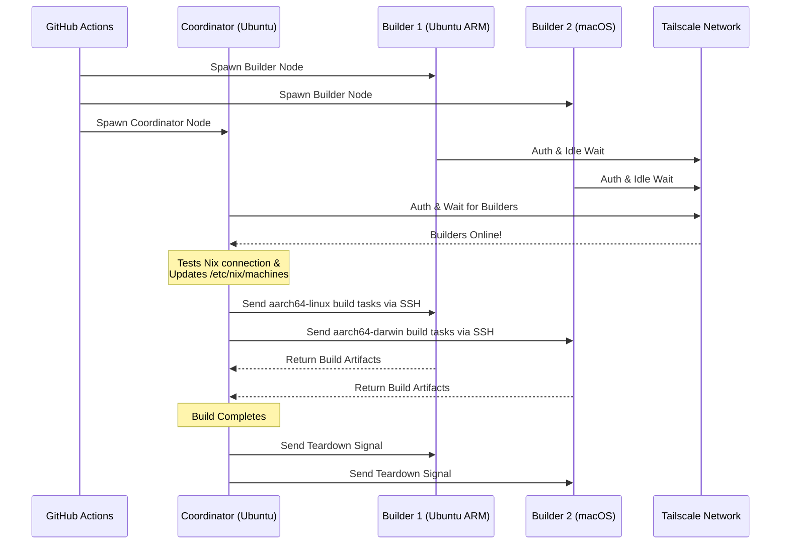

# ❄️ Configurar Builds Distribuidos de Nix

Una Acción de GitHub para aprovisionar instantáneamente un clúster efímero y multiplataforma de [Build Distribuido de Nix](https://wiki.nixos.org/wiki/Distributed_build) usando [Runners alojados por GitHub](https://docs.github.com/en/actions/reference/runners/github-hosted-runners) estándar conectados de forma segura vía Tailscale.

Esta acción te permite desplegar una matriz de runners secundarios de GitHub (los **Builders**) y conectarlos a un runner primario (el **Coordinador**) sin problemas a través de Tailscale SSH. El Coordinador configura automáticamente Nix para usar estos nodos como constructores remotos, maximizando el rendimiento concurrente de las compilaciones sin gestionar infraestructura externa. ¡Es perfecto para construir paquetes multi-arquitectura o escalar horizontalmente cierres pesados de sistemas NixOS en una flota de runners x86.

## Características

- 🚀 **Constructores Remotos Sin Configuración:** Configura automáticamente `/etc/nix/machines` y conecta nodos vía Tailscale SSH (¡sin claves SSH manuales!).
- 🌍 **Multiplataforma y Multi-Arquitectura:** Combina runners Ubuntu (x86, ARM) y macOS (Intel, Apple Silicon) en la misma build.
- ⚖️ **Escalado Horizontal para NixOS:** ¿Necesitas evaluar y construir una configuración masiva de NixOS? Despliega toda una granja de nodos idénticos (por ejemplo, cinco runners `ubuntu-24.04`) y deja que Nix distribuya automáticamente las derivaciones paralelas en todos los núcleos CPU disponibles del clúster.
- 🧹 **Máximo Espacio en Disco:** Limpia automáticamente el software preinstalado en runners Linux (mediante [nothing-but-nix](https://github.com/wimpysworld/nothing-but-nix)) para dar máximo espacio a tu tienda Nix.
- ⚡ **Cache Integrada:** Integra [magic-nix-cache](https://github.com/DeterminateSystems/magic-nix-cache-action) para acelerar evaluaciones de flakes y builds locales.
- 🛑 **Apagado Ordenado:** Los Builders esperan inactivos por tareas y se autodestruyen ordenadamente cuando el Coordinador termina.

## Cómo Funciona

El flujo de trabajo separa los runners en dos roles: `builder` y `coordinator`.



## Prerrequisitos

Antes de usar esta acción, debe configurar una red Tailscale para que los runners se comuniquen de forma segura.

1. **Configure las ACL de Tailscale:**
   Asegúrese de que su Tailscale tenga grupos de etiquetas creados y que las ACL permitan que el coordinador se conecte por SSH a los builders sin problemas usando Tailscale SSH.
   Agregue lo siguiente a sus [Controles de acceso de Tailscale](https://login.tailscale.com/admin/acls/file):

<details>
<summary>Haga clic para ver la configuración requerida de las ACL de Tailscale</summary>

```json
{
  "grants": [
    {
      "src": ["tag:nix-ci-builder", "tag:nix-ci-coordinator"],
      "dst": ["tag:nix-ci-builder", "tag:nix-ci-coordinator"],
      "ip": ["*"]
    }
  ],
  "ssh": [
    {
      "src": ["tag:nix-ci-coordinator"],
      "dst": ["tag:nix-ci-builder"],
      "users": ["autogroup:nonroot", "root"],
      "action": "accept"
    }
  ],
  "tagOwners": {
    "tag:nix-ci-coordinator": ["autogroup:admin", "tag:nix-ci-coordinator"],
    "tag:nix-ci-builder": ["autogroup:admin", "tag:nix-ci-builder"]
  }
}
```
</details>

2. **Crear un cliente OAuth de Tailscale:**
   Genere un secreto de cliente OAuth en su [panel de administración de Tailscale](https://login.tailscale.com/admin/settings/trust-credentials), con alcance de escritura `auth_keys` y etiquetas `nix-ci-builder` `nix-ci-coordinator`.
   Agregue este secreto a los secretos de su repositorio de GitHub como `TS_OAUTH_SECRET`.

## Entradas

| Entrada              | Descripción                                                                                     | Requerido | Predeterminado |
| -------------------- | ----------------------------------------------------------------------------------------------- | --------- | -------------- |
| `tailscale_authkey`  | Secreto del cliente OAuth de Tailscale o clave de autenticación.                                | **Sí**    | N/A            |
| `tailscale_hostname` | Nombre de host para registrar en Tailscale.                                                    | **Sí**    | N/A            |
| `tailscale_tags`     | Etiquetas para anunciar a Tailscale (ej. `tag:nix-ci-builder`).                                | **Sí**    | N/A            |
| `role`               | Rol del trabajo actual: `"builder"` o `"coordinator"`.                                        | Sí        | `"builder"`    |
| `builders`           | Lista separada por espacios de nombres de host completos de los builders a esperar. (_Requerido si el rol es coordinator_) | No        | `""`           |
| `builder_timeout`    | Tiempo máximo (en segundos) que el builder debe esperar antes de auto-terminarse.             | No        | `"300"`        |
| `extra_nix_config`   | Configuración Nix extra para añadir a `/etc/nix/nix.conf`.                                    | No        | `""`           |

## Uso

### Ejemplo completo de compilación distribuida

A continuación se muestra un flujo de trabajo completo (`nix-build.yml`) que lanza dinámicamente múltiples arquitecturas de runner (Ubuntu x86, Ubuntu ARM, macOS x86, macOS Apple Silicon), los conecta entre sí y ejecuta una compilación distribuida de Nix.

Si está compilando una configuración pesada de NixOS y simplemente quiere acelerarla usando escalado horizontal, puede cambiar `BUILDER_COUNTS` para lanzar múltiples runners idénticos x86. Por ejemplo:
`BUILDER_COUNTS: '{"ubuntu-24.04": 4}'`
Esto le proporcionará instantáneamente una granja de compilación con 16 núcleos de CPU (4 runners × 4 núcleos) para procesar derivaciones en paralelo.

Como los runners alojados por GitHub son efímeros, todos los artefactos de compilación en la tienda Nix se perderán cuando el flujo de trabajo termine. Para aprovechar los beneficios de sus compilaciones distribuidas en futuras ejecuciones CI o en sus máquinas locales, se recomienda encarecidamente subir los resultados a una caché binaria como [Cachix](https://www.cachix.org) o [Attic](https://github.com/zhaofengli/attic).

```yaml
name: Distributed Nix Build

on:
  workflow_dispatch:

env:
  # Define exactly how many runners of each OS type you want
  BUILDER_COUNTS: '{"ubuntu-24.04": 1, "ubuntu-24.04-arm": 1, "macos-26-intel": 1, "macos-26": 1}'

jobs:
  config:
    runs-on: ubuntu-slim
    outputs:
      builder_matrix: ${{ steps.set.outputs.builder_matrix }}
      builders_list: ${{ steps.set.outputs.builders_list }}
      run_suffix: ${{ steps.set.outputs.run_suffix }}
    steps:
      - id: set
        run: |
          SUFFIX=$(openssl rand -hex 3)
          echo "run_suffix=$SUFFIX" >> "$GITHUB_OUTPUT"

          # Dynamically generate the Matrix JSON based on BUILDER_COUNTS
          MATRIX_JSON=$(echo '${{ env.BUILDER_COUNTS }}' | jq -c '[
              to_entries[] | .key as $os | .value as $count |
              range(1; $count + 1) | { os: $os, id: "\($os)-\(.)" }
            ]
          ')
          echo "builder_matrix=$MATRIX_JSON" >> "$GITHUB_OUTPUT"

          # Create a space-separated list of hostnames for the coordinator
          BUILDERS_LIST=$(echo "$MATRIX_JSON" | jq -r --arg suffix "$SUFFIX" 'map("nix-builder-\($suffix)-\(.id)") | join(" ")')
          echo "builders_list=$BUILDERS_LIST" >> "$GITHUB_OUTPUT"

  builder:
    needs: config
    name: Builder ${{ matrix.builder.id }} (${{ needs.config.outputs.run_suffix }})
    runs-on: ${{ matrix.builder.os }}
    strategy:
      fail-fast: false
      matrix:
        builder: ${{ fromJSON(needs.config.outputs.builder_matrix) }}
    steps:
      - name: Setup Distributed Nix Builder
        uses: Misaka13514/setup-distributed-nix-builds@main
        with:
          tailscale_authkey: ${{ secrets.TS_OAUTH_SECRET }}
          tailscale_hostname: nix-builder-${{ needs.config.outputs.run_suffix }}-${{ matrix.builder.id }}
          tailscale_tags: tag:nix-ci-builder
          role: builder

      # Optionally configure your Cachix/Attic or other caching here
      # - uses: cachix/cachix-action@v17

  coordinator:
    needs: config
    name: Coordinator (${{ needs.config.outputs.run_suffix }})
    runs-on: ubuntu-24.04
    steps:
      - name: Setup Coordinator & Connect Builders
        uses: Misaka13514/setup-distributed-nix-builds@main
        with:
          tailscale_authkey: ${{ secrets.TS_OAUTH_SECRET }}
          tailscale_hostname: nix-coordinator-${{ needs.config.outputs.run_suffix }}
          tailscale_tags: tag:nix-ci-coordinator
          role: coordinator
          builders: ${{ needs.config.outputs.builders_list }}

      # Optionally configure your Cachix/Attic or other caching here
      # - uses: cachix/cachix-action@v17

      - name: Execute Distributed Build
        run: |
          # Your build command here. Because builders are registered in /etc/nix/machines,
          # Nix will automatically offload tasks to the correct architecture node.
          nix build -L --max-jobs 0 .#my-package

      # Signal builders to terminate if they are not needed anymore
      - name: Teardown Builders
        run: stop-nix-builders

      # Push build results to Cachix/Attic or other cache here if desired
      # - name: Push to Cachix
      #   run: cachix push mycache --all
```

## Licencia

Este proyecto está licenciado bajo la [Licencia MIT](LICENSE).



---


Tranlated By [Open Ai Tx](https://github.com/OpenAiTx/OpenAiTx) | Last indexed: 2026-03-26


---