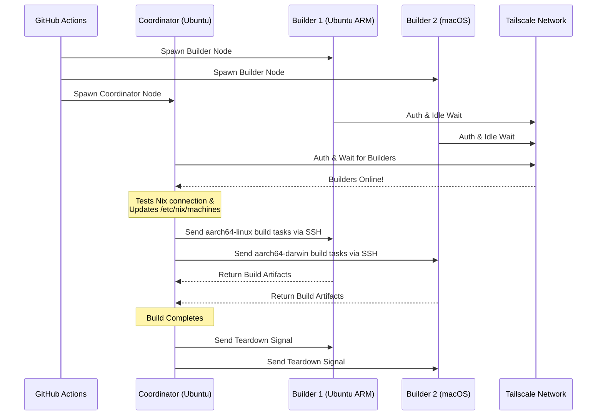

<div align="right">
  <details>
    <summary >🌐 زبان</summary>
    <div>
      <div align="center">
        <a href="https://openaitx.github.io/view.html?user=Misaka13514&project=setup-distributed-nix-builds&lang=en">English</a>
        | <a href="https://openaitx.github.io/view.html?user=Misaka13514&project=setup-distributed-nix-builds&lang=zh-CN">简体中文</a>
        | <a href="https://openaitx.github.io/view.html?user=Misaka13514&project=setup-distributed-nix-builds&lang=zh-TW">繁體中文</a>
        | <a href="https://openaitx.github.io/view.html?user=Misaka13514&project=setup-distributed-nix-builds&lang=ja">日本語</a>
        | <a href="https://openaitx.github.io/view.html?user=Misaka13514&project=setup-distributed-nix-builds&lang=ko">한국어</a>
        | <a href="https://openaitx.github.io/view.html?user=Misaka13514&project=setup-distributed-nix-builds&lang=hi">हिन्दी</a>
        | <a href="https://openaitx.github.io/view.html?user=Misaka13514&project=setup-distributed-nix-builds&lang=th">ไทย</a>
        | <a href="https://openaitx.github.io/view.html?user=Misaka13514&project=setup-distributed-nix-builds&lang=fr">Français</a>
        | <a href="https://openaitx.github.io/view.html?user=Misaka13514&project=setup-distributed-nix-builds&lang=de">Deutsch</a>
        | <a href="https://openaitx.github.io/view.html?user=Misaka13514&project=setup-distributed-nix-builds&lang=es">Español</a>
        | <a href="https://openaitx.github.io/view.html?user=Misaka13514&project=setup-distributed-nix-builds&lang=it">Italiano</a>
        | <a href="https://openaitx.github.io/view.html?user=Misaka13514&project=setup-distributed-nix-builds&lang=ru">Русский</a>
        | <a href="https://openaitx.github.io/view.html?user=Misaka13514&project=setup-distributed-nix-builds&lang=pt">Português</a>
        | <a href="https://openaitx.github.io/view.html?user=Misaka13514&project=setup-distributed-nix-builds&lang=nl">Nederlands</a>
        | <a href="https://openaitx.github.io/view.html?user=Misaka13514&project=setup-distributed-nix-builds&lang=pl">Polski</a>
        | <a href="https://openaitx.github.io/view.html?user=Misaka13514&project=setup-distributed-nix-builds&lang=ar">العربية</a>
        | <a href="https://openaitx.github.io/view.html?user=Misaka13514&project=setup-distributed-nix-builds&lang=fa">فارسی</a>
        | <a href="https://openaitx.github.io/view.html?user=Misaka13514&project=setup-distributed-nix-builds&lang=tr">Türkçe</a>
        | <a href="https://openaitx.github.io/view.html?user=Misaka13514&project=setup-distributed-nix-builds&lang=vi">Tiếng Việt</a>
        | <a href="https://openaitx.github.io/view.html?user=Misaka13514&project=setup-distributed-nix-builds&lang=id">Bahasa Indonesia</a>
        | <a href="https://openaitx.github.io/view.html?user=Misaka13514&project=setup-distributed-nix-builds&lang=as">অসমীয়া</
      </div>
    </div>
  </details>
</div>

# ❄️ راه‌اندازی بیلدهای توزیع‌شده نیکس

یک اکشن گیت‌هاب برای راه‌اندازی فوری خوشه‌ای اپیمرال و چندسکویی [بیلد توزیع‌شده نیکس](https://wiki.nixos.org/wiki/Distributed_build) با استفاده از [رانرهای میزبانی‌شده گیت‌هاب](https://docs.github.com/en/actions/reference/runners/github-hosted-runners) که از طریق تیل‌اسکیل به طور امن متصل می‌شوند.

این اکشن به شما امکان می‌دهد یک ماتریس از رانرهای ثانویه گیت‌هاب (که **بیلدرها** هستند) را راه‌اندازی کنید و آن‌ها را به رانر اصلی (که **هماهنگ‌کننده** است) به طور یکپارچه از طریق SSH تیل‌اسکیل متصل نمایید. هماهنگ‌کننده به طور خودکار نیکس را پیکربندی می‌کند تا از این گره‌ها به عنوان بیلدرهای راه دور استفاده کند و عملکرد بیلد همزمان را بدون مدیریت زیرساخت خارجی به حداکثر می‌رساند! این راهکار برای ساخت پکیج‌های چندمعماری یا افزایش افقی بیلدهای سنگین سیستم NixOS بر روی ناوگانی از رانرهای x86 کاملاً مناسب است.

## ویژگی‌ها


- 🚀 **سازنده‌های راه دور بدون نیاز به پیکربندی:** به طور خودکار فایل `/etc/nix/machines` را پیکربندی می‌کند و گره‌ها را از طریق SSH تیلز‌اسکیل متصل می‌سازد (نیازی به کلیدهای SSH دستی نیست!).
- 🌍 **چندسکویی و چندمعماری:** می‌توانید اجراکننده‌های Ubuntu (x86، ARM) و macOS (Intel، Apple Silicon) را در یک ساخت ترکیب کنید.
- ⚖️ **مقیاس‌پذیری افقی برای NixOS:** نیاز به ارزیابی و ساخت یک پیکربندی عظیم NixOS دارید؟ یک مزرعه کامل از گره‌های مشابه (مثلاً پنج اجراکننده `ubuntu-24.04`) راه‌اندازی کنید و اجازه دهید Nix ساخت‌های مشتق موازی را به طور خودکار بین همه هسته‌های CPU موجود در خوشه توزیع کند.
- 🧹 **حداکثر فضای دیسک:** به طور خودکار نرم‌افزارهای از پیش نصب‌شده روی اجراکننده‌های لینوکس را پاک می‌کند (از طریق [nothing-but-nix](https://github.com/wimpysworld/nothing-but-nix)) تا فضای کافی برای فروشگاه Nix شما فراهم شود.
- ⚡ **کش داخلی:** با [magic-nix-cache](https://github.com/DeterminateSystems/magic-nix-cache-action) ادغام شده تا ارزیابی فلک و ساخت‌های محلی را سرعت بخشد.
- 🛑 **جمع‌آوری آرام:** سازنده‌ها در انتظار وظایف می‌مانند و پس از پایان کار هماهنگ‌کننده، به طور آرام خود را خاموش می‌کنند.

## نحوه عملکرد

این گردش‌کار اجراکننده‌ها را به دو نقش تقسیم می‌کند: `builder` و `coordinator`.



## پیش‌نیازها

قبل از استفاده از این اکشن، باید یک شبکه Tailscale برای ارتباط امن رانرها پیکربندی کنید.

1. **پیکربندی ACLهای Tailscale:**
   اطمینان حاصل کنید که گروه‌های تگ در Tailscale ایجاد شده‌اند و ACLها به هماهنگ‌کننده اجازه می‌دهند تا با استفاده از Tailscale SSH بدون مشکل به بیلدرها متصل شود.
   موارد زیر را به [کنترل دسترسی Tailscale](https://login.tailscale.com/admin/acls/file) خود اضافه کنید:

<details>
<summary>برای مشاهده پیکربندی مورد نیاز ACLهای Tailscale کلیک کنید</summary>

```json
{
  "grants": [
    {
      "src": ["tag:nix-ci-builder", "tag:nix-ci-coordinator"],
      "dst": ["tag:nix-ci-builder", "tag:nix-ci-coordinator"],
      "ip": ["*"]
    }
  ],
  "ssh": [
    {
      "src": ["tag:nix-ci-coordinator"],
      "dst": ["tag:nix-ci-builder"],
      "users": ["autogroup:nonroot", "root"],
      "action": "accept"
    }
  ],
  "tagOwners": {
    "tag:nix-ci-coordinator": ["autogroup:admin", "tag:nix-ci-coordinator"],
    "tag:nix-ci-builder": ["autogroup:admin", "tag:nix-ci-builder"]
  }
}
```
</details>

2. **ایجاد یک کلاینت OAuth برای Tailscale:**
   یک OAuth Client Secret را در [پنل مدیریت Tailscale](https://login.tailscale.com/admin/settings/trust-credentials) ایجاد کنید، با دسترسی `auth_keys` و تگ‌های `nix-ci-builder` و `nix-ci-coordinator`.
   این رمز را به عنوان `TS_OAUTH_SECRET` به بخش Secrets مخزن GitHub خود اضافه کنید.

## ورودی‌ها

| ورودی                 | توضیحات                                                                                         | ضروری    | پیش‌فرض     |
| --------------------- | ----------------------------------------------------------------------------------------------- | -------- | ----------- |
| `tailscale_authkey`   | کلاینت سکرت یا Auth Key مربوط به Tailscale OAuth.                                               | **بله**  | N/A         |
| `tailscale_hostname`  | نام میزبان جهت ثبت در Tailscale.                                                                | **بله**  | N/A         |
| `tailscale_tags`      | تگ‌هایی که به Tailscale معرفی می‌شوند (مثلاً `tag:nix-ci-builder`).                             | **بله**  | N/A         |
| `role`                | نقش این job: `"builder"` یا `"coordinator"`.                                                    | بله      | `"builder"` |
| `builders`            | لیست نام‌های کامل میزبان‌های builder که باید منتظرشان ماند. (_در صورت coordinator بودن نقش الزامی است_) | خیر      | `""`        |
| `builder_timeout`     | حداکثر زمان (بر حسب ثانیه) که builder باید قبل از خاتمه خودکار منتظر بماند.                     | خیر      | `"300"`     |
| `extra_nix_config`    | پیکربندی اضافی Nix برای اضافه شدن به `/etc/nix/nix.conf`.                                      | خیر      | `""`        |

## نحوه استفاده

### نمونه ساخت توزیع‌شده کامل

در زیر یک workflow کامل (`nix-build.yml`) آمده است که چندین runner با معماری مختلف (اوبونتو x86، اوبونتو ARM، مک x86، مک اپل سیلیکون) را به صورت پویا راه‌اندازی، به هم متصل و یک ساخت توزیع‌شده Nix را اجرا می‌کند.

اگر قصد دارید یک پیکربندی سنگین NixOS را ساخته و فقط می‌خواهید با مقیاس‌پذیری افقی سرعت آن را افزایش دهید، می‌توانید مقدار `BUILDER_COUNTS` را تغییر دهید تا چند runner x86 یکسان ایجاد شود. برای مثال:
`BUILDER_COUNTS: '{"ubuntu-24.04": 4}'` 
این کار فوراً یک build farm با ۱۶ هسته CPU (۴ runner × ۴ هسته) برای پردازش موازی مشتقات در اختیار شما قرار می‌دهد.

از آنجا که GitHub Hosted Runners موقت هستند، پس از پایان workflow تمام محصولات ساخت‌شده در Nix store از بین می‌روند. برای بهره‌مندی از نتایج ساخت توزیع‌شده در اجراهای بعدی CI یا روی ماشین‌های شخصی، توصیه می‌شود نتایج را به یک binary cache مانند [Cachix](https://www.cachix.org) یا [Attic](https://github.com/zhaofengli/attic) ارسال کنید.

```yaml
name: Distributed Nix Build

on:
  workflow_dispatch:

env:
  # Define exactly how many runners of each OS type you want
  BUILDER_COUNTS: '{"ubuntu-24.04": 1, "ubuntu-24.04-arm": 1, "macos-26-intel": 1, "macos-26": 1}'

jobs:
  config:
    runs-on: ubuntu-slim
    outputs:
      builder_matrix: ${{ steps.set.outputs.builder_matrix }}
      builders_list: ${{ steps.set.outputs.builders_list }}
      run_suffix: ${{ steps.set.outputs.run_suffix }}
    steps:
      - id: set
        run: |
          SUFFIX=$(openssl rand -hex 3)
          echo "run_suffix=$SUFFIX" >> "$GITHUB_OUTPUT"

          # Dynamically generate the Matrix JSON based on BUILDER_COUNTS
          MATRIX_JSON=$(echo '${{ env.BUILDER_COUNTS }}' | jq -c '[
              to_entries[] | .key as $os | .value as $count |
              range(1; $count + 1) | { os: $os, id: "\($os)-\(.)" }
            ]
          ')
          echo "builder_matrix=$MATRIX_JSON" >> "$GITHUB_OUTPUT"

          # Create a space-separated list of hostnames for the coordinator
          BUILDERS_LIST=$(echo "$MATRIX_JSON" | jq -r --arg suffix "$SUFFIX" 'map("nix-builder-\($suffix)-\(.id)") | join(" ")')
          echo "builders_list=$BUILDERS_LIST" >> "$GITHUB_OUTPUT"

  builder:
    needs: config
    name: Builder ${{ matrix.builder.id }} (${{ needs.config.outputs.run_suffix }})
    runs-on: ${{ matrix.builder.os }}
    strategy:
      fail-fast: false
      matrix:
        builder: ${{ fromJSON(needs.config.outputs.builder_matrix) }}
    steps:
      - name: Setup Distributed Nix Builder
        uses: Misaka13514/setup-distributed-nix-builds@main
        with:
          tailscale_authkey: ${{ secrets.TS_OAUTH_SECRET }}
          tailscale_hostname: nix-builder-${{ needs.config.outputs.run_suffix }}-${{ matrix.builder.id }}
          tailscale_tags: tag:nix-ci-builder
          role: builder

      # Optionally configure your Cachix/Attic or other caching here
      # - uses: cachix/cachix-action@v17

  coordinator:
    needs: config
    name: Coordinator (${{ needs.config.outputs.run_suffix }})
    runs-on: ubuntu-24.04
    steps:
      - name: Setup Coordinator & Connect Builders
        uses: Misaka13514/setup-distributed-nix-builds@main
        with:
          tailscale_authkey: ${{ secrets.TS_OAUTH_SECRET }}
          tailscale_hostname: nix-coordinator-${{ needs.config.outputs.run_suffix }}
          tailscale_tags: tag:nix-ci-coordinator
          role: coordinator
          builders: ${{ needs.config.outputs.builders_list }}

      # Optionally configure your Cachix/Attic or other caching here
      # - uses: cachix/cachix-action@v17

      - name: Execute Distributed Build
        run: |
          # Your build command here. Because builders are registered in /etc/nix/machines,
          # Nix will automatically offload tasks to the correct architecture node.
          nix build -L --max-jobs 0 .#my-package

      # Signal builders to terminate if they are not needed anymore
      - name: Teardown Builders
        run: stop-nix-builders

      # Push build results to Cachix/Attic or other cache here if desired
      # - name: Push to Cachix
      #   run: cachix push mycache --all
```

## مجوز

این پروژه تحت [مجوز MIT](LICENSE) منتشر شده است.



---


Tranlated By [Open Ai Tx](https://github.com/OpenAiTx/OpenAiTx) | Last indexed: 2026-03-27


---