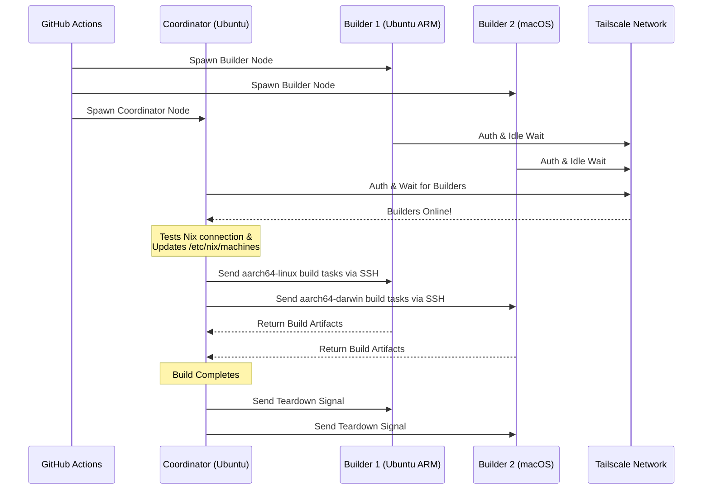

<div align="right">
  <details>
    <summary >🌐 Langue</summary>
    <div>
      <div align="center">
        <a href="https://openaitx.github.io/view.html?user=Misaka13514&project=setup-distributed-nix-builds&lang=en">English</a>
        | <a href="https://openaitx.github.io/view.html?user=Misaka13514&project=setup-distributed-nix-builds&lang=zh-CN">简体中文</a>
        | <a href="https://openaitx.github.io/view.html?user=Misaka13514&project=setup-distributed-nix-builds&lang=zh-TW">繁體中文</a>
        | <a href="https://openaitx.github.io/view.html?user=Misaka13514&project=setup-distributed-nix-builds&lang=ja">日本語</a>
        | <a href="https://openaitx.github.io/view.html?user=Misaka13514&project=setup-distributed-nix-builds&lang=ko">한국어</a>
        | <a href="https://openaitx.github.io/view.html?user=Misaka13514&project=setup-distributed-nix-builds&lang=hi">हिन्दी</a>
        | <a href="https://openaitx.github.io/view.html?user=Misaka13514&project=setup-distributed-nix-builds&lang=th">ไทย</a>
        | <a href="https://openaitx.github.io/view.html?user=Misaka13514&project=setup-distributed-nix-builds&lang=fr">Français</a>
        | <a href="https://openaitx.github.io/view.html?user=Misaka13514&project=setup-distributed-nix-builds&lang=de">Deutsch</a>
        | <a href="https://openaitx.github.io/view.html?user=Misaka13514&project=setup-distributed-nix-builds&lang=es">Español</a>
        | <a href="https://openaitx.github.io/view.html?user=Misaka13514&project=setup-distributed-nix-builds&lang=it">Italiano</a>
        | <a href="https://openaitx.github.io/view.html?user=Misaka13514&project=setup-distributed-nix-builds&lang=ru">Русский</a>
        | <a href="https://openaitx.github.io/view.html?user=Misaka13514&project=setup-distributed-nix-builds&lang=pt">Português</a>
        | <a href="https://openaitx.github.io/view.html?user=Misaka13514&project=setup-distributed-nix-builds&lang=nl">Nederlands</a>
        | <a href="https://openaitx.github.io/view.html?user=Misaka13514&project=setup-distributed-nix-builds&lang=pl">Polski</a>
        | <a href="https://openaitx.github.io/view.html?user=Misaka13514&project=setup-distributed-nix-builds&lang=ar">العربية</a>
        | <a href="https://openaitx.github.io/view.html?user=Misaka13514&project=setup-distributed-nix-builds&lang=fa">فارسی</a>
        | <a href="https://openaitx.github.io/view.html?user=Misaka13514&project=setup-distributed-nix-builds&lang=tr">Türkçe</a>
        | <a href="https://openaitx.github.io/view.html?user=Misaka13514&project=setup-distributed-nix-builds&lang=vi">Tiếng Việt</a>
        | <a href="https://openaitx.github.io/view.html?user=Misaka13514&project=setup-distributed-nix-builds&lang=id">Bahasa Indonesia</a>
        | <a href="https://openaitx.github.io/view.html?user=Misaka13514&project=setup-distributed-nix-builds&lang=as">অসমীয়া</
      </div>
    </div>
  </details>
</div>

# ❄️ Configuration des Builds Nix Distribués

Une action GitHub pour provisionner instantanément un cluster éphémère et multiplateforme de [Builds Nix Distribués](https://wiki.nixos.org/wiki/Distributed_build) en utilisant les [GitHub Hosted Runners](https://docs.github.com/en/actions/reference/runners/github-hosted-runners) standards, connectés en toute sécurité via Tailscale.

Cette action vous permet de lancer une matrice de runners GitHub secondaires (les **Builders**) et de les connecter à un runner principal (le **Coordinateur**) de façon transparente via Tailscale SSH. Le Coordinateur configure automatiquement Nix pour utiliser ces nœuds comme builders distants, maximisant les performances de build simultanées sans gérer d'infrastructure externe ! Parfait pour construire des paquets multi-architectures ou pour scaler horizontalement de lourdes clôtures système NixOS sur une flotte de runners x86.

## Fonctionnalités

- 🚀 **Constructeurs distants sans configuration :** Configure automatiquement `/etc/nix/machines` et connecte les nœuds via Tailscale SSH (aucune clé SSH manuelle requise !).
- 🌍 **Multi-plateforme & Multi-architecture :** Combinez des runners Ubuntu (x86, ARM) et macOS (Intel, Apple Silicon) dans un même build.
- ⚖️ **Scalabilité horizontale pour NixOS :** Besoin d’évaluer et de construire une configuration NixOS massive ? Lancez une ferme entière de nœuds identiques (par exemple, cinq runners `ubuntu-24.04`) et laissez Nix répartir automatiquement les builds de dérivations en parallèle sur tous les cœurs CPU disponibles du cluster.
- 🧹 **Espace disque maximal :** Nettoie automatiquement les logiciels préinstallés sur les runners Linux (via [nothing-but-nix](https://github.com/wimpysworld/nothing-but-nix)) pour offrir un maximum d’espace à votre Nix store.
- ⚡ **Mise en cache intégrée :** Intègre [magic-nix-cache](https://github.com/DeterminateSystems/magic-nix-cache-action) pour accélérer l’évaluation des flakes et les builds locaux.
- 🛑 **Extinction en douceur :** Les builders attendent passivement les tâches et s’auto-terminent proprement lorsque le coordinateur termine.

## Fonctionnement

Le workflow sépare les runners en deux rôles : `builder` et `coordinator`.



## Prérequis

Avant d’utiliser cette action, vous devez configurer un réseau Tailscale pour que les runners communiquent de manière sécurisée.

1. **Configurer les ACLs Tailscale :**
   Assurez-vous que votre Tailscale dispose de groupes de tags créés et que les ACLs permettent au coordinateur de se connecter en SSH aux builders sans problème via Tailscale SSH.
   Ajoutez ce qui suit à vos [Contrôles d’accès Tailscale](https://login.tailscale.com/admin/acls/file) :

<details>
<summary>Cliquez pour voir la configuration ACL Tailscale requise</summary>

```json
{
  "grants": [
    {
      "src": ["tag:nix-ci-builder", "tag:nix-ci-coordinator"],
      "dst": ["tag:nix-ci-builder", "tag:nix-ci-coordinator"],
      "ip": ["*"]
    }
  ],
  "ssh": [
    {
      "src": ["tag:nix-ci-coordinator"],
      "dst": ["tag:nix-ci-builder"],
      "users": ["autogroup:nonroot", "root"],
      "action": "accept"
    }
  ],
  "tagOwners": {
    "tag:nix-ci-coordinator": ["autogroup:admin", "tag:nix-ci-coordinator"],
    "tag:nix-ci-builder": ["autogroup:admin", "tag:nix-ci-builder"]
  }
}
```
</details>

2. **Créer un client OAuth Tailscale :**  
   Générez un secret client OAuth dans votre [panneau d’administration Tailscale](https://login.tailscale.com/admin/settings/trust-credentials), avec la portée en écriture `auth_keys` et les tags `nix-ci-builder` `nix-ci-coordinator`.  
   Ajoutez ce secret aux secrets de votre dépôt GitHub sous le nom `TS_OAUTH_SECRET`.

## Entrées

| Entrée               | Description                                                                                     | Obligatoire | Par défaut  |
| -------------------- | ----------------------------------------------------------------------------------------------- | ----------- | ----------- |
| `tailscale_authkey`  | Secret client OAuth Tailscale ou clé d’authentification.                                        | **Oui**     | N/A         |
| `tailscale_hostname` | Nom d’hôte à enregistrer auprès de Tailscale.                                                  | **Oui**     | N/A         |
| `tailscale_tags`     | Tags à annoncer à Tailscale (ex. `tag:nix-ci-builder`).                                        | **Oui**     | N/A         |
| `role`               | Rôle du job courant : `"builder"` ou `"coordinator"`.                                          | Oui         | `"builder"` |
| `builders`           | Liste d’hôtes complets des builders à attendre, séparés par des espaces. (_Requis si rôle coordinator_) | Non         | `""`        |
| `builder_timeout`    | Temps maximum (en secondes) que le builder doit attendre avant de s’auto-terminer.             | Non         | `"300"`     |
| `extra_nix_config`   | Configuration Nix supplémentaire à ajouter à `/etc/nix/nix.conf`.                             | Non         | `""`        |

## Utilisation

### Exemple complet de build distribué

Voici un workflow complet (`nix-build.yml`) qui lance dynamiquement plusieurs architectures de runners (Ubuntu x86, Ubuntu ARM, macOS x86, macOS Apple Silicon), les connecte entre eux et exécute une build Nix distribuée.

Si vous construisez une configuration NixOS lourde et souhaitez simplement l’accélérer par scalabilité horizontale, vous pouvez modifier `BUILDER_COUNTS` pour lancer plusieurs runners x86 identiques. Par exemple :  
`BUILDER_COUNTS: '{"ubuntu-24.04": 4}'`  
Cela vous fournira instantanément une ferme de build avec 16 cœurs CPU (4 runners × 4 cœurs) pour traiter les dérivations en parallèle.

Comme les runners hébergés GitHub sont éphémères, tous les artefacts de build dans le store Nix seront perdus à la fin du workflow. Pour profiter des avantages de vos builds distribués lors des prochaines exécutions CI ou sur vos machines locales, il est fortement recommandé de pousser les résultats vers un cache binaire comme [Cachix](https://www.cachix.org) ou [Attic](https://github.com/zhaofengli/attic).

```yaml
name: Distributed Nix Build

on:
  workflow_dispatch:

env:
  # Define exactly how many runners of each OS type you want
  BUILDER_COUNTS: '{"ubuntu-24.04": 1, "ubuntu-24.04-arm": 1, "macos-26-intel": 1, "macos-26": 1}'

jobs:
  config:
    runs-on: ubuntu-slim
    outputs:
      builder_matrix: ${{ steps.set.outputs.builder_matrix }}
      builders_list: ${{ steps.set.outputs.builders_list }}
      run_suffix: ${{ steps.set.outputs.run_suffix }}
    steps:
      - id: set
        run: |
          SUFFIX=$(openssl rand -hex 3)
          echo "run_suffix=$SUFFIX" >> "$GITHUB_OUTPUT"

          # Dynamically generate the Matrix JSON based on BUILDER_COUNTS
          MATRIX_JSON=$(echo '${{ env.BUILDER_COUNTS }}' | jq -c '[
              to_entries[] | .key as $os | .value as $count |
              range(1; $count + 1) | { os: $os, id: "\($os)-\(.)" }
            ]
          ')
          echo "builder_matrix=$MATRIX_JSON" >> "$GITHUB_OUTPUT"

          # Create a space-separated list of hostnames for the coordinator
          BUILDERS_LIST=$(echo "$MATRIX_JSON" | jq -r --arg suffix "$SUFFIX" 'map("nix-builder-\($suffix)-\(.id)") | join(" ")')
          echo "builders_list=$BUILDERS_LIST" >> "$GITHUB_OUTPUT"

  builder:
    needs: config
    name: Builder ${{ matrix.builder.id }} (${{ needs.config.outputs.run_suffix }})
    runs-on: ${{ matrix.builder.os }}
    strategy:
      fail-fast: false
      matrix:
        builder: ${{ fromJSON(needs.config.outputs.builder_matrix) }}
    steps:
      - name: Setup Distributed Nix Builder
        uses: Misaka13514/setup-distributed-nix-builds@main
        with:
          tailscale_authkey: ${{ secrets.TS_OAUTH_SECRET }}
          tailscale_hostname: nix-builder-${{ needs.config.outputs.run_suffix }}-${{ matrix.builder.id }}
          tailscale_tags: tag:nix-ci-builder
          role: builder

      # Optionally configure your Cachix/Attic or other caching here
      # - uses: cachix/cachix-action@v17

  coordinator:
    needs: config
    name: Coordinator (${{ needs.config.outputs.run_suffix }})
    runs-on: ubuntu-24.04
    steps:
      - name: Setup Coordinator & Connect Builders
        uses: Misaka13514/setup-distributed-nix-builds@main
        with:
          tailscale_authkey: ${{ secrets.TS_OAUTH_SECRET }}
          tailscale_hostname: nix-coordinator-${{ needs.config.outputs.run_suffix }}
          tailscale_tags: tag:nix-ci-coordinator
          role: coordinator
          builders: ${{ needs.config.outputs.builders_list }}

      # Optionally configure your Cachix/Attic or other caching here
      # - uses: cachix/cachix-action@v17

      - name: Execute Distributed Build
        run: |
          # Your build command here. Because builders are registered in /etc/nix/machines,
          # Nix will automatically offload tasks to the correct architecture node.
          nix build -L --max-jobs 0 .#my-package

      # Signal builders to terminate if they are not needed anymore
      - name: Teardown Builders
        run: stop-nix-builders

      # Push build results to Cachix/Attic or other cache here if desired
      # - name: Push to Cachix
      #   run: cachix push mycache --all
```

## Licence

Ce projet est sous licence [MIT License](LICENSE).



---


Tranlated By [Open Ai Tx](https://github.com/OpenAiTx/OpenAiTx) | Last indexed: 2026-03-27


---