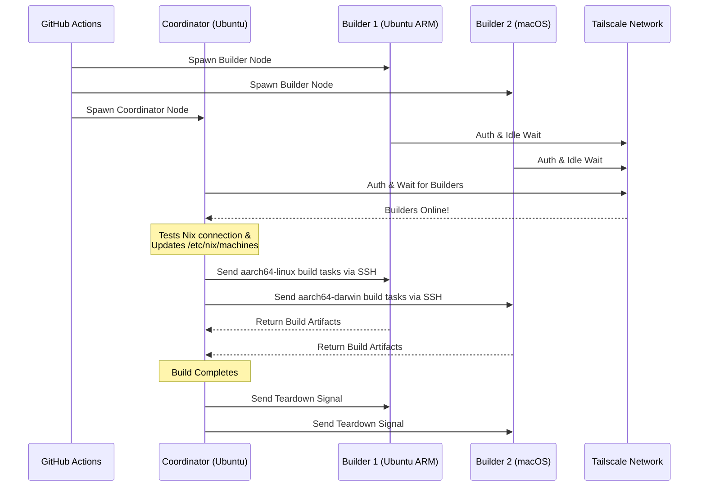

<div align="right">
  <details>
    <summary >🌐 भाषा</summary>
    <div>
      <div align="center">
        <a href="https://openaitx.github.io/view.html?user=Misaka13514&project=setup-distributed-nix-builds&lang=en">English</a>
        | <a href="https://openaitx.github.io/view.html?user=Misaka13514&project=setup-distributed-nix-builds&lang=zh-CN">简体中文</a>
        | <a href="https://openaitx.github.io/view.html?user=Misaka13514&project=setup-distributed-nix-builds&lang=zh-TW">繁體中文</a>
        | <a href="https://openaitx.github.io/view.html?user=Misaka13514&project=setup-distributed-nix-builds&lang=ja">日本語</a>
        | <a href="https://openaitx.github.io/view.html?user=Misaka13514&project=setup-distributed-nix-builds&lang=ko">한국어</a>
        | <a href="https://openaitx.github.io/view.html?user=Misaka13514&project=setup-distributed-nix-builds&lang=hi">हिन्दी</a>
        | <a href="https://openaitx.github.io/view.html?user=Misaka13514&project=setup-distributed-nix-builds&lang=th">ไทย</a>
        | <a href="https://openaitx.github.io/view.html?user=Misaka13514&project=setup-distributed-nix-builds&lang=fr">Français</a>
        | <a href="https://openaitx.github.io/view.html?user=Misaka13514&project=setup-distributed-nix-builds&lang=de">Deutsch</a>
        | <a href="https://openaitx.github.io/view.html?user=Misaka13514&project=setup-distributed-nix-builds&lang=es">Español</a>
        | <a href="https://openaitx.github.io/view.html?user=Misaka13514&project=setup-distributed-nix-builds&lang=it">Italiano</a>
        | <a href="https://openaitx.github.io/view.html?user=Misaka13514&project=setup-distributed-nix-builds&lang=ru">Русский</a>
        | <a href="https://openaitx.github.io/view.html?user=Misaka13514&project=setup-distributed-nix-builds&lang=pt">Português</a>
        | <a href="https://openaitx.github.io/view.html?user=Misaka13514&project=setup-distributed-nix-builds&lang=nl">Nederlands</a>
        | <a href="https://openaitx.github.io/view.html?user=Misaka13514&project=setup-distributed-nix-builds&lang=pl">Polski</a>
        | <a href="https://openaitx.github.io/view.html?user=Misaka13514&project=setup-distributed-nix-builds&lang=ar">العربية</a>
        | <a href="https://openaitx.github.io/view.html?user=Misaka13514&project=setup-distributed-nix-builds&lang=fa">فارسی</a>
        | <a href="https://openaitx.github.io/view.html?user=Misaka13514&project=setup-distributed-nix-builds&lang=tr">Türkçe</a>
        | <a href="https://openaitx.github.io/view.html?user=Misaka13514&project=setup-distributed-nix-builds&lang=vi">Tiếng Việt</a>
        | <a href="https://openaitx.github.io/view.html?user=Misaka13514&project=setup-distributed-nix-builds&lang=id">Bahasa Indonesia</a>
        | <a href="https://openaitx.github.io/view.html?user=Misaka13514&project=setup-distributed-nix-builds&lang=as">অসমীয়া</
      </div>
    </div>
  </details>
</div>

# ❄️ वितरित निक्स बिल्ड्स सेटअप करें

एक GitHub Action जो कि एक अल्पकालिक, क्रॉस-प्लेटफार्म [वितरित निक्स बिल्ड](https://wiki.nixos.org/wiki/Distributed_build) क्लस्टर को तुरंत स्थापित करता है, जिसमें स्टैंडर्ड [GitHub होस्टेड रनर्स](https://docs.github.com/en/actions/reference/runners/github-hosted-runners) को Tailscale के माध्यम से सुरक्षित रूप से जोड़ा जाता है।

यह एक्शन आपको द्वितीयक GitHub रनर्स (जिन्हें **बिल्डर्स** कहा जाता है) की एक मैट्रिक्स को तुरंत शुरू करने और उन्हें एक प्राथमिक रनर (जिसे **कोऑर्डिनेटर** कहा जाता है) से Tailscale SSH के ज़रिए सहजता से जोड़ने की अनुमति देता है। कोऑर्डिनेटर स्वतः निक्स को इन नोड्स को रिमोट बिल्डर्स के रूप में उपयोग करने के लिए कॉन्फ़िगर करता है, जिससे बिना बाहरी इन्फ्रास्ट्रक्चर प्रबंधन के अधिकतम समवर्ती बिल्ड प्रदर्शन मिलता है! यह मल्टी-आर्किटेक्चर पैकेज बिल्ड करने या कई x86 रनर्स पर भारी NixOS सिस्टम क्लोज़र को क्षैतिज रूप से स्केल करने के लिए आदर्श है।

## विशेषताएँ


- 🚀 **शून्य-कॉन्फ़िग रिमोट बिल्डर्स:** स्वचालित रूप से `/etc/nix/machines` को कॉन्फ़िग करता है और Tailscale SSH के माध्यम से नोड्स को कनेक्ट करता है (कोई मैन्युअल SSH कुंजी आवश्यक नहीं!).
- 🌍 **क्रॉस-प्लेटफ़ॉर्म और मल्टी-आर्क:** एक ही बिल्ड में Ubuntu (x86, ARM) और macOS (Intel, Apple Silicon) रनर्स को मिलाकर उपयोग करें.
- ⚖️ **NixOS के लिए क्षैतिज स्केलिंग:** क्या आपको एक विशाल NixOS कॉन्फ़िगरेशन का मूल्यांकन और निर्माण करना है? एक जैसी नोड्स का पूरा समूह (जैसे, पाँच `ubuntu-24.04` रनर्स) शुरू करें और Nix को क्लस्टर में उपलब्ध सभी CPU कोर में समानांतर डेरिवेशन बिल्ड्स अपने आप वितरित करने दें.
- 🧹 **अधिकतम डिस्क स्थान:** Linux रनर्स पर प्री-इंस्टॉल्ड सॉफ़्टवेयर को स्वचालित रूप से साफ़ करता है ([nothing-but-nix](https://github.com/wimpysworld/nothing-but-nix) के माध्यम से) ताकि आपके Nix स्टोर को अधिकतम स्थान मिल सके.
- ⚡ **इनबिल्ट कैशिंग:** [magic-nix-cache](https://github.com/DeterminateSystems/magic-nix-cache-action) को एकीकृत करता है जिससे फ्लेक मूल्यांकन और स्थानीय बिल्ड तेज़ होते हैं.
- 🛑 **सुगम समापन:** बिल्डर्स कार्यों के लिए निष्क्रिय प्रतीक्षा करते हैं और कोऑर्डिनेटर के समाप्त होते ही खुद को सुरक्षित रूप से बंद कर लेते हैं.

## यह कैसे काम करता है

वर्कफ़्लो रनर्स को दो भूमिकाओं में विभाजित करता है: `builder` और `coordinator`.



## आवश्यकताएँ

इस क्रिया का उपयोग करने से पहले, आपको रनर्स के लिए सुरक्षित रूप से संचार करने हेतु एक Tailscale नेटवर्क कॉन्फ़िगर करना होगा।

1. **Tailscale ACLs कॉन्फ़िगर करें:**
   सुनिश्चित करें कि आपके Tailscale में टैग समूह बनाए गए हैं और ACLs कोऑर्डिनेटर को Tailscale SSH के माध्यम से बिल्डर्स में निर्बाध रूप से SSH करने की अनुमति देते हैं।
   निम्नलिखित को अपने [Tailscale Access Controls](https://login.tailscale.com/admin/acls/file) में जोड़ें:

<details>
<summary>आवश्यक Tailscale ACL कॉन्फ़िगरेशन देखने के लिए क्लिक करें</summary>

```json
{
  "grants": [
    {
      "src": ["tag:nix-ci-builder", "tag:nix-ci-coordinator"],
      "dst": ["tag:nix-ci-builder", "tag:nix-ci-coordinator"],
      "ip": ["*"]
    }
  ],
  "ssh": [
    {
      "src": ["tag:nix-ci-coordinator"],
      "dst": ["tag:nix-ci-builder"],
      "users": ["autogroup:nonroot", "root"],
      "action": "accept"
    }
  ],
  "tagOwners": {
    "tag:nix-ci-coordinator": ["autogroup:admin", "tag:nix-ci-coordinator"],
    "tag:nix-ci-builder": ["autogroup:admin", "tag:nix-ci-builder"]
  }
}
```
</details>

2. **Tailscale OAuth क्लाइंट बनाएं:**
   अपने [Tailscale Admin पैनल](https://login.tailscale.com/admin/settings/trust-credentials) में `auth_keys` लिखने के लिए स्कोप और `nix-ci-builder` `nix-ci-coordinator` टैग्स के साथ एक OAuth क्लाइंट सीक्रेट जेनरेट करें।
   इस सीक्रेट को अपनी GitHub Repository Secrets में `TS_OAUTH_SECRET` के रूप में जोड़ें।

## इनपुट

| इनपुट                | विवरण                                                                                          | आवश्यक   | डिफ़ॉल्ट     |
| -------------------- | ---------------------------------------------------------------------------------------------- | -------- | ------------ |
| `tailscale_authkey`  | Tailscale OAuth क्लाइंट सीक्रेट या Auth Key.                                                    | **हाँ**  | लागू नहीं    |
| `tailscale_hostname` | Tailscale के साथ रजिस्टर करने के लिए होस्टनेम.                                                  | **हाँ**  | लागू नहीं    |
| `tailscale_tags`     | Tailscale पर विज्ञापित करने के लिए टैग्स (जैसे `tag:nix-ci-builder`).                           | **हाँ**  | लागू नहीं    |
| `role`               | वर्तमान जॉब की भूमिका: `"builder"` या `"coordinator"`.                                          | हाँ      | `"builder"`  |
| `builders`           | प्रतीक्षा करने के लिए पूर्ण बिल्डर होस्टनेम्स की स्पेस सेपरेटेड लिस्ट। (_अगर रोल coordinator है तो आवश्यक_) | नहीं      | `""`         |
| `builder_timeout`    | अधिकतम समय (सेकंड में) जिसे बिल्डर को स्वयं-टर्मिनेट करने से पहले प्रतीक्षा करनी चाहिए।           | नहीं      | `"300"`      |
| `extra_nix_config`   | `/etc/nix/nix.conf` में जोड़ने के लिए अतिरिक्त Nix कॉन्फ़िगरेशन।                                | नहीं      | `""`         |

## उपयोग

### पूर्ण वितरित बिल्ड उदाहरण

नीचे एक संपूर्ण वर्कफ़्लो (`nix-build.yml`) है जो डायनामिक रूप से कई रनर आर्किटेक्चर्स (Ubuntu x86, Ubuntu ARM, macOS x86, macOS Apple Silicon) को स्पिन करता है, उन्हें जोड़ता है और एक वितरित Nix बिल्ड चलाता है।

यदि आप एक भारी NixOS कॉन्फ़िगरेशन बना रहे हैं और बस इसे क्षैतिज स्केलिंग का उपयोग करके तेज़ करना चाहते हैं, तो आप `BUILDER_COUNTS` को बदल सकते हैं ताकि कई समान x86 रनर स्पॉन हो सकें। उदाहरण के लिए:
`BUILDER_COUNTS: '{"ubuntu-24.04": 4}'` 
यह आपको तुरंत 16 CPU कोर (4 रनर × 4 कोर) के साथ एक बिल्ड फार्म देगा, ताकि डेरिवेशन समानांतर में प्रोसेस किए जा सकें।

चूंकि GitHub Hosted Runners अस्थायी होते हैं, वर्कफ़्लो समाप्त होने पर Nix स्टोर में सभी बिल्ड आर्टीफैक्ट्स खो जाएंगे। भविष्य के CI रन या अपनी स्थानीय मशीनों पर अपने वितरित बिल्ड्स का लाभ उठाने के लिए, परिणामों को किसी बाइनरी कैश जैसे [Cachix](https://www.cachix.org) या [Attic](https://github.com/zhaofengli/attic) में पुश करना अत्यधिक अनुशंसित है।

```yaml
name: Distributed Nix Build

on:
  workflow_dispatch:

env:
  # Define exactly how many runners of each OS type you want
  BUILDER_COUNTS: '{"ubuntu-24.04": 1, "ubuntu-24.04-arm": 1, "macos-26-intel": 1, "macos-26": 1}'

jobs:
  config:
    runs-on: ubuntu-slim
    outputs:
      builder_matrix: ${{ steps.set.outputs.builder_matrix }}
      builders_list: ${{ steps.set.outputs.builders_list }}
      run_suffix: ${{ steps.set.outputs.run_suffix }}
    steps:
      - id: set
        run: |
          SUFFIX=$(openssl rand -hex 3)
          echo "run_suffix=$SUFFIX" >> "$GITHUB_OUTPUT"

          # Dynamically generate the Matrix JSON based on BUILDER_COUNTS
          MATRIX_JSON=$(echo '${{ env.BUILDER_COUNTS }}' | jq -c '[
              to_entries[] | .key as $os | .value as $count |
              range(1; $count + 1) | { os: $os, id: "\($os)-\(.)" }
            ]
          ')
          echo "builder_matrix=$MATRIX_JSON" >> "$GITHUB_OUTPUT"

          # Create a space-separated list of hostnames for the coordinator
          BUILDERS_LIST=$(echo "$MATRIX_JSON" | jq -r --arg suffix "$SUFFIX" 'map("nix-builder-\($suffix)-\(.id)") | join(" ")')
          echo "builders_list=$BUILDERS_LIST" >> "$GITHUB_OUTPUT"

  builder:
    needs: config
    name: Builder ${{ matrix.builder.id }} (${{ needs.config.outputs.run_suffix }})
    runs-on: ${{ matrix.builder.os }}
    strategy:
      fail-fast: false
      matrix:
        builder: ${{ fromJSON(needs.config.outputs.builder_matrix) }}
    steps:
      - name: Setup Distributed Nix Builder
        uses: Misaka13514/setup-distributed-nix-builds@main
        with:
          tailscale_authkey: ${{ secrets.TS_OAUTH_SECRET }}
          tailscale_hostname: nix-builder-${{ needs.config.outputs.run_suffix }}-${{ matrix.builder.id }}
          tailscale_tags: tag:nix-ci-builder
          role: builder

      # Optionally configure your Cachix/Attic or other caching here
      # - uses: cachix/cachix-action@v17

  coordinator:
    needs: config
    name: Coordinator (${{ needs.config.outputs.run_suffix }})
    runs-on: ubuntu-24.04
    steps:
      - name: Setup Coordinator & Connect Builders
        uses: Misaka13514/setup-distributed-nix-builds@main
        with:
          tailscale_authkey: ${{ secrets.TS_OAUTH_SECRET }}
          tailscale_hostname: nix-coordinator-${{ needs.config.outputs.run_suffix }}
          tailscale_tags: tag:nix-ci-coordinator
          role: coordinator
          builders: ${{ needs.config.outputs.builders_list }}

      # Optionally configure your Cachix/Attic or other caching here
      # - uses: cachix/cachix-action@v17

      - name: Execute Distributed Build
        run: |
          # Your build command here. Because builders are registered in /etc/nix/machines,
          # Nix will automatically offload tasks to the correct architecture node.
          nix build -L --max-jobs 0 .#my-package

      # Signal builders to terminate if they are not needed anymore
      - name: Teardown Builders
        run: stop-nix-builders

      # Push build results to Cachix/Attic or other cache here if desired
      # - name: Push to Cachix
      #   run: cachix push mycache --all
```

## लाइसेंस

यह परियोजना [MIT लाइसेंस](LICENSE) के तहत लाइसेंस प्राप्त है।



---


Tranlated By [Open Ai Tx](https://github.com/OpenAiTx/OpenAiTx) | Last indexed: 2026-03-27


---