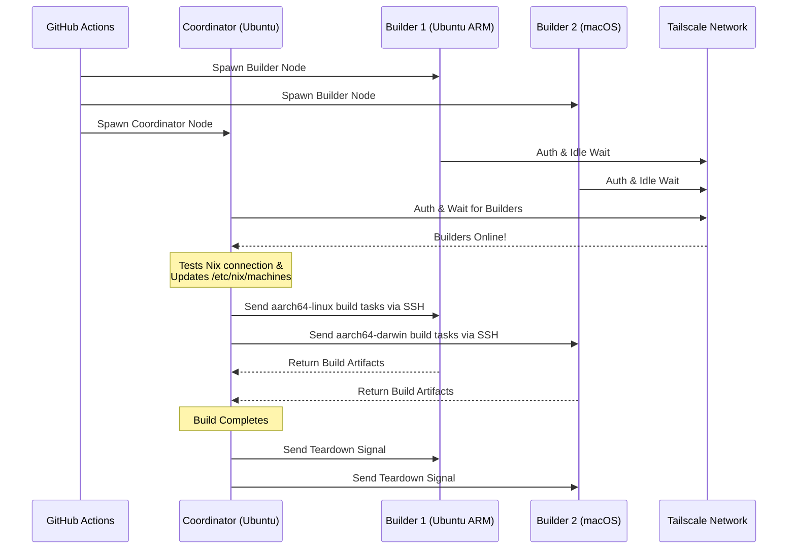

<div align="right">
  <details>
    <summary >🌐 Bahasa</summary>
    <div>
      <div align="center">
        <a href="https://openaitx.github.io/view.html?user=Misaka13514&project=setup-distributed-nix-builds&lang=en">English</a>
        | <a href="https://openaitx.github.io/view.html?user=Misaka13514&project=setup-distributed-nix-builds&lang=zh-CN">简体中文</a>
        | <a href="https://openaitx.github.io/view.html?user=Misaka13514&project=setup-distributed-nix-builds&lang=zh-TW">繁體中文</a>
        | <a href="https://openaitx.github.io/view.html?user=Misaka13514&project=setup-distributed-nix-builds&lang=ja">日本語</a>
        | <a href="https://openaitx.github.io/view.html?user=Misaka13514&project=setup-distributed-nix-builds&lang=ko">한국어</a>
        | <a href="https://openaitx.github.io/view.html?user=Misaka13514&project=setup-distributed-nix-builds&lang=hi">हिन्दी</a>
        | <a href="https://openaitx.github.io/view.html?user=Misaka13514&project=setup-distributed-nix-builds&lang=th">ไทย</a>
        | <a href="https://openaitx.github.io/view.html?user=Misaka13514&project=setup-distributed-nix-builds&lang=fr">Français</a>
        | <a href="https://openaitx.github.io/view.html?user=Misaka13514&project=setup-distributed-nix-builds&lang=de">Deutsch</a>
        | <a href="https://openaitx.github.io/view.html?user=Misaka13514&project=setup-distributed-nix-builds&lang=es">Español</a>
        | <a href="https://openaitx.github.io/view.html?user=Misaka13514&project=setup-distributed-nix-builds&lang=it">Italiano</a>
        | <a href="https://openaitx.github.io/view.html?user=Misaka13514&project=setup-distributed-nix-builds&lang=ru">Русский</a>
        | <a href="https://openaitx.github.io/view.html?user=Misaka13514&project=setup-distributed-nix-builds&lang=pt">Português</a>
        | <a href="https://openaitx.github.io/view.html?user=Misaka13514&project=setup-distributed-nix-builds&lang=nl">Nederlands</a>
        | <a href="https://openaitx.github.io/view.html?user=Misaka13514&project=setup-distributed-nix-builds&lang=pl">Polski</a>
        | <a href="https://openaitx.github.io/view.html?user=Misaka13514&project=setup-distributed-nix-builds&lang=ar">العربية</a>
        | <a href="https://openaitx.github.io/view.html?user=Misaka13514&project=setup-distributed-nix-builds&lang=fa">فارسی</a>
        | <a href="https://openaitx.github.io/view.html?user=Misaka13514&project=setup-distributed-nix-builds&lang=tr">Türkçe</a>
        | <a href="https://openaitx.github.io/view.html?user=Misaka13514&project=setup-distributed-nix-builds&lang=vi">Tiếng Việt</a>
        | <a href="https://openaitx.github.io/view.html?user=Misaka13514&project=setup-distributed-nix-builds&lang=id">Bahasa Indonesia</a>
        | <a href="https://openaitx.github.io/view.html?user=Misaka13514&project=setup-distributed-nix-builds&lang=as">অসমীয়া</
      </div>
    </div>
  </details>
</div>

# ❄️ Pengaturan Distributed Nix Builds

Sebuah GitHub Action untuk langsung menyediakan cluster [Distributed Nix Build](https://wiki.nixos.org/wiki/Distributed_build) yang sementara dan lintas platform menggunakan [GitHub Hosted Runners](https://docs.github.com/en/actions/reference/runners/github-hosted-runners) standar yang terhubung secara aman melalui Tailscale.

Aksi ini memungkinkan Anda untuk menjalankan matriks runner GitHub sekunder (disebut **Builder**) dan menghubungkannya ke runner utama (disebut **Coordinator**) dengan mulus melalui Tailscale SSH. Koordinator akan secara otomatis mengonfigurasi Nix untuk menggunakan node-node ini sebagai remote builder, memaksimalkan kinerja build secara bersamaan tanpa harus mengelola infrastruktur eksternal! Sangat cocok untuk membangun paket multi-arsitektur atau melakukan skala horizontal pada proses build NixOS yang berat di banyak runner x86.

## Fitur-fitur

- 🚀 **Zero-Config Remote Builders:** Secara otomatis mengonfigurasi `/etc/nix/machines` dan menghubungkan node melalui Tailscale SSH (tidak perlu kunci SSH manual!).
- 🌍 **Lintas Platform & Multi-Arsitektur:** Kombinasikan dan padukan runner Ubuntu (x86, ARM) dan macOS (Intel, Apple Silicon) dalam satu proses build.
- ⚖️ **Skalabilitas Horizontal untuk NixOS:** Perlu mengevaluasi dan membangun konfigurasi NixOS besar? Jalankan satu kelompok node identik (misal, lima runner `ubuntu-24.04`) dan biarkan Nix secara otomatis mendistribusikan build derivasi paralel ke seluruh inti CPU yang tersedia di klaster.
- 🧹 **Ruang Disk Maksimal:** Secara otomatis membersihkan perangkat lunak pra-instalasi pada runner Linux (melalui [nothing-but-nix](https://github.com/wimpysworld/nothing-but-nix)) agar ruang Nix store Anda maksimal.
- ⚡ **Caching Bawaan:** Mengintegrasikan [magic-nix-cache](https://github.com/DeterminateSystems/magic-nix-cache-action) untuk mempercepat evaluasi flake dan build lokal.
- 🛑 **Penghentian yang Halus:** Builder menunggu tugas dalam keadaan idle dan menghentikan dirinya sendiri secara halus ketika Koordinator selesai.

## Cara Kerjanya

Alur kerja memisahkan runner menjadi dua peran: `builder` dan `coordinator`.



## Prasyarat

Sebelum menggunakan aksi ini, Anda perlu mengkonfigurasi jaringan Tailscale agar runner dapat berkomunikasi dengan aman.

1. **Konfigurasi ACL Tailscale:**
   Pastikan Tailscale Anda memiliki grup tag yang dibuat dan ACL memungkinkan koordinator untuk SSH ke builder dengan lancar menggunakan Tailscale SSH.
   Tambahkan hal berikut ke [Kontrol Akses Tailscale](https://login.tailscale.com/admin/acls/file) Anda:

<details>
<summary>Klik untuk melihat konfigurasi ACL Tailscale yang diperlukan</summary>

```json
{
  "grants": [
    {
      "src": ["tag:nix-ci-builder", "tag:nix-ci-coordinator"],
      "dst": ["tag:nix-ci-builder", "tag:nix-ci-coordinator"],
      "ip": ["*"]
    }
  ],
  "ssh": [
    {
      "src": ["tag:nix-ci-coordinator"],
      "dst": ["tag:nix-ci-builder"],
      "users": ["autogroup:nonroot", "root"],
      "action": "accept"
    }
  ],
  "tagOwners": {
    "tag:nix-ci-coordinator": ["autogroup:admin", "tag:nix-ci-coordinator"],
    "tag:nix-ci-builder": ["autogroup:admin", "tag:nix-ci-builder"]
  }
}
```
</details>

2. **Buat Tailscale OAuth Client:**
   Buat OAuth Client Secret di [panel Admin Tailscale](https://login.tailscale.com/admin/settings/trust-credentials), dengan scope penulisan `auth_keys` dan tag `nix-ci-builder` `nix-ci-coordinator`.
   Tambahkan secret ini ke GitHub Repository Secrets Anda sebagai `TS_OAUTH_SECRET`.

## Masukan

| Masukan              | Deskripsi                                                                                      | Wajib    | Default     |
| -------------------- | ---------------------------------------------------------------------------------------------- | -------- | ----------- |
| `tailscale_authkey`  | Secret OAuth client Tailscale atau Auth Key.                                                   | **Ya**   | N/A         |
| `tailscale_hostname` | Hostname untuk didaftarkan ke Tailscale.                                                       | **Ya**   | N/A         |
| `tailscale_tags`     | Tag yang akan diiklankan ke Tailscale (misal `tag:nix-ci-builder`).                            | **Ya**   | N/A         |
| `role`               | Peran dari job saat ini: `"builder"` atau `"coordinator"`.                                     | Ya       | `"builder"` |
| `builders`           | Daftar hostname builder penuh yang dipisahkan spasi untuk ditunggu. (_Wajib jika role coordinator_) | Tidak    | `""`        |
| `builder_timeout`    | Waktu maksimum (dalam detik) builder menunggu sebelum menghentikan dirinya sendiri.            | Tidak    | `"300"`     |
| `extra_nix_config`   | Konfigurasi Nix tambahan untuk ditambahkan ke `/etc/nix/nix.conf`.                             | Tidak    | `""`        |

## Penggunaan

### Contoh Build Terdistribusi Lengkap

Di bawah ini adalah workflow lengkap (`nix-build.yml`) yang secara dinamis menjalankan beberapa arsitektur runner (Ubuntu x86, Ubuntu ARM, macOS x86, macOS Apple Silicon), menghubungkan mereka, dan menjalankan build Nix terdistribusi.

Jika Anda membangun konfigurasi NixOS yang berat dan ingin mempercepatnya dengan penskalaan horizontal, Anda dapat mengubah `BUILDER_COUNTS` untuk membuat beberapa runner x86 yang identik. Contoh:
`BUILDER_COUNTS: '{"ubuntu-24.04": 4}'`
Ini akan langsung memberi Anda build farm dengan 16 core CPU (4 runner × 4 core) untuk memproses derivasi secara paralel.

Karena GitHub Hosted Runners bersifat sementara, semua artefak build di Nix store akan hilang saat workflow selesai. Untuk memanfaatkan hasil build terdistribusi Anda pada run CI berikutnya atau di mesin lokal, sangat disarankan untuk mengirim hasilnya ke binary cache seperti [Cachix](https://www.cachix.org) atau [Attic](https://github.com/zhaofengli/attic).

```yaml
name: Distributed Nix Build

on:
  workflow_dispatch:

env:
  # Define exactly how many runners of each OS type you want
  BUILDER_COUNTS: '{"ubuntu-24.04": 1, "ubuntu-24.04-arm": 1, "macos-26-intel": 1, "macos-26": 1}'

jobs:
  config:
    runs-on: ubuntu-slim
    outputs:
      builder_matrix: ${{ steps.set.outputs.builder_matrix }}
      builders_list: ${{ steps.set.outputs.builders_list }}
      run_suffix: ${{ steps.set.outputs.run_suffix }}
    steps:
      - id: set
        run: |
          SUFFIX=$(openssl rand -hex 3)
          echo "run_suffix=$SUFFIX" >> "$GITHUB_OUTPUT"

          # Dynamically generate the Matrix JSON based on BUILDER_COUNTS
          MATRIX_JSON=$(echo '${{ env.BUILDER_COUNTS }}' | jq -c '[
              to_entries[] | .key as $os | .value as $count |
              range(1; $count + 1) | { os: $os, id: "\($os)-\(.)" }
            ]
          ')
          echo "builder_matrix=$MATRIX_JSON" >> "$GITHUB_OUTPUT"

          # Create a space-separated list of hostnames for the coordinator
          BUILDERS_LIST=$(echo "$MATRIX_JSON" | jq -r --arg suffix "$SUFFIX" 'map("nix-builder-\($suffix)-\(.id)") | join(" ")')
          echo "builders_list=$BUILDERS_LIST" >> "$GITHUB_OUTPUT"

  builder:
    needs: config
    name: Builder ${{ matrix.builder.id }} (${{ needs.config.outputs.run_suffix }})
    runs-on: ${{ matrix.builder.os }}
    strategy:
      fail-fast: false
      matrix:
        builder: ${{ fromJSON(needs.config.outputs.builder_matrix) }}
    steps:
      - name: Setup Distributed Nix Builder
        uses: Misaka13514/setup-distributed-nix-builds@main
        with:
          tailscale_authkey: ${{ secrets.TS_OAUTH_SECRET }}
          tailscale_hostname: nix-builder-${{ needs.config.outputs.run_suffix }}-${{ matrix.builder.id }}
          tailscale_tags: tag:nix-ci-builder
          role: builder

      # Optionally configure your Cachix/Attic or other caching here
      # - uses: cachix/cachix-action@v17

  coordinator:
    needs: config
    name: Coordinator (${{ needs.config.outputs.run_suffix }})
    runs-on: ubuntu-24.04
    steps:
      - name: Setup Coordinator & Connect Builders
        uses: Misaka13514/setup-distributed-nix-builds@main
        with:
          tailscale_authkey: ${{ secrets.TS_OAUTH_SECRET }}
          tailscale_hostname: nix-coordinator-${{ needs.config.outputs.run_suffix }}
          tailscale_tags: tag:nix-ci-coordinator
          role: coordinator
          builders: ${{ needs.config.outputs.builders_list }}

      # Optionally configure your Cachix/Attic or other caching here
      # - uses: cachix/cachix-action@v17

      - name: Execute Distributed Build
        run: |
          # Your build command here. Because builders are registered in /etc/nix/machines,
          # Nix will automatically offload tasks to the correct architecture node.
          nix build -L --max-jobs 0 .#my-package

      # Signal builders to terminate if they are not needed anymore
      - name: Teardown Builders
        run: stop-nix-builders

      # Push build results to Cachix/Attic or other cache here if desired
      # - name: Push to Cachix
      #   run: cachix push mycache --all
```

## Lisensi

Proyek ini dilisensikan di bawah [Lisensi MIT](LICENSE).



---


Tranlated By [Open Ai Tx](https://github.com/OpenAiTx/OpenAiTx) | Last indexed: 2026-03-27


---