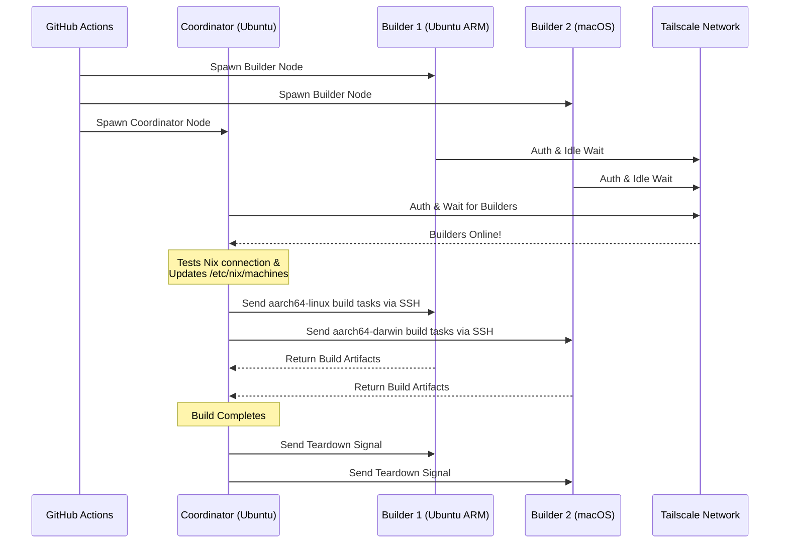

<div align="right">
  <details>
    <summary >🌐 Lingua</summary>
    <div>
      <div align="center">
        <a href="https://openaitx.github.io/view.html?user=Misaka13514&project=setup-distributed-nix-builds&lang=en">English</a>
        | <a href="https://openaitx.github.io/view.html?user=Misaka13514&project=setup-distributed-nix-builds&lang=zh-CN">简体中文</a>
        | <a href="https://openaitx.github.io/view.html?user=Misaka13514&project=setup-distributed-nix-builds&lang=zh-TW">繁體中文</a>
        | <a href="https://openaitx.github.io/view.html?user=Misaka13514&project=setup-distributed-nix-builds&lang=ja">日本語</a>
        | <a href="https://openaitx.github.io/view.html?user=Misaka13514&project=setup-distributed-nix-builds&lang=ko">한국어</a>
        | <a href="https://openaitx.github.io/view.html?user=Misaka13514&project=setup-distributed-nix-builds&lang=hi">हिन्दी</a>
        | <a href="https://openaitx.github.io/view.html?user=Misaka13514&project=setup-distributed-nix-builds&lang=th">ไทย</a>
        | <a href="https://openaitx.github.io/view.html?user=Misaka13514&project=setup-distributed-nix-builds&lang=fr">Français</a>
        | <a href="https://openaitx.github.io/view.html?user=Misaka13514&project=setup-distributed-nix-builds&lang=de">Deutsch</a>
        | <a href="https://openaitx.github.io/view.html?user=Misaka13514&project=setup-distributed-nix-builds&lang=es">Español</a>
        | <a href="https://openaitx.github.io/view.html?user=Misaka13514&project=setup-distributed-nix-builds&lang=it">Italiano</a>
        | <a href="https://openaitx.github.io/view.html?user=Misaka13514&project=setup-distributed-nix-builds&lang=ru">Русский</a>
        | <a href="https://openaitx.github.io/view.html?user=Misaka13514&project=setup-distributed-nix-builds&lang=pt">Português</a>
        | <a href="https://openaitx.github.io/view.html?user=Misaka13514&project=setup-distributed-nix-builds&lang=nl">Nederlands</a>
        | <a href="https://openaitx.github.io/view.html?user=Misaka13514&project=setup-distributed-nix-builds&lang=pl">Polski</a>
        | <a href="https://openaitx.github.io/view.html?user=Misaka13514&project=setup-distributed-nix-builds&lang=ar">العربية</a>
        | <a href="https://openaitx.github.io/view.html?user=Misaka13514&project=setup-distributed-nix-builds&lang=fa">فارسی</a>
        | <a href="https://openaitx.github.io/view.html?user=Misaka13514&project=setup-distributed-nix-builds&lang=tr">Türkçe</a>
        | <a href="https://openaitx.github.io/view.html?user=Misaka13514&project=setup-distributed-nix-builds&lang=vi">Tiếng Việt</a>
        | <a href="https://openaitx.github.io/view.html?user=Misaka13514&project=setup-distributed-nix-builds&lang=id">Bahasa Indonesia</a>
        | <a href="https://openaitx.github.io/view.html?user=Misaka13514&project=setup-distributed-nix-builds&lang=as">অসমীয়া</
      </div>
    </div>
  </details>
</div>

# ❄️ Configurare Build Nix Distribuite

Una GitHub Action per fornire istantaneamente un cluster effimero e multipiattaforma di [Build Nix Distribuite](https://wiki.nixos.org/wiki/Distributed_build) utilizzando i comuni [GitHub Hosted Runners](https://docs.github.com/en/actions/reference/runners/github-hosted-runners) collegati in modo sicuro tramite Tailscale.

Questa action consente di avviare una matrice di runner GitHub secondari (i **Builder**) e collegarli a un runner principale (il **Coordinatore**) senza problemi tramite Tailscale SSH. Il Coordinatore configura automaticamente Nix per utilizzare questi nodi come builder remoti, massimizzando le prestazioni di build concorrenti senza gestire infrastrutture esterne! È perfetto per compilare pacchetti multi-architettura o per scalare orizzontalmente pesanti closure di sistema NixOS su una flotta di runner x86.

## Caratteristiche

- 🚀 **Builder Remoti Zero-Config:** Configura automaticamente `/etc/nix/machines` e collega i nodi tramite Tailscale SSH (nessuna chiave SSH manuale richiesta!).
- 🌍 **Cross-Platform & Multi-Arch:** Mescola e abbina runner Ubuntu (x86, ARM) e macOS (Intel, Apple Silicon) nello stesso build.
- ⚖️ **Scalabilità Orizzontale per NixOS:** Hai bisogno di valutare e costruire una configurazione NixOS massiccia? Avvia un'intera farm di nodi identici (es. cinque runner `ubuntu-24.04`) e lascia che Nix distribuisca automaticamente le build delle derivazioni in parallelo su tutti i core CPU disponibili nel cluster.
- 🧹 **Spazio Disco Massimo:** Rimuove automaticamente il software preinstallato sui runner Linux (tramite [nothing-but-nix](https://github.com/wimpysworld/nothing-but-nix)) per dare massimo spazio al tuo Nix store.
- ⚡ **Caching Integrato:** Integra [magic-nix-cache](https://github.com/DeterminateSystems/magic-nix-cache-action) per velocizzare valutazioni flake e build locali.
- 🛑 **Teardown Graduale:** I builder attendono inattivi i task e si auto-terminano in modo graduale quando il Coordinator ha finito.

## Come Funziona

Il workflow separa i runner in due ruoli: `builder` e `coordinator`.



## Prerequisiti

Prima di utilizzare questa azione, è necessario configurare una rete Tailscale affinché i runner possano comunicare in modo sicuro.

1. **Configura le ACL di Tailscale:**
   Assicurati che in Tailscale siano stati creati gruppi di tag e che le ACL consentano al coordinatore di accedere tramite SSH ai builder senza interruzioni utilizzando Tailscale SSH.
   Aggiungi quanto segue ai tuoi [Controlli di Accesso Tailscale](https://login.tailscale.com/admin/acls/file):

<details>
<summary>Fai clic per visualizzare la configurazione ACL richiesta per Tailscale</summary>

```json
{
  "grants": [
    {
      "src": ["tag:nix-ci-builder", "tag:nix-ci-coordinator"],
      "dst": ["tag:nix-ci-builder", "tag:nix-ci-coordinator"],
      "ip": ["*"]
    }
  ],
  "ssh": [
    {
      "src": ["tag:nix-ci-coordinator"],
      "dst": ["tag:nix-ci-builder"],
      "users": ["autogroup:nonroot", "root"],
      "action": "accept"
    }
  ],
  "tagOwners": {
    "tag:nix-ci-coordinator": ["autogroup:admin", "tag:nix-ci-coordinator"],
    "tag:nix-ci-builder": ["autogroup:admin", "tag:nix-ci-builder"]
  }
}
```
</details>

2. **Crea un Client OAuth Tailscale:**
   Genera un OAuth Client Secret nel tuo [pannello di amministrazione Tailscale](https://login.tailscale.com/admin/settings/trust-credentials), con il write scope `auth_keys` e i tag `nix-ci-builder` `nix-ci-coordinator`.
   Aggiungi questo secret ai Secrets del tuo repository GitHub come `TS_OAUTH_SECRET`.

## Input

| Input                | Descrizione                                                                                     | Obbligatorio | Predefinito     |
| -------------------- | ----------------------------------------------------------------------------------------------- | ------------ | --------------- |
| `tailscale_authkey`  | Secret OAuth client di Tailscale o Auth Key.                                                    | **Sì**       | N/A             |
| `tailscale_hostname` | Nome host da registrare con Tailscale.                                                          | **Sì**       | N/A             |
| `tailscale_tags`     | Tag da pubblicizzare su Tailscale (es. `tag:nix-ci-builder`).                                   | **Sì**       | N/A             |
| `role`               | Ruolo del job corrente: `"builder"` o `"coordinator"`.                                          | Sì           | `"builder"`     |
| `builders`           | Lista separata da spazi dei nomi host completi dei builder da attendere. (_Obbligatorio se il ruolo è coordinator_) | No           | `""`            |
| `builder_timeout`    | Tempo massimo (in secondi) che il builder dovrebbe attendere prima di terminarsi autonomamente. | No           | `"300"`         |
| `extra_nix_config`   | Configurazione Nix extra da aggiungere a `/etc/nix/nix.conf`.                                   | No           | `""`            |

## Utilizzo

### Esempio Completo di Build Distribuita

Di seguito è riportato un workflow completo (`nix-build.yml`) che avvia dinamicamente più architetture runner (Ubuntu x86, Ubuntu ARM, macOS x86, macOS Apple Silicon), le collega tra loro e esegue una build Nix distribuita.

Se stai costruendo una configurazione NixOS pesante e desideri semplicemente velocizzarla utilizzando lo scaling orizzontale, puoi modificare `BUILDER_COUNTS` per avviare più runner x86 identici. Ad esempio:
`BUILDER_COUNTS: '{"ubuntu-24.04": 4}'` 
Questo ti darà istantaneamente una build farm con 16 core CPU (4 runner × 4 core) per elaborare le derivazioni in parallelo.

Poiché i GitHub Hosted Runner sono effimeri, tutti gli artefatti di build nello store Nix verranno persi al termine del workflow. Per sfruttare i vantaggi delle build distribuite nei futuri run CI o sulle tue macchine locali, è fortemente consigliato pushare i risultati su una cache binaria come [Cachix](https://www.cachix.org) o [Attic](https://github.com/zhaofengli/attic).

```yaml
name: Distributed Nix Build

on:
  workflow_dispatch:

env:
  # Define exactly how many runners of each OS type you want
  BUILDER_COUNTS: '{"ubuntu-24.04": 1, "ubuntu-24.04-arm": 1, "macos-26-intel": 1, "macos-26": 1}'

jobs:
  config:
    runs-on: ubuntu-slim
    outputs:
      builder_matrix: ${{ steps.set.outputs.builder_matrix }}
      builders_list: ${{ steps.set.outputs.builders_list }}
      run_suffix: ${{ steps.set.outputs.run_suffix }}
    steps:
      - id: set
        run: |
          SUFFIX=$(openssl rand -hex 3)
          echo "run_suffix=$SUFFIX" >> "$GITHUB_OUTPUT"

          # Dynamically generate the Matrix JSON based on BUILDER_COUNTS
          MATRIX_JSON=$(echo '${{ env.BUILDER_COUNTS }}' | jq -c '[
              to_entries[] | .key as $os | .value as $count |
              range(1; $count + 1) | { os: $os, id: "\($os)-\(.)" }
            ]
          ')
          echo "builder_matrix=$MATRIX_JSON" >> "$GITHUB_OUTPUT"

          # Create a space-separated list of hostnames for the coordinator
          BUILDERS_LIST=$(echo "$MATRIX_JSON" | jq -r --arg suffix "$SUFFIX" 'map("nix-builder-\($suffix)-\(.id)") | join(" ")')
          echo "builders_list=$BUILDERS_LIST" >> "$GITHUB_OUTPUT"

  builder:
    needs: config
    name: Builder ${{ matrix.builder.id }} (${{ needs.config.outputs.run_suffix }})
    runs-on: ${{ matrix.builder.os }}
    strategy:
      fail-fast: false
      matrix:
        builder: ${{ fromJSON(needs.config.outputs.builder_matrix) }}
    steps:
      - name: Setup Distributed Nix Builder
        uses: Misaka13514/setup-distributed-nix-builds@main
        with:
          tailscale_authkey: ${{ secrets.TS_OAUTH_SECRET }}
          tailscale_hostname: nix-builder-${{ needs.config.outputs.run_suffix }}-${{ matrix.builder.id }}
          tailscale_tags: tag:nix-ci-builder
          role: builder

      # Optionally configure your Cachix/Attic or other caching here
      # - uses: cachix/cachix-action@v17

  coordinator:
    needs: config
    name: Coordinator (${{ needs.config.outputs.run_suffix }})
    runs-on: ubuntu-24.04
    steps:
      - name: Setup Coordinator & Connect Builders
        uses: Misaka13514/setup-distributed-nix-builds@main
        with:
          tailscale_authkey: ${{ secrets.TS_OAUTH_SECRET }}
          tailscale_hostname: nix-coordinator-${{ needs.config.outputs.run_suffix }}
          tailscale_tags: tag:nix-ci-coordinator
          role: coordinator
          builders: ${{ needs.config.outputs.builders_list }}

      # Optionally configure your Cachix/Attic or other caching here
      # - uses: cachix/cachix-action@v17

      - name: Execute Distributed Build
        run: |
          # Your build command here. Because builders are registered in /etc/nix/machines,
          # Nix will automatically offload tasks to the correct architecture node.
          nix build -L --max-jobs 0 .#my-package

      # Signal builders to terminate if they are not needed anymore
      - name: Teardown Builders
        run: stop-nix-builders

      # Push build results to Cachix/Attic or other cache here if desired
      # - name: Push to Cachix
      #   run: cachix push mycache --all
```

## Licenza

Questo progetto è concesso in licenza secondo la [Licenza MIT](LICENSE).



---


Tranlated By [Open Ai Tx](https://github.com/OpenAiTx/OpenAiTx) | Last indexed: 2026-03-27


---