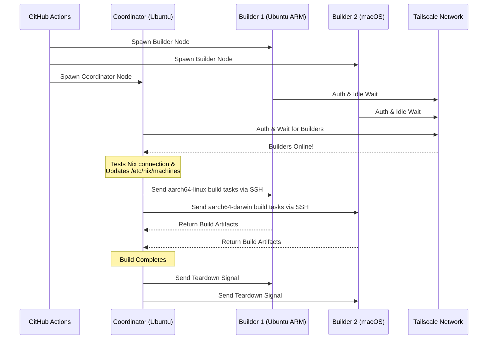

# ❄️ 分散Nixビルドのセットアップ

GitHub Actionsを使って、標準の[GitHubホストランナー](https://docs.github.com/en/actions/reference/runners/github-hosted-runners)を用い、Tailscale経由で安全に接続された一時的でクロスプラットフォームな[分散Nixビルド](https://wiki.nixos.org/wiki/Distributed_build)クラスターを即座に構築します。

このアクションは、二次的なGitHubランナー（**ビルダー**）のマトリックスを立ち上げ、プライマリランナー（**コーディネーター**）にTailscale SSHでシームレスに接続します。コーディネーターはこれらのノードをリモートビルダーとしてNixに自動設定し、外部インフラを管理することなくビルドの並列性能を最大化します！マルチアーキテクチャパッケージのビルドや、x86ランナー群にまたがる大規模なNixOSシステムクロージャの水平スケーリングに最適です。

## 特徴

- 🚀 **ゼロコンフィグのリモートビルダー：** `/etc/nix/machines`を自動設定し、Tailscale SSHでノードを接続（手動のSSHキー不要！）。
- 🌍 **クロスプラットフォーム＆マルチアーキテクチャ：** 同一ビルド内でUbuntu（x86、ARM）とmacOS（Intel、Apple Silicon）ランナーを組み合わせ可能。
- ⚖️ **NixOSの水平スケーリング：** 大規模なNixOS構成の評価・ビルドが必要ですか？同一ノード（例：5台の`ubuntu-24.04`ランナー）をファームとして立ち上げ、Nixが利用可能な全CPUコアに並列派生ビルドを自動分散します。
- 🧹 **最大ディスクスペース：** Linuxランナー上のプリインストール済みソフトウェアを自動クリーンアップ（[nothing-but-nix](https://github.com/wimpysworld/nothing-but-nix)経由）し、Nixストアに最大の余裕を確保。
- ⚡ **組み込みキャッシュ：** [magic-nix-cache](https://github.com/DeterminateSystems/magic-nix-cache-action)と統合し、フレーク評価やローカルビルドを高速化。
- 🛑 **優雅なシャットダウン：** ビルダーはタスクを待機し、コーディネーターの終了時に自動で優雅に終了。

## 動作概要

ワークフローはランナーを`builder`と`coordinator`の2つの役割に分けます。



## 前提条件

このアクションを使用する前に、ランナーが安全に通信できるようにTailscaleネットワークを構成する必要があります。

1. **Tailscale ACLを構成する:**
   Tailscaleにタググループが作成されており、ACLがコーディネーターがTailscale SSHを使ってビルダーにシームレスにSSHできるように許可していることを確認してください。
   次の内容を[Tailscaleアクセスコントロール](https://login.tailscale.com/admin/acls/file)に追加してください。

<details>
<summary>必要なTailscale ACL構成を表示</summary>

```json
{
  "grants": [
    {
      "src": ["tag:nix-ci-builder", "tag:nix-ci-coordinator"],
      "dst": ["tag:nix-ci-builder", "tag:nix-ci-coordinator"],
      "ip": ["*"]
    }
  ],
  "ssh": [
    {
      "src": ["tag:nix-ci-coordinator"],
      "dst": ["tag:nix-ci-builder"],
      "users": ["autogroup:nonroot", "root"],
      "action": "accept"
    }
  ],
  "tagOwners": {
    "tag:nix-ci-coordinator": ["autogroup:admin", "tag:nix-ci-coordinator"],
    "tag:nix-ci-builder": ["autogroup:admin", "tag:nix-ci-builder"]
  }
}
```
</details>

2. **Tailscale OAuth クライアントの作成：**
   [Tailscale 管理パネル](https://login.tailscale.com/admin/settings/trust-credentials)で OAuth クライアントシークレットを生成します。`auth_keys` の書き込みスコープと `nix-ci-builder`、`nix-ci-coordinator` タグを設定してください。
   このシークレットを GitHub リポジトリのシークレットに `TS_OAUTH_SECRET` として追加します。

## 入力

| 入力                 | 説明                                                                                         | 必須     | デフォルト   |
| -------------------- | --------------------------------------------------------------------------------------------- | -------- | ----------- |
| `tailscale_authkey`  | Tailscale OAuth クライアントシークレットまたは認証キー。                                     | **必須** | N/A         |
| `tailscale_hostname` | Tailscale に登録するホスト名。                                                               | **必須** | N/A         |
| `tailscale_tags`     | Tailscale に広告するタグ（例：`tag:nix-ci-builder`）。                                      | **必須** | N/A         |
| `role`               | 現在のジョブの役割：`"builder"` または `"coordinator"`。                                    | 必須     | `"builder"` |
| `builders`           | 待機する完全なビルダーホスト名の空白区切りリスト。（役割が coordinator の場合必須）          | いいえ   | `""`        |
| `builder_timeout`    | ビルダーが自己終了するまでの最大待機時間（秒）。                                            | いいえ   | `"300"`     |
| `extra_nix_config`   | `/etc/nix/nix.conf` に追記する追加の Nix 設定。                                            | いいえ   | `""`        |

## 使用法

### 完全分散ビルドの例

以下は複数のランナーアーキテクチャ（Ubuntu x86、Ubuntu ARM、macOS x86、macOS Apple Silicon）を動的に起動し、それらを接続して分散 Nix ビルドを実行する完全なワークフロー (`nix-build.yml`) です。

重い NixOS 構成をビルドしていて、単に水平スケーリングで速度を上げたい場合は、`BUILDER_COUNTS` を変更して複数の同一 x86 ランナーを起動することができます。例えば：
`BUILDER_COUNTS: '{"ubuntu-24.04": 4}'`  
これにより、16 CPU コア（4 ランナー × 4 コア）のビルドファームが即座に得られ、派生物を並列処理できます。

GitHub ホステッドランナーは一時的なため、ワークフロー完了時に Nix ストア内のすべてのビルド成果物は失われます。将来の CI 実行やローカルマシンで分散ビルドの利点を享受するためには、成果物を [Cachix](https://www.cachix.org) や [Attic](https://github.com/zhaofengli/attic) のようなバイナリキャッシュにプッシュすることを強く推奨します。

```yaml
name: Distributed Nix Build

on:
  workflow_dispatch:

env:
  # Define exactly how many runners of each OS type you want
  BUILDER_COUNTS: '{"ubuntu-24.04": 1, "ubuntu-24.04-arm": 1, "macos-26-intel": 1, "macos-26": 1}'

jobs:
  config:
    runs-on: ubuntu-slim
    outputs:
      builder_matrix: ${{ steps.set.outputs.builder_matrix }}
      builders_list: ${{ steps.set.outputs.builders_list }}
      run_suffix: ${{ steps.set.outputs.run_suffix }}
    steps:
      - id: set
        run: |
          SUFFIX=$(openssl rand -hex 3)
          echo "run_suffix=$SUFFIX" >> "$GITHUB_OUTPUT"

          # Dynamically generate the Matrix JSON based on BUILDER_COUNTS
          MATRIX_JSON=$(echo '${{ env.BUILDER_COUNTS }}' | jq -c '[
              to_entries[] | .key as $os | .value as $count |
              range(1; $count + 1) | { os: $os, id: "\($os)-\(.)" }
            ]
          ')
          echo "builder_matrix=$MATRIX_JSON" >> "$GITHUB_OUTPUT"

          # Create a space-separated list of hostnames for the coordinator
          BUILDERS_LIST=$(echo "$MATRIX_JSON" | jq -r --arg suffix "$SUFFIX" 'map("nix-builder-\($suffix)-\(.id)") | join(" ")')
          echo "builders_list=$BUILDERS_LIST" >> "$GITHUB_OUTPUT"

  builder:
    needs: config
    name: Builder ${{ matrix.builder.id }} (${{ needs.config.outputs.run_suffix }})
    runs-on: ${{ matrix.builder.os }}
    strategy:
      fail-fast: false
      matrix:
        builder: ${{ fromJSON(needs.config.outputs.builder_matrix) }}
    steps:
      - name: Setup Distributed Nix Builder
        uses: Misaka13514/setup-distributed-nix-builds@main
        with:
          tailscale_authkey: ${{ secrets.TS_OAUTH_SECRET }}
          tailscale_hostname: nix-builder-${{ needs.config.outputs.run_suffix }}-${{ matrix.builder.id }}
          tailscale_tags: tag:nix-ci-builder
          role: builder

      # Optionally configure your Cachix/Attic or other caching here
      # - uses: cachix/cachix-action@v17

  coordinator:
    needs: config
    name: Coordinator (${{ needs.config.outputs.run_suffix }})
    runs-on: ubuntu-24.04
    steps:
      - name: Setup Coordinator & Connect Builders
        uses: Misaka13514/setup-distributed-nix-builds@main
        with:
          tailscale_authkey: ${{ secrets.TS_OAUTH_SECRET }}
          tailscale_hostname: nix-coordinator-${{ needs.config.outputs.run_suffix }}
          tailscale_tags: tag:nix-ci-coordinator
          role: coordinator
          builders: ${{ needs.config.outputs.builders_list }}

      # Optionally configure your Cachix/Attic or other caching here
      # - uses: cachix/cachix-action@v17

      - name: Execute Distributed Build
        run: |
          # Your build command here. Because builders are registered in /etc/nix/machines,
          # Nix will automatically offload tasks to the correct architecture node.
          nix build -L --max-jobs 0 .#my-package

      # Signal builders to terminate if they are not needed anymore
      - name: Teardown Builders
        run: stop-nix-builders

      # Push build results to Cachix/Attic or other cache here if desired
      # - name: Push to Cachix
      #   run: cachix push mycache --all
```

## ライセンス

このプロジェクトは[MITライセンス](LICENSE)の下でライセンスされています。



---


Tranlated By [Open Ai Tx](https://github.com/OpenAiTx/OpenAiTx) | Last indexed: 2026-03-26


---