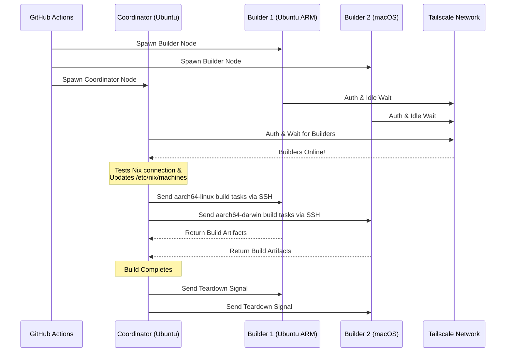

<div align="right">
  <details>
    <summary >🌐 언어</summary>
    <div>
      <div align="center">
        <a href="https://openaitx.github.io/view.html?user=Misaka13514&project=setup-distributed-nix-builds&lang=en">English</a>
        | <a href="https://openaitx.github.io/view.html?user=Misaka13514&project=setup-distributed-nix-builds&lang=zh-CN">简体中文</a>
        | <a href="https://openaitx.github.io/view.html?user=Misaka13514&project=setup-distributed-nix-builds&lang=zh-TW">繁體中文</a>
        | <a href="https://openaitx.github.io/view.html?user=Misaka13514&project=setup-distributed-nix-builds&lang=ja">日本語</a>
        | <a href="https://openaitx.github.io/view.html?user=Misaka13514&project=setup-distributed-nix-builds&lang=ko">한국어</a>
        | <a href="https://openaitx.github.io/view.html?user=Misaka13514&project=setup-distributed-nix-builds&lang=hi">हिन्दी</a>
        | <a href="https://openaitx.github.io/view.html?user=Misaka13514&project=setup-distributed-nix-builds&lang=th">ไทย</a>
        | <a href="https://openaitx.github.io/view.html?user=Misaka13514&project=setup-distributed-nix-builds&lang=fr">Français</a>
        | <a href="https://openaitx.github.io/view.html?user=Misaka13514&project=setup-distributed-nix-builds&lang=de">Deutsch</a>
        | <a href="https://openaitx.github.io/view.html?user=Misaka13514&project=setup-distributed-nix-builds&lang=es">Español</a>
        | <a href="https://openaitx.github.io/view.html?user=Misaka13514&project=setup-distributed-nix-builds&lang=it">Italiano</a>
        | <a href="https://openaitx.github.io/view.html?user=Misaka13514&project=setup-distributed-nix-builds&lang=ru">Русский</a>
        | <a href="https://openaitx.github.io/view.html?user=Misaka13514&project=setup-distributed-nix-builds&lang=pt">Português</a>
        | <a href="https://openaitx.github.io/view.html?user=Misaka13514&project=setup-distributed-nix-builds&lang=nl">Nederlands</a>
        | <a href="https://openaitx.github.io/view.html?user=Misaka13514&project=setup-distributed-nix-builds&lang=pl">Polski</a>
        | <a href="https://openaitx.github.io/view.html?user=Misaka13514&project=setup-distributed-nix-builds&lang=ar">العربية</a>
        | <a href="https://openaitx.github.io/view.html?user=Misaka13514&project=setup-distributed-nix-builds&lang=fa">فارسی</a>
        | <a href="https://openaitx.github.io/view.html?user=Misaka13514&project=setup-distributed-nix-builds&lang=tr">Türkçe</a>
        | <a href="https://openaitx.github.io/view.html?user=Misaka13514&project=setup-distributed-nix-builds&lang=vi">Tiếng Việt</a>
        | <a href="https://openaitx.github.io/view.html?user=Misaka13514&project=setup-distributed-nix-builds&lang=id">Bahasa Indonesia</a>
        | <a href="https://openaitx.github.io/view.html?user=Misaka13514&project=setup-distributed-nix-builds&lang=as">অসমীয়া</
      </div>
    </div>
  </details>
</div>

# ❄️ 분산 Nix 빌드 설정

GitHub Hosted Runner를 표준으로 사용하여 Tailscale을 통해 안전하게 연결된 에페메럴, 크로스플랫폼 [분산 Nix 빌드](https://wiki.nixos.org/wiki/Distributed_build) 클러스터를 즉시 프로비저닝하는 GitHub Action입니다.

이 액션은 보조 GitHub 러너들(**빌더**)의 매트릭스를 신속하게 생성하고, 기본 러너(**코디네이터**)와 Tailscale SSH를 통해 원활하게 연결할 수 있게 해줍니다. 코디네이터는 Nix를 자동으로 구성하여 이러한 노드들을 원격 빌더로 활용하므로, 외부 인프라를 관리하지 않고도 동시 빌드 성능을 극대화할 수 있습니다! 이는 멀티 아키텍처 패키지를 빌드하거나 여러 x86 러너에 걸쳐 대용량 NixOS 시스템 클로저를 수평 확장할 때 이상적입니다.

## 특징

- 🚀 **제로-구성 원격 빌더:** `/etc/nix/machines`를 자동으로 구성하고 Tailscale SSH를 통해 노드를 연결합니다(수동 SSH 키 필요 없음!).
- 🌍 **크로스-플랫폼 & 멀티-아키텍처:** 동일한 빌드에서 Ubuntu(x86, ARM)와 macOS(Intel, Apple Silicon) 러너를 혼합하여 사용할 수 있습니다.
- ⚖️ **NixOS 수평 확장:** 대규모 NixOS 구성을 평가하고 빌드해야 하나요? 동일한 노드(예: 다섯 개의 `ubuntu-24.04` 러너)로 팜을 구성하고 Nix가 클러스터의 모든 사용 가능한 CPU 코어에 파생 빌드를 자동 분산시킵니다.
- 🧹 **최대 디스크 공간 확보:** Linux 러너에서 사전 설치된 소프트웨어를 자동으로 정리하여([nothing-but-nix](https://github.com/wimpysworld/nothing-but-nix) 사용) Nix 저장소의 공간을 최대한 확보합니다.
- ⚡ **내장 캐싱:** [magic-nix-cache](https://github.com/DeterminateSystems/magic-nix-cache-action)와 통합되어 플레이크 평가와 로컬 빌드를 가속화합니다.
- 🛑 **우아한 종료:** 빌더는 작업을 대기하며, 코디네이터가 완료되면 자동으로 정상 종료합니다.

## 작동 방식

워크플로우는 러너를 두 가지 역할인 `builder`와 `coordinator`로 분리합니다.


## 사전 준비 사항

이 액션을 사용하기 전에 러너들이 안전하게 통신할 수 있도록 Tailscale 네트워크를 구성해야 합니다.

1. **Tailscale ACL 구성:**
   Tailscale에 태그 그룹이 생성되어 있고 ACL이 코디네이터가 Tailscale SSH를 사용하여 빌더에 원활하게 SSH할 수 있도록 허용하는지 확인하세요.
   다음 내용을 [Tailscale 접근 제어](https://login.tailscale.com/admin/acls/file)에 추가하세요:

<details>
<summary>필요한 Tailscale ACL 구성 보기</summary>


```json
{
  "grants": [
    {
      "src": ["tag:nix-ci-builder", "tag:nix-ci-coordinator"],
      "dst": ["tag:nix-ci-builder", "tag:nix-ci-coordinator"],
      "ip": ["*"]
    }
  ],
  "ssh": [
    {
      "src": ["tag:nix-ci-coordinator"],
      "dst": ["tag:nix-ci-builder"],
      "users": ["autogroup:nonroot", "root"],
      "action": "accept"
    }
  ],
  "tagOwners": {
    "tag:nix-ci-coordinator": ["autogroup:admin", "tag:nix-ci-coordinator"],
    "tag:nix-ci-builder": ["autogroup:admin", "tag:nix-ci-builder"]
  }
}
```
</details>

2. **Tailscale OAuth 클라이언트 생성:**
   [Tailscale 관리자 패널](https://login.tailscale.com/admin/settings/trust-credentials)에서 `auth_keys` 쓰기 권한과 `nix-ci-builder`, `nix-ci-coordinator` 태그를 가진 OAuth 클라이언트 비밀키를 생성하세요.  
   이 비밀키를 GitHub 저장소 시크릿에 `TS_OAUTH_SECRET`로 추가하세요.

## 입력값

| 입력값                | 설명                                                                                           | 필수     | 기본값      |
| -------------------- | ---------------------------------------------------------------------------------------------- | -------- | ----------- |
| `tailscale_authkey`  | Tailscale OAuth 클라이언트 비밀키 또는 인증 키.                                                | **예**   | N/A         |
| `tailscale_hostname` | Tailscale에 등록할 호스트명.                                                                   | **예**   | N/A         |
| `tailscale_tags`     | Tailscale에 광고할 태그들 (예: `tag:nix-ci-builder`).                                         | **예**   | N/A         |
| `role`               | 현재 작업의 역할: `"builder"` 또는 `"coordinator"`.                                           | 예       | `"builder"` |
| `builders`           | 기다릴 전체 builder 호스트명들의 공백 구분 리스트. (_role이 coordinator인 경우 필수_)           | 아니오   | `""`        |
| `builder_timeout`    | 빌더가 스스로 종료하기 전 최대 대기 시간(초).                                               | 아니오   | `"300"`     |
| `extra_nix_config`   | `/etc/nix/nix.conf`에 추가할 추가 Nix 설정.                                                  | 아니오   | `""`        |

## 사용법

### 완전한 분산 빌드 예시

아래는 여러 런너 아키텍처(Ubuntu x86, Ubuntu ARM, macOS x86, macOS Apple Silicon)를 동적으로 생성하고 서로 연결하여 분산 Nix 빌드를 수행하는 전체 워크플로우(`nix-build.yml`) 예시입니다.

무거운 NixOS 구성을 빌드하고 단순히 수평 확장으로 속도를 높이고 싶다면, `BUILDER_COUNTS`를 변경하여 여러 개의 동일한 x86 런너를 생성할 수 있습니다. 예를 들어:  
`BUILDER_COUNTS: '{"ubuntu-24.04": 4}'`  
이렇게 하면 16 CPU 코어(4개의 런너 × 4코어)를 가진 빌드 팜이 즉시 생성되어 병렬로 파생상품을 처리할 수 있습니다.

GitHub 호스티드 런너는 일시적이므로, 워크플로우가 끝나면 Nix 저장소 내 모든 빌드 산출물이 사라집니다. 분산 빌드의 이점을 향후 CI 실행이나 로컬 머신에서 활용하려면, 결과물을 [Cachix](https://www.cachix.org)나 [Attic](https://github.com/zhaofengli/attic)과 같은 바이너리 캐시에 푸시하는 것이 강력히 권장됩니다.

```yaml
name: Distributed Nix Build

on:
  workflow_dispatch:

env:
  # Define exactly how many runners of each OS type you want
  BUILDER_COUNTS: '{"ubuntu-24.04": 1, "ubuntu-24.04-arm": 1, "macos-26-intel": 1, "macos-26": 1}'

jobs:
  config:
    runs-on: ubuntu-slim
    outputs:
      builder_matrix: ${{ steps.set.outputs.builder_matrix }}
      builders_list: ${{ steps.set.outputs.builders_list }}
      run_suffix: ${{ steps.set.outputs.run_suffix }}
    steps:
      - id: set
        run: |
          SUFFIX=$(openssl rand -hex 3)
          echo "run_suffix=$SUFFIX" >> "$GITHUB_OUTPUT"

          # Dynamically generate the Matrix JSON based on BUILDER_COUNTS
          MATRIX_JSON=$(echo '${{ env.BUILDER_COUNTS }}' | jq -c '[
              to_entries[] | .key as $os | .value as $count |
              range(1; $count + 1) | { os: $os, id: "\($os)-\(.)" }
            ]
          ')
          echo "builder_matrix=$MATRIX_JSON" >> "$GITHUB_OUTPUT"

          # Create a space-separated list of hostnames for the coordinator
          BUILDERS_LIST=$(echo "$MATRIX_JSON" | jq -r --arg suffix "$SUFFIX" 'map("nix-builder-\($suffix)-\(.id)") | join(" ")')
          echo "builders_list=$BUILDERS_LIST" >> "$GITHUB_OUTPUT"

  builder:
    needs: config
    name: Builder ${{ matrix.builder.id }} (${{ needs.config.outputs.run_suffix }})
    runs-on: ${{ matrix.builder.os }}
    strategy:
      fail-fast: false
      matrix:
        builder: ${{ fromJSON(needs.config.outputs.builder_matrix) }}
    steps:
      - name: Setup Distributed Nix Builder
        uses: Misaka13514/setup-distributed-nix-builds@main
        with:
          tailscale_authkey: ${{ secrets.TS_OAUTH_SECRET }}
          tailscale_hostname: nix-builder-${{ needs.config.outputs.run_suffix }}-${{ matrix.builder.id }}
          tailscale_tags: tag:nix-ci-builder
          role: builder

      # Optionally configure your Cachix/Attic or other caching here
      # - uses: cachix/cachix-action@v17

  coordinator:
    needs: config
    name: Coordinator (${{ needs.config.outputs.run_suffix }})
    runs-on: ubuntu-24.04
    steps:
      - name: Setup Coordinator & Connect Builders
        uses: Misaka13514/setup-distributed-nix-builds@main
        with:
          tailscale_authkey: ${{ secrets.TS_OAUTH_SECRET }}
          tailscale_hostname: nix-coordinator-${{ needs.config.outputs.run_suffix }}
          tailscale_tags: tag:nix-ci-coordinator
          role: coordinator
          builders: ${{ needs.config.outputs.builders_list }}

      # Optionally configure your Cachix/Attic or other caching here
      # - uses: cachix/cachix-action@v17

      - name: Execute Distributed Build
        run: |
          # Your build command here. Because builders are registered in /etc/nix/machines,
          # Nix will automatically offload tasks to the correct architecture node.
          nix build -L --max-jobs 0 .#my-package

      # Signal builders to terminate if they are not needed anymore
      - name: Teardown Builders
        run: stop-nix-builders

      # Push build results to Cachix/Attic or other cache here if desired
      # - name: Push to Cachix
      #   run: cachix push mycache --all
```
## 라이선스

이 프로젝트는 [MIT 라이선스](LICENSE)에 따라 라이선스가 부여됩니다.



---


Tranlated By [Open Ai Tx](https://github.com/OpenAiTx/OpenAiTx) | Last indexed: 2026-03-27


---