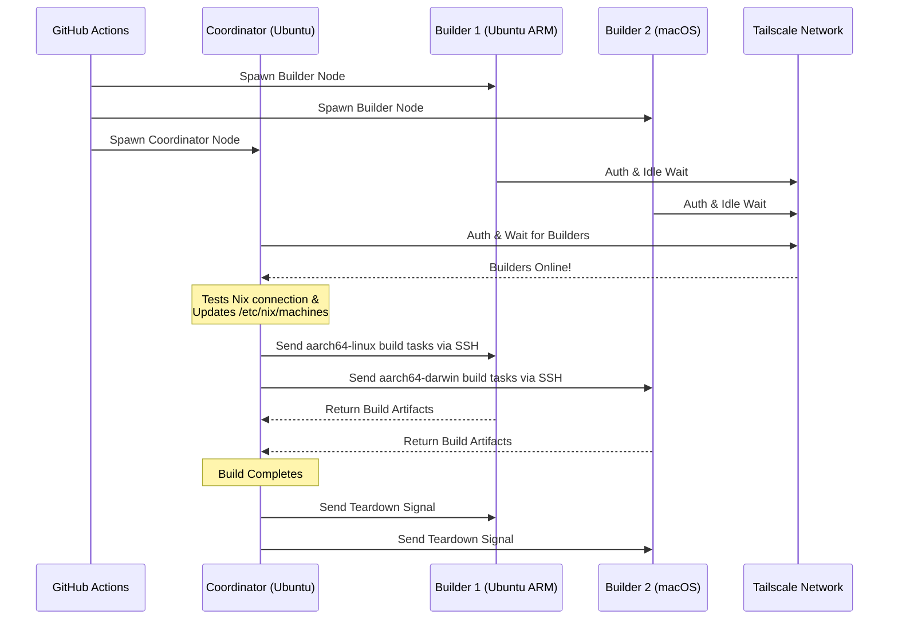

<div align="right">
  <details>
    <summary >🌐 Taal</summary>
    <div>
      <div align="center">
        <a href="https://openaitx.github.io/view.html?user=Misaka13514&project=setup-distributed-nix-builds&lang=en">Engels</a>
        | <a href="https://openaitx.github.io/view.html?user=Misaka13514&project=setup-distributed-nix-builds&lang=zh-CN">简体中文</a>
        | <a href="https://openaitx.github.io/view.html?user=Misaka13514&project=setup-distributed-nix-builds&lang=zh-TW">繁體中文</a>
        | <a href="https://openaitx.github.io/view.html?user=Misaka13514&project=setup-distributed-nix-builds&lang=ja">日本語</a>
        | <a href="https://openaitx.github.io/view.html?user=Misaka13514&project=setup-distributed-nix-builds&lang=ko">한국어</a>
        | <a href="https://openaitx.github.io/view.html?user=Misaka13514&project=setup-distributed-nix-builds&lang=hi">हिन्दी</a>
        | <a href="https://openaitx.github.io/view.html?user=Misaka13514&project=setup-distributed-nix-builds&lang=th">ไทย</a>
        | <a href="https://openaitx.github.io/view.html?user=Misaka13514&project=setup-distributed-nix-builds&lang=fr">Frans</a>
        | <a href="https://openaitx.github.io/view.html?user=Misaka13514&project=setup-distributed-nix-builds&lang=de">Duits</a>
        | <a href="https://openaitx.github.io/view.html?user=Misaka13514&project=setup-distributed-nix-builds&lang=es">Spaans</a>
        | <a href="https://openaitx.github.io/view.html?user=Misaka13514&project=setup-distributed-nix-builds&lang=it">Italiaans</a>
        | <a href="https://openaitx.github.io/view.html?user=Misaka13514&project=setup-distributed-nix-builds&lang=ru">Russisch</a>
        | <a href="https://openaitx.github.io/view.html?user=Misaka13514&project=setup-distributed-nix-builds&lang=pt">Portugees</a>
        | <a href="https://openaitx.github.io/view.html?user=Misaka13514&project=setup-distributed-nix-builds&lang=nl">Nederlands</a>
        | <a href="https://openaitx.github.io/view.html?user=Misaka13514&project=setup-distributed-nix-builds&lang=pl">Pools</a>
        | <a href="https://openaitx.github.io/view.html?user=Misaka13514&project=setup-distributed-nix-builds&lang=ar">العربية</a>
        | <a href="https://openaitx.github.io/view.html?user=Misaka13514&project=setup-distributed-nix-builds&lang=fa">فارسی</a>
        | <a href="https://openaitx.github.io/view.html?user=Misaka13514&project=setup-distributed-nix-builds&lang=tr">Turks</a>
        | <a href="https://openaitx.github.io/view.html?user=Misaka13514&project=setup-distributed-nix-builds&lang=vi">Vietnamees</a>
        | <a href="https://openaitx.github.io/view.html?user=Misaka13514&project=setup-distributed-nix-builds&lang=id">Indonesisch</a>
        | <a href="https://openaitx.github.io/view.html?user=Misaka13514&project=setup-distributed-nix-builds&lang=as">অসমীয়া</
      </div>
    </div>
  </details>
</div>

# ❄️ Gedistribueerde Nix Builds Inrichten

Een GitHub Action om direct een vluchtige, cross-platform [Gedistribueerde Nix Build](https://wiki.nixos.org/wiki/Distributed_build) cluster te voorzien met standaard [GitHub Hosted Runners](https://docs.github.com/en/actions/reference/runners/github-hosted-runners), veilig verbonden via Tailscale.

Met deze actie kun je eenvoudig een matrix van secundaire GitHub runners (de **Builders**) opzetten en deze naadloos verbinden met een primaire runner (de **Coordinator**) via Tailscale SSH. De Coordinator configureert Nix automatisch om deze nodes als externe builders te gebruiken, waardoor je de bouwprestaties gelijktijdig maximaliseert zonder externe infrastructuur te beheren! Perfect voor het bouwen van multi-architectuur pakketten of het horizontaal opschalen van zware NixOS systeemsluitingen over een vloot van x86-runners.

## Functies

- 🚀 **Zero-configuratie Remote Builders:** Configureert automatisch `/etc/nix/machines` en verbindt nodes via Tailscale SSH (geen handmatige SSH-sleutels nodig!).
- 🌍 **Cross-platform & Multi-arch:** Combineer en mix Ubuntu (x86, ARM) en macOS (Intel, Apple Silicon) runners binnen dezelfde build.
- ⚖️ **Horizontale Schaling voor NixOS:** Moet je een enorme NixOS-configuratie evalueren en bouwen? Start een hele reeks identieke nodes (bijv. vijf `ubuntu-24.04` runners) op en laat Nix automatisch parallelle derivatie-builds verdelen over alle beschikbare CPU-kernen in de cluster.
- 🧹 **Maximale Schijfruimte:** Verwijdert automatisch vooraf geïnstalleerde software op Linux-runners (via [nothing-but-nix](https://github.com/wimpysworld/nothing-but-nix)) om je Nix store maximale ruimte te geven.
- ⚡ **Ingebouwde Caching:** Integreert [magic-nix-cache](https://github.com/DeterminateSystems/magic-nix-cache-action) om flake-evaluaties en lokale builds te versnellen.
- 🛑 **Netjes Afsluiten:** Builders wachten inactief op taken en beëindigen zichzelf netjes wanneer de Coördinator klaar is.

## Hoe het Werkt

De workflow verdeelt runners in twee rollen: `builder` en `coordinator`.



## Vereisten

Voordat je deze actie gebruikt, moet je een Tailscale-netwerk configureren zodat de runners veilig kunnen communiceren.

1. **Configureer Tailscale-ACL's:**
   Zorg ervoor dat je Tailscale taggroepen heeft aangemaakt en dat de ACL's toestaan dat de coördinator via Tailscale SSH naadloos kan inloggen op de builders.
   Voeg het volgende toe aan je [Tailscale Access Controls](https://login.tailscale.com/admin/acls/file):

<details>
<summary>Klik om de vereiste Tailscale ACL-configuratie te bekijken</summary>

```json
{
  "grants": [
    {
      "src": ["tag:nix-ci-builder", "tag:nix-ci-coordinator"],
      "dst": ["tag:nix-ci-builder", "tag:nix-ci-coordinator"],
      "ip": ["*"]
    }
  ],
  "ssh": [
    {
      "src": ["tag:nix-ci-coordinator"],
      "dst": ["tag:nix-ci-builder"],
      "users": ["autogroup:nonroot", "root"],
      "action": "accept"
    }
  ],
  "tagOwners": {
    "tag:nix-ci-coordinator": ["autogroup:admin", "tag:nix-ci-coordinator"],
    "tag:nix-ci-builder": ["autogroup:admin", "tag:nix-ci-builder"]
  }
}
```
</details>

2. **Maak een Tailscale OAuth Client aan:**
   Genereer een OAuth Client Secret in je [Tailscale Admin paneel](https://login.tailscale.com/admin/settings/trust-credentials), met `auth_keys` schrijfrechten en de tags `nix-ci-builder` en `nix-ci-coordinator`.
   Voeg dit geheim toe aan je GitHub Repository Secrets als `TS_OAUTH_SECRET`.

## Inputs

| Input                | Beschrijving                                                                                   | Vereist  | Standaard   |
| -------------------- | --------------------------------------------------------------------------------------------- | -------- | ----------- |
| `tailscale_authkey`  | Tailscale OAuth client secret of Auth Key.                                                    | **Ja**   | N/B         |
| `tailscale_hostname` | Hostnaam om te registreren bij Tailscale.                                                     | **Ja**   | N/B         |
| `tailscale_tags`     | Tags om te adverteren naar Tailscale (bijv. `tag:nix-ci-builder`).                            | **Ja**   | N/B         |
| `role`               | Rol van de huidige job: `"builder"` of `"coordinator"`.                                       | Ja       | `"builder"` |
| `builders`           | Spatiegescheiden lijst van volledige builder hostnamen om op te wachten. (_Vereist als rol coordinator is_) | Nee      | `""`        |
| `builder_timeout`    | Maximale tijd (in seconden) dat de builder moet wachten voordat hij zichzelf beëindigt.        | Nee      | `"300"`     |
| `extra_nix_config`   | Extra Nix-configuratie om toe te voegen aan `/etc/nix/nix.conf`.                              | Nee      | `""`        |

## Gebruik

### Voorbeeld van volledige gedistribueerde build

Hieronder staat een complete workflow (`nix-build.yml`) die dynamisch meerdere runner-architecturen opstart (Ubuntu x86, Ubuntu ARM, macOS x86, macOS Apple Silicon), ze met elkaar verbindt, en een gedistribueerde Nix-build uitvoert.

Als je een zware NixOS-configuratie bouwt en deze simpelweg sneller wilt maken door horizontaal te schalen, kun je `BUILDER_COUNTS` aanpassen om meerdere identieke x86 runners te starten. Bijvoorbeeld:
`BUILDER_COUNTS: '{"ubuntu-24.04": 4}'`
Dit geeft je direct een build farm met 16 CPU-cores (4 runners × 4 cores) om afleidingen parallel te verwerken.

Omdat GitHub Hosted Runners vluchtig zijn, gaan alle build-artifacten in de Nix store verloren zodra de workflow is afgerond. Om in toekomstige CI-runs of op je lokale machines te profiteren van je gedistribueerde builds, is het sterk aanbevolen om de resultaten naar een binary cache te pushen zoals [Cachix](https://www.cachix.org) of [Attic](https://github.com/zhaofengli/attic).

```yaml
name: Distributed Nix Build

on:
  workflow_dispatch:

env:
  # Define exactly how many runners of each OS type you want
  BUILDER_COUNTS: '{"ubuntu-24.04": 1, "ubuntu-24.04-arm": 1, "macos-26-intel": 1, "macos-26": 1}'

jobs:
  config:
    runs-on: ubuntu-slim
    outputs:
      builder_matrix: ${{ steps.set.outputs.builder_matrix }}
      builders_list: ${{ steps.set.outputs.builders_list }}
      run_suffix: ${{ steps.set.outputs.run_suffix }}
    steps:
      - id: set
        run: |
          SUFFIX=$(openssl rand -hex 3)
          echo "run_suffix=$SUFFIX" >> "$GITHUB_OUTPUT"

          # Dynamically generate the Matrix JSON based on BUILDER_COUNTS
          MATRIX_JSON=$(echo '${{ env.BUILDER_COUNTS }}' | jq -c '[
              to_entries[] | .key as $os | .value as $count |
              range(1; $count + 1) | { os: $os, id: "\($os)-\(.)" }
            ]
          ')
          echo "builder_matrix=$MATRIX_JSON" >> "$GITHUB_OUTPUT"

          # Create a space-separated list of hostnames for the coordinator
          BUILDERS_LIST=$(echo "$MATRIX_JSON" | jq -r --arg suffix "$SUFFIX" 'map("nix-builder-\($suffix)-\(.id)") | join(" ")')
          echo "builders_list=$BUILDERS_LIST" >> "$GITHUB_OUTPUT"

  builder:
    needs: config
    name: Builder ${{ matrix.builder.id }} (${{ needs.config.outputs.run_suffix }})
    runs-on: ${{ matrix.builder.os }}
    strategy:
      fail-fast: false
      matrix:
        builder: ${{ fromJSON(needs.config.outputs.builder_matrix) }}
    steps:
      - name: Setup Distributed Nix Builder
        uses: Misaka13514/setup-distributed-nix-builds@main
        with:
          tailscale_authkey: ${{ secrets.TS_OAUTH_SECRET }}
          tailscale_hostname: nix-builder-${{ needs.config.outputs.run_suffix }}-${{ matrix.builder.id }}
          tailscale_tags: tag:nix-ci-builder
          role: builder

      # Optionally configure your Cachix/Attic or other caching here
      # - uses: cachix/cachix-action@v17

  coordinator:
    needs: config
    name: Coordinator (${{ needs.config.outputs.run_suffix }})
    runs-on: ubuntu-24.04
    steps:
      - name: Setup Coordinator & Connect Builders
        uses: Misaka13514/setup-distributed-nix-builds@main
        with:
          tailscale_authkey: ${{ secrets.TS_OAUTH_SECRET }}
          tailscale_hostname: nix-coordinator-${{ needs.config.outputs.run_suffix }}
          tailscale_tags: tag:nix-ci-coordinator
          role: coordinator
          builders: ${{ needs.config.outputs.builders_list }}

      # Optionally configure your Cachix/Attic or other caching here
      # - uses: cachix/cachix-action@v17

      - name: Execute Distributed Build
        run: |
          # Your build command here. Because builders are registered in /etc/nix/machines,
          # Nix will automatically offload tasks to the correct architecture node.
          nix build -L --max-jobs 0 .#my-package

      # Signal builders to terminate if they are not needed anymore
      - name: Teardown Builders
        run: stop-nix-builders

      # Push build results to Cachix/Attic or other cache here if desired
      # - name: Push to Cachix
      #   run: cachix push mycache --all
```

## Licentie

Dit project is gelicentieerd onder de [MIT-licentie](LICENSE).



---


Tranlated By [Open Ai Tx](https://github.com/OpenAiTx/OpenAiTx) | Last indexed: 2026-03-27


---