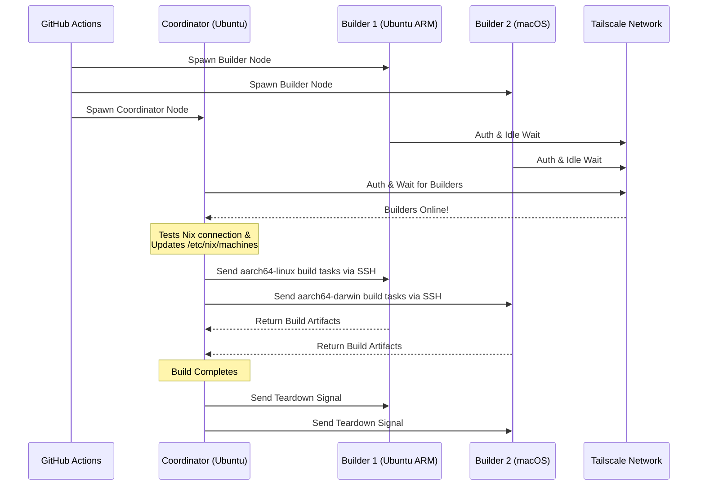

<div align="right">
  <details>
    <summary >🌐 Język</summary>
    <div>
      <div align="center">
        <a href="https://openaitx.github.io/view.html?user=Misaka13514&project=setup-distributed-nix-builds&lang=en">English</a>
        | <a href="https://openaitx.github.io/view.html?user=Misaka13514&project=setup-distributed-nix-builds&lang=zh-CN">简体中文</a>
        | <a href="https://openaitx.github.io/view.html?user=Misaka13514&project=setup-distributed-nix-builds&lang=zh-TW">繁體中文</a>
        | <a href="https://openaitx.github.io/view.html?user=Misaka13514&project=setup-distributed-nix-builds&lang=ja">日本語</a>
        | <a href="https://openaitx.github.io/view.html?user=Misaka13514&project=setup-distributed-nix-builds&lang=ko">한국어</a>
        | <a href="https://openaitx.github.io/view.html?user=Misaka13514&project=setup-distributed-nix-builds&lang=hi">हिन्दी</a>
        | <a href="https://openaitx.github.io/view.html?user=Misaka13514&project=setup-distributed-nix-builds&lang=th">ไทย</a>
        | <a href="https://openaitx.github.io/view.html?user=Misaka13514&project=setup-distributed-nix-builds&lang=fr">Français</a>
        | <a href="https://openaitx.github.io/view.html?user=Misaka13514&project=setup-distributed-nix-builds&lang=de">Deutsch</a>
        | <a href="https://openaitx.github.io/view.html?user=Misaka13514&project=setup-distributed-nix-builds&lang=es">Español</a>
        | <a href="https://openaitx.github.io/view.html?user=Misaka13514&project=setup-distributed-nix-builds&lang=it">Italiano</a>
        | <a href="https://openaitx.github.io/view.html?user=Misaka13514&project=setup-distributed-nix-builds&lang=ru">Русский</a>
        | <a href="https://openaitx.github.io/view.html?user=Misaka13514&project=setup-distributed-nix-builds&lang=pt">Português</a>
        | <a href="https://openaitx.github.io/view.html?user=Misaka13514&project=setup-distributed-nix-builds&lang=nl">Nederlands</a>
        | <a href="https://openaitx.github.io/view.html?user=Misaka13514&project=setup-distributed-nix-builds&lang=pl">Polski</a>
        | <a href="https://openaitx.github.io/view.html?user=Misaka13514&project=setup-distributed-nix-builds&lang=ar">العربية</a>
        | <a href="https://openaitx.github.io/view.html?user=Misaka13514&project=setup-distributed-nix-builds&lang=fa">فارسی</a>
        | <a href="https://openaitx.github.io/view.html?user=Misaka13514&project=setup-distributed-nix-builds&lang=tr">Türkçe</a>
        | <a href="https://openaitx.github.io/view.html?user=Misaka13514&project=setup-distributed-nix-builds&lang=vi">Tiếng Việt</a>
        | <a href="https://openaitx.github.io/view.html?user=Misaka13514&project=setup-distributed-nix-builds&lang=id">Bahasa Indonesia</a>
        | <a href="https://openaitx.github.io/view.html?user=Misaka13514&project=setup-distributed-nix-builds&lang=as">অসমীয়া</
      </div>
    </div>
  </details>
</div>

# ❄️ Konfiguracja Rozproszonych Budów Nix

GitHub Action do natychmiastowego uruchamiania efemerycznego, wieloplatformowego klastra [Rozproszonych Budów Nix](https://wiki.nixos.org/wiki/Distributed_build) z użyciem standardowych [Hostowanych Runnerów GitHub](https://docs.github.com/en/actions/reference/runners/github-hosted-runners) bezpiecznie połączonych przez Tailscale.

To działanie pozwala uruchomić macierz dodatkowych runnerów GitHub (tzw. **Budowniczych**) i połączyć je z głównym runnerem (tzw. **Koordynatorem**) bezproblemowo przez Tailscale SSH. Koordynator automatycznie konfiguruje Nix do użycia tych węzłów jako zdalnych budowniczych, maksymalizując wydajność równoczesnych budów bez zarządzania zewnętrzną infrastrukturą! Jest to idealne rozwiązanie do budowy pakietów wieloarchitektonicznych lub horyzontalnej skalowalności ciężkich zamknięć systemu NixOS na flotę runnerów x86.

## Funkcje

- 🚀 **Zdalni budowniczowie bez konfiguracji:** Automatycznie konfiguruje `/etc/nix/machines` i łączy węzły przez Tailscale SSH (bez potrzeby ręcznego generowania kluczy SSH!).
- 🌍 **Wieloplatformowość i multiarchitektura:** Łącz i mieszaj maszyny Ubuntu (x86, ARM) i macOS (Intel, Apple Silicon) w tym samym procesie budowania.
- ⚖️ **Skalowanie horyzontalne dla NixOS:** Potrzebujesz zbudować ogromną konfigurację NixOS? Uruchom całą farmę identycznych węzłów (np. pięć runnerów `ubuntu-24.04`) i pozwól, by Nix automatycznie rozdzielił równoległe budowy pomiędzy wszystkie dostępne rdzenie CPU w klastrze.
- 🧹 **Maksymalna ilość miejsca na dysku:** Automatyczne czyszczenie preinstalowanego oprogramowania na runnerach Linuksa (przez [nothing-but-nix](https://github.com/wimpysworld/nothing-but-nix)), aby zapewnić maksymalną ilość miejsca dla sklepu Nix.
- ⚡ **Wbudowane buforowanie:** Integruje [magic-nix-cache](https://github.com/DeterminateSystems/magic-nix-cache-action) w celu przyspieszenia ewaluacji flake i lokalnych budów.
- 🛑 **Łagodne wygaszanie:** Budowniczowie czekają bezczynnie na zadania i kończą pracę w kontrolowany sposób po zakończeniu pracy Koordynatora.

## Jak to działa

Przepływ pracy dzieli runnerów na dwie role: `builder` i `coordinator`.



## Wymagania wstępne

Przed użyciem tej akcji należy skonfigurować sieć Tailscale, aby umożliwić bezpieczną komunikację runnerów.

1. **Skonfiguruj ACL Tailscale:**
   Upewnij się, że w Tailscale zostały utworzone grupy tagów oraz ACL pozwalają koordynatorowi na bezproblemowe łączenie się z builderami poprzez Tailscale SSH.
   Dodaj poniższe do swoich [Tailscale Access Controls](https://login.tailscale.com/admin/acls/file):

<details>
<summary>Kliknij, aby zobaczyć wymaganą konfigurację ACL Tailscale</summary>

```json
{
  "grants": [
    {
      "src": ["tag:nix-ci-builder", "tag:nix-ci-coordinator"],
      "dst": ["tag:nix-ci-builder", "tag:nix-ci-coordinator"],
      "ip": ["*"]
    }
  ],
  "ssh": [
    {
      "src": ["tag:nix-ci-coordinator"],
      "dst": ["tag:nix-ci-builder"],
      "users": ["autogroup:nonroot", "root"],
      "action": "accept"
    }
  ],
  "tagOwners": {
    "tag:nix-ci-coordinator": ["autogroup:admin", "tag:nix-ci-coordinator"],
    "tag:nix-ci-builder": ["autogroup:admin", "tag:nix-ci-builder"]
  }
}
```
</details>

2. **Utwórz klienta OAuth Tailscale:**
   Wygeneruj OAuth Client Secret w [panelu administracyjnym Tailscale](https://login.tailscale.com/admin/settings/trust-credentials), z zakresem zapisu `auth_keys` oraz tagami `nix-ci-builder` `nix-ci-coordinator`.
   Dodaj ten sekret do sekcji GitHub Repository Secrets jako `TS_OAUTH_SECRET`.

## Wejścia

| Wejście              | Opis                                                                                           | Wymagane | Domyślne    |
| -------------------- | ---------------------------------------------------------------------------------------------- | -------- | ----------- |
| `tailscale_authkey`  | Klucz klienta OAuth Tailscale lub Auth Key.                                                    | **Tak**  | N/D         |
| `tailscale_hostname` | Nazwa hosta do zarejestrowania w Tailscale.                                                    | **Tak**  | N/D         |
| `tailscale_tags`     | Tagi do zadeklarowania w Tailscale (np. `tag:nix-ci-builder`).                                 | **Tak**  | N/D         |
| `role`               | Rola bieżącego zadania: `"builder"` lub `"coordinator"`.                                       | Tak      | `"builder"` |
| `builders`           | Lista pełnych nazw hostów builderów (oddzielone spacją), na które należy poczekać. (_Wymagane jeśli rola to coordinator_) | Nie      | `""`        |
| `builder_timeout`    | Maksymalny czas (w sekundach), przez jaki builder powinien czekać przed zakończeniem.          | Nie      | `"300"`     |
| `extra_nix_config`   | Dodatkowa konfiguracja Nix do dopisania do `/etc/nix/nix.conf`.                                | Nie      | `""`        |

## Użycie

### Przykład pełnej dystrybucji kompilacji

Poniżej znajduje się kompletny workflow (`nix-build.yml`), który dynamicznie uruchamia wiele runnerów o różnych architekturach (Ubuntu x86, Ubuntu ARM, macOS x86, macOS Apple Silicon), łączy je razem i uruchamia rozproszoną kompilację Nix.

Jeśli budujesz ciężką konfigurację NixOS i chcesz ją po prostu przyspieszyć przez skalowanie poziome, możesz zmienić `BUILDER_COUNTS`, aby uruchomić wiele identycznych runnerów x86. Przykład:
`BUILDER_COUNTS: '{"ubuntu-24.04": 4}'` 
Da ci to natychmiast farmę kompilacyjną z 16 rdzeniami CPU (4 runnery × 4 rdzenie) do równoległego przetwarzania pochodnych.

Ponieważ hostowane runnery GitHub są efemeryczne, wszystkie artefakty kompilacji w Nix store zostaną utracone po zakończeniu workflow. Aby korzystać z efektów rozproszonych kompilacji w przyszłych przebiegach CI lub na lokalnych maszynach, zdecydowanie zaleca się wypychanie wyników do cache binarnego, np. [Cachix](https://www.cachix.org) lub [Attic](https://github.com/zhaofengli/attic).

```yaml
name: Distributed Nix Build

on:
  workflow_dispatch:

env:
  # Define exactly how many runners of each OS type you want
  BUILDER_COUNTS: '{"ubuntu-24.04": 1, "ubuntu-24.04-arm": 1, "macos-26-intel": 1, "macos-26": 1}'

jobs:
  config:
    runs-on: ubuntu-slim
    outputs:
      builder_matrix: ${{ steps.set.outputs.builder_matrix }}
      builders_list: ${{ steps.set.outputs.builders_list }}
      run_suffix: ${{ steps.set.outputs.run_suffix }}
    steps:
      - id: set
        run: |
          SUFFIX=$(openssl rand -hex 3)
          echo "run_suffix=$SUFFIX" >> "$GITHUB_OUTPUT"

          # Dynamically generate the Matrix JSON based on BUILDER_COUNTS
          MATRIX_JSON=$(echo '${{ env.BUILDER_COUNTS }}' | jq -c '[
              to_entries[] | .key as $os | .value as $count |
              range(1; $count + 1) | { os: $os, id: "\($os)-\(.)" }
            ]
          ')
          echo "builder_matrix=$MATRIX_JSON" >> "$GITHUB_OUTPUT"

          # Create a space-separated list of hostnames for the coordinator
          BUILDERS_LIST=$(echo "$MATRIX_JSON" | jq -r --arg suffix "$SUFFIX" 'map("nix-builder-\($suffix)-\(.id)") | join(" ")')
          echo "builders_list=$BUILDERS_LIST" >> "$GITHUB_OUTPUT"

  builder:
    needs: config
    name: Builder ${{ matrix.builder.id }} (${{ needs.config.outputs.run_suffix }})
    runs-on: ${{ matrix.builder.os }}
    strategy:
      fail-fast: false
      matrix:
        builder: ${{ fromJSON(needs.config.outputs.builder_matrix) }}
    steps:
      - name: Setup Distributed Nix Builder
        uses: Misaka13514/setup-distributed-nix-builds@main
        with:
          tailscale_authkey: ${{ secrets.TS_OAUTH_SECRET }}
          tailscale_hostname: nix-builder-${{ needs.config.outputs.run_suffix }}-${{ matrix.builder.id }}
          tailscale_tags: tag:nix-ci-builder
          role: builder

      # Optionally configure your Cachix/Attic or other caching here
      # - uses: cachix/cachix-action@v17

  coordinator:
    needs: config
    name: Coordinator (${{ needs.config.outputs.run_suffix }})
    runs-on: ubuntu-24.04
    steps:
      - name: Setup Coordinator & Connect Builders
        uses: Misaka13514/setup-distributed-nix-builds@main
        with:
          tailscale_authkey: ${{ secrets.TS_OAUTH_SECRET }}
          tailscale_hostname: nix-coordinator-${{ needs.config.outputs.run_suffix }}
          tailscale_tags: tag:nix-ci-coordinator
          role: coordinator
          builders: ${{ needs.config.outputs.builders_list }}

      # Optionally configure your Cachix/Attic or other caching here
      # - uses: cachix/cachix-action@v17

      - name: Execute Distributed Build
        run: |
          # Your build command here. Because builders are registered in /etc/nix/machines,
          # Nix will automatically offload tasks to the correct architecture node.
          nix build -L --max-jobs 0 .#my-package

      # Signal builders to terminate if they are not needed anymore
      - name: Teardown Builders
        run: stop-nix-builders

      # Push build results to Cachix/Attic or other cache here if desired
      # - name: Push to Cachix
      #   run: cachix push mycache --all
```

## Licencja

Ten projekt jest licencjonowany na warunkach [Licencji MIT](LICENSE).



---


Tranlated By [Open Ai Tx](https://github.com/OpenAiTx/OpenAiTx) | Last indexed: 2026-03-27


---