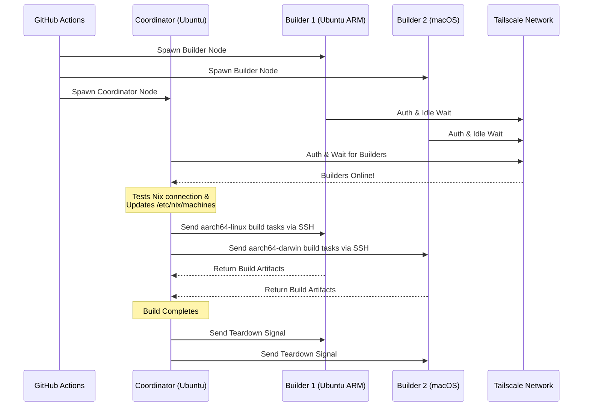

<div align="right">
  <details>
    <summary >🌐 Idioma</summary>
    <div>
      <div align="center">
        <a href="https://openaitx.github.io/view.html?user=Misaka13514&project=setup-distributed-nix-builds&lang=en">English</a>
        | <a href="https://openaitx.github.io/view.html?user=Misaka13514&project=setup-distributed-nix-builds&lang=zh-CN">简体中文</a>
        | <a href="https://openaitx.github.io/view.html?user=Misaka13514&project=setup-distributed-nix-builds&lang=zh-TW">繁體中文</a>
        | <a href="https://openaitx.github.io/view.html?user=Misaka13514&project=setup-distributed-nix-builds&lang=ja">日本語</a>
        | <a href="https://openaitx.github.io/view.html?user=Misaka13514&project=setup-distributed-nix-builds&lang=ko">한국어</a>
        | <a href="https://openaitx.github.io/view.html?user=Misaka13514&project=setup-distributed-nix-builds&lang=hi">हिन्दी</a>
        | <a href="https://openaitx.github.io/view.html?user=Misaka13514&project=setup-distributed-nix-builds&lang=th">ไทย</a>
        | <a href="https://openaitx.github.io/view.html?user=Misaka13514&project=setup-distributed-nix-builds&lang=fr">Français</a>
        | <a href="https://openaitx.github.io/view.html?user=Misaka13514&project=setup-distributed-nix-builds&lang=de">Deutsch</a>
        | <a href="https://openaitx.github.io/view.html?user=Misaka13514&project=setup-distributed-nix-builds&lang=es">Español</a>
        | <a href="https://openaitx.github.io/view.html?user=Misaka13514&project=setup-distributed-nix-builds&lang=it">Italiano</a>
        | <a href="https://openaitx.github.io/view.html?user=Misaka13514&project=setup-distributed-nix-builds&lang=ru">Русский</a>
        | <a href="https://openaitx.github.io/view.html?user=Misaka13514&project=setup-distributed-nix-builds&lang=pt">Português</a>
        | <a href="https://openaitx.github.io/view.html?user=Misaka13514&project=setup-distributed-nix-builds&lang=nl">Nederlands</a>
        | <a href="https://openaitx.github.io/view.html?user=Misaka13514&project=setup-distributed-nix-builds&lang=pl">Polski</a>
        | <a href="https://openaitx.github.io/view.html?user=Misaka13514&project=setup-distributed-nix-builds&lang=ar">العربية</a>
        | <a href="https://openaitx.github.io/view.html?user=Misaka13514&project=setup-distributed-nix-builds&lang=fa">فارسی</a>
        | <a href="https://openaitx.github.io/view.html?user=Misaka13514&project=setup-distributed-nix-builds&lang=tr">Türkçe</a>
        | <a href="https://openaitx.github.io/view.html?user=Misaka13514&project=setup-distributed-nix-builds&lang=vi">Tiếng Việt</a>
        | <a href="https://openaitx.github.io/view.html?user=Misaka13514&project=setup-distributed-nix-builds&lang=id">Bahasa Indonesia</a>
        | <a href="https://openaitx.github.io/view.html?user=Misaka13514&project=setup-distributed-nix-builds&lang=as">অসমীয়া</
      </div>
    </div>
  </details>
</div>

# ❄️ Configurar Builds Distribuídos com Nix

Uma GitHub Action para provisionar instantaneamente um cluster efêmero e multiplataforma de [Build Distribuído do Nix](https://wiki.nixos.org/wiki/Distributed_build) usando [GitHub Hosted Runners](https://docs.github.com/en/actions/reference/runners/github-hosted-runners) padrão, conectados com segurança via Tailscale.

Esta action permite iniciar uma matriz de runners GitHub secundários (os **Builders**) e conectá-los a um runner primário (o **Coordenador**) de forma transparente pelo Tailscale SSH. O Coordenador configura automaticamente o Nix para usar esses nós como builders remotos, maximizando o desempenho de builds simultâneos sem gerenciar infraestrutura externa! É perfeito para construir pacotes multi-arquitetura ou escalar horizontalmente closures pesados do sistema NixOS em uma frota de runners x86.

## Funcionalidades

- 🚀 **Builders Remotos Sem Configuração:** Configura automaticamente o `/etc/nix/machines` e conecta os nós via Tailscale SSH (não é necessário configurar chaves SSH manualmente!).
- 🌍 **Multi-Plataforma & Multi-Arquitetura:** Misture e combine runners Ubuntu (x86, ARM) e macOS (Intel, Apple Silicon) na mesma compilação.
- ⚖️ **Escalabilidade Horizontal para NixOS:** Precisa avaliar e construir uma configuração NixOS massiva? Inicie uma fazenda inteira de nós idênticos (ex.: cinco runners `ubuntu-24.04`) e deixe o Nix distribuir automaticamente as compilações paralelas de derivações por todos os núcleos de CPU disponíveis no cluster.
- 🧹 **Máximo Espaço em Disco:** Limpa automaticamente softwares pré-instalados em runners Linux (via [nothing-but-nix](https://github.com/wimpysworld/nothing-but-nix)) para dar à sua Nix store o máximo de espaço possível.
- ⚡ **Cache Integrado:** Integra o [magic-nix-cache](https://github.com/DeterminateSystems/magic-nix-cache-action) para acelerar avaliações de flakes e builds locais.
- 🛑 **Desligamento Controlado:** Builders aguardam tarefas ociosamente e se encerram de forma controlada quando o Coordenador termina.

## Como Funciona

O fluxo de trabalho separa os runners em dois papéis: `builder` e `coordinator`.



## Pré-requisitos

Antes de usar esta ação, você precisa configurar uma rede Tailscale para que os runners possam se comunicar de forma segura.

1. **Configure as ACLs do Tailscale:**
   Certifique-se de que seu Tailscale tenha grupos de tags criados e as ACLs permitam que o coordenador acesse os builders via SSH de forma transparente usando Tailscale SSH.
   Adicione o seguinte aos seus [Controles de Acesso do Tailscale](https://login.tailscale.com/admin/acls/file):

<details>
<summary>Clique para ver a configuração necessária de ACL do Tailscale</summary>

```json
{
  "grants": [
    {
      "src": ["tag:nix-ci-builder", "tag:nix-ci-coordinator"],
      "dst": ["tag:nix-ci-builder", "tag:nix-ci-coordinator"],
      "ip": ["*"]
    }
  ],
  "ssh": [
    {
      "src": ["tag:nix-ci-coordinator"],
      "dst": ["tag:nix-ci-builder"],
      "users": ["autogroup:nonroot", "root"],
      "action": "accept"
    }
  ],
  "tagOwners": {
    "tag:nix-ci-coordinator": ["autogroup:admin", "tag:nix-ci-coordinator"],
    "tag:nix-ci-builder": ["autogroup:admin", "tag:nix-ci-builder"]
  }
}
```
</details>

2. **Crie um Cliente OAuth do Tailscale:**
   Gere um Segredo de Cliente OAuth em seu [painel de administração do Tailscale](https://login.tailscale.com/admin/settings/trust-credentials), com escopo de escrita para `auth_keys` e tags `nix-ci-builder` `nix-ci-coordinator`.
   Adicione este segredo aos Segredos do Repositório GitHub como `TS_OAUTH_SECRET`.

## Entradas

| Entrada              | Descrição                                                                                        | Obrigatório | Padrão      |
| -------------------- | ------------------------------------------------------------------------------------------------ | ----------- | ----------- |
| `tailscale_authkey`  | Segredo do cliente OAuth do Tailscale ou Chave de Autenticação.                                  | **Sim**     | N/A         |
| `tailscale_hostname` | Nome do host para registrar no Tailscale.                                                        | **Sim**     | N/A         |
| `tailscale_tags`     | Tags para anunciar ao Tailscale (ex.: `tag:nix-ci-builder`).                                     | **Sim**     | N/A         |
| `role`               | Função do job atual: `"builder"` ou `"coordinator"`.                                             | Sim         | `"builder"` |
| `builders`           | Lista separada por espaço dos nomes completos dos builders para aguardar. (_Obrigatório se função for coordinator_) | Não         | `""`        |
| `builder_timeout`    | Tempo máximo (em segundos) que o builder deve esperar antes de se autodestruir.                  | Não         | `"300"`     |
| `extra_nix_config`   | Configuração extra do Nix para adicionar a `/etc/nix/nix.conf`.                                  | Não         | `""`        |

## Uso

### Exemplo Completo de Build Distribuído

Abaixo está um workflow completo (`nix-build.yml`) que inicia dinamicamente múltiplas arquiteturas de runners (Ubuntu x86, Ubuntu ARM, macOS x86, macOS Apple Silicon), conecta-os e executa um build distribuído do Nix.

Se você está construindo uma configuração pesada do NixOS e apenas quer acelerar usando escala horizontal, pode alterar o `BUILDER_COUNTS` para iniciar múltiplos runners x86 idênticos. Por exemplo:
`BUILDER_COUNTS: '{"ubuntu-24.04": 4}'` 
Isso lhe dará instantaneamente uma farm de builds com 16 núcleos de CPU (4 runners × 4 núcleos) para processar derivações em paralelo.

Como os GitHub Hosted Runners são efêmeros, todos os artefatos de build no Nix store serão perdidos ao final do workflow. Para aproveitar os benefícios dos builds distribuídos em execuções futuras do CI ou em suas máquinas locais, é altamente recomendado enviar os resultados para um cache binário como [Cachix](https://www.cachix.org) ou [Attic](https://github.com/zhaofengli/attic).

```yaml
name: Distributed Nix Build

on:
  workflow_dispatch:

env:
  # Define exactly how many runners of each OS type you want
  BUILDER_COUNTS: '{"ubuntu-24.04": 1, "ubuntu-24.04-arm": 1, "macos-26-intel": 1, "macos-26": 1}'

jobs:
  config:
    runs-on: ubuntu-slim
    outputs:
      builder_matrix: ${{ steps.set.outputs.builder_matrix }}
      builders_list: ${{ steps.set.outputs.builders_list }}
      run_suffix: ${{ steps.set.outputs.run_suffix }}
    steps:
      - id: set
        run: |
          SUFFIX=$(openssl rand -hex 3)
          echo "run_suffix=$SUFFIX" >> "$GITHUB_OUTPUT"

          # Dynamically generate the Matrix JSON based on BUILDER_COUNTS
          MATRIX_JSON=$(echo '${{ env.BUILDER_COUNTS }}' | jq -c '[
              to_entries[] | .key as $os | .value as $count |
              range(1; $count + 1) | { os: $os, id: "\($os)-\(.)" }
            ]
          ')
          echo "builder_matrix=$MATRIX_JSON" >> "$GITHUB_OUTPUT"

          # Create a space-separated list of hostnames for the coordinator
          BUILDERS_LIST=$(echo "$MATRIX_JSON" | jq -r --arg suffix "$SUFFIX" 'map("nix-builder-\($suffix)-\(.id)") | join(" ")')
          echo "builders_list=$BUILDERS_LIST" >> "$GITHUB_OUTPUT"

  builder:
    needs: config
    name: Builder ${{ matrix.builder.id }} (${{ needs.config.outputs.run_suffix }})
    runs-on: ${{ matrix.builder.os }}
    strategy:
      fail-fast: false
      matrix:
        builder: ${{ fromJSON(needs.config.outputs.builder_matrix) }}
    steps:
      - name: Setup Distributed Nix Builder
        uses: Misaka13514/setup-distributed-nix-builds@main
        with:
          tailscale_authkey: ${{ secrets.TS_OAUTH_SECRET }}
          tailscale_hostname: nix-builder-${{ needs.config.outputs.run_suffix }}-${{ matrix.builder.id }}
          tailscale_tags: tag:nix-ci-builder
          role: builder

      # Optionally configure your Cachix/Attic or other caching here
      # - uses: cachix/cachix-action@v17

  coordinator:
    needs: config
    name: Coordinator (${{ needs.config.outputs.run_suffix }})
    runs-on: ubuntu-24.04
    steps:
      - name: Setup Coordinator & Connect Builders
        uses: Misaka13514/setup-distributed-nix-builds@main
        with:
          tailscale_authkey: ${{ secrets.TS_OAUTH_SECRET }}
          tailscale_hostname: nix-coordinator-${{ needs.config.outputs.run_suffix }}
          tailscale_tags: tag:nix-ci-coordinator
          role: coordinator
          builders: ${{ needs.config.outputs.builders_list }}

      # Optionally configure your Cachix/Attic or other caching here
      # - uses: cachix/cachix-action@v17

      - name: Execute Distributed Build
        run: |
          # Your build command here. Because builders are registered in /etc/nix/machines,
          # Nix will automatically offload tasks to the correct architecture node.
          nix build -L --max-jobs 0 .#my-package

      # Signal builders to terminate if they are not needed anymore
      - name: Teardown Builders
        run: stop-nix-builders

      # Push build results to Cachix/Attic or other cache here if desired
      # - name: Push to Cachix
      #   run: cachix push mycache --all
```

## Licença

Este projeto está licenciado sob a [Licença MIT](LICENSE).



---


Tranlated By [Open Ai Tx](https://github.com/OpenAiTx/OpenAiTx) | Last indexed: 2026-03-27


---