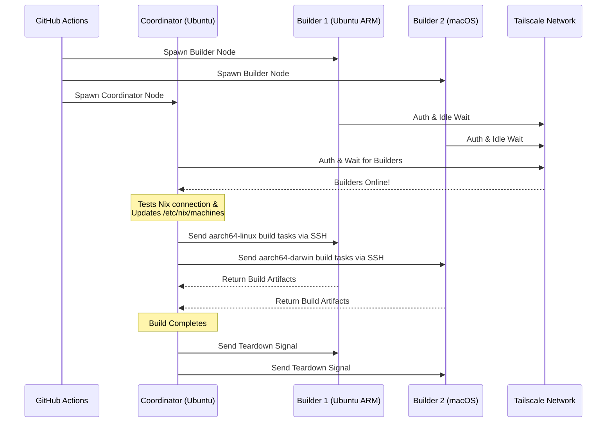

<div align="right">
  <details>
    <summary >🌐 Язык</summary>
    <div>
      <div align="center">
        <a href="https://openaitx.github.io/view.html?user=Misaka13514&project=setup-distributed-nix-builds&lang=en">English</a>
        | <a href="https://openaitx.github.io/view.html?user=Misaka13514&project=setup-distributed-nix-builds&lang=zh-CN">简体中文</a>
        | <a href="https://openaitx.github.io/view.html?user=Misaka13514&project=setup-distributed-nix-builds&lang=zh-TW">繁體中文</a>
        | <a href="https://openaitx.github.io/view.html?user=Misaka13514&project=setup-distributed-nix-builds&lang=ja">日本語</a>
        | <a href="https://openaitx.github.io/view.html?user=Misaka13514&project=setup-distributed-nix-builds&lang=ko">한국어</a>
        | <a href="https://openaitx.github.io/view.html?user=Misaka13514&project=setup-distributed-nix-builds&lang=hi">हिन्दी</a>
        | <a href="https://openaitx.github.io/view.html?user=Misaka13514&project=setup-distributed-nix-builds&lang=th">ไทย</a>
        | <a href="https://openaitx.github.io/view.html?user=Misaka13514&project=setup-distributed-nix-builds&lang=fr">Français</a>
        | <a href="https://openaitx.github.io/view.html?user=Misaka13514&project=setup-distributed-nix-builds&lang=de">Deutsch</a>
        | <a href="https://openaitx.github.io/view.html?user=Misaka13514&project=setup-distributed-nix-builds&lang=es">Español</a>
        | <a href="https://openaitx.github.io/view.html?user=Misaka13514&project=setup-distributed-nix-builds&lang=it">Italiano</a>
        | <a href="https://openaitx.github.io/view.html?user=Misaka13514&project=setup-distributed-nix-builds&lang=ru">Русский</a>
        | <a href="https://openaitx.github.io/view.html?user=Misaka13514&project=setup-distributed-nix-builds&lang=pt">Português</a>
        | <a href="https://openaitx.github.io/view.html?user=Misaka13514&project=setup-distributed-nix-builds&lang=nl">Nederlands</a>
        | <a href="https://openaitx.github.io/view.html?user=Misaka13514&project=setup-distributed-nix-builds&lang=pl">Polski</a>
        | <a href="https://openaitx.github.io/view.html?user=Misaka13514&project=setup-distributed-nix-builds&lang=ar">العربية</a>
        | <a href="https://openaitx.github.io/view.html?user=Misaka13514&project=setup-distributed-nix-builds&lang=fa">فارسی</a>
        | <a href="https://openaitx.github.io/view.html?user=Misaka13514&project=setup-distributed-nix-builds&lang=tr">Türkçe</a>
        | <a href="https://openaitx.github.io/view.html?user=Misaka13514&project=setup-distributed-nix-builds&lang=vi">Tiếng Việt</a>
        | <a href="https://openaitx.github.io/view.html?user=Misaka13514&project=setup-distributed-nix-builds&lang=id">Bahasa Indonesia</a>
        | <a href="https://openaitx.github.io/view.html?user=Misaka13514&project=setup-distributed-nix-builds&lang=as">অসমীয়া</
      </div>
    </div>
  </details>
</div>

# ❄️ Настройка Распределённых Сборок Nix

GitHub Action для мгновенного развертывания эфемерного, кроссплатформенного [распределенного кластера Nix-сборки](https://wiki.nixos.org/wiki/Distributed_build) с использованием стандартных [виртуальных исполнителей GitHub](https://docs.github.com/en/actions/reference/runners/github-hosted-runners), безопасно подключённых через Tailscale.

Это действие позволяет вам запустить матрицу вторичных исполнителей GitHub (**Сборщики**) и подключить их к основному исполнителю (**Координатор**) бесшовно через Tailscale SSH. Координатор автоматически настраивает Nix для использования этих узлов как удалённых сборщиков, максимизируя производительность одновременной сборки без управления внешней инфраструктурой! Идеально подходит для сборки мультиархитектурных пакетов или горизонтального масштабирования тяжелых системных замыканий NixOS на парке x86-исполнителей.

## Возможности

- 🚀 **Сборщики без настройки:** Автоматически настраивает `/etc/nix/machines` и подключает узлы через Tailscale SSH (без необходимости вручную добавлять SSH-ключи!).
- 🌍 **Кроссплатформенность и мультиархитектурность:** Смешивайте и комбинируйте Ubuntu (x86, ARM) и macOS (Intel, Apple Silicon) раннеры в одном билде.
- ⚖️ **Горизонтальное масштабирование для NixOS:** Нужно оценить и собрать огромную конфигурацию NixOS? Запускайте целую ферму идентичных узлов (например, пять раннеров `ubuntu-24.04`), и Nix автоматически распределит параллельные сборки по всем доступным ядрам CPU в кластере.
- 🧹 **Максимальное место на диске:** Автоматически очищает предустановленное ПО на Linux-раннерах (через [nothing-but-nix](https://github.com/wimpysworld/nothing-but-nix)), чтобы предоставить вашему Nix store максимум свободного пространства.
- ⚡ **Встроенное кэширование:** Интегрирует [magic-nix-cache](https://github.com/DeterminateSystems/magic-nix-cache-action) для ускорения оценки flakes и локальных сборок.
- 🛑 **Корректное завершение работы:** Сборщики ожидают задачи в режиме ожидания и завершают работу корректно после завершения работы Координатора.

## Как это работает

В рабочем процессе раннеры разделяются на две роли: `builder` и `coordinator`.



## Предварительные требования

Перед использованием этого действия необходимо настроить сеть Tailscale, чтобы раннеры могли безопасно взаимодействовать.

1. **Настройте ACL для Tailscale:**
   Убедитесь, что в вашей сети Tailscale созданы группы тегов и ACL разрешают координатору подключаться к сборщикам по SSH через Tailscale без препятствий.
   Добавьте следующее в [Контроль доступа Tailscale](https://login.tailscale.com/admin/acls/file):

<details>
<summary>Нажмите, чтобы просмотреть требуемую конфигурацию ACL для Tailscale</summary>

```json
{
  "grants": [
    {
      "src": ["tag:nix-ci-builder", "tag:nix-ci-coordinator"],
      "dst": ["tag:nix-ci-builder", "tag:nix-ci-coordinator"],
      "ip": ["*"]
    }
  ],
  "ssh": [
    {
      "src": ["tag:nix-ci-coordinator"],
      "dst": ["tag:nix-ci-builder"],
      "users": ["autogroup:nonroot", "root"],
      "action": "accept"
    }
  ],
  "tagOwners": {
    "tag:nix-ci-coordinator": ["autogroup:admin", "tag:nix-ci-coordinator"],
    "tag:nix-ci-builder": ["autogroup:admin", "tag:nix-ci-builder"]
  }
}
```
</details>

2. **Создайте OAuth-клиент Tailscale:**
   Сгенерируйте секрет OAuth-клиента в [панели администратора Tailscale](https://login.tailscale.com/admin/settings/trust-credentials), с правом записи `auth_keys` и тегами `nix-ci-builder` `nix-ci-coordinator`.
   Добавьте этот секрет в секреты вашего репозитория GitHub как `TS_OAUTH_SECRET`.

## Входные параметры

| Вход                | Описание                                                                                        | Обязателен | По умолчанию |
| ------------------- | ----------------------------------------------------------------------------------------------- | ---------- | ------------ |
| `tailscale_authkey` | Секрет OAuth-клиента Tailscale или ключ авторизации.                                            | **Да**     | N/A          |
| `tailscale_hostname`| Имя хоста для регистрации в Tailscale.                                                          | **Да**     | N/A          |
| `tailscale_tags`    | Теги для передачи в Tailscale (например, `tag:nix-ci-builder`).                                 | **Да**     | N/A          |
| `role`              | Роль текущей задачи: `"builder"` или `"coordinator"`.                                           | Да         | `"builder"`  |
| `builders`          | Список имён хостов билдера через пробел для ожидания. (_Обязательно, если роль — coordinator_)   | Нет        | `""`         |
| `builder_timeout`   | Максимальное время (в секундах) ожидания перед самозавершением билдера.                         | Нет        | `"300"`      |
| `extra_nix_config`  | Дополнительная конфигурация Nix для добавления в `/etc/nix/nix.conf`.                           | Нет        | `""`         |

## Использование

### Пример полного распределённого билда

Ниже приведён полный workflow (`nix-build.yml`), который динамически запускает несколько архитектур runner'ов (Ubuntu x86, Ubuntu ARM, macOS x86, macOS Apple Silicon), объединяет их и выполняет распределённую сборку Nix.

Если вы собираете тяжёлую конфигурацию NixOS и хотите просто ускорить её с помощью горизонтального масштабирования, можете изменить `BUILDER_COUNTS` для запуска нескольких одинаковых x86 runner'ов. Например:
`BUILDER_COUNTS: '{"ubuntu-24.04": 4}'`
Это мгновенно создаст для вас build farm с 16 CPU-ядрами (4 runner × 4 ядра) для параллельной обработки derivations.

Поскольку Hosted Runner'ы GitHub эфемерны, все артефакты сборки в хранилище Nix будут утеряны после завершения workflow. Чтобы воспользоваться преимуществами распределённых сборок в будущих CI-запусках или на своих локальных машинах, настоятельно рекомендуется отправлять результаты в бинарный кэш, такой как [Cachix](https://www.cachix.org) или [Attic](https://github.com/zhaofengli/attic).

```yaml
name: Distributed Nix Build

on:
  workflow_dispatch:

env:
  # Define exactly how many runners of each OS type you want
  BUILDER_COUNTS: '{"ubuntu-24.04": 1, "ubuntu-24.04-arm": 1, "macos-26-intel": 1, "macos-26": 1}'

jobs:
  config:
    runs-on: ubuntu-slim
    outputs:
      builder_matrix: ${{ steps.set.outputs.builder_matrix }}
      builders_list: ${{ steps.set.outputs.builders_list }}
      run_suffix: ${{ steps.set.outputs.run_suffix }}
    steps:
      - id: set
        run: |
          SUFFIX=$(openssl rand -hex 3)
          echo "run_suffix=$SUFFIX" >> "$GITHUB_OUTPUT"

          # Dynamically generate the Matrix JSON based on BUILDER_COUNTS
          MATRIX_JSON=$(echo '${{ env.BUILDER_COUNTS }}' | jq -c '[
              to_entries[] | .key as $os | .value as $count |
              range(1; $count + 1) | { os: $os, id: "\($os)-\(.)" }
            ]
          ')
          echo "builder_matrix=$MATRIX_JSON" >> "$GITHUB_OUTPUT"

          # Create a space-separated list of hostnames for the coordinator
          BUILDERS_LIST=$(echo "$MATRIX_JSON" | jq -r --arg suffix "$SUFFIX" 'map("nix-builder-\($suffix)-\(.id)") | join(" ")')
          echo "builders_list=$BUILDERS_LIST" >> "$GITHUB_OUTPUT"

  builder:
    needs: config
    name: Builder ${{ matrix.builder.id }} (${{ needs.config.outputs.run_suffix }})
    runs-on: ${{ matrix.builder.os }}
    strategy:
      fail-fast: false
      matrix:
        builder: ${{ fromJSON(needs.config.outputs.builder_matrix) }}
    steps:
      - name: Setup Distributed Nix Builder
        uses: Misaka13514/setup-distributed-nix-builds@main
        with:
          tailscale_authkey: ${{ secrets.TS_OAUTH_SECRET }}
          tailscale_hostname: nix-builder-${{ needs.config.outputs.run_suffix }}-${{ matrix.builder.id }}
          tailscale_tags: tag:nix-ci-builder
          role: builder

      # Optionally configure your Cachix/Attic or other caching here
      # - uses: cachix/cachix-action@v17

  coordinator:
    needs: config
    name: Coordinator (${{ needs.config.outputs.run_suffix }})
    runs-on: ubuntu-24.04
    steps:
      - name: Setup Coordinator & Connect Builders
        uses: Misaka13514/setup-distributed-nix-builds@main
        with:
          tailscale_authkey: ${{ secrets.TS_OAUTH_SECRET }}
          tailscale_hostname: nix-coordinator-${{ needs.config.outputs.run_suffix }}
          tailscale_tags: tag:nix-ci-coordinator
          role: coordinator
          builders: ${{ needs.config.outputs.builders_list }}

      # Optionally configure your Cachix/Attic or other caching here
      # - uses: cachix/cachix-action@v17

      - name: Execute Distributed Build
        run: |
          # Your build command here. Because builders are registered in /etc/nix/machines,
          # Nix will automatically offload tasks to the correct architecture node.
          nix build -L --max-jobs 0 .#my-package

      # Signal builders to terminate if they are not needed anymore
      - name: Teardown Builders
        run: stop-nix-builders

      # Push build results to Cachix/Attic or other cache here if desired
      # - name: Push to Cachix
      #   run: cachix push mycache --all
```

## Лицензия

Этот проект лицензирован на условиях [лицензии MIT](LICENSE).



---


Tranlated By [Open Ai Tx](https://github.com/OpenAiTx/OpenAiTx) | Last indexed: 2026-03-27


---