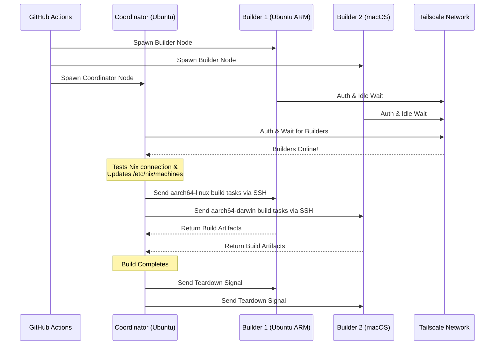

<div align="right">
  <details>
    <summary >🌐 ภาษา</summary>
    <div>
      <div align="center">
        <a href="https://openaitx.github.io/view.html?user=Misaka13514&project=setup-distributed-nix-builds&lang=en">English</a>
        | <a href="https://openaitx.github.io/view.html?user=Misaka13514&project=setup-distributed-nix-builds&lang=zh-CN">简体中文</a>
        | <a href="https://openaitx.github.io/view.html?user=Misaka13514&project=setup-distributed-nix-builds&lang=zh-TW">繁體中文</a>
        | <a href="https://openaitx.github.io/view.html?user=Misaka13514&project=setup-distributed-nix-builds&lang=ja">日本語</a>
        | <a href="https://openaitx.github.io/view.html?user=Misaka13514&project=setup-distributed-nix-builds&lang=ko">한국어</a>
        | <a href="https://openaitx.github.io/view.html?user=Misaka13514&project=setup-distributed-nix-builds&lang=hi">हिन्दी</a>
        | <a href="https://openaitx.github.io/view.html?user=Misaka13514&project=setup-distributed-nix-builds&lang=th">ไทย</a>
        | <a href="https://openaitx.github.io/view.html?user=Misaka13514&project=setup-distributed-nix-builds&lang=fr">Français</a>
        | <a href="https://openaitx.github.io/view.html?user=Misaka13514&project=setup-distributed-nix-builds&lang=de">Deutsch</a>
        | <a href="https://openaitx.github.io/view.html?user=Misaka13514&project=setup-distributed-nix-builds&lang=es">Español</a>
        | <a href="https://openaitx.github.io/view.html?user=Misaka13514&project=setup-distributed-nix-builds&lang=it">Italiano</a>
        | <a href="https://openaitx.github.io/view.html?user=Misaka13514&project=setup-distributed-nix-builds&lang=ru">Русский</a>
        | <a href="https://openaitx.github.io/view.html?user=Misaka13514&project=setup-distributed-nix-builds&lang=pt">Português</a>
        | <a href="https://openaitx.github.io/view.html?user=Misaka13514&project=setup-distributed-nix-builds&lang=nl">Nederlands</a>
        | <a href="https://openaitx.github.io/view.html?user=Misaka13514&project=setup-distributed-nix-builds&lang=pl">Polski</a>
        | <a href="https://openaitx.github.io/view.html?user=Misaka13514&project=setup-distributed-nix-builds&lang=ar">العربية</a>
        | <a href="https://openaitx.github.io/view.html?user=Misaka13514&project=setup-distributed-nix-builds&lang=fa">فارسی</a>
        | <a href="https://openaitx.github.io/view.html?user=Misaka13514&project=setup-distributed-nix-builds&lang=tr">Türkçe</a>
        | <a href="https://openaitx.github.io/view.html?user=Misaka13514&project=setup-distributed-nix-builds&lang=vi">Tiếng Việt</a>
        | <a href="https://openaitx.github.io/view.html?user=Misaka13514&project=setup-distributed-nix-builds&lang=id">Bahasa Indonesia</a>
        | <a href="https://openaitx.github.io/view.html?user=Misaka13514&project=setup-distributed-nix-builds&lang=as">অসমীয়া</
      </div>
    </div>
  </details>
</div>

# ❄️ ตั้งค่าการ Build แบบ Distributed ด้วย Nix

GitHub Action สำหรับเตรียมคลัสเตอร์ [Distributed Nix Build](https://wiki.nixos.org/wiki/Distributed_build) แบบชั่วคราว ข้ามแพลตฟอร์มได้ทันที โดยใช้ [GitHub Hosted Runners](https://docs.github.com/en/actions/reference/runners/github-hosted-runners) มาตรฐาน เชื่อมต่ออย่างปลอดภัยผ่าน Tailscale

แอคชันนี้ช่วยให้คุณสามารถเปิดใช้งาน runner รองของ GitHub หลายตัว (เรียกว่า **Builders**) และเชื่อมต่อกับ runner หลัก (เรียกว่า **Coordinator**) ได้อย่างราบรื่นผ่าน Tailscale SSH โดย Coordinator จะตั้งค่า Nix เพื่อใช้โนดเหล่านี้เป็น remote builder อัตโนมัติ เพิ่มประสิทธิภาพการ build พร้อมกันสูงสุดโดยไม่ต้องจัดการโครงสร้างพื้นฐานภายนอก! เหมาะสำหรับการ build แพ็กเกจหลายสถาปัตยกรรม หรือกระจายโหลด build ระบบ NixOS ขนาดใหญ่บน runner x86 หลายเครื่อง

## คุณสมบัติ

- 🚀 **Zero-Config Remote Builders:** กำหนดค่า `/etc/nix/machines` และเชื่อมต่อโหนดผ่าน Tailscale SSH อัตโนมัติ (ไม่ต้องใช้คีย์ SSH ด้วยตนเอง!)
- 🌍 **Cross-Platform & Multi-Arch:** ผสมผสาน Ubuntu (x86, ARM) และ macOS (Intel, Apple Silicon) รันเนอร์ในบิลด์เดียวกันได้
- ⚖️ **Horizontal Scaling for NixOS:** ต้องประเมินและสร้างคอนฟิก NixOS ขนาดใหญ่ใช่หรือไม่? สร้างฟาร์มโหนดเหมือนกันทั้งฟาร์ม (เช่น `ubuntu-24.04` รันเนอร์ 5 ตัว) และให้ Nix กระจายงาน build derivation แบบขนานอัตโนมัติไปยัง CPU core ทั้งหมดในคลัสเตอร์
- 🧹 **Maximum Disk Space:** ลบซอฟต์แวร์ที่ติดตั้งล่วงหน้าบน Linux runner อัตโนมัติ (ผ่าน [nothing-but-nix](https://github.com/wimpysworld/nothing-but-nix)) เพื่อเพิ่มพื้นที่ให้กับ Nix store ของคุณสูงสุด
- ⚡ **Built-in Caching:** ผสาน [magic-nix-cache](https://github.com/DeterminateSystems/magic-nix-cache-action) เพื่อเร่งการประเมิน flake และการ build ในเครื่อง
- 🛑 **Graceful Teardown:** ตัว builder จะรอคำสั่งอย่างสงบและยุติตัวเองอย่างปลอดภัยเมื่อ Coordinator ทำงานเสร็จ

## วิธีการทำงาน

เวิร์กโฟลว์นี้จะแยกรันเนอร์ออกเป็นสองบทบาทคือ `builder` และ `coordinator`



## ข้อกำหนดเบื้องต้น

ก่อนใช้แอคชันนี้ คุณต้องตั้งค่าเครือข่าย Tailscale เพื่อให้รันเนอร์สามารถสื่อสารกันได้อย่างปลอดภัย

1. **กำหนดค่า Tailscale ACLs:**
   ตรวจสอบให้แน่ใจว่าใน Tailscale ของคุณได้สร้างกลุ่มแท็ก และ ACLs อนุญาตให้โคออร์ดิเนเตอร์ SSH ไปยังบิลเดอร์ได้อย่างไร้รอยต่อด้วย Tailscale SSH
   เพิ่มสิ่งต่อไปนี้ลงใน [Tailscale Access Controls](https://login.tailscale.com/admin/acls/file) ของคุณ:

<details>
<summary>คลิกเพื่อดูการตั้งค่า Tailscale ACL ที่จำเป็น</summary>

```json
{
  "grants": [
    {
      "src": ["tag:nix-ci-builder", "tag:nix-ci-coordinator"],
      "dst": ["tag:nix-ci-builder", "tag:nix-ci-coordinator"],
      "ip": ["*"]
    }
  ],
  "ssh": [
    {
      "src": ["tag:nix-ci-coordinator"],
      "dst": ["tag:nix-ci-builder"],
      "users": ["autogroup:nonroot", "root"],
      "action": "accept"
    }
  ],
  "tagOwners": {
    "tag:nix-ci-coordinator": ["autogroup:admin", "tag:nix-ci-coordinator"],
    "tag:nix-ci-builder": ["autogroup:admin", "tag:nix-ci-builder"]
  }
}
```
</details>

2. **สร้าง Tailscale OAuth Client:**
   สร้าง OAuth Client Secret ใน [Tailscale Admin panel](https://login.tailscale.com/admin/settings/trust-credentials) ของคุณ โดยกำหนด `auth_keys` write scope และแท็ก `nix-ci-builder` `nix-ci-coordinator`
   เพิ่ม secret นี้ลงใน GitHub Repository Secrets ของคุณเป็น `TS_OAUTH_SECRET`

## อินพุต

| อินพุต                | คำอธิบาย                                                                                     | จำเป็นหรือไม่ | ค่าเริ่มต้น     |
| -------------------- | -------------------------------------------------------------------------------------------- | ------------ | ------------- |
| `tailscale_authkey`  | Tailscale OAuth client secret หรือ Auth Key.                                                 | **ใช่**      | N/A           |
| `tailscale_hostname` | ชื่อโฮสต์ที่จะลงทะเบียนกับ Tailscale.                                                        | **ใช่**      | N/A           |
| `tailscale_tags`     | แท็กที่จะประกาศไปยัง Tailscale (เช่น `tag:nix-ci-builder`).                                  | **ใช่**      | N/A           |
| `role`               | บทบาทของงานปัจจุบัน: `"builder"` หรือ `"coordinator"`.                                      | ใช่          | `"builder"`   |
| `builders`           | รายชื่อโฮสต์ของ builder เต็มรูปแบบที่คั่นด้วยช่องว่าง (_จำเป็นหากบทบาทเป็น coordinator_)     | ไม่          | `""`          |
| `builder_timeout`    | เวลาสูงสุด (วินาที) ที่ builder จะรอก่อนปิดตัวเอง                                          | ไม่          | `"300"`       |
| `extra_nix_config`   | คอนฟิก Nix เพิ่มเติมที่จะผนวกเข้า `/etc/nix/nix.conf`                                        | ไม่          | `""`          |

## วิธีใช้งาน

### ตัวอย่างการ Build แบบ Distributed เต็มรูปแบบ

ด้านล่างนี้คือตัวอย่าง workflow (`nix-build.yml`) ที่จะสั่งให้สปินอัพ runner หลายสถาปัตยกรรม (Ubuntu x86, Ubuntu ARM, macOS x86, macOS Apple Silicon) แบบไดนามิก เชื่อมต่อกัน และรัน distributed Nix build

หากคุณกำลัง build คอนฟิก NixOS ขนาดใหญ่และต้องการเร่งความเร็วด้วย horizontal scaling คุณสามารถเปลี่ยนค่า `BUILDER_COUNTS` เพื่อสั่งสปินอัพ x86 runner ที่เหมือนกันหลายตัว เช่น:
`BUILDER_COUNTS: '{"ubuntu-24.04": 4}'`
ซึ่งจะทำให้คุณมี build farm ที่มี 16 CPU cores (4 runners × 4 cores) เพื่อประมวลผล derivation แบบขนาน

เนื่องจาก GitHub Hosted Runners เป็นแบบชั่วคราว อาร์ติแฟกต์ที่ build ใน Nix store จะหายไปเมื่อ workflow เสร็จสมบูรณ์ หากต้องการนำผลลัพธ์จาก distributed builds ไปใช้ใน CI ครั้งถัดไปหรือบนเครื่อง local ของคุณ แนะนำให้ push ผลลัพธ์ไปที่ binary cache เช่น [Cachix](https://www.cachix.org) หรือ [Attic](https://github.com/zhaofengli/attic)

```yaml
name: Distributed Nix Build

on:
  workflow_dispatch:

env:
  # Define exactly how many runners of each OS type you want
  BUILDER_COUNTS: '{"ubuntu-24.04": 1, "ubuntu-24.04-arm": 1, "macos-26-intel": 1, "macos-26": 1}'

jobs:
  config:
    runs-on: ubuntu-slim
    outputs:
      builder_matrix: ${{ steps.set.outputs.builder_matrix }}
      builders_list: ${{ steps.set.outputs.builders_list }}
      run_suffix: ${{ steps.set.outputs.run_suffix }}
    steps:
      - id: set
        run: |
          SUFFIX=$(openssl rand -hex 3)
          echo "run_suffix=$SUFFIX" >> "$GITHUB_OUTPUT"

          # Dynamically generate the Matrix JSON based on BUILDER_COUNTS
          MATRIX_JSON=$(echo '${{ env.BUILDER_COUNTS }}' | jq -c '[
              to_entries[] | .key as $os | .value as $count |
              range(1; $count + 1) | { os: $os, id: "\($os)-\(.)" }
            ]
          ')
          echo "builder_matrix=$MATRIX_JSON" >> "$GITHUB_OUTPUT"

          # Create a space-separated list of hostnames for the coordinator
          BUILDERS_LIST=$(echo "$MATRIX_JSON" | jq -r --arg suffix "$SUFFIX" 'map("nix-builder-\($suffix)-\(.id)") | join(" ")')
          echo "builders_list=$BUILDERS_LIST" >> "$GITHUB_OUTPUT"

  builder:
    needs: config
    name: Builder ${{ matrix.builder.id }} (${{ needs.config.outputs.run_suffix }})
    runs-on: ${{ matrix.builder.os }}
    strategy:
      fail-fast: false
      matrix:
        builder: ${{ fromJSON(needs.config.outputs.builder_matrix) }}
    steps:
      - name: Setup Distributed Nix Builder
        uses: Misaka13514/setup-distributed-nix-builds@main
        with:
          tailscale_authkey: ${{ secrets.TS_OAUTH_SECRET }}
          tailscale_hostname: nix-builder-${{ needs.config.outputs.run_suffix }}-${{ matrix.builder.id }}
          tailscale_tags: tag:nix-ci-builder
          role: builder

      # Optionally configure your Cachix/Attic or other caching here
      # - uses: cachix/cachix-action@v17

  coordinator:
    needs: config
    name: Coordinator (${{ needs.config.outputs.run_suffix }})
    runs-on: ubuntu-24.04
    steps:
      - name: Setup Coordinator & Connect Builders
        uses: Misaka13514/setup-distributed-nix-builds@main
        with:
          tailscale_authkey: ${{ secrets.TS_OAUTH_SECRET }}
          tailscale_hostname: nix-coordinator-${{ needs.config.outputs.run_suffix }}
          tailscale_tags: tag:nix-ci-coordinator
          role: coordinator
          builders: ${{ needs.config.outputs.builders_list }}

      # Optionally configure your Cachix/Attic or other caching here
      # - uses: cachix/cachix-action@v17

      - name: Execute Distributed Build
        run: |
          # Your build command here. Because builders are registered in /etc/nix/machines,
          # Nix will automatically offload tasks to the correct architecture node.
          nix build -L --max-jobs 0 .#my-package

      # Signal builders to terminate if they are not needed anymore
      - name: Teardown Builders
        run: stop-nix-builders

      # Push build results to Cachix/Attic or other cache here if desired
      # - name: Push to Cachix
      #   run: cachix push mycache --all
```

## ใบอนุญาต

โครงการนี้อยู่ภายใต้เงื่อนไขของ [สัญญาอนุญาต MIT](LICENSE)



---


Tranlated By [Open Ai Tx](https://github.com/OpenAiTx/OpenAiTx) | Last indexed: 2026-03-27


---