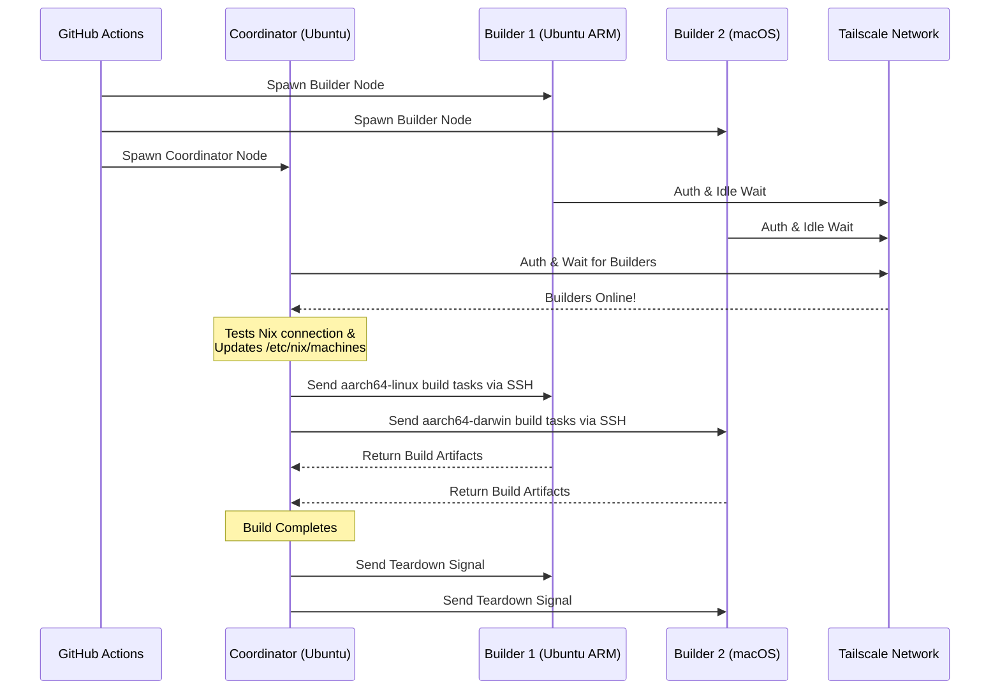

<div align="right">
  <details>
    <summary >🌐 Dil</summary>
    <div>
      <div align="center">
        <a href="https://openaitx.github.io/view.html?user=Misaka13514&project=setup-distributed-nix-builds&lang=en">English</a>
        | <a href="https://openaitx.github.io/view.html?user=Misaka13514&project=setup-distributed-nix-builds&lang=zh-CN">简体中文</a>
        | <a href="https://openaitx.github.io/view.html?user=Misaka13514&project=setup-distributed-nix-builds&lang=zh-TW">繁體中文</a>
        | <a href="https://openaitx.github.io/view.html?user=Misaka13514&project=setup-distributed-nix-builds&lang=ja">日本語</a>
        | <a href="https://openaitx.github.io/view.html?user=Misaka13514&project=setup-distributed-nix-builds&lang=ko">한국어</a>
        | <a href="https://openaitx.github.io/view.html?user=Misaka13514&project=setup-distributed-nix-builds&lang=hi">हिन्दी</a>
        | <a href="https://openaitx.github.io/view.html?user=Misaka13514&project=setup-distributed-nix-builds&lang=th">ไทย</a>
        | <a href="https://openaitx.github.io/view.html?user=Misaka13514&project=setup-distributed-nix-builds&lang=fr">Français</a>
        | <a href="https://openaitx.github.io/view.html?user=Misaka13514&project=setup-distributed-nix-builds&lang=de">Deutsch</a>
        | <a href="https://openaitx.github.io/view.html?user=Misaka13514&project=setup-distributed-nix-builds&lang=es">Español</a>
        | <a href="https://openaitx.github.io/view.html?user=Misaka13514&project=setup-distributed-nix-builds&lang=it">Italiano</a>
        | <a href="https://openaitx.github.io/view.html?user=Misaka13514&project=setup-distributed-nix-builds&lang=ru">Русский</a>
        | <a href="https://openaitx.github.io/view.html?user=Misaka13514&project=setup-distributed-nix-builds&lang=pt">Português</a>
        | <a href="https://openaitx.github.io/view.html?user=Misaka13514&project=setup-distributed-nix-builds&lang=nl">Nederlands</a>
        | <a href="https://openaitx.github.io/view.html?user=Misaka13514&project=setup-distributed-nix-builds&lang=pl">Polski</a>
        | <a href="https://openaitx.github.io/view.html?user=Misaka13514&project=setup-distributed-nix-builds&lang=ar">العربية</a>
        | <a href="https://openaitx.github.io/view.html?user=Misaka13514&project=setup-distributed-nix-builds&lang=fa">فارسی</a>
        | <a href="https://openaitx.github.io/view.html?user=Misaka13514&project=setup-distributed-nix-builds&lang=tr">Türkçe</a>
        | <a href="https://openaitx.github.io/view.html?user=Misaka13514&project=setup-distributed-nix-builds&lang=vi">Tiếng Việt</a>
        | <a href="https://openaitx.github.io/view.html?user=Misaka13514&project=setup-distributed-nix-builds&lang=id">Bahasa Indonesia</a>
        | <a href="https://openaitx.github.io/view.html?user=Misaka13514&project=setup-distributed-nix-builds&lang=as">অসমীয়া</
      </div>
    </div>
  </details>
</div>

# ❄️ Dağıtık Nix Derlemelerini Kurma

Ephemeral, platformlar arası [Dağıtık Nix Derlemesi](https://wiki.nixos.org/wiki/Distributed_build) kümesini standart [GitHub Hosted Runnerlar](https://docs.github.com/en/actions/reference/runners/github-hosted-runners) üzerinden Tailscale ile güvenli şekilde anında sağlamak için bir GitHub Action’ı.

Bu action, birincil runner’a ( **Koordinatör** ) sorunsuz şekilde bağlanan ikincil GitHub runner’larından ( **Derleyiciler** ) oluşan bir matris oluşturmanıza ve Tailscale SSH üzerinden bağlantı sağlamanıza olanak tanır. Koordinatör, Nix’i bu düğümleri uzak derleyiciler olarak kullanacak şekilde otomatik olarak yapılandırır; harici altyapı yönetmeden eşzamanlı derleme performansını en üst düzeye çıkarır! Çok mimarili paketler derlemek veya x86 runner filosu üzerinde ağır NixOS sistem kapamalarını yatay olarak ölçeklendirmek için mükemmeldir.

## Özellikler

- 🚀 **Sıfır-Konfigürasyon Uzaktan Derleyiciler:** `/etc/nix/machines` dosyasını otomatik olarak yapılandırır ve düğümleri Tailscale SSH ile bağlar (manuel SSH anahtarları gerekmez!).
- 🌍 **Çapraz Platform & Çoklu Mimari:** Aynı yapıda Ubuntu (x86, ARM) ve macOS (Intel, Apple Silicon) çalışanlarını karıştırıp eşleştirin.
- ⚖️ **NixOS için Yatay Ölçekleme:** Devasa bir NixOS yapılandırmasını değerlendirmek ve derlemek mi gerekiyor? Tamamen aynı düğümlerden oluşan bir çiftlik başlatın (örneğin, beş `ubuntu-24.04` çalışanı) ve Nix, tüm mevcut CPU çekirdeklerinde paralel türev derlemelerini otomatik olarak dağıtsın.
- 🧹 **Maksimum Disk Alanı:** Linux çalışanlarında önceden yüklenmiş yazılımları ([nothing-but-nix](https://github.com/wimpysworld/nothing-but-nix) ile) otomatik olarak temizler ve Nix deposuna maksimum alan kazandırır.
- ⚡ **Dahili Önbellekleme:** [magic-nix-cache](https://github.com/DeterminateSystems/magic-nix-cache-action) ile entegre olarak flake değerlendirmelerini ve yerel derlemeleri hızlandırır.
- 🛑 **Zarif Kapatma:** Derleyiciler, görevleri beklerken boşta kalır ve Koordinatör işlemi bitirdiğinde kendilerini zarifçe sonlandırır.

## Nasıl Çalışır

İş akışı, çalışanları iki role ayırır: `builder` ve `coordinator`.



## Önkoşullar

Bu işlemi kullanmadan önce, koşucuların güvenli bir şekilde iletişim kurabilmesi için bir Tailscale ağı yapılandırmanız gerekir.

1. **Tailscale ACL'lerini Yapılandırın:**
   Tailscale'inizde etiket gruplarının oluşturulduğundan ve ACL'lerin koordinatörün Tailscale SSH kullanarak yapılandırıcılara sorunsuz bir şekilde SSH yapmasına izin verdiğinden emin olun.
   Aşağıdakileri [Tailscale Erişim Kontrolleri](https://login.tailscale.com/admin/acls/file) bölümüne ekleyin:

<details>
<summary>Gerekli Tailscale ACL yapılandırmasını görüntülemek için tıklayın</summary>

```json
{
  "grants": [
    {
      "src": ["tag:nix-ci-builder", "tag:nix-ci-coordinator"],
      "dst": ["tag:nix-ci-builder", "tag:nix-ci-coordinator"],
      "ip": ["*"]
    }
  ],
  "ssh": [
    {
      "src": ["tag:nix-ci-coordinator"],
      "dst": ["tag:nix-ci-builder"],
      "users": ["autogroup:nonroot", "root"],
      "action": "accept"
    }
  ],
  "tagOwners": {
    "tag:nix-ci-coordinator": ["autogroup:admin", "tag:nix-ci-coordinator"],
    "tag:nix-ci-builder": ["autogroup:admin", "tag:nix-ci-builder"]
  }
}
```
</details>

2. **Tailscale OAuth İstemcisi Oluşturun:**
   [Tailscale Yönetim panelinizde](https://login.tailscale.com/admin/settings/trust-credentials) `auth_keys` yazma kapsamı ve `nix-ci-builder` ile `nix-ci-coordinator` etiketleriyle bir OAuth İstemci Sırrı oluşturun.
   Bu sırrı GitHub Depo Sırlarınızda `TS_OAUTH_SECRET` olarak ekleyin.

## Girdiler

| Girdi                | Açıklama                                                                                       | Gerekli  | Varsayılan  |
| -------------------- | ---------------------------------------------------------------------------------------------- | -------- | ----------- |
| `tailscale_authkey`  | Tailscale OAuth istemci sırrı veya Kimlik Anahtarı.                                            | **Evet** | N/A         |
| `tailscale_hostname` | Tailscale ile kaydedilecek ana bilgisayar adı.                                                 | **Evet** | N/A         |
| `tailscale_tags`     | Tailscale'a bildirilecek etiketler (örn. `tag:nix-ci-builder`).                                | **Evet** | N/A         |
| `role`               | Mevcut işin rolü: `"builder"` veya `"coordinator"`.                                            | Evet     | `"builder"` |
| `builders`           | Beklenecek tam builder ana bilgisayar adlarının boşlukla ayrılmış listesi. (_Rol coordinator ise gereklidir_) | Hayır     | `""`        |
| `builder_timeout`    | Builder'ın kendi kendini sonlandırmadan önce bekleyeceği maksimum süre (saniye cinsinden).     | Hayır    | `"300"`     |
| `extra_nix_config`   | `/etc/nix/nix.conf` dosyasına eklenecek ekstra Nix yapılandırması.                             | Hayır    | `""`        |

## Kullanım

### Tam Dağıtık Derleme Örneği

Aşağıda, birden fazla runner mimarisini (Ubuntu x86, Ubuntu ARM, macOS x86, macOS Apple Silicon) dinamik olarak başlatan, bunları birbirine bağlayan ve dağıtık bir Nix derlemesi çalıştıran eksiksiz bir iş akışı (`nix-build.yml`) bulunmaktadır.

Ağır bir NixOS yapılandırması oluşturuyorsanız ve sadece yatay ölçeklendirme ile hızlandırmak istiyorsanız, `BUILDER_COUNTS` değerini değiştirerek birden fazla aynı x86 runner başlatabilirsiniz. Örneğin:
`BUILDER_COUNTS: '{"ubuntu-24.04": 4}'` 
Bu, size anında 16 CPU çekirdeği (4 runner × 4 çekirdek) ile paralel olarak türevleri işleyebilecek bir derleme çiftliği sağlar.

GitHub Hosted Runner'lar geçici olduğundan, iş akışı tamamlandığında Nix deposundaki tüm derleme çıktıları kaybolacaktır. Dağıtık derlemelerinizin avantajlarından gelecekteki CI çalıştırmalarında veya yerel makinelerinizde faydalanmak için, sonuçları [Cachix](https://www.cachix.org) veya [Attic](https://github.com/zhaofengli/attic) gibi bir binary cache'e göndermeniz şiddetle tavsiye edilir.

```yaml
name: Distributed Nix Build

on:
  workflow_dispatch:

env:
  # Define exactly how many runners of each OS type you want
  BUILDER_COUNTS: '{"ubuntu-24.04": 1, "ubuntu-24.04-arm": 1, "macos-26-intel": 1, "macos-26": 1}'

jobs:
  config:
    runs-on: ubuntu-slim
    outputs:
      builder_matrix: ${{ steps.set.outputs.builder_matrix }}
      builders_list: ${{ steps.set.outputs.builders_list }}
      run_suffix: ${{ steps.set.outputs.run_suffix }}
    steps:
      - id: set
        run: |
          SUFFIX=$(openssl rand -hex 3)
          echo "run_suffix=$SUFFIX" >> "$GITHUB_OUTPUT"

          # Dynamically generate the Matrix JSON based on BUILDER_COUNTS
          MATRIX_JSON=$(echo '${{ env.BUILDER_COUNTS }}' | jq -c '[
              to_entries[] | .key as $os | .value as $count |
              range(1; $count + 1) | { os: $os, id: "\($os)-\(.)" }
            ]
          ')
          echo "builder_matrix=$MATRIX_JSON" >> "$GITHUB_OUTPUT"

          # Create a space-separated list of hostnames for the coordinator
          BUILDERS_LIST=$(echo "$MATRIX_JSON" | jq -r --arg suffix "$SUFFIX" 'map("nix-builder-\($suffix)-\(.id)") | join(" ")')
          echo "builders_list=$BUILDERS_LIST" >> "$GITHUB_OUTPUT"

  builder:
    needs: config
    name: Builder ${{ matrix.builder.id }} (${{ needs.config.outputs.run_suffix }})
    runs-on: ${{ matrix.builder.os }}
    strategy:
      fail-fast: false
      matrix:
        builder: ${{ fromJSON(needs.config.outputs.builder_matrix) }}
    steps:
      - name: Setup Distributed Nix Builder
        uses: Misaka13514/setup-distributed-nix-builds@main
        with:
          tailscale_authkey: ${{ secrets.TS_OAUTH_SECRET }}
          tailscale_hostname: nix-builder-${{ needs.config.outputs.run_suffix }}-${{ matrix.builder.id }}
          tailscale_tags: tag:nix-ci-builder
          role: builder

      # Optionally configure your Cachix/Attic or other caching here
      # - uses: cachix/cachix-action@v17

  coordinator:
    needs: config
    name: Coordinator (${{ needs.config.outputs.run_suffix }})
    runs-on: ubuntu-24.04
    steps:
      - name: Setup Coordinator & Connect Builders
        uses: Misaka13514/setup-distributed-nix-builds@main
        with:
          tailscale_authkey: ${{ secrets.TS_OAUTH_SECRET }}
          tailscale_hostname: nix-coordinator-${{ needs.config.outputs.run_suffix }}
          tailscale_tags: tag:nix-ci-coordinator
          role: coordinator
          builders: ${{ needs.config.outputs.builders_list }}

      # Optionally configure your Cachix/Attic or other caching here
      # - uses: cachix/cachix-action@v17

      - name: Execute Distributed Build
        run: |
          # Your build command here. Because builders are registered in /etc/nix/machines,
          # Nix will automatically offload tasks to the correct architecture node.
          nix build -L --max-jobs 0 .#my-package

      # Signal builders to terminate if they are not needed anymore
      - name: Teardown Builders
        run: stop-nix-builders

      # Push build results to Cachix/Attic or other cache here if desired
      # - name: Push to Cachix
      #   run: cachix push mycache --all
```

## Lisans

Bu proje [MIT Lisansı](LICENSE) kapsamında lisanslanmıştır.



---


Tranlated By [Open Ai Tx](https://github.com/OpenAiTx/OpenAiTx) | Last indexed: 2026-03-27


---