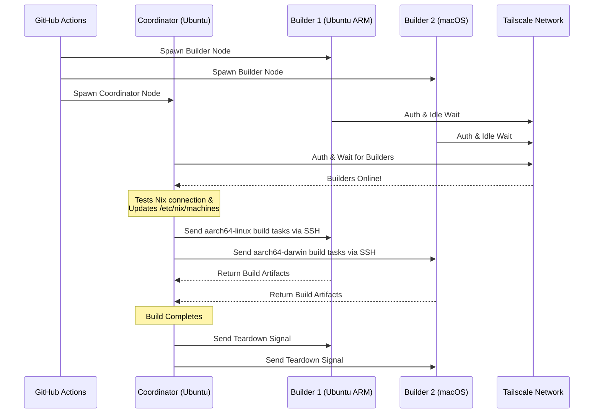

<div align="right">
  <details>
    <summary >🌐 Ngôn ngữ</summary>
    <div>
      <div align="center">
        <a href="https://openaitx.github.io/view.html?user=Misaka13514&project=setup-distributed-nix-builds&lang=en">English</a>
        | <a href="https://openaitx.github.io/view.html?user=Misaka13514&project=setup-distributed-nix-builds&lang=zh-CN">简体中文</a>
        | <a href="https://openaitx.github.io/view.html?user=Misaka13514&project=setup-distributed-nix-builds&lang=zh-TW">繁體中文</a>
        | <a href="https://openaitx.github.io/view.html?user=Misaka13514&project=setup-distributed-nix-builds&lang=ja">日本語</a>
        | <a href="https://openaitx.github.io/view.html?user=Misaka13514&project=setup-distributed-nix-builds&lang=ko">한국어</a>
        | <a href="https://openaitx.github.io/view.html?user=Misaka13514&project=setup-distributed-nix-builds&lang=hi">हिन्दी</a>
        | <a href="https://openaitx.github.io/view.html?user=Misaka13514&project=setup-distributed-nix-builds&lang=th">ไทย</a>
        | <a href="https://openaitx.github.io/view.html?user=Misaka13514&project=setup-distributed-nix-builds&lang=fr">Français</a>
        | <a href="https://openaitx.github.io/view.html?user=Misaka13514&project=setup-distributed-nix-builds&lang=de">Deutsch</a>
        | <a href="https://openaitx.github.io/view.html?user=Misaka13514&project=setup-distributed-nix-builds&lang=es">Español</a>
        | <a href="https://openaitx.github.io/view.html?user=Misaka13514&project=setup-distributed-nix-builds&lang=it">Italiano</a>
        | <a href="https://openaitx.github.io/view.html?user=Misaka13514&project=setup-distributed-nix-builds&lang=ru">Русский</a>
        | <a href="https://openaitx.github.io/view.html?user=Misaka13514&project=setup-distributed-nix-builds&lang=pt">Português</a>
        | <a href="https://openaitx.github.io/view.html?user=Misaka13514&project=setup-distributed-nix-builds&lang=nl">Nederlands</a>
        | <a href="https://openaitx.github.io/view.html?user=Misaka13514&project=setup-distributed-nix-builds&lang=pl">Polski</a>
        | <a href="https://openaitx.github.io/view.html?user=Misaka13514&project=setup-distributed-nix-builds&lang=ar">العربية</a>
        | <a href="https://openaitx.github.io/view.html?user=Misaka13514&project=setup-distributed-nix-builds&lang=fa">فارسی</a>
        | <a href="https://openaitx.github.io/view.html?user=Misaka13514&project=setup-distributed-nix-builds&lang=tr">Türkçe</a>
        | <a href="https://openaitx.github.io/view.html?user=Misaka13514&project=setup-distributed-nix-builds&lang=vi">Tiếng Việt</a>
        | <a href="https://openaitx.github.io/view.html?user=Misaka13514&project=setup-distributed-nix-builds&lang=id">Bahasa Indonesia</a>
        | <a href="https://openaitx.github.io/view.html?user=Misaka13514&project=setup-distributed-nix-builds&lang=as">অসমীয়া</
      </div>
    </div>
  </details>
</div>

# ❄️ Thiết lập Xây dựng Nix Phân tán

Một GitHub Action để cung cấp tức thời một cụm [Xây dựng Nix Phân tán](https://wiki.nixos.org/wiki/Distributed_build) đa nền tảng, tạm thời bằng cách sử dụng các [GitHub Hosted Runners](https://docs.github.com/en/actions/reference/runners/github-hosted-runners) tiêu chuẩn được kết nối bảo mật qua Tailscale.

Action này cho phép bạn khởi tạo một ma trận các runner phụ của GitHub (gọi là **Builders**) và kết nối chúng với runner chính (gọi là **Coordinator**) một cách liền mạch qua Tailscale SSH. Coordinator sẽ tự động cấu hình Nix để sử dụng các node này làm máy xây dựng từ xa, tối đa hóa hiệu suất xây dựng đồng thời mà không cần quản lý hạ tầng bên ngoài! Rất phù hợp để xây dựng các gói đa kiến trúc hoặc mở rộng quy mô ngang các đóng hệ thống NixOS nặng trên nhiều runner x86.

## Tính năng

- 🚀 **Remote Builders không cần cấu hình:** Tự động cấu hình `/etc/nix/machines` và kết nối các node qua Tailscale SSH (không cần khóa SSH thủ công!).
- 🌍 **Đa nền tảng & Đa kiến trúc:** Kết hợp Ubuntu (x86, ARM) và macOS (Intel, Apple Silicon) runners trong cùng một build.
- ⚖️ **Mở rộng ngang cho NixOS:** Cần đánh giá và build một cấu hình NixOS khổng lồ? Khởi tạo cả một cụm node giống nhau (ví dụ, năm runner `ubuntu-24.04`) và để Nix tự động phân phối các build derivation song song trên tất cả lõi CPU khả dụng trong cụm.
- 🧹 **Tối đa dung lượng đĩa:** Tự động dọn dẹp phần mềm cài sẵn trên Linux runners (thông qua [nothing-but-nix](https://github.com/wimpysworld/nothing-but-nix)) để dành tối đa không gian cho Nix store.
- ⚡ **Tích hợp cache:** Tích hợp [magic-nix-cache](https://github.com/DeterminateSystems/magic-nix-cache-action) để tăng tốc đánh giá flake và build cục bộ.
- 🛑 **Dừng hoạt động an toàn:** Các builder chờ nhiệm vụ nhàn rỗi và tự động dừng an toàn khi Coordinator hoàn thành.

## Cách hoạt động

Quy trình làm việc chia runners thành hai vai trò: `builder` và `coordinator`.



## Yêu cầu trước

Trước khi sử dụng hành động này, bạn cần cấu hình một mạng Tailscale để các runner có thể giao tiếp an toàn.

1. **Cấu hình ACLs của Tailscale:**
   Đảm bảo bạn đã tạo nhóm thẻ trong Tailscale và ACLs cho phép coordinator SSH vào các builder một cách liền mạch bằng Tailscale SSH.
   Thêm nội dung sau vào [Kiểm soát truy cập Tailscale](https://login.tailscale.com/admin/acls/file):

<details>
<summary>Nhấn để xem cấu hình ACLs cần thiết của Tailscale</summary>

```json
{
  "grants": [
    {
      "src": ["tag:nix-ci-builder", "tag:nix-ci-coordinator"],
      "dst": ["tag:nix-ci-builder", "tag:nix-ci-coordinator"],
      "ip": ["*"]
    }
  ],
  "ssh": [
    {
      "src": ["tag:nix-ci-coordinator"],
      "dst": ["tag:nix-ci-builder"],
      "users": ["autogroup:nonroot", "root"],
      "action": "accept"
    }
  ],
  "tagOwners": {
    "tag:nix-ci-coordinator": ["autogroup:admin", "tag:nix-ci-coordinator"],
    "tag:nix-ci-builder": ["autogroup:admin", "tag:nix-ci-builder"]
  }
}
```
</details>

2. **Tạo một OAuth Client cho Tailscale:**
   Tạo một OAuth Client Secret trong [Bảng điều khiển quản trị Tailscale](https://login.tailscale.com/admin/settings/trust-credentials), với quyền ghi `auth_keys` và các thẻ `nix-ci-builder`, `nix-ci-coordinator`.
   Thêm secret này vào Secrets của Repository GitHub của bạn với tên `TS_OAUTH_SECRET`.

## Tham số đầu vào

| Tham số             | Mô tả                                                                                          | Bắt buộc | Mặc định     |
| ------------------- | ---------------------------------------------------------------------------------------------- | -------- | ------------ |
| `tailscale_authkey` | Secret OAuth client hoặc Auth Key của Tailscale.                                               | **Có**   | N/A          |
| `tailscale_hostname`| Tên máy chủ sẽ đăng ký với Tailscale.                                                          | **Có**   | N/A          |
| `tailscale_tags`    | Thẻ để quảng bá tới Tailscale (ví dụ: `tag:nix-ci-builder`).                                   | **Có**   | N/A          |
| `role`              | Vai trò của job hiện tại: `"builder"` hoặc `"coordinator"`.                                   | Có       | `"builder"`  |
| `builders`          | Danh sách tên máy builder đầy đủ, phân tách bởi dấu cách, để chờ. (_Bắt buộc nếu là coordinator_)| Không    | `""`         |
| `builder_timeout`   | Thời gian tối đa (giây) builder sẽ chờ trước khi tự kết thúc.                                  | Không    | `"300"`      |
| `extra_nix_config`  | Cấu hình Nix bổ sung để thêm vào `/etc/nix/nix.conf`.                                         | Không    | `""`         |

## Cách sử dụng

### Ví dụ build phân tán hoàn chỉnh

Dưới đây là một workflow hoàn chỉnh (`nix-build.yml`) sẽ khởi tạo động nhiều runner với các kiến trúc khác nhau (Ubuntu x86, Ubuntu ARM, macOS x86, macOS Apple Silicon), kết nối chúng với nhau và thực hiện một build Nix phân tán.

Nếu bạn đang build một cấu hình NixOS nặng và chỉ muốn tăng tốc thông qua mở rộng ngang, bạn có thể thay đổi `BUILDER_COUNTS` để khởi tạo nhiều runner x86 giống nhau. Ví dụ:
`BUILDER_COUNTS: '{"ubuntu-24.04": 4}'`
Điều này sẽ giúp bạn có ngay một build farm với 16 nhân CPU (4 runner × 4 nhân) để xử lý các derivation song song.

Vì các GitHub Hosted Runner là tạm thời, tất cả artifact build trong Nix store sẽ bị mất khi workflow kết thúc. Để tận dụng kết quả build phân tán cho các lần chạy CI sau hoặc trên máy local, rất khuyến nghị bạn đẩy kết quả lên binary cache như [Cachix](https://www.cachix.org) hoặc [Attic](https://github.com/zhaofengli/attic).

```yaml
name: Distributed Nix Build

on:
  workflow_dispatch:

env:
  # Define exactly how many runners of each OS type you want
  BUILDER_COUNTS: '{"ubuntu-24.04": 1, "ubuntu-24.04-arm": 1, "macos-26-intel": 1, "macos-26": 1}'

jobs:
  config:
    runs-on: ubuntu-slim
    outputs:
      builder_matrix: ${{ steps.set.outputs.builder_matrix }}
      builders_list: ${{ steps.set.outputs.builders_list }}
      run_suffix: ${{ steps.set.outputs.run_suffix }}
    steps:
      - id: set
        run: |
          SUFFIX=$(openssl rand -hex 3)
          echo "run_suffix=$SUFFIX" >> "$GITHUB_OUTPUT"

          # Dynamically generate the Matrix JSON based on BUILDER_COUNTS
          MATRIX_JSON=$(echo '${{ env.BUILDER_COUNTS }}' | jq -c '[
              to_entries[] | .key as $os | .value as $count |
              range(1; $count + 1) | { os: $os, id: "\($os)-\(.)" }
            ]
          ')
          echo "builder_matrix=$MATRIX_JSON" >> "$GITHUB_OUTPUT"

          # Create a space-separated list of hostnames for the coordinator
          BUILDERS_LIST=$(echo "$MATRIX_JSON" | jq -r --arg suffix "$SUFFIX" 'map("nix-builder-\($suffix)-\(.id)") | join(" ")')
          echo "builders_list=$BUILDERS_LIST" >> "$GITHUB_OUTPUT"

  builder:
    needs: config
    name: Builder ${{ matrix.builder.id }} (${{ needs.config.outputs.run_suffix }})
    runs-on: ${{ matrix.builder.os }}
    strategy:
      fail-fast: false
      matrix:
        builder: ${{ fromJSON(needs.config.outputs.builder_matrix) }}
    steps:
      - name: Setup Distributed Nix Builder
        uses: Misaka13514/setup-distributed-nix-builds@main
        with:
          tailscale_authkey: ${{ secrets.TS_OAUTH_SECRET }}
          tailscale_hostname: nix-builder-${{ needs.config.outputs.run_suffix }}-${{ matrix.builder.id }}
          tailscale_tags: tag:nix-ci-builder
          role: builder

      # Optionally configure your Cachix/Attic or other caching here
      # - uses: cachix/cachix-action@v17

  coordinator:
    needs: config
    name: Coordinator (${{ needs.config.outputs.run_suffix }})
    runs-on: ubuntu-24.04
    steps:
      - name: Setup Coordinator & Connect Builders
        uses: Misaka13514/setup-distributed-nix-builds@main
        with:
          tailscale_authkey: ${{ secrets.TS_OAUTH_SECRET }}
          tailscale_hostname: nix-coordinator-${{ needs.config.outputs.run_suffix }}
          tailscale_tags: tag:nix-ci-coordinator
          role: coordinator
          builders: ${{ needs.config.outputs.builders_list }}

      # Optionally configure your Cachix/Attic or other caching here
      # - uses: cachix/cachix-action@v17

      - name: Execute Distributed Build
        run: |
          # Your build command here. Because builders are registered in /etc/nix/machines,
          # Nix will automatically offload tasks to the correct architecture node.
          nix build -L --max-jobs 0 .#my-package

      # Signal builders to terminate if they are not needed anymore
      - name: Teardown Builders
        run: stop-nix-builders

      # Push build results to Cachix/Attic or other cache here if desired
      # - name: Push to Cachix
      #   run: cachix push mycache --all
```

## Giấy phép

Dự án này được cấp phép theo [Giấy phép MIT](LICENSE).



---


Tranlated By [Open Ai Tx](https://github.com/OpenAiTx/OpenAiTx) | Last indexed: 2026-03-27


---