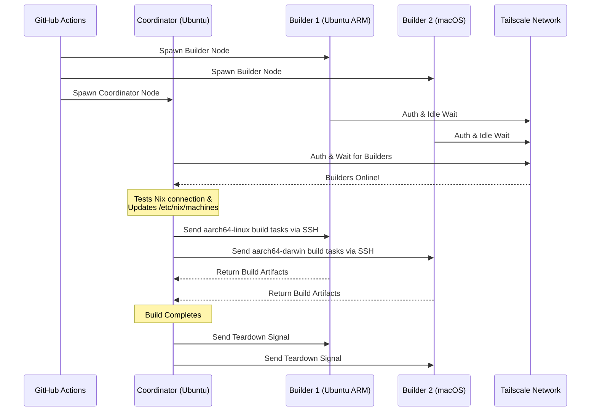

<div align="right">
  <details>
    <summary >🌐 语言</summary>
    <div>
      <div align="center">
        <a href="https://openaitx.github.io/view.html?user=Misaka13514&project=setup-distributed-nix-builds&lang=en">English</a>
        | <a href="https://openaitx.github.io/view.html?user=Misaka13514&project=setup-distributed-nix-builds&lang=zh-CN">简体中文</a>
        | <a href="https://openaitx.github.io/view.html?user=Misaka13514&project=setup-distributed-nix-builds&lang=zh-TW">繁體中文</a>
        | <a href="https://openaitx.github.io/view.html?user=Misaka13514&project=setup-distributed-nix-builds&lang=ja">日本語</a>
        | <a href="https://openaitx.github.io/view.html?user=Misaka13514&project=setup-distributed-nix-builds&lang=ko">한국어</a>
        | <a href="https://openaitx.github.io/view.html?user=Misaka13514&project=setup-distributed-nix-builds&lang=hi">हिन्दी</a>
        | <a href="https://openaitx.github.io/view.html?user=Misaka13514&project=setup-distributed-nix-builds&lang=th">ไทย</a>
        | <a href="https://openaitx.github.io/view.html?user=Misaka13514&project=setup-distributed-nix-builds&lang=fr">Français</a>
        | <a href="https://openaitx.github.io/view.html?user=Misaka13514&project=setup-distributed-nix-builds&lang=de">Deutsch</a>
        | <a href="https://openaitx.github.io/view.html?user=Misaka13514&project=setup-distributed-nix-builds&lang=es">Español</a>
        | <a href="https://openaitx.github.io/view.html?user=Misaka13514&project=setup-distributed-nix-builds&lang=it">Italiano</a>
        | <a href="https://openaitx.github.io/view.html?user=Misaka13514&project=setup-distributed-nix-builds&lang=ru">Русский</a>
        | <a href="https://openaitx.github.io/view.html?user=Misaka13514&project=setup-distributed-nix-builds&lang=pt">Português</a>
        | <a href="https://openaitx.github.io/view.html?user=Misaka13514&project=setup-distributed-nix-builds&lang=nl">Nederlands</a>
        | <a href="https://openaitx.github.io/view.html?user=Misaka13514&project=setup-distributed-nix-builds&lang=pl">Polski</a>
        | <a href="https://openaitx.github.io/view.html?user=Misaka13514&project=setup-distributed-nix-builds&lang=ar">العربية</a>
        | <a href="https://openaitx.github.io/view.html?user=Misaka13514&project=setup-distributed-nix-builds&lang=fa">فارسی</a>
        | <a href="https://openaitx.github.io/view.html?user=Misaka13514&project=setup-distributed-nix-builds&lang=tr">Türkçe</a>
        | <a href="https://openaitx.github.io/view.html?user=Misaka13514&project=setup-distributed-nix-builds&lang=vi">Tiếng Việt</a>
        | <a href="https://openaitx.github.io/view.html?user=Misaka13514&project=setup-distributed-nix-builds&lang=id">Bahasa Indonesia</a>
        | <a href="https://openaitx.github.io/view.html?user=Misaka13514&project=setup-distributed-nix-builds&lang=as">অসমীয়া</
      </div>
    </div>
  </details>
</div>

# ❄️ 配置分布式 Nix 构建

一个 GitHub Action，可即时使用标准的 [GitHub 托管运行器](https://docs.github.com/en/actions/reference/runners/github-hosted-runners) 通过 Tailscale 安全连接，快速搭建临时的、跨平台的 [分布式 Nix 构建](https://wiki.nixos.org/wiki/Distributed_build) 集群。

此 Action 允许你启动一组作为辅助 GitHub 运行器（即 **构建者**），并通过 Tailscale SSH 无缝连接到主运行器（即 **协调者**）。协调者会自动配置 Nix 使用这些节点作为远程构建器，无需管理外部基础设施，即可最大化并发构建性能！非常适合构建多架构软件包，或在大量 x86 运行器间横向扩展 NixOS 系统闭包的重负载构建。

## 功能

- 🚀 **零配置远程构建器：** 自动配置 `/etc/nix/machines` 并通过 Tailscale SSH 连接节点（无需手动 SSH 密钥！）。
- 🌍 **跨平台 & 多架构：** 可在同一次构建中混合使用 Ubuntu（x86，ARM）和 macOS（Intel，Apple Silicon）运行器。
- ⚖️ **NixOS 水平扩展：** 需要评估和构建庞大的 NixOS 配置？可启动一整个相同节点的集群（如五个 `ubuntu-24.04` 运行器），让 Nix 自动将并行派生构建分发到集群中所有可用 CPU 核心。
- 🧹 **最大磁盘空间：** 自动清理 Linux 运行器上预装软件（通过 [nothing-but-nix](https://github.com/wimpysworld/nothing-but-nix)），为 Nix store 腾出最大空间。
- ⚡ **内置缓存：** 集成 [magic-nix-cache](https://github.com/DeterminateSystems/magic-nix-cache-action) 加速 flake 评估和本地构建。
- 🛑 **优雅拆解：** 构建器空闲等待任务，并在协调器完成后优雅自我终止。

## 工作原理

工作流将运行器分为两类角色：`builder` 和 `coordinator`。



## 前提条件

在使用此操作之前，您需要配置一个 Tailscale 网络，以便运行器能够安全通信。

1. **配置 Tailscale 访问控制列表（ACLs）：**
   确保您的 Tailscale 已创建标签组，并且 ACL 允许协调器通过 Tailscale SSH 无缝地 SSH 进入构建器。
   将以下内容添加到您的 [Tailscale 访问控制](https://login.tailscale.com/admin/acls/file) 文件中：

<details>
<summary>点击查看所需的 Tailscale ACL 配置</summary>

```json
{
  "grants": [
    {
      "src": ["tag:nix-ci-builder", "tag:nix-ci-coordinator"],
      "dst": ["tag:nix-ci-builder", "tag:nix-ci-coordinator"],
      "ip": ["*"]
    }
  ],
  "ssh": [
    {
      "src": ["tag:nix-ci-coordinator"],
      "dst": ["tag:nix-ci-builder"],
      "users": ["autogroup:nonroot", "root"],
      "action": "accept"
    }
  ],
  "tagOwners": {
    "tag:nix-ci-coordinator": ["autogroup:admin", "tag:nix-ci-coordinator"],
    "tag:nix-ci-builder": ["autogroup:admin", "tag:nix-ci-builder"]
  }
}
```
</details>

2. **创建一个 Tailscale OAuth 客户端：**  
   在您的 [Tailscale 管理面板](https://login.tailscale.com/admin/settings/trust-credentials) 中生成一个 OAuth 客户端密钥，带有 `auth_keys` 写权限和 `nix-ci-builder`、`nix-ci-coordinator` 标签。  
   将此密钥添加到您的 GitHub 仓库 Secrets 中，命名为 `TS_OAUTH_SECRET`。

## 输入

| 输入                 | 描述                                                                                          | 必需     | 默认值      |
| -------------------- | --------------------------------------------------------------------------------------------- | -------- | ----------- |
| `tailscale_authkey`  | Tailscale OAuth 客户端密钥或认证密钥。                                                         | **是**   | 无          |
| `tailscale_hostname` | 要注册到 Tailscale 的主机名。                                                                  | **是**   | 无          |
| `tailscale_tags`     | 向 Tailscale 广告的标签（例如 `tag:nix-ci-builder`）。                                         | **是**   | 无          |
| `role`               | 当前任务的角色：“builder” 或 “coordinator”。                                                  | 是       | `"builder"` |
| `builders`           | 以空格分隔的完整构建者主机名列表，需等待它们完成。（_如果角色是 coordinator，则必需_）           | 否       | `""`        |
| `builder_timeout`    | 构建者在自我终止前等待的最长时间（秒）。                                                       | 否       | `"300"`     |
| `extra_nix_config`   | 追加到 `/etc/nix/nix.conf` 的额外 Nix 配置。                                                  | 否       | `""`        |

## 用法

### 完整分布式构建示例

下面是一个完整的工作流示例（`nix-build.yml`），它动态启动多个运行器架构（Ubuntu x86、Ubuntu ARM、macOS x86、macOS Apple Silicon），将它们连接起来，并运行分布式 Nix 构建。

如果您正在构建一个大型的 NixOS 配置，并且只是想通过水平扩展来加速它，您可以更改 `BUILDER_COUNTS` 来启动多个相同的 x86 运行器。例如：  
`BUILDER_COUNTS: '{"ubuntu-24.04": 4}'`  
这将立即为您提供一个拥有 16 个 CPU 核心（4 个运行器 × 4 核心）的构建集群，用于并行处理派生。

由于 GitHub 托管的运行器是临时的，工作流完成后 Nix 存储中的所有构建产物都会丢失。为了在未来的 CI 运行或本地机器上重用分布式构建的成果，强烈建议将结果推送到二进制缓存，如 [Cachix](https://www.cachix.org) 或 [Attic](https://github.com/zhaofengli/attic)。

```yaml
name: Distributed Nix Build

on:
  workflow_dispatch:

env:
  # Define exactly how many runners of each OS type you want
  BUILDER_COUNTS: '{"ubuntu-24.04": 1, "ubuntu-24.04-arm": 1, "macos-26-intel": 1, "macos-26": 1}'

jobs:
  config:
    runs-on: ubuntu-slim
    outputs:
      builder_matrix: ${{ steps.set.outputs.builder_matrix }}
      builders_list: ${{ steps.set.outputs.builders_list }}
      run_suffix: ${{ steps.set.outputs.run_suffix }}
    steps:
      - id: set
        run: |
          SUFFIX=$(openssl rand -hex 3)
          echo "run_suffix=$SUFFIX" >> "$GITHUB_OUTPUT"

          # Dynamically generate the Matrix JSON based on BUILDER_COUNTS
          MATRIX_JSON=$(echo '${{ env.BUILDER_COUNTS }}' | jq -c '[
              to_entries[] | .key as $os | .value as $count |
              range(1; $count + 1) | { os: $os, id: "\($os)-\(.)" }
            ]
          ')
          echo "builder_matrix=$MATRIX_JSON" >> "$GITHUB_OUTPUT"

          # Create a space-separated list of hostnames for the coordinator
          BUILDERS_LIST=$(echo "$MATRIX_JSON" | jq -r --arg suffix "$SUFFIX" 'map("nix-builder-\($suffix)-\(.id)") | join(" ")')
          echo "builders_list=$BUILDERS_LIST" >> "$GITHUB_OUTPUT"

  builder:
    needs: config
    name: Builder ${{ matrix.builder.id }} (${{ needs.config.outputs.run_suffix }})
    runs-on: ${{ matrix.builder.os }}
    strategy:
      fail-fast: false
      matrix:
        builder: ${{ fromJSON(needs.config.outputs.builder_matrix) }}
    steps:
      - name: Setup Distributed Nix Builder
        uses: Misaka13514/setup-distributed-nix-builds@main
        with:
          tailscale_authkey: ${{ secrets.TS_OAUTH_SECRET }}
          tailscale_hostname: nix-builder-${{ needs.config.outputs.run_suffix }}-${{ matrix.builder.id }}
          tailscale_tags: tag:nix-ci-builder
          role: builder

      # Optionally configure your Cachix/Attic or other caching here
      # - uses: cachix/cachix-action@v17

  coordinator:
    needs: config
    name: Coordinator (${{ needs.config.outputs.run_suffix }})
    runs-on: ubuntu-24.04
    steps:
      - name: Setup Coordinator & Connect Builders
        uses: Misaka13514/setup-distributed-nix-builds@main
        with:
          tailscale_authkey: ${{ secrets.TS_OAUTH_SECRET }}
          tailscale_hostname: nix-coordinator-${{ needs.config.outputs.run_suffix }}
          tailscale_tags: tag:nix-ci-coordinator
          role: coordinator
          builders: ${{ needs.config.outputs.builders_list }}

      # Optionally configure your Cachix/Attic or other caching here
      # - uses: cachix/cachix-action@v17

      - name: Execute Distributed Build
        run: |
          # Your build command here. Because builders are registered in /etc/nix/machines,
          # Nix will automatically offload tasks to the correct architecture node.
          nix build -L --max-jobs 0 .#my-package

      # Signal builders to terminate if they are not needed anymore
      - name: Teardown Builders
        run: stop-nix-builders

      # Push build results to Cachix/Attic or other cache here if desired
      # - name: Push to Cachix
      #   run: cachix push mycache --all
```

## 许可证

本项目根据[MIT 许可证](LICENSE)授权。



---


Tranlated By [Open Ai Tx](https://github.com/OpenAiTx/OpenAiTx) | Last indexed: 2026-03-27


---