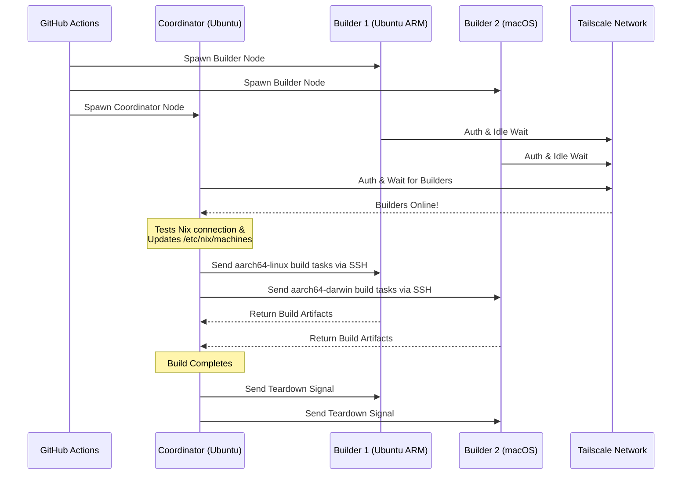

<div align="right">
  <details>
    <summary >🌐 語言</summary>
    <div>
      <div align="center">
        <a href="https://openaitx.github.io/view.html?user=Misaka13514&project=setup-distributed-nix-builds&lang=en">English</a>
        | <a href="https://openaitx.github.io/view.html?user=Misaka13514&project=setup-distributed-nix-builds&lang=zh-CN">简体中文</a>
        | <a href="https://openaitx.github.io/view.html?user=Misaka13514&project=setup-distributed-nix-builds&lang=zh-TW">繁體中文</a>
        | <a href="https://openaitx.github.io/view.html?user=Misaka13514&project=setup-distributed-nix-builds&lang=ja">日本語</a>
        | <a href="https://openaitx.github.io/view.html?user=Misaka13514&project=setup-distributed-nix-builds&lang=ko">한국어</a>
        | <a href="https://openaitx.github.io/view.html?user=Misaka13514&project=setup-distributed-nix-builds&lang=hi">हिन्दी</a>
        | <a href="https://openaitx.github.io/view.html?user=Misaka13514&project=setup-distributed-nix-builds&lang=th">ไทย</a>
        | <a href="https://openaitx.github.io/view.html?user=Misaka13514&project=setup-distributed-nix-builds&lang=fr">Français</a>
        | <a href="https://openaitx.github.io/view.html?user=Misaka13514&project=setup-distributed-nix-builds&lang=de">Deutsch</a>
        | <a href="https://openaitx.github.io/view.html?user=Misaka13514&project=setup-distributed-nix-builds&lang=es">Español</a>
        | <a href="https://openaitx.github.io/view.html?user=Misaka13514&project=setup-distributed-nix-builds&lang=it">Italiano</a>
        | <a href="https://openaitx.github.io/view.html?user=Misaka13514&project=setup-distributed-nix-builds&lang=ru">Русский</a>
        | <a href="https://openaitx.github.io/view.html?user=Misaka13514&project=setup-distributed-nix-builds&lang=pt">Português</a>
        | <a href="https://openaitx.github.io/view.html?user=Misaka13514&project=setup-distributed-nix-builds&lang=nl">Nederlands</a>
        | <a href="https://openaitx.github.io/view.html?user=Misaka13514&project=setup-distributed-nix-builds&lang=pl">Polski</a>
        | <a href="https://openaitx.github.io/view.html?user=Misaka13514&project=setup-distributed-nix-builds&lang=ar">العربية</a>
        | <a href="https://openaitx.github.io/view.html?user=Misaka13514&project=setup-distributed-nix-builds&lang=fa">فارسی</a>
        | <a href="https://openaitx.github.io/view.html?user=Misaka13514&project=setup-distributed-nix-builds&lang=tr">Türkçe</a>
        | <a href="https://openaitx.github.io/view.html?user=Misaka13514&project=setup-distributed-nix-builds&lang=vi">Tiếng Việt</a>
        | <a href="https://openaitx.github.io/view.html?user=Misaka13514&project=setup-distributed-nix-builds&lang=id">Bahasa Indonesia</a>
        | <a href="https://openaitx.github.io/view.html?user=Misaka13514&project=setup-distributed-nix-builds&lang=as">অসমীয়া</
      </div>
    </div>
  </details>
</div>

# ❄️ 建立分散式 Nix 編譯

一個 GitHub Action，可以即時佈建暫時性的跨平台[分散式 Nix 編譯](https://wiki.nixos.org/wiki/Distributed_build)叢集，利用標準的[GitHub Hosted Runners](https://docs.github.com/en/actions/reference/runners/github-hosted-runners)，並透過 Tailscale 安全連線。

此 Action 允許你快速啟動一組次要的 GitHub runner（**建構者**），並無縫地透過 Tailscale SSH 連接到主要 runner（**協調者**）。協調者會自動設定 Nix 使用這些節點作為遠端編譯機，最大化同時編譯效能，無需管理外部基礎設施！這非常適合建置多架構套件，或是將繁重的 NixOS 系統閉包橫向擴展至多台 x86 runner。

## 功能

- 🚀 **零配置遠端建置器：**自動設定 `/etc/nix/machines` 並透過 Tailscale SSH 連接節點（無需手動 SSH 金鑰！）。
- 🌍 **跨平台與多架構：**在同一個建置中混合使用 Ubuntu（x86、ARM）及 macOS（Intel、Apple Silicon）執行器。
- ⚖️ **NixOS 水平擴展：**需要評估並建置大規模 NixOS 配置嗎？啟動一整個相同節點的農場（例如五個 `ubuntu-24.04` 執行器），讓 Nix 自動將並行衍生建置分配到叢集所有可用 CPU 核心上。
- 🧹 **最大磁碟空間：**自動清理 Linux 執行器上預先安裝的軟體（透過 [nothing-but-nix](https://github.com/wimpysworld/nothing-but-nix)），讓你的 Nix 儲存空間擁有最大喘息空間。
- ⚡ **內建快取：**整合 [magic-nix-cache](https://github.com/DeterminateSystems/magic-nix-cache-action) 以加速 flake 評估與本地建置。
- 🛑 **優雅拆卸：**建置器閒置等待任務，並於協調者完成後自動優雅終止。

## 運作方式

此工作流程將執行器分為兩種角色：`builder` 和 `coordinator`。



## 先決條件

在使用此動作之前，您需要配置 Tailscale 網路，以便執行器能夠安全地通訊。

1. **配置 Tailscale ACLs：**
   確保您的 Tailscale 已建立標籤群組，且 ACLs 允許協調器能夠透過 Tailscale SSH 無縫地登入建置器。
   請將以下內容新增至您的 [Tailscale 存取控制](https://login.tailscale.com/admin/acls/file)：

<details>
<summary>點擊以檢視所需的 Tailscale ACL 設定</summary>

```json
{
  "grants": [
    {
      "src": ["tag:nix-ci-builder", "tag:nix-ci-coordinator"],
      "dst": ["tag:nix-ci-builder", "tag:nix-ci-coordinator"],
      "ip": ["*"]
    }
  ],
  "ssh": [
    {
      "src": ["tag:nix-ci-coordinator"],
      "dst": ["tag:nix-ci-builder"],
      "users": ["autogroup:nonroot", "root"],
      "action": "accept"
    }
  ],
  "tagOwners": {
    "tag:nix-ci-coordinator": ["autogroup:admin", "tag:nix-ci-coordinator"],
    "tag:nix-ci-builder": ["autogroup:admin", "tag:nix-ci-builder"]
  }
}
```
</details>

2. **建立 Tailscale OAuth 用戶端：**
   在您的 [Tailscale 管理面板](https://login.tailscale.com/admin/settings/trust-credentials)中產生 OAuth 用戶端密鑰，具備 `auth_keys` 寫入範圍及 `nix-ci-builder`、`nix-ci-coordinator` 標籤。
   將此密鑰新增至您的 GitHub 儲存庫機密，名稱為 `TS_OAUTH_SECRET`。

## 輸入參數

| 參數名稱             | 說明                                                                                           | 必填     | 預設值      |
| -------------------- | ---------------------------------------------------------------------------------------------- | -------- | ----------- |
| `tailscale_authkey`  | Tailscale OAuth 用戶端密鑰或授權金鑰。                                                         | **是**   | N/A         |
| `tailscale_hostname` | 要向 Tailscale 註冊的主機名稱。                                                                | **是**   | N/A         |
| `tailscale_tags`     | 要向 Tailscale 宣告的標籤（例如 `tag:nix-ci-builder`）。                                       | **是**   | N/A         |
| `role`               | 當前工作的角色："builder" 或 "coordinator"。                                                   | 是       | `"builder"` |
| `builders`           | 需等待的完整 builder 主機名稱列表（以空格分隔）。(_若角色為 coordinator 則必填_)              | 否       | `""`        |
| `builder_timeout`    | builder 在自我終止前應等待的最長時間（秒）。                                                    | 否       | `"300"`     |
| `extra_nix_config`   | 要附加至 `/etc/nix/nix.conf` 的額外 Nix 設定。                                                 | 否       | `""`        |

## 使用方式

### 完整分散式建置範例

以下為完整工作流程 (`nix-build.yml`)，可動態啟動多種 runner 架構（Ubuntu x86、Ubuntu ARM、macOS x86、macOS Apple Silicon），將它們連線並執行分散式 Nix 建置。

若您正在建置大型 NixOS 設定並希望透過水平擴展加速，您可以變更 `BUILDER_COUNTS` 以產生多個相同 x86 runner。例如：
`BUILDER_COUNTS: '{"ubuntu-24.04": 4}'` 
這將立即給您一個擁有 16 個 CPU 核心（4 個 runner × 4 核心）的建置農場，能平行處理 derivation。

由於 GitHub Hosted Runner 是短暫性的，工作流程結束時 Nix store 中的所有建置產物都會遺失。若要在未來的 CI 執行或本地機器上持續享受分散式建置效益，強烈建議將結果推送至二進位快取，如 [Cachix](https://www.cachix.org) 或 [Attic](https://github.com/zhaofengli/attic)。

```yaml
name: Distributed Nix Build

on:
  workflow_dispatch:

env:
  # Define exactly how many runners of each OS type you want
  BUILDER_COUNTS: '{"ubuntu-24.04": 1, "ubuntu-24.04-arm": 1, "macos-26-intel": 1, "macos-26": 1}'

jobs:
  config:
    runs-on: ubuntu-slim
    outputs:
      builder_matrix: ${{ steps.set.outputs.builder_matrix }}
      builders_list: ${{ steps.set.outputs.builders_list }}
      run_suffix: ${{ steps.set.outputs.run_suffix }}
    steps:
      - id: set
        run: |
          SUFFIX=$(openssl rand -hex 3)
          echo "run_suffix=$SUFFIX" >> "$GITHUB_OUTPUT"

          # Dynamically generate the Matrix JSON based on BUILDER_COUNTS
          MATRIX_JSON=$(echo '${{ env.BUILDER_COUNTS }}' | jq -c '[
              to_entries[] | .key as $os | .value as $count |
              range(1; $count + 1) | { os: $os, id: "\($os)-\(.)" }
            ]
          ')
          echo "builder_matrix=$MATRIX_JSON" >> "$GITHUB_OUTPUT"

          # Create a space-separated list of hostnames for the coordinator
          BUILDERS_LIST=$(echo "$MATRIX_JSON" | jq -r --arg suffix "$SUFFIX" 'map("nix-builder-\($suffix)-\(.id)") | join(" ")')
          echo "builders_list=$BUILDERS_LIST" >> "$GITHUB_OUTPUT"

  builder:
    needs: config
    name: Builder ${{ matrix.builder.id }} (${{ needs.config.outputs.run_suffix }})
    runs-on: ${{ matrix.builder.os }}
    strategy:
      fail-fast: false
      matrix:
        builder: ${{ fromJSON(needs.config.outputs.builder_matrix) }}
    steps:
      - name: Setup Distributed Nix Builder
        uses: Misaka13514/setup-distributed-nix-builds@main
        with:
          tailscale_authkey: ${{ secrets.TS_OAUTH_SECRET }}
          tailscale_hostname: nix-builder-${{ needs.config.outputs.run_suffix }}-${{ matrix.builder.id }}
          tailscale_tags: tag:nix-ci-builder
          role: builder

      # Optionally configure your Cachix/Attic or other caching here
      # - uses: cachix/cachix-action@v17

  coordinator:
    needs: config
    name: Coordinator (${{ needs.config.outputs.run_suffix }})
    runs-on: ubuntu-24.04
    steps:
      - name: Setup Coordinator & Connect Builders
        uses: Misaka13514/setup-distributed-nix-builds@main
        with:
          tailscale_authkey: ${{ secrets.TS_OAUTH_SECRET }}
          tailscale_hostname: nix-coordinator-${{ needs.config.outputs.run_suffix }}
          tailscale_tags: tag:nix-ci-coordinator
          role: coordinator
          builders: ${{ needs.config.outputs.builders_list }}

      # Optionally configure your Cachix/Attic or other caching here
      # - uses: cachix/cachix-action@v17

      - name: Execute Distributed Build
        run: |
          # Your build command here. Because builders are registered in /etc/nix/machines,
          # Nix will automatically offload tasks to the correct architecture node.
          nix build -L --max-jobs 0 .#my-package

      # Signal builders to terminate if they are not needed anymore
      - name: Teardown Builders
        run: stop-nix-builders

      # Push build results to Cachix/Attic or other cache here if desired
      # - name: Push to Cachix
      #   run: cachix push mycache --all
```

## 授權條款

本專案採用 [MIT 授權條款](LICENSE)。



---


Tranlated By [Open Ai Tx](https://github.com/OpenAiTx/OpenAiTx) | Last indexed: 2026-03-27


---