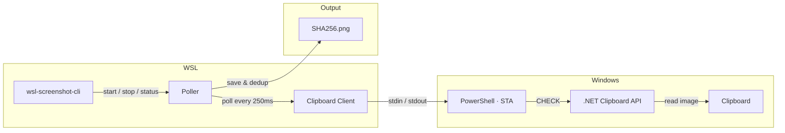

# wsl-screenshot-cli

[](https://github.com/Nailuu/wsl-screenshot-cli/releases)

Herramienta CLI que monitorea el portapapeles de Windows para capturas de pantalla, haciéndolas pegables en WSL (p. ej., Claude Code CLI, Codex CLI, ...) mientras preserva la funcionalidad de pegar en Windows.

Toma una captura de pantalla en Windows, luego pégala en tu terminal WSL — obtienes una ruta de archivo. Pégala en Paint — obtienes la imagen. Pégala en el Explorador — obtienes el archivo. Todo al mismo tiempo.


### Inicio rápido

```bash
wsl-screenshot-cli start --daemon   # start monitoring
wsl-screenshot-cli status           # check it's running
wsl-screenshot-cli stop             # stop monitoring
wsl-screenshot-cli update           # update to latest version
```

## Instalación

### Instalación rápida (recomendada)

```bash
curl -fsSL https://nailu.dev/wscli/install.sh | bash
```

Esto descarga el binario más reciente en `~/.local/bin/`. No se requiere el conjunto de herramientas de Go.

### A través de Go

```bash
go install github.com/nailuu/wsl-screenshot-cli@latest
```

### Desde la fuente

```bash
git clone https://github.com/Nailuu/wsl-screenshot-cli.git
cd wsl-screenshot-cli
go build -o wsl-screenshot-cli .
```

### Opciones de inicio automático

**Opción 1** — Inicio automático con tu shell (añadir a `~/.bashrc` o `~/.zshrc`):

```bash
wsl-screenshot-cli start --daemon --quiet
```

> **Consejo:** La bandera `--quiet` evita que aparezca el mensaje `Polling process is already running` cada vez que abres una nueva terminal.

> **Nota:** El script de instalación coloca el binario en `~/.local/bin/`, que normalmente se añade al PATH mediante `~/.profile` (solo en shells de inicio de sesión). Si recibes `command not found` en `.bashrc`, añade esto **antes** de la línea anterior:
> ```bash
> if [ -d "$HOME/.local/bin" ] && [[ ":$PATH:" != *":$HOME/.local/bin:"* ]]; then
>     export PATH="$HOME/.local/bin:$PATH"
> fi
> ```

**Opción 2** — Auto-inicio/parada con hooks de Claude Code (añadir a `~/.claude/settings.json`):

```json
{
  "hooks": {
    "SessionStart": [
      {
        "matcher": "",
        "hooks": [
          {
            "type": "command",
            "command": "wsl-screenshot-cli start --daemon --quiet 2>/dev/null; echo 'wsl-screenshot-cli started'"
          }
        ]
      }
    ],
    "SessionEnd": [
      {
        "matcher": "",
        "hooks": [
          {
            "type": "command",
            "command": "wsl-screenshot-cli stop 2>/dev/null"
          }
        ]
      }
    ]
  }
}
```

## Cómo Funciona


Un subproceso persistente `powershell.exe -STA` maneja todo el acceso al portapapeles mediante un simple protocolo de texto stdin/stdout (`CHECK` / `UPDATE` / `EXIT`). El lado Go realiza sondeos enviando comandos `CHECK`; PowerShell usa APIs precompiladas de .NET Clipboard (`System.Windows.Forms.Clipboard`) para la detección de cambios — sin compilación C# en tiempo de ejecución, por lo que funciona incluso cuando productos EDR (SentinelOne, CrowdStrike, etc.) bloquean `csc.exe`. `DoEvents()` procesa mensajes de Windows para mantener el hilo STA responsivo — evitando congelamientos en Explorer, Snipping Tool y otras apps durante operaciones del portapapeles.

Cuando se detecta una nueva captura de pantalla, el sondeador:

1. Recibe la imagen como PNG base64 desde PowerShell
2. Realiza deduplicación por hash SHA256 y guarda en disco
3. Convierte la ruta WSL a ruta de Windows mediante `wslpath -w`
4. Indica a PowerShell que establezca tres formatos del portapapeles simultáneamente

### Qué sucede al pegar

Después de capturar una captura de pantalla, el portapapeles contiene tres formatos simultáneamente:

| Dónde pegas | Formato del portapapeles | Lo que obtienes |
|---|---|---|
| Terminal WSL (Ctrl+Shift+V) | `CF_UNICODETEXT` | Ruta de archivo: `/tmp/.wsl-screenshot-cli/<hash>.png` |
| Aplicación de imágenes Windows (Paint, etc.) | `CF_BITMAP` | La captura como imagen |
| Explorador de Windows / diálogo de archivos | `CF_HDROP` | El archivo PNG (pegar como archivo) |

## Uso

### Inicio


```bash
# Foreground (useful for debugging)
wsl-screenshot-cli start

# Background daemon (typical usage)
wsl-screenshot-cli start --daemon

# Custom interval and output directory
wsl-screenshot-cli start --daemon --interval 1000 --output ~/screenshots/

# Debug mode — logs all PowerShell I/O
wsl-screenshot-cli start --verbose
```

| Bandera | Corto | Predeterminado | Descripción |
|---|---|---|---|
| `--daemon` | `-d` | `false` | Ejecutar como un demonio en segundo plano |
| `--interval` | `-i` | `250` | Intervalo de sondeo en ms (100–5000) |
| `--output` | `-o` | `/tmp/.wsl-screenshot-cli/` | Directorio para almacenar PNGs |
| `--quiet` | `-q` | `false` | Suprimir mensajes informativos |
| `--verbose` | `-v` | `false` | Registrar toda la E/S de PowerShell para depuración |

### Estado

```bash
$ wsl-screenshot-cli status
Status:       running
PID:          12345
Uptime:       2h 15m 30s
CPU usage:    2.5%
Memory:       45.2 MB
Screenshots:  127
Output dir:   /tmp/.wsl-screenshot-cli/
Log file:     /tmp/.wsl-screenshot-cli.log
```

### Detener

```bash
wsl-screenshot-cli stop
```

### Actualización

```bash
wsl-screenshot-cli update
```
Actualizaciones a la última versión desde GitHub. Si el daemon está en ejecución, se detendrá antes de actualizar. Volver a ejecutar el script de instalación cuando ya esté en la última versión omitirá la descarga.

## Requisitos previos

- **WSL2** con interoperabilidad de Windows habilitada
- **PowerShell** accesible desde WSL (`powershell.exe` debe estar en PATH)
- **Go 1.25+** (solo si se compila desde el código fuente)

## Pruebas

### Requisitos

- **Go 1.25+**
- **gcc** — requerido para la bandera `-race` (dependencia de cgo). Instalar con:

  ```bash
  sudo apt update && sudo apt install -y gcc
  ```

### Ejecutar pruebas

Ejecuta la suite completa con el detector de condiciones de carrera:

```bash
CGO_ENABLED=1 go test -race -count=1 -v ./...
```

Sin gcc, aún puede ejecutar pruebas sin detección de condiciones de carrera:

```bash
go test -count=1 -v ./...
```

## Estructura del Proyecto

```
├── main.go                        # Entry point
├── cmd/
│   ├── root.go                    # Root cobra command
│   ├── start.go                   # start command (flags, daemon/foreground)
│   ├── status.go                  # status command (process diagnostics)
│   ├── stop.go                    # stop command (SIGTERM)
│   └── update.go                  # update command (self-update via install script)
└── internal/
    ├── clipboard/
    │   ├── clipboard.go           # Go ↔ PowerShell client (stdin/stdout pipes)
    │   └── clipboard.ps1          # Embedded PowerShell script (Win32 clipboard)
    ├── daemon/
    │   ├── daemon.go              # Daemonize, PID management, lifecycle
    │   └── status.go              # /proc parsing (CPU, memory, uptime)
    ├── platform/
    │   └── platform.go            # WSL environment checks
    └── poller/
        └── poller.go              # Poll loop, SHA256 dedup, circuit breaker
```



---


Tranlated By [Open Ai Tx](https://github.com/OpenAiTx/OpenAiTx) | Last indexed: 2026-06-14


---