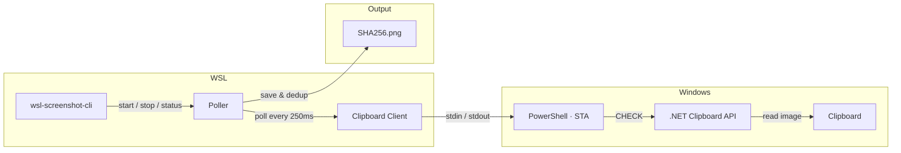

# wsl-screenshot-cli

[](https://github.com/Nailuu/wsl-screenshot-cli/releases)

Outil CLI qui surveille le presse-papiers Windows pour les captures d’écran, les rendant collables dans WSL (par exemple Claude Code CLI, Codex CLI, ...) tout en préservant la fonctionnalité de collage Windows.

Prenez une capture d’écran sous Windows, puis collez-la dans votre terminal WSL — vous obtenez un chemin de fichier. Collez dans Paint — vous obtenez l’image. Collez dans l’Explorateur — vous obtenez le fichier. Tout cela en même temps.


### Démarrage rapide

```bash
wsl-screenshot-cli start --daemon   # start monitoring
wsl-screenshot-cli status           # check it's running
wsl-screenshot-cli stop             # stop monitoring
wsl-screenshot-cli update           # update to latest version
```

## Installation

### Installation rapide (recommandée)

```bash
curl -fsSL https://nailu.dev/wscli/install.sh | bash
```

Cela télécharge le dernier binaire dans `~/.local/bin/`. Aucun outil Go requis.

### Via Go

```bash
go install github.com/nailuu/wsl-screenshot-cli@latest
```
### Depuis la source


```bash
git clone https://github.com/Nailuu/wsl-screenshot-cli.git
cd wsl-screenshot-cli
go build -o wsl-screenshot-cli .
```

### Options de démarrage automatique

**Option 1** — Démarrage automatique avec votre shell (ajouter à `~/.bashrc` ou `~/.zshrc`) :

```bash
wsl-screenshot-cli start --daemon --quiet
```

> **Astuce :** L’option `--quiet` empêche le message `Polling process is already running` d’apparaître à chaque ouverture d’un nouveau terminal.

> **Remarque :** Le script d’installation place le binaire dans `~/.local/bin/`, qui est généralement ajouté au PATH par `~/.profile` (seulement pour les shells de connexion). Si vous obtenez `command not found` dans `.bashrc`, ajoutez ceci **avant** la ligne ci-dessus :
> ```bash
> if [ -d "$HOME/.local/bin" ] && [[ ":$PATH:" != *":$HOME/.local/bin:"* ]]; then
>     export PATH="$HOME/.local/bin:$PATH"
> fi
> ```

**Option 2** — Démarrage/arrêt automatique avec les hooks Claude Code (à ajouter dans `~/.claude/settings.json`) :

```json
{
  "hooks": {
    "SessionStart": [
      {
        "matcher": "",
        "hooks": [
          {
            "type": "command",
            "command": "wsl-screenshot-cli start --daemon --quiet 2>/dev/null; echo 'wsl-screenshot-cli started'"
          }
        ]
      }
    ],
    "SessionEnd": [
      {
        "matcher": "",
        "hooks": [
          {
            "type": "command",
            "command": "wsl-screenshot-cli stop 2>/dev/null"
          }
        ]
      }
    ]
  }
}
```

## Comment ça marche



Un sous-processus persistant `powershell.exe -STA` gère tout l'accès au presse-papiers via un protocole texte simple stdin/stdout (`CHECK` / `UPDATE` / `EXIT`). Le côté Go interroge en envoyant des commandes `CHECK` ; PowerShell utilise des API Clipboard .NET précompilées (`System.Windows.Forms.Clipboard`) pour la détection de changement — pas de compilation C# à l'exécution, donc cela fonctionne même lorsque les produits EDR (SentinelOne, CrowdStrike, etc.) bloquent `csc.exe`. `DoEvents()` pompe les messages Windows pour garder le thread STA réactif — évitant les blocages dans Explorer, Snipping Tool, et d'autres applications pendant les opérations du presse-papiers.

Lorsqu'une nouvelle capture d'écran est détectée, le poller :

1. Reçoit l'image en PNG base64 depuis PowerShell
2. Déduplique par hash SHA256 et sauvegarde sur disque
3. Convertit le chemin WSL en chemin Windows via `wslpath -w`
4. Demande à PowerShell de définir trois formats de presse-papiers simultanément

### Ce qui se passe lors du collage

Après qu'une capture d'écran est prise, le presse-papiers contient trois formats simultanément :

| Où vous collez | Format du presse-papiers | Ce que vous obtenez |
|---|---|---|
| Terminal WSL (Ctrl+Shift+V) | `CF_UNICODETEXT` | Chemin de fichier : `/tmp/.wsl-screenshot-cli/<hash>.png` |
| Application d'image Windows (Paint, etc.) | `CF_BITMAP` | La capture d'écran en image |
| Explorateur Windows / boîte de dialogue de fichier | `CF_HDROP` | Le fichier PNG (coller-en-tant-que-fichier) |

## Utilisation

### Démarrage

```bash
# Foreground (useful for debugging)
wsl-screenshot-cli start

# Background daemon (typical usage)
wsl-screenshot-cli start --daemon

# Custom interval and output directory
wsl-screenshot-cli start --daemon --interval 1000 --output ~/screenshots/

# Debug mode — logs all PowerShell I/O
wsl-screenshot-cli start --verbose
```
| Drapeau | Court | Par défaut | Description |
|---|---|---|---|
| `--daemon` | `-d` | `false` | Exécuter en tant que démon en arrière-plan |
| `--interval` | `-i` | `250` | Intervalle de sondage en ms (100–5000) |
| `--output` | `-o` | `/tmp/.wsl-screenshot-cli/` | Répertoire pour stocker les PNG |
| `--quiet` | `-q` | `false` | Supprimer les messages d'information |
| `--verbose` | `-v` | `false` | Enregistrer toutes les E/S PowerShell pour le débogage |

### Statut


```bash
$ wsl-screenshot-cli status
Status:       running
PID:          12345
Uptime:       2h 15m 30s
CPU usage:    2.5%
Memory:       45.2 MB
Screenshots:  127
Output dir:   /tmp/.wsl-screenshot-cli/
Log file:     /tmp/.wsl-screenshot-cli.log
```

### Arrêt

```bash
wsl-screenshot-cli stop
```

### Mise à jour

```bash
wsl-screenshot-cli update
```

Mises à jour de la dernière version depuis GitHub. Si le démon est en cours d'exécution, il sera arrêté avant la mise à jour. Relancer le script d'installation lorsque la dernière version est déjà installée sautera le téléchargement.

## Prérequis

- **WSL2** avec l'interopérabilité Windows activée
- **PowerShell** accessible depuis WSL (`powershell.exe` doit être dans le PATH)
- **Go 1.25+** (uniquement si compilation depuis la source)

## Tests

### Exigences

- **Go 1.25+**
- **gcc** — requis pour l'option `-race` (dépendance cgo). Installer avec :
  ```bash
  sudo apt update && sudo apt install -y gcc
  ```

### Exécution des tests

Exécutez la suite complète avec le détecteur de course :

```bash
CGO_ENABLED=1 go test -race -count=1 -v ./...
```

Sans gcc, vous pouvez toujours exécuter des tests sans détection de concurrence :

```bash
go test -count=1 -v ./...
```

## Structure du projet

```
├── main.go                        # Entry point
├── cmd/
│   ├── root.go                    # Root cobra command
│   ├── start.go                   # start command (flags, daemon/foreground)
│   ├── status.go                  # status command (process diagnostics)
│   ├── stop.go                    # stop command (SIGTERM)
│   └── update.go                  # update command (self-update via install script)
└── internal/
    ├── clipboard/
    │   ├── clipboard.go           # Go ↔ PowerShell client (stdin/stdout pipes)
    │   └── clipboard.ps1          # Embedded PowerShell script (Win32 clipboard)
    ├── daemon/
    │   ├── daemon.go              # Daemonize, PID management, lifecycle
    │   └── status.go              # /proc parsing (CPU, memory, uptime)
    ├── platform/
    │   └── platform.go            # WSL environment checks
    └── poller/
        └── poller.go              # Poll loop, SHA256 dedup, circuit breaker
```



---


Tranlated By [Open Ai Tx](https://github.com/OpenAiTx/OpenAiTx) | Last indexed: 2026-06-14


---