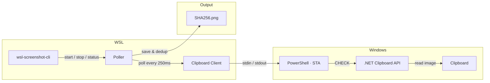

# wsl-screenshot-cli

[](https://github.com/Nailuu/wsl-screenshot-cli/releases)

スクリーンショットを監視し、WSLで貼り付け可能にするWindowsクリップボード用CLIツール（例：Claude Code CLI、Codex CLIなど）、Windowsの貼り付け機能を維持します。

Windowsでスクリーンショットを撮り、WSLターミナルに貼り付けるとファイルパスが得られます。ペイントに貼り付けると画像が得られます。エクスプローラーに貼り付けるとファイルが得られます。すべて同時に。


### クイックスタート

```bash
wsl-screenshot-cli start --daemon   # start monitoring
wsl-screenshot-cli status           # check it's running
wsl-screenshot-cli stop             # stop monitoring
wsl-screenshot-cli update           # update to latest version
```

## インストール

### クイックインストール（推奨）

```bash
curl -fsSL https://nailu.dev/wscli/install.sh | bash
```

これは最新のバイナリを `~/.local/bin/` にダウンロードします。Go ツールチェーンは不要です。

### Go経由でのインストール

```bash
go install github.com/nailuu/wsl-screenshot-cli@latest
```

### ソースから

```bash
git clone https://github.com/Nailuu/wsl-screenshot-cli.git
cd wsl-screenshot-cli
go build -o wsl-screenshot-cli .
```

### 自動起動オプション

**オプション1** — シェル起動時に自動起動（`~/.bashrc` または `~/.zshrc` に追加）:

```bash
wsl-screenshot-cli start --daemon --quiet
```

> **ヒント：** `--quiet` フラグは、新しいターミナルを開くたびに表示される `Polling process is already running` メッセージを抑制します。

> **注意：** インストールスクリプトはバイナリを `~/.local/bin/` に配置します。これは通常 `~/.profile`（ログインシェルのみ）で PATH に追加されます。`.bashrc` で `command not found` が出る場合は、上記行の**前に**以下を追加してください：
> ```bash
> if [ -d "$HOME/.local/bin" ] && [[ ":$PATH:" != *":$HOME/.local/bin:"* ]]; then
>     export PATH="$HOME/.local/bin:$PATH"
> fi
> ```

**オプション2** — Claude Code フックで自動起動/停止（`~/.claude/settings.json` に追加）：

```json
{
  "hooks": {
    "SessionStart": [
      {
        "matcher": "",
        "hooks": [
          {
            "type": "command",
            "command": "wsl-screenshot-cli start --daemon --quiet 2>/dev/null; echo 'wsl-screenshot-cli started'"
          }
        ]
      }
    ],
    "SessionEnd": [
      {
        "matcher": "",
        "hooks": [
          {
            "type": "command",
            "command": "wsl-screenshot-cli stop 2>/dev/null"
          }
        ]
      }
    ]
  }
}
```

## 仕組み


永続的な `powershell.exe -STA` サブプロセスが、シンプルな stdin/stdout テキストプロトコル（`CHECK` / `UPDATE` / `EXIT`）を通じてすべてのクリップボードアクセスを処理します。Go 側は `CHECK` コマンドを送信してポーリングします。PowerShell は事前コンパイル済みの .NET クリップボードAPI（`System.Windows.Forms.Clipboard`）を使用して変更検出を行います — ランタイムの C# コンパイルは不要で、EDR 製品（SentinelOne、CrowdStrike など）が `csc.exe` をブロックしていても動作します。`DoEvents()` は Windows メッセージを処理して STA スレッドの応答性を維持し、クリップボード操作中の Explorer、Snipping Tool、その他アプリのフリーズを防ぎます。

新しいスクリーンショットが検出されると、ポーラーは以下を行います：

1. PowerShell から base64 PNG 形式で画像を受信
2. SHA256 ハッシュで重複排除し、ディスクに保存
3. `wslpath -w` を使って WSL パスを Windows パスに変換
4. PowerShell に対して 3 つのクリップボード形式を同時に設定するよう指示

### 貼り付け時に何が起こるか

スクリーンショットがキャプチャされると、クリップボードには同時に 3 つの形式が含まれます：

| 貼り付け先 | クリップボード形式 | 得られるもの |
|---|---|---|
| WSL ターミナル（Ctrl+Shift+V） | `CF_UNICODETEXT` | ファイルパス：`/tmp/.wsl-screenshot-cli/<hash>.png` |
| Windows 画像アプリ（Paint など） | `CF_BITMAP` | 画像としてのスクリーンショット |
| Windows エクスプローラー / ファイルダイアログ | `CF_HDROP` | PNG ファイル（ファイルとして貼り付け） |

## 使い方

### 起動


```bash
# Foreground (useful for debugging)
wsl-screenshot-cli start

# Background daemon (typical usage)
wsl-screenshot-cli start --daemon

# Custom interval and output directory
wsl-screenshot-cli start --daemon --interval 1000 --output ~/screenshots/

# Debug mode — logs all PowerShell I/O
wsl-screenshot-cli start --verbose
```
| フラグ | 短縮 | デフォルト | 説明 |
|---|---|---|---|
| `--daemon` | `-d` | `false` | バックグラウンドデーモンとして実行 |
| `--interval` | `-i` | `250` | ポーリング間隔（ms単位、100～5000） |
| `--output` | `-o` | `/tmp/.wsl-screenshot-cli/` | PNGを保存するディレクトリ |
| `--quiet` | `-q` | `false` | 情報メッセージを抑制 |
| `--verbose` | `-v` | `false` | デバッグ用にすべてのPowerShell入出力をログ記録 |

### ステータス


```bash
$ wsl-screenshot-cli status
Status:       running
PID:          12345
Uptime:       2h 15m 30s
CPU usage:    2.5%
Memory:       45.2 MB
Screenshots:  127
Output dir:   /tmp/.wsl-screenshot-cli/
Log file:     /tmp/.wsl-screenshot-cli.log
```

### 停止

```bash
wsl-screenshot-cli stop
```

### 更新

```bash
wsl-screenshot-cli update
```
GitHubからの最新リリースへの更新。デーモンが実行中の場合、更新前に停止されます。すでに最新バージョンの場合、インストールスクリプトを再実行するとダウンロードがスキップされます。

## 前提条件

- **WSL2**（Windowsの相互運用が有効）
- **PowerShell** がWSLからアクセス可能（`powershell.exe`がPATHにあること）
- **Go 1.25+**（ソースからビルドする場合のみ）

## テスト

### 要件

- **Go 1.25+**
- **gcc** — `-race`フラグ（cgo依存）に必要。インストール方法：

  ```bash
  sudo apt update && sudo apt install -y gcc
  ```

### テストの実行

レースデテクターを使用してフルスイートを実行します:

```bash
CGO_ENABLED=1 go test -race -count=1 -v ./...
```

gccなしでも、競合検出なしでテストを実行できます:

```bash
go test -count=1 -v ./...
```

## プロジェクト構成

```
├── main.go                        # Entry point
├── cmd/
│   ├── root.go                    # Root cobra command
│   ├── start.go                   # start command (flags, daemon/foreground)
│   ├── status.go                  # status command (process diagnostics)
│   ├── stop.go                    # stop command (SIGTERM)
│   └── update.go                  # update command (self-update via install script)
└── internal/
    ├── clipboard/
    │   ├── clipboard.go           # Go ↔ PowerShell client (stdin/stdout pipes)
    │   └── clipboard.ps1          # Embedded PowerShell script (Win32 clipboard)
    ├── daemon/
    │   ├── daemon.go              # Daemonize, PID management, lifecycle
    │   └── status.go              # /proc parsing (CPU, memory, uptime)
    ├── platform/
    │   └── platform.go            # WSL environment checks
    └── poller/
        └── poller.go              # Poll loop, SHA256 dedup, circuit breaker
```



---


Tranlated By [Open Ai Tx](https://github.com/OpenAiTx/OpenAiTx) | Last indexed: 2026-06-14


---