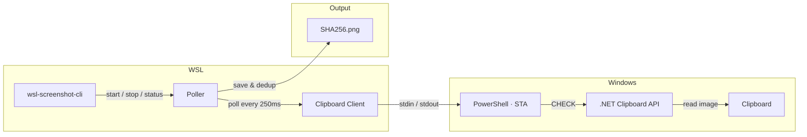

# wsl-screenshot-cli

[](https://github.com/Nailuu/wsl-screenshot-cli/releases)

스크린샷을 위해 Windows 클립보드를 모니터링하는 CLI 도구로, Windows의 붙여넣기 기능을 유지하면서 WSL(예: Claude Code CLI, Codex CLI 등)에서 붙여넣을 수 있게 합니다.

Windows에서 스크린샷을 찍고, WSL 터미널에 붙여넣으면 파일 경로를 받습니다. Paint에 붙여넣으면 이미지가 붙여지고, 탐색기에 붙여넣으면 파일이 붙여집니다. 모두 동시에 가능합니다.


### 빠른 시작

```bash
wsl-screenshot-cli start --daemon   # start monitoring
wsl-screenshot-cli status           # check it's running
wsl-screenshot-cli stop             # stop monitoring
wsl-screenshot-cli update           # update to latest version
```
## 설치

### 빠른 설치 (권장)


```bash
curl -fsSL https://nailu.dev/wscli/install.sh | bash
```
이 명령은 최신 바이너리를 `~/.local/bin/`에 다운로드합니다. Go 도구 체인이 필요 없습니다.

### Go를 통해


```bash
go install github.com/nailuu/wsl-screenshot-cli@latest
```

### 출처부터

```bash
git clone https://github.com/Nailuu/wsl-screenshot-cli.git
cd wsl-screenshot-cli
go build -o wsl-screenshot-cli .
```

### 자동 시작 옵션

**옵션 1** — 셸과 함께 자동 시작 (`~/.bashrc` 또는 `~/.zshrc`에 추가):

```bash
wsl-screenshot-cli start --daemon --quiet
```

> **팁:** `--quiet` 플래그는 새 터미널을 열 때마다 `Polling process is already running` 메시지가 나타나지 않도록 합니다.

> **참고:** 설치 스크립트는 바이너리를 `~/.local/bin/`에 배치하며, 이는 일반적으로 `~/.profile`(로그인 쉘 전용)에 의해 PATH에 추가됩니다. `.bashrc`에서 `command not found` 오류가 발생하면 위 줄 **앞에** 다음을 추가하세요:
> ```bash
> if [ -d "$HOME/.local/bin" ] && [[ ":$PATH:" != *":$HOME/.local/bin:"* ]]; then
>     export PATH="$HOME/.local/bin:$PATH"
> fi
> ```

**옵션 2** — Claude Code 후크로 자동 시작/중지 설정 (`~/.claude/settings.json`에 추가):

```json
{
  "hooks": {
    "SessionStart": [
      {
        "matcher": "",
        "hooks": [
          {
            "type": "command",
            "command": "wsl-screenshot-cli start --daemon --quiet 2>/dev/null; echo 'wsl-screenshot-cli started'"
          }
        ]
      }
    ],
    "SessionEnd": [
      {
        "matcher": "",
        "hooks": [
          {
            "type": "command",
            "command": "wsl-screenshot-cli stop 2>/dev/null"
          }
        ]
      }
    ]
  }
}
```

## 작동 원리


지속적인 `powershell.exe -STA` 하위 프로세스가 단순한 stdin/stdout 텍스트 프로토콜(`CHECK` / `UPDATE` / `EXIT`)을 통해 모든 클립보드 접근을 처리합니다. Go 쪽에서는 `CHECK` 명령을 보내 폴링하며; PowerShell은 변경 감지를 위해 사전 컴파일된 .NET 클립보드 API(`System.Windows.Forms.Clipboard`)를 사용합니다 — 런타임 C# 컴파일이 없으므로 EDR 제품(SentinelOne, CrowdStrike 등)이 `csc.exe`를 차단해도 작동합니다. `DoEvents()`는 Windows 메시지를 펌핑하여 STA 스레드의 응답성을 유지합니다 — 클립보드 작업 중 Explorer, 스니핑 도구, 기타 앱이 멈추는 것을 방지합니다.

새 스크린샷이 감지되면, 폴러는:

1. PowerShell로부터 base64 PNG 이미지 수신
2. SHA256 해시로 중복 제거 후 디스크에 저장
3. `wslpath -w`를 통해 WSL 경로를 Windows 경로로 변환
4. PowerShell에 세 가지 클립보드 포맷을 동시에 설정하도록 지시

### 붙여넣기 시 동작

스크린샷이 캡처된 후, 클립보드에는 세 가지 포맷이 동시에 포함됩니다:

| 붙여넣는 위치 | 클립보드 포맷 | 결과물 |
|---|---|---|
| WSL 터미널 (Ctrl+Shift+V) | `CF_UNICODETEXT` | 파일 경로: `/tmp/.wsl-screenshot-cli/<hash>.png` |
| Windows 이미지 앱 (페인트 등) | `CF_BITMAP` | 이미지로서의 스크린샷 |
| Windows 탐색기 / 파일 대화상자 | `CF_HDROP` | PNG 파일 (파일로 붙여넣기) |

## 사용법

### 시작하기


```bash
# Foreground (useful for debugging)
wsl-screenshot-cli start

# Background daemon (typical usage)
wsl-screenshot-cli start --daemon

# Custom interval and output directory
wsl-screenshot-cli start --daemon --interval 1000 --output ~/screenshots/

# Debug mode — logs all PowerShell I/O
wsl-screenshot-cli start --verbose
```
| 플래그 | 축약형 | 기본값 | 설명 |
|---|---|---|---|
| `--daemon` | `-d` | `false` | 백그라운드 데몬으로 실행 |
| `--interval` | `-i` | `250` | 폴링 간격(ms) (100–5000) |
| `--output` | `-o` | `/tmp/.wsl-screenshot-cli/` | PNG 파일 저장 디렉터리 |
| `--quiet` | `-q` | `false` | 정보 메시지 출력 억제 |
| `--verbose` | `-v` | `false` | 디버깅을 위한 모든 PowerShell I/O 기록 |

### 상태


```bash
$ wsl-screenshot-cli status
Status:       running
PID:          12345
Uptime:       2h 15m 30s
CPU usage:    2.5%
Memory:       45.2 MB
Screenshots:  127
Output dir:   /tmp/.wsl-screenshot-cli/
Log file:     /tmp/.wsl-screenshot-cli.log
```

### 중지

```bash
wsl-screenshot-cli stop
```

### 업데이트

```bash
wsl-screenshot-cli update
```
GitHub에서 최신 릴리스로 업데이트합니다. 데몬이 실행 중인 경우 업데이트 전에 중지됩니다. 이미 최신 버전에서 설치 스크립트를 다시 실행하면 다운로드가 건너뜁니다.

## 전제 조건

- Windows 상호 운용이 활성화된 **WSL2**
- WSL에서 접근 가능한 **PowerShell** (`powershell.exe`가 PATH에 있어야 함)
- **Go 1.25+** (소스에서 빌드하는 경우에만 필요)

## 테스트

### 요구 사항

- **Go 1.25+**
- **gcc** — `-race` 플래그(cgo 의존성)에 필요합니다. 다음 명령어로 설치하세요:

  ```bash
  sudo apt update && sudo apt install -y gcc
  ```

### 테스트 실행

레이스 감지기와 함께 전체 테스트를 실행합니다:

```bash
CGO_ENABLED=1 go test -race -count=1 -v ./...
```

gcc 없이도 레이스 감지 없이 테스트를 실행할 수 있습니다:

```bash
go test -count=1 -v ./...
```

## 프로젝트 구조

```
├── main.go                        # Entry point
├── cmd/
│   ├── root.go                    # Root cobra command
│   ├── start.go                   # start command (flags, daemon/foreground)
│   ├── status.go                  # status command (process diagnostics)
│   ├── stop.go                    # stop command (SIGTERM)
│   └── update.go                  # update command (self-update via install script)
└── internal/
    ├── clipboard/
    │   ├── clipboard.go           # Go ↔ PowerShell client (stdin/stdout pipes)
    │   └── clipboard.ps1          # Embedded PowerShell script (Win32 clipboard)
    ├── daemon/
    │   ├── daemon.go              # Daemonize, PID management, lifecycle
    │   └── status.go              # /proc parsing (CPU, memory, uptime)
    ├── platform/
    │   └── platform.go            # WSL environment checks
    └── poller/
        └── poller.go              # Poll loop, SHA256 dedup, circuit breaker
```



---


Tranlated By [Open Ai Tx](https://github.com/OpenAiTx/OpenAiTx) | Last indexed: 2026-06-14


---