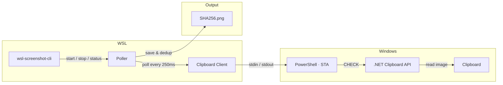

# wsl-screenshot-cli

[](https://github.com/Nailuu/wsl-screenshot-cli/releases)

CLI 工具，监控 Windows 剪贴板中的截图，使其可在 WSL 中粘贴（例如 Claude Code CLI、Codex CLI 等），同时保留 Windows 的粘贴功能。

在 Windows 上截图，然后在 WSL 终端中粘贴——你会得到一个文件路径。在画图中粘贴——你会得到图片。在资源管理器中粘贴——你会得到文件。所有这些同时实现。


### 快速开始

```bash
wsl-screenshot-cli start --daemon   # start monitoring
wsl-screenshot-cli status           # check it's running
wsl-screenshot-cli stop             # stop monitoring
wsl-screenshot-cli update           # update to latest version
```

## 安装

### 快速安装（推荐）

```bash
curl -fsSL https://nailu.dev/wscli/install.sh | bash
```

这将最新的二进制文件下载到 `~/.local/bin/`。无需 Go 工具链。

### 通过 Go

```bash
go install github.com/nailuu/wsl-screenshot-cli@latest
```
### 来自源文件


```bash
git clone https://github.com/Nailuu/wsl-screenshot-cli.git
cd wsl-screenshot-cli
go build -o wsl-screenshot-cli .
```

### 自动启动选项

**选项 1** — 随 shell 自动启动（添加到 `~/.bashrc` 或 `~/.zshrc`）：

```bash
wsl-screenshot-cli start --daemon --quiet
```

> **提示：** `--quiet` 标志可以防止每次打开新终端时出现 `Polling process is already running` 的消息。

> **注意：** 安装脚本将二进制文件放置在 `~/.local/bin/`，该路径通常由 `~/.profile` 添加到 PATH 中（仅限登录 shell）。如果在 `.bashrc` 中出现 `command not found`，请在上述行**之前**添加以下内容：
> ```bash
> if [ -d "$HOME/.local/bin" ] && [[ ":$PATH:" != *":$HOME/.local/bin:"* ]]; then
>     export PATH="$HOME/.local/bin:$PATH"
> fi
> ```

**选项 2** — 使用 Claude Code 钩子自动启动/停止（添加到 `~/.claude/settings.json`）：

```json
{
  "hooks": {
    "SessionStart": [
      {
        "matcher": "",
        "hooks": [
          {
            "type": "command",
            "command": "wsl-screenshot-cli start --daemon --quiet 2>/dev/null; echo 'wsl-screenshot-cli started'"
          }
        ]
      }
    ],
    "SessionEnd": [
      {
        "matcher": "",
        "hooks": [
          {
            "type": "command",
            "command": "wsl-screenshot-cli stop 2>/dev/null"
          }
        ]
      }
    ]
  }
}
```

## 工作原理



一个持久的 `powershell.exe -STA` 子进程通过一个简单的标准输入/输出文本协议（`CHECK` / `UPDATE` / `EXIT`）处理所有剪贴板访问。Go 端通过发送 `CHECK` 命令进行轮询；PowerShell 使用预编译的 .NET 剪贴板 API（`System.Windows.Forms.Clipboard`）进行变更检测——无运行时 C# 编译，因此即使 EDR 产品（SentinelOne、CrowdStrike 等）阻止 `csc.exe` 也能正常工作。`DoEvents()` 泵送 Windows 消息以保持 STA 线程响应——防止在剪贴板操作期间资源管理器、截图工具和其他应用程序冻结。

当检测到新截图时，轮询器：

1. 从 PowerShell 接收以 base64 PNG 格式编码的图像
2. 通过 SHA256 哈希进行去重并保存到磁盘
3. 通过 `wslpath -w` 将 WSL 路径转换为 Windows 路径
4. 告诉 PowerShell 同时设置三种剪贴板格式

### 粘贴时发生了什么

截图捕获后，剪贴板同时包含三种格式：

| 粘贴位置 | 剪贴板格式 | 结果 |
|---|---|---|
| WSL 终端（Ctrl+Shift+V） | `CF_UNICODETEXT` | 文件路径：`/tmp/.wsl-screenshot-cli/<hash>.png` |
| Windows 图像应用（画图等） | `CF_BITMAP` | 截图作为图像 |
| Windows 资源管理器 / 文件对话框 | `CF_HDROP` | PNG 文件（作为文件粘贴） |

## 使用

### 启动

```bash
# Foreground (useful for debugging)
wsl-screenshot-cli start

# Background daemon (typical usage)
wsl-screenshot-cli start --daemon

# Custom interval and output directory
wsl-screenshot-cli start --daemon --interval 1000 --output ~/screenshots/

# Debug mode — logs all PowerShell I/O
wsl-screenshot-cli start --verbose
```
| 标志 | 简写 | 默认值 | 描述 |
|---|---|---|---|
| `--daemon` | `-d` | `false` | 作为后台守护进程运行 |
| `--interval` | `-i` | `250` | 轮询间隔（毫秒，100–5000） |
| `--output` | `-o` | `/tmp/.wsl-screenshot-cli/` | 存储 PNG 的目录 |
| `--quiet` | `-q` | `false` | 抑制信息消息 |
| `--verbose` | `-v` | `false` | 记录所有 PowerShell 输入/输出以进行调试 |

### 状态


```bash
$ wsl-screenshot-cli status
Status:       running
PID:          12345
Uptime:       2h 15m 30s
CPU usage:    2.5%
Memory:       45.2 MB
Screenshots:  127
Output dir:   /tmp/.wsl-screenshot-cli/
Log file:     /tmp/.wsl-screenshot-cli.log
```

### 停止

```bash
wsl-screenshot-cli stop
```

### 更新

```bash
wsl-screenshot-cli update
```

从 GitHub 更新到最新版本。如果守护进程正在运行，更新前将先停止它。已经是最新版本时重新运行安装脚本将跳过下载。

## 前提条件

- 启用 Windows 互操作的 **WSL2**
- WSL 中可访问的 **PowerShell**（`powershell.exe` 必须在 PATH 中）
- **Go 1.25+**（仅在从源码构建时需要）

## 测试

### 要求

- **Go 1.25+**
- **gcc** — 需要用于 `-race` 标志（cgo 依赖）。安装命令：
  ```bash
  sudo apt update && sudo apt install -y gcc
  ```

### 运行测试

使用竞争检测器运行完整测试套件：

```bash
CGO_ENABLED=1 go test -race -count=1 -v ./...
```

没有 gcc，您仍然可以在没有竞态检测的情况下运行测试：

```bash
go test -count=1 -v ./...
```

## 项目结构

```
├── main.go                        # Entry point
├── cmd/
│   ├── root.go                    # Root cobra command
│   ├── start.go                   # start command (flags, daemon/foreground)
│   ├── status.go                  # status command (process diagnostics)
│   ├── stop.go                    # stop command (SIGTERM)
│   └── update.go                  # update command (self-update via install script)
└── internal/
    ├── clipboard/
    │   ├── clipboard.go           # Go ↔ PowerShell client (stdin/stdout pipes)
    │   └── clipboard.ps1          # Embedded PowerShell script (Win32 clipboard)
    ├── daemon/
    │   ├── daemon.go              # Daemonize, PID management, lifecycle
    │   └── status.go              # /proc parsing (CPU, memory, uptime)
    ├── platform/
    │   └── platform.go            # WSL environment checks
    └── poller/
        └── poller.go              # Poll loop, SHA256 dedup, circuit breaker
```



---


Tranlated By [Open Ai Tx](https://github.com/OpenAiTx/OpenAiTx) | Last indexed: 2026-06-14


---