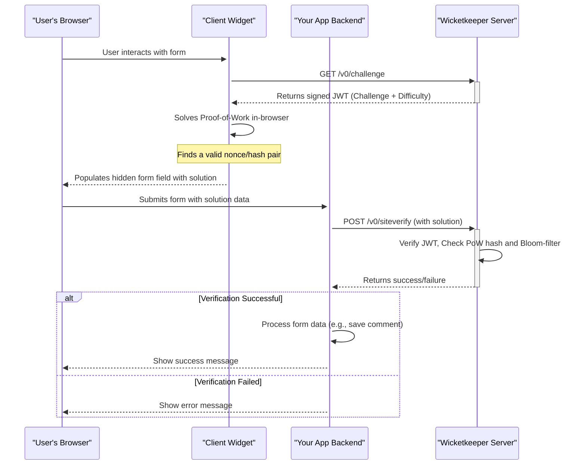

<p align="center">
  <a href="https://wicketkeeper.io"></a>
</p>


Un sistema captcha basado en prueba de trabajo (PoW) que respeta la privacidad, diseñado para ser una alternativa centrada en el usuario a los captchas tradicionales. Wicketkeeper protege tus formularios web de bots simples sin requerir que los usuarios resuelvan puzzles frustrantes.

Lo logra mediante la emisión de un pequeño desafío computacional del lado del cliente que es fácil de resolver para un dispositivo moderno pero costoso para los bots realizar a escala. El sistema está compuesto por un backend en Go, un cliente JavaScript embebible y una aplicación demo full-stack.

---

## Tabla de Contenidos

- [Características](#features)
- [Cómo Funciona](#how-it-works)
- [Estructura del Proyecto](#project-structure)
- [Comenzando: Configuración de la Demo Completa](#getting-started-full-demo-setup)
  - [Requisitos Previos](#prerequisites)
  - [Paso 1: Clonar el Repositorio](#step-1-clone-the-repository)
  - [Paso 2: Ejecutar los Servicios Backend](#step-2-run-the-backend-services)
  - [Paso 3: Construir el Widget Cliente](#step-3-build-the-client-widget)
  - [Paso 4: Ejecutar la Aplicación de Ejemplo](#step-4-run-the-example-application)
- [Uso de Componentes Individuales](#usage-of-individual-components)
  - [Servidor Wicketkeeper (Go)](#wicketkeeper-server-go)
  - [Widget Cliente (JavaScript)](#client-widget-javascript)

## Características

- **Motor de Prueba de Trabajo:** Reemplaza puzzles visuales con un desafío computacional que es fácil para los usuarios pero difícil para los bots.
- **Sin Estado y Seguro:** Usa JSON Web Tokens (JWT) firmados para ciclos de desafío/respuesta, eliminando el estado de sesión en el servidor.
- **Prevención de Repetición de Ataques:** Utiliza filtros Bloom de Redis para una prevención de reutilización de desafíos de alto rendimiento y basada en ventanas temporales.
- **Widget Cliente Embebible:** Un widget JavaScript ligero y sin dependencias que se integra fácilmente en cualquier formulario web.
- **Configurable:** Ajusta fácilmente la dificultad del PoW, orígenes CORS y puertos mediante variables de entorno.
- **Contenerizado:** Soporte completo para Docker y Docker Compose para un despliegue sencillo del servidor backend y su dependencia Redis.
- **Demo Full-Stack:** Incluye un ejemplo completo en Express.js + TypeScript para demostrar una integración en un entorno real.

## Cómo Funciona

El ecosistema Wicketkeeper involucra cuatro actores principales: el Navegador del Usuario, el Widget Cliente, el Backend de su Aplicación y el Servidor Wicketkeeper.


1.  **Solicitud de Desafío:** El widget del cliente solicita un nuevo desafío PoW al Servidor Wicketkeeper.  
2.  **Emisión del Desafío:** El servidor genera un desafío único, lo empaqueta en un JWT firmado y lo envía al cliente.  
3.  **Prueba de Trabajo:** El navegador del cliente (usando Web Workers) encuentra una solución (`nonce`) al acertijo criptográfico.  
4.  **Integración en el Formulario:** La solución se coloca en un campo oculto de entrada en su formulario web.  
5.  **Verificación del Lado del Servidor:** Cuando el usuario envía el formulario, el backend de su aplicación envía la solución al endpoint `/v0/siteverify` del Servidor Wicketkeeper.  
6.  **Validación:** El Servidor Wicketkeeper valida la firma del JWT, la corrección del PoW y revisa un filtro Bloom de Redis para asegurar que el desafío no se haya usado antes. Devuelve una respuesta final de éxito o fracaso.  

## Estructura del Proyecto  

El repositorio está organizado en tres componentes principales:  


```
.
├── client/          # The frontend JS widget that solves the PoW challenge
├── server/          # The Go backend that issues and verifies challenges
├── example/         # A full-stack Express.js demo application
└── README.md        # This file
```

## Comenzando: Configuración completa de la demostración

Esta guía te ayudará a ejecutar todo el ecosistema de Wicketkeeper, incluyendo el servidor backend, el widget cliente y la aplicación de ejemplo.

### Requisitos previos

- [Go](https://go.dev/doc/install) (v1.23+)
- [Node.js](https://nodejs.org/) (v16+) y npm
- [Docker](https://www.docker.com/products/docker-desktop/) y Docker Compose

### Paso 1: Clonar el repositorio

```bash
git clone https://github.com/a-ve/wicketkeeper.git
cd wicketkeeper
```

### Paso 2: Ejecutar los Servicios Backend

La forma más sencilla de ejecutar el servidor Go y su dependencia Redis es con Docker Compose.

```bash
cd server/
mkdir data
docker-compose up -d
```

Esto construirá y arrancará el servicio Go `wicketkeeper` en el puerto `8080` y un contenedor `redis-stack`. En la primera ejecución, se generará un archivo `wicketkeeper.key` en `server/data/`.

### Paso 3: Construir el Widget del Cliente

El widget del cliente necesita ser compilado en un solo archivo JavaScript.

```bash
cd ../client/
npm install
npm run build:fast
```

Esto crea `client/dist/fast.js`. Ahora, copie este archivo al directorio público de la aplicación de ejemplo:

```bash
cp dist/fast.js ../example/public/
```

### Paso 4: Ejecutar la Aplicación de Ejemplo

El ejemplo es un servidor Express.js que sirve un formulario HTML simple y maneja envíos.

```bash
cd ../example/
npm install

# Compile the TypeScript code
npx tsc

# Start the server
node dist/server.js
```
Deberías ver la salida: `🚀 Server listening on http://localhost:8081`.

Ahora puedes navegar a **<http://localhost:8081>** en tu navegador para ver la demostración de Wicketkeeper en acción.

## Uso de Componentes Individuales

### Servidor Wicketkeeper (Go)

El servidor se configura mediante variables de entorno. Consulta `server/README.md` para más detalles.

| Variable           | Descripción                                                                                                                                                                                           | Predeterminado       |
| ------------------ | ----------------------------------------------------------------------------------------------------------------------------------------------------------------------------------------------------- | -------------------- |
| `LISTEN_PORT`      | El puerto en el que el servidor escuchará.                                                                                                                                                           | `8080`               |
| `REDIS_ADDR`       | La dirección de la instancia de Redis.                                                                                                                                                              | `127.0.0.1:6379`     |
| `REDIS_DB`         | Número de base de datos de Redis (0-15). **Nota:** Redis Cluster solo soporta DB 0.                                                                                                                  | `0`                  |
| `DIFFICULTY`       | Número de ceros iniciales para el hash PoW. Más alto es más difícil.                                                                                                                                 | `4`                  |
| `ALLOWED_ORIGINS`  | Lista separada por comas de orígenes para CORS (ej., `https://domain.com`).                                                                                                                          | `*`                  |
| `BASE_PATH`        | Ruta base para el servidor. Nota: Para rutas distintas a `/` debes usar `data-challenge-url` cuando uses el cliente. Ver [aquí](https://wicketkeeper.io/components/frontend-widget.html#configuration). | `/`           |
| `PRIVATE_KEY_PATH` | Ruta para almacenar la clave privada Ed25519. Se creará si no existe.                                                                                                                                | `./wicketkeeper.key` |

**Endpoints de la API:**

- `GET /v0/challenge`: Emite un nuevo desafío PoW.
- `POST /v0/siteverify`: Verifica un desafío resuelto.

### Widget Cliente (JavaScript)

El cliente es un único archivo JS (`dist/fast.js` o `dist/slow.js`) que puede incluirse en cualquier página HTML.

**1. Incluir el Script**


```html
<script defer src="path/to/fast-or-slow.js"></script>
```

**2. Agregar el Widget a un Formulario**

El script inicializa automáticamente cualquier `div` con la clase `.wicketkeeper`.

```html
<form action="/submit" method="POST">
  <!-- Other form fields -->
  <div class="wicketkeeper" data-input-name="my_captcha_field"></div>
  <button type="submit">Submit</button>
</form>
```

El cliente puede configurarse con un endpoint de desafío personalizado durante el paso de compilación. Consulte `client/README.md` para más detalles.



---


Tranlated By [Open Ai Tx](https://github.com/OpenAiTx/OpenAiTx) | Last indexed: 2026-03-08


---