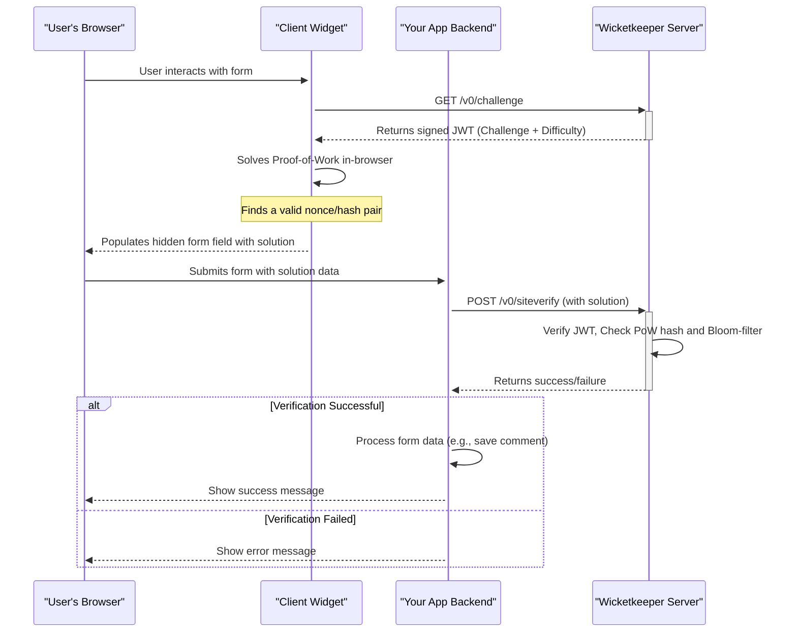

<p align="center">
  <a href="https://wicketkeeper.io"></a>
</p>


Un système captcha respectueux de la vie privée, basé sur la preuve de travail (PoW), conçu pour être une alternative centrée sur l'utilisateur aux captchas traditionnels. Wicketkeeper protège vos formulaires web contre les bots simples sans demander aux utilisateurs de résoudre des puzzles frustrants.

Il y parvient en émettant un petit défi computationnel côté client, facile à résoudre pour un appareil moderne mais coûteux à exécuter à grande échelle pour les bots. Le système est composé d'un backend Go, d'un client JavaScript intégrable, et d'une application démo full-stack.

---

## Table des matières

- [Fonctionnalités](#features)
- [Comment ça marche](#how-it-works)
- [Structure du projet](#project-structure)
- [Premiers pas : Installation complète de la démo](#getting-started-full-demo-setup)
  - [Prérequis](#prerequisites)
  - [Étape 1 : Cloner le dépôt](#step-1-clone-the-repository)
  - [Étape 2 : Lancer les services backend](#step-2-run-the-backend-services)
  - [Étape 3 : Construire le widget client](#step-3-build-the-client-widget)
  - [Étape 4 : Lancer l’application exemple](#step-4-run-the-example-application)
- [Utilisation des composants individuels](#usage-of-individual-components)
  - [Serveur Wicketkeeper (Go)](#wicketkeeper-server-go)
  - [Widget client (JavaScript)](#client-widget-javascript)

## Fonctionnalités

- **Moteur de preuve de travail :** Remplace les puzzles visuels par un défi computationnel facile pour les utilisateurs mais difficile pour les bots.
- **Sans état & sécurisé :** Utilise des JSON Web Tokens (JWT) signés pour les cycles défi/réponse, éliminant l’état de session côté serveur.
- **Prévention des attaques par rejeu :** Exploite les filtres Bloom Redis pour une prévention performante et limitée dans le temps de la réutilisation des défis.
- **Widget client intégrable :** Un widget JavaScript léger, sans dépendances, qui s’intègre facilement dans n’importe quel formulaire web.
- **Configurabilité :** Ajustez facilement la difficulté de PoW, les origines CORS et les ports via des variables d’environnement.
- **Conteneurisé :** Support complet de Docker et Docker Compose pour un déploiement facile du serveur backend et de sa dépendance Redis.
- **Démo full-stack :** Inclut un exemple complet Express.js + TypeScript pour démontrer une intégration en conditions réelles.

## Comment ça fonctionne

L'écosystème Wicketkeeper comprend quatre acteurs principaux : le navigateur de l'utilisateur, le widget client, votre backend d'application et le serveur Wicketkeeper.


1.  **Demande de défi :** Le widget client demande un nouveau défi PoW au serveur Wicketkeeper.  
2.  **Émission du défi :** Le serveur génère un défi unique, l’emballe dans un JWT signé, et l’envoie au client.  
3.  **Preuve de travail :** Le navigateur du client (utilisant les Web Workers) trouve une solution (`nonce`) au puzzle cryptographique.  
4.  **Intégration au formulaire :** La solution est placée dans un champ caché de votre formulaire web.  
5.  **Vérification côté serveur :** Lorsque l’utilisateur soumet le formulaire, le backend de votre application envoie la solution au point de terminaison `/v0/siteverify` du serveur Wicketkeeper.  
6.  **Validation :** Le serveur Wicketkeeper valide la signature JWT, la correction du PoW, et vérifie un filtre Bloom Redis pour s’assurer que le défi n’a pas été utilisé auparavant. Il renvoie une réponse finale de succès ou d’échec.  

## Structure du projet  

Le dépôt est organisé en trois composants principaux :


```
.
├── client/          # The frontend JS widget that solves the PoW challenge
├── server/          # The Go backend that issues and verifies challenges
├── example/         # A full-stack Express.js demo application
└── README.md        # This file
```

## Mise en route : Configuration complète de la démo

Ce guide vous aidera à exécuter l'écosystème complet de Wicketkeeper, y compris le serveur backend, le widget client, et l'application d'exemple.

### Prérequis

- [Go](https://go.dev/doc/install) (v1.23+)
- [Node.js](https://nodejs.org/) (v16+) et npm
- [Docker](https://www.docker.com/products/docker-desktop/) et Docker Compose

### Étape 1 : Cloner le dépôt

```bash
git clone https://github.com/a-ve/wicketkeeper.git
cd wicketkeeper
```

### Étape 2 : Exécuter les services backend

La manière la plus simple d'exécuter le serveur Go et sa dépendance Redis est d'utiliser Docker Compose.

```bash
cd server/
mkdir data
docker-compose up -d
```

Cela construira et démarrera le service Go `wicketkeeper` sur le port `8080` ainsi qu'un conteneur `redis-stack`. Lors de la première exécution, un fichier `wicketkeeper.key` sera généré dans `server/data/`.

### Étape 3 : Construire le Widget Client

Le widget client doit être compilé en un seul fichier JavaScript.

```bash
cd ../client/
npm install
npm run build:fast
```

Cela crée `client/dist/fast.js`. Maintenant, copiez ce fichier dans le répertoire public de l'application exemple :

```bash
cp dist/fast.js ../example/public/
```

### Étape 4 : Exécuter l'application exemple

L'exemple est un serveur Express.js qui sert un formulaire HTML simple et gère les soumissions.

```bash
cd ../example/
npm install

# Compile the TypeScript code
npx tsc

# Start the server
node dist/server.js
```
Vous devriez voir la sortie : `🚀 Serveur à l'écoute sur http://localhost:8081`.

Vous pouvez maintenant naviguer vers **<http://localhost:8081>** dans votre navigateur pour voir la démo Wicketkeeper en action !

## Utilisation des Composants Individuels

### Serveur Wicketkeeper (Go)

Le serveur est configuré via des variables d'environnement. Voir `server/README.md` pour plus de détails.

| Variable           | Description                                                                                                                                                                                            | Par défaut           |
| ------------------ | ------------------------------------------------------------------------------------------------------------------------------------------------------------------------------------------------------ | -------------------- |
| `LISTEN_PORT`      | Le port sur lequel le serveur écoutera.                                                                                                                                                               | `8080`               |
| `REDIS_ADDR`       | L'adresse de l'instance Redis.                                                                                                                                                                        | `127.0.0.1:6379`     |
| `REDIS_DB`         | Numéro de base de données Redis (0-15). **Note :** Redis Cluster ne supporte que la DB 0.                                                                                                              | `0`                  |
| `DIFFICULTY`       | Nombre de zéros initiaux pour le hash PoW. Plus c'est élevé, plus c'est difficile.                                                                                                                    | `4`                  |
| `ALLOWED_ORIGINS`  | Liste d'origines séparées par des virgules pour CORS (ex. : `https://domain.com`).                                                                                                                     | `*`                  |
| `BASE_PATH`        | Chemin de base pour le serveur. Note : Pour des chemins autres que `/`, vous devez utiliser `data-challenge-url` avec le client. Voir [ici](https://wicketkeeper.io/components/frontend-widget.html#configuration). | `/`           |
| `PRIVATE_KEY_PATH` | Chemin pour stocker la clé privée Ed25519. Sera créé si inexistant.                                                                                                                                    | `./wicketkeeper.key` |

**Points d'API :**

- `GET /v0/challenge` : Émet un nouveau challenge PoW.
- `POST /v0/siteverify` : Vérifie un challenge résolu.

### Widget Client (JavaScript)

Le client est un fichier JS unique (`dist/fast.js` ou `dist/slow.js`) pouvant être inclus dans n'importe quelle page HTML.

**1. Inclure le script**


```html
<script defer src="path/to/fast-or-slow.js"></script>
```

**2. Ajouter le Widget à un Formulaire**

Le script initialise automatiquement tout `div` avec la classe `.wicketkeeper`.

```html
<form action="/submit" method="POST">
  <!-- Other form fields -->
  <div class="wicketkeeper" data-input-name="my_captcha_field"></div>
  <button type="submit">Submit</button>
</form>
```

Le client peut être configuré avec un point de terminaison de défi personnalisé lors de l’étape de compilation. Voir `client/README.md` pour plus de détails.



---


Tranlated By [Open Ai Tx](https://github.com/OpenAiTx/OpenAiTx) | Last indexed: 2026-03-08


---