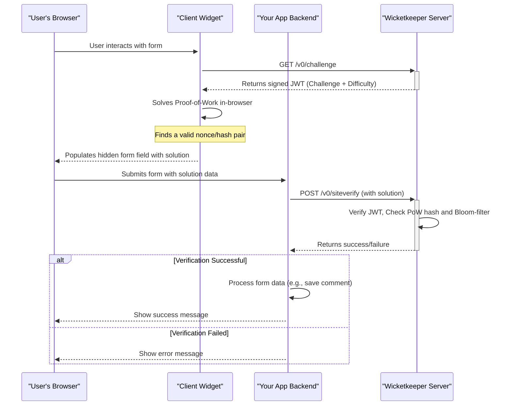

<p align="center">
  <a href="https://wicketkeeper.io"></a>
</p>


ユーザー中心の従来型キャプチャの代替となるよう設計された、プライバシーに配慮したプルーフ・オブ・ワーク（PoW）キャプチャシステムです。Wicketkeeperは、ユーザーに煩わしいパズルを解かせることなく、単純なボットからウェブフォームを保護します。

これは、最新のデバイスで簡単に解けるが、ボットが大量に実行するにはコストのかかる、小さなクライアント側の計算チャレンジを発行することで実現しています。システムはGoのバックエンド、埋め込み可能なJavaScriptクライアント、およびフルスタックのデモアプリケーションで構成されています。

---

## 目次

- [特徴](#features)
- [仕組み](#how-it-works)
- [プロジェクト構成](#project-structure)
- [始めに：フルデモセットアップ](#getting-started-full-demo-setup)
  - [前提条件](#prerequisites)
  - [ステップ1：リポジトリのクローン](#step-1-clone-the-repository)
  - [ステップ2：バックエンドサービスの起動](#step-2-run-the-backend-services)
  - [ステップ3：クライアントウィジェットのビルド](#step-3-build-the-client-widget)
  - [ステップ4：サンプルアプリケーションの実行](#step-4-run-the-example-application)
- [個別コンポーネントの利用方法](#usage-of-individual-components)
  - [Wicketkeeperサーバー（Go）](#wicketkeeper-server-go)
  - [クライアントウィジェット（JavaScript）](#client-widget-javascript)

## 特徴

- **プルーフ・オブ・ワークエンジン：** 視覚的なパズルを、ユーザーには簡単でボットには難しい計算チャレンジに置き換えます。
- **ステートレスかつ安全：** チャレンジ/レスポンスのサイクルに署名付きJSON Webトークン（JWT）を使用し、サーバー側のセッション状態を排除します。
- **リプレイ攻撃防止：** Redis Bloomフィルターを活用し、高性能かつ時間窓付きでチャレンジの再利用を防止します。
- **埋め込み可能なクライアントウィジェット：** 軽量で依存関係のないJavaScriptウィジェットが、どんなウェブフォームにも簡単に統合できます。
- **設定可能：** 環境変数を通じてPoWの難易度、CORSのオリジン、ポート番号を容易に調整可能です。
- **コンテナ対応：** バックエンドサーバーとそのRedis依存関係の簡単なデプロイのために、完全なDockerおよびDocker Composeのサポートを提供します。
- **フルスタックデモ：** 実際の統合例を示すExpress.js + TypeScriptの完全なサンプルを含みます。

## 動作原理

Wicketkeeperのエコシステムには、ユーザーのブラウザ、クライアントウィジェット、あなたのアプリケーションバックエンド、そしてWicketkeeperサーバーの4つの主要な役割が含まれます。


1.  **チャレンジ要求:** クライアントウィジェットがWicketkeeperサーバーに新しいPoWチャレンジを要求します。  
2.  **チャレンジ発行:** サーバーはユニークなチャレンジを生成し、署名付きJWTにパッケージしてクライアントに送信します。  
3.  **作業証明:** クライアントのブラウザ（Web Workersを使用）が暗号パズルの解決策（`nonce`）を見つけます。  
4.  **フォーム統合:** 解決策はウェブフォームの隠し入力フィールドに配置されます。  
5.  **サーバー側検証:** ユーザーがフォームを送信すると、アプリケーションのバックエンドが解決策をWicketkeeperサーバーの`/v0/siteverify`エンドポイントに送信します。  
6.  **検証:** WicketkeeperサーバーはJWT署名、PoWの正確性を検証し、Redis Bloomフィルターをチェックしてチャレンジが以前に使用されていないことを確認します。最終的に成功または失敗の応答を返します。  

## プロジェクト構成  

リポジトリは3つの主要なコンポーネントに分かれています：


```
.
├── client/          # The frontend JS widget that solves the PoW challenge
├── server/          # The Go backend that issues and verifies challenges
├── example/         # A full-stack Express.js demo application
└── README.md        # This file
```

## はじめに：フルデモセットアップ

このガイドでは、バックエンドサーバー、クライアントウィジェット、およびサンプルアプリケーションを含むWicketkeeperエコシステム全体を実行する方法を説明します。

### 前提条件

- [Go](https://go.dev/doc/install) (v1.23+)
- [Node.js](https://nodejs.org/) (v16+) と npm
- [Docker](https://www.docker.com/products/docker-desktop/) と Docker Compose

### ステップ1：リポジトリをクローンする

```bash
git clone https://github.com/a-ve/wicketkeeper.git
cd wicketkeeper
```

### ステップ2：バックエンドサービスの起動

GoサーバーとそのRedis依存関係を実行する最も簡単な方法は、Docker Composeを使うことです。

```bash
cd server/
mkdir data
docker-compose up -d
```

これはポート `8080` で `wicketkeeper` Go サービスと `redis-stack` コンテナをビルドして起動します。初回実行時に `server/data/` に `wicketkeeper.key` ファイルが生成されます。

### ステップ 3: クライアントウィジェットのビルド

クライアントウィジェットは単一のJavaScriptファイルにコンパイルする必要があります。

```bash
cd ../client/
npm install
npm run build:fast
```

これにより `client/dist/fast.js` が作成されます。次に、このファイルをサンプルアプリケーションのパブリックディレクトリにコピーします：

```bash
cp dist/fast.js ../example/public/
```

### ステップ4：サンプルアプリケーションの実行

このサンプルは、シンプルなHTMLフォームを提供し、送信を処理するExpress.jsサーバーです。

```bash
cd ../example/
npm install

# Compile the TypeScript code
npx tsc

# Start the server
node dist/server.js
```
出力として次のように表示されるはずです：`🚀 Server listening on http://localhost:8081`。

ブラウザで **<http://localhost:8081>** にアクセスすると、Wicketkeeperデモが動作しているのを確認できます！

## 個別コンポーネントの使用方法

### Wicketkeeperサーバー（Go）

サーバーは環境変数で設定します。詳細は `server/README.md` を参照してください。

| 変数名             | 説明                                                                                                                                                                                                  | デフォルト            |
| ------------------ | ------------------------------------------------------------------------------------------------------------------------------------------------------------------------------------------------------ | -------------------- |
| `LISTEN_PORT`      | サーバーがリッスンするポート番号。                                                                                                                                                                    | `8080`               |
| `REDIS_ADDR`       | Redisインスタンスのアドレス。                                                                                                                                                                         | `127.0.0.1:6379`     |
| `REDIS_DB`         | Redisのデータベース番号（0-15）。**注意:** RedisクラスタはDB 0のみ対応。                                                                                                                              | `0`                  |
| `DIFFICULTY`       | PoWハッシュの先頭に必要なゼロの数。数値が大きいほど難易度が高い。                                                                                                                                      | `4`                  |
| `ALLOWED_ORIGINS`  | CORS用のオリジンのカンマ区切りリスト（例：`https://domain.com`）。                                                                                                                                    | `*`                  |
| `BASE_PATH`        | サーバーのベースパス。注意：`/`以外のパスを使う場合、クライアント使用時は`data-challenge-url`を利用してください。詳細は[こちら](https://wicketkeeper.io/components/frontend-widget.html#configuration)。 | `/`                  |
| `PRIVATE_KEY_PATH` | Ed25519秘密鍵の保存パス。存在しない場合は作成されます。                                                                                                                                                 | `./wicketkeeper.key` |

**APIエンドポイント:**

- `GET /v0/challenge`: 新しいPoWチャレンジを発行します。
- `POST /v0/siteverify`: 解決済みチャレンジの検証を行います。

### クライアントウィジェット（JavaScript）

クライアントは単一のJSファイル（`dist/fast.js` または `dist/slow.js`）で、任意のHTMLページに組み込むことができます。

**1. スクリプトを読み込む**


```html
<script defer src="path/to/fast-or-slow.js"></script>
```

**2. フォームにウィジェットを追加する**

スクリプトは、クラスが `.wicketkeeper` の `div` を自動的に初期化します。

```html
<form action="/submit" method="POST">
  <!-- Other form fields -->
  <div class="wicketkeeper" data-input-name="my_captcha_field"></div>
  <button type="submit">Submit</button>
</form>
```
クライアントはビルドステップ中にカスタムチャレンジエンドポイントで構成できます。詳細は `client/README.md` を参照してください。



---


Tranlated By [Open Ai Tx](https://github.com/OpenAiTx/OpenAiTx) | Last indexed: 2026-03-08


---