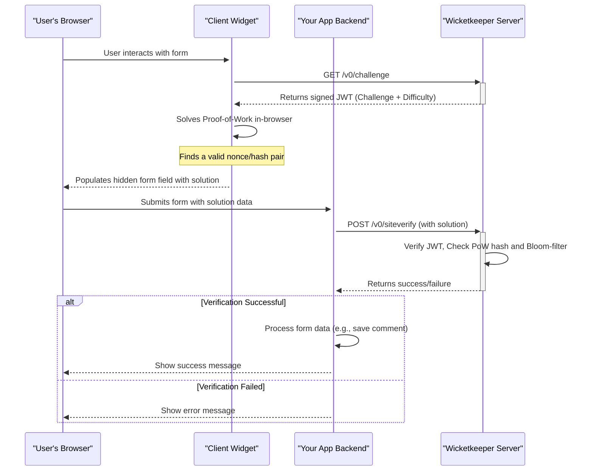

<p align="center">
  <a href="https://wicketkeeper.io"></a>
</p>


사용자 중심의 대안으로 설계된 프라이버시 친화적인 작업 증명(PoW) 캡차 시스템입니다. Wicketkeeper는 사용자가 짜증나는 퍼즐을 풀 필요 없이 간단한 봇으로부터 웹 폼을 보호합니다.

이는 최신 기기가 쉽게 해결할 수 있지만 봇이 대규모로 수행하기에는 비용이 많이 드는 소규모 클라이언트 측 계산 과제를 발급함으로써 달성됩니다. 이 시스템은 Go 백엔드, 임베디드 가능한 JavaScript 클라이언트, 그리고 풀스택 데모 애플리케이션으로 구성되어 있습니다.

---

## 목차

- [기능](#features)
- [작동 원리](#how-it-works)
- [프로젝트 구조](#project-structure)
- [시작하기: 전체 데모 설정](#getting-started-full-demo-setup)
  - [필수 조건](#prerequisites)
  - [1단계: 저장소 복제](#step-1-clone-the-repository)
  - [2단계: 백엔드 서비스 실행](#step-2-run-the-backend-services)
  - [3단계: 클라이언트 위젯 빌드](#step-3-build-the-client-widget)
  - [4단계: 예제 애플리케이션 실행](#step-4-run-the-example-application)
- [개별 컴포넌트 사용법](#usage-of-individual-components)
  - [Wicketkeeper 서버 (Go)](#wicketkeeper-server-go)
  - [클라이언트 위젯 (JavaScript)](#client-widget-javascript)

## 기능

- **작업 증명 엔진:** 시각적 퍼즐을 사용자에게는 쉽고 봇에게는 어려운 계산 과제로 대체합니다.
- **무상태 및 보안:** 도전/응답 주기에 서명된 JSON 웹 토큰(JWT)을 사용하여 서버 측 세션 상태를 제거합니다.
- **재생 공격 방지:** Redis 블룸 필터를 활용하여 고성능, 시간 창 내에서 도전 재사용을 방지합니다.
- **임베디드 클라이언트 위젯:** 어떤 웹 폼에도 쉽게 통합할 수 있는 경량 의존성 없는 JavaScript 위젯입니다.
- **구성 가능:** 환경 변수로 PoW 난이도, CORS 출처, 포트를 쉽게 조절할 수 있습니다.
- **컨테이너화:** 백엔드 서버 및 Redis 의존성의 손쉬운 배포를 위한 Docker 및 Docker Compose 완전 지원.
- **풀스택 데모:** 실제 통합을 보여주는 Express.js + TypeScript 완전 예제를 포함합니다.

## 작동 원리

위켓키퍼 생태계는 네 가지 주요 주체로 구성됩니다: 사용자의 브라우저, 클라이언트 위젯, 귀하의 애플리케이션 백엔드, 그리고 위켓키퍼 서버.


1.  **도전 요청:** 클라이언트 위젯이 Wicketkeeper 서버에 새로운 PoW 도전을 요청합니다.
2.  **도전 발급:** 서버는 고유한 도전을 생성하여 서명된 JWT로 패키징한 후 클라이언트에 전송합니다.
3.  **작업 증명:** 클라이언트의 브라우저(웹 워커 사용)가 암호화 퍼즐에 대한 해답(`nonce`)을 찾습니다.
4.  **폼 통합:** 해답은 웹 폼의 숨겨진 입력 필드에 삽입됩니다.
5.  **서버 측 검증:** 사용자가 폼을 제출하면 애플리케이션 백엔드가 해답을 Wicketkeeper 서버의 `/v0/siteverify` 엔드포인트로 전송합니다.
6.  **검증:** Wicketkeeper 서버는 JWT 서명, PoW의 정확성, Redis 블룸 필터를 통해 도전이 이전에 사용된 적이 없는지 확인합니다. 최종 성공 또는 실패 응답을 반환합니다.

## 프로젝트 구조

리포지토리는 세 가지 주요 구성 요소로 구성되어 있습니다:


```
.
├── client/          # The frontend JS widget that solves the PoW challenge
├── server/          # The Go backend that issues and verifies challenges
├── example/         # A full-stack Express.js demo application
└── README.md        # This file
```
## 시작하기: 전체 데모 설정

이 가이드는 백엔드 서버, 클라이언트 위젯, 예제 애플리케이션을 포함한 전체 Wicketkeeper 생태계를 실행하는 데 도움을 줍니다.

### 사전 요구사항

- [Go](https://go.dev/doc/install) (v1.23 이상)
- [Node.js](https://nodejs.org/) (v16 이상) 및 npm
- [Docker](https://www.docker.com/products/docker-desktop/) 및 Docker Compose

### 1단계: 저장소 복제하기


```bash
git clone https://github.com/a-ve/wicketkeeper.git
cd wicketkeeper
```
### 2단계: 백엔드 서비스 실행

Go 서버와 그에 의존하는 Redis를 실행하는 가장 쉬운 방법은 Docker Compose를 사용하는 것입니다.


```bash
cd server/
mkdir data
docker-compose up -d
```
이 명령은 포트 `8080`에서 `wicketkeeper` Go 서비스를 빌드하고 시작하며, `redis-stack` 컨테이너를 실행합니다. 첫 실행 시 `server/data/`에 `wicketkeeper.key` 파일이 생성됩니다.

### 3단계: 클라이언트 위젯 빌드

클라이언트 위젯은 하나의 JavaScript 파일로 컴파일되어야 합니다.


```bash
cd ../client/
npm install
npm run build:fast
```
이렇게 하면 `client/dist/fast.js`가 생성됩니다. 이제 이 파일을 예제 애플리케이션의 public 디렉터리로 복사하세요:


```bash
cp dist/fast.js ../example/public/
```

### 4단계: 예제 애플리케이션 실행

예제는 간단한 HTML 폼을 제공하고 제출을 처리하는 Express.js 서버입니다.

```bash
cd ../example/
npm install

# Compile the TypeScript code
npx tsc

# Start the server
node dist/server.js
```
출력에 다음과 같이 표시됩니다: `🚀 Server listening on http://localhost:8081`.

이제 브라우저에서 **<http://localhost:8081>** 로 이동하여 Wicketkeeper 데모를 직접 확인할 수 있습니다!

## 개별 컴포넌트 사용법

### Wicketkeeper 서버 (Go)

서버는 환경 변수로 구성됩니다. 자세한 내용은 `server/README.md`를 참조하세요.

| 변수                | 설명                                                                                                                                                                                                | 기본값               |
| ------------------- | -------------------------------------------------------------------------------------------------------------------------------------------------------------------------------------------------- | -------------------- |
| `LISTEN_PORT`       | 서버가 수신할 포트 번호입니다.                                                                                                                                                                      | `8080`               |
| `REDIS_ADDR`        | Redis 인스턴스의 주소입니다.                                                                                                                                                                        | `127.0.0.1:6379`     |
| `REDIS_DB`          | Redis 데이터베이스 번호(0-15). **참고:** Redis 클러스터는 DB 0만 지원합니다.                                                                                                                        | `0`                  |
| `DIFFICULTY`        | PoW 해시의 선행 0 개수입니다. 숫자가 클수록 난이도가 높아집니다.                                                                                                                                     | `4`                  |
| `ALLOWED_ORIGINS`   | CORS를 위한 출처(origin)들의 쉼표로 구분된 리스트입니다 (예: `https://domain.com`).                                                                                                                   | `*`                  |
| `BASE_PATH`         | 서버의 기본 경로입니다. 참고: `/` 이외의 경로를 사용할 경우 클라이언트에서 `data-challenge-url`을 사용해야 합니다. 자세한 내용은 [여기](https://wicketkeeper.io/components/frontend-widget.html#configuration)에서 확인하세요. | `/`           |
| `PRIVATE_KEY_PATH`  | Ed25519 개인키를 저장할 경로입니다. 없으면 생성됩니다.                                                                                                                                               | `./wicketkeeper.key` |

**API 엔드포인트:**

- `GET /v0/challenge`: 새로운 PoW 챌린지를 발급합니다.
- `POST /v0/siteverify`: 해결된 챌린지를 검증합니다.

### 클라이언트 위젯 (JavaScript)

클라이언트는 단일 JS 파일(`dist/fast.js` 또는 `dist/slow.js`)로, 모든 HTML 페이지에 포함할 수 있습니다.

**1. 스크립트 포함하기**


```html
<script defer src="path/to/fast-or-slow.js"></script>
```

**2. 위젯을 폼에 추가하기**

스크립트는 `.wicketkeeper` 클래스를 가진 모든 `div`를 자동으로 초기화합니다.

```html
<form action="/submit" method="POST">
  <!-- Other form fields -->
  <div class="wicketkeeper" data-input-name="my_captcha_field"></div>
  <button type="submit">Submit</button>
</form>
```
클라이언트는 빌드 단계에서 사용자 지정 챌린지 엔드포인트로 구성할 수 있습니다. 자세한 내용은 `client/README.md`를 참조하세요.



---


Tranlated By [Open Ai Tx](https://github.com/OpenAiTx/OpenAiTx) | Last indexed: 2026-03-08


---