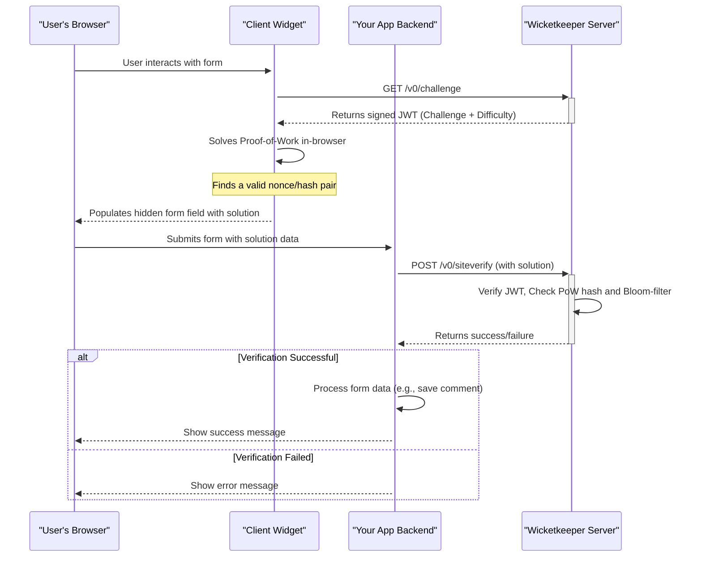

<p align="center">
  <a href="https://wicketkeeper.io"></a>
</p>


一个注重隐私的工作量证明（PoW）验证码系统，旨在成为传统验证码的以用户为中心的替代方案。Wicketkeeper 保护您的网页表单免受简单机器人攻击，无需用户解决令人沮丧的谜题。

它通过发出一个小型的客户端计算挑战来实现，这对现代设备来说易于解决，但对机器人大规模执行则代价高昂。该系统由 Go 后端、可嵌入的 JavaScript 客户端以及一个全栈演示应用组成。

---

## 目录

- [功能](#features)
- [工作原理](#how-it-works)
- [项目结构](#project-structure)
- [快速开始：完整演示搭建](#getting-started-full-demo-setup)
  - [先决条件](#prerequisites)
  - [步骤 1：克隆仓库](#step-1-clone-the-repository)
  - [步骤 2：运行后端服务](#step-2-run-the-backend-services)
  - [步骤 3：构建客户端组件](#step-3-build-the-client-widget)
  - [步骤 4：运行示例应用](#step-4-run-the-example-application)
- [各组件使用方法](#usage-of-individual-components)
  - [Wicketkeeper 服务器（Go）](#wicketkeeper-server-go)
  - [客户端组件（JavaScript）](#client-widget-javascript)

## 功能

- **工作量证明引擎：** 用计算挑战替代视觉谜题，对用户友好但对机器人难以应对。
- **无状态且安全：** 使用签名的 JSON Web Token (JWT) 进行挑战/响应，消除服务器端会话状态。
- **防重放攻击：** 利用 Redis Bloom 过滤器实现高性能、基于时间窗口的挑战重用防护。
- **可嵌入客户端组件：** 轻量、无依赖的 JavaScript 组件，轻松集成至任何网页表单。
- **可配置：** 通过环境变量轻松调整 PoW 难度、CORS 源和端口。
- **容器化：** 完整支持 Docker 和 Docker Compose，方便部署后端服务器及其 Redis 依赖。
- **全栈演示：** 包含完整的 Express.js + TypeScript 示例，展示真实世界的集成方式。

## 工作原理

Wicketkeeper 生态系统涉及四个主要参与者：用户的浏览器、客户端小部件、您的应用后端和 Wicketkeeper 服务器。


1.  **挑战请求：** 客户端小部件向 Wicketkeeper 服务器请求新的 PoW 挑战。  
2.  **挑战发放：** 服务器生成唯一挑战，将其打包成签名的 JWT，并发送给客户端。  
3.  **工作量证明：** 客户端浏览器（使用 Web Workers）找到密码难题的解决方案（`nonce`）。  
4.  **表单集成：** 解决方案被放置在网页表单的隐藏输入字段中。  
5.  **服务器端验证：** 用户提交表单时，应用后端将解决方案发送到 Wicketkeeper 服务器的 `/v0/siteverify` 端点。  
6.  **验证：** Wicketkeeper 服务器验证 JWT 签名、PoW 的正确性，并检查 Redis Bloom 过滤器以确保挑战未被重复使用。服务器返回最终成功或失败响应。  

## 项目结构  

该仓库分为三个主要组件：


```
.
├── client/          # The frontend JS widget that solves the PoW challenge
├── server/          # The Go backend that issues and verifies challenges
├── example/         # A full-stack Express.js demo application
└── README.md        # This file
```

## 入门指南：完整演示设置

本指南将帮助您运行完整的 Wicketkeeper 生态系统，包括后端服务器、客户端组件和示例应用程序。

### 先决条件

- [Go](https://go.dev/doc/install)（v1.23+）
- [Node.js](https://nodejs.org/)（v16+）和 npm
- [Docker](https://www.docker.com/products/docker-desktop/) 和 Docker Compose

### 第一步：克隆仓库

```bash
git clone https://github.com/a-ve/wicketkeeper.git
cd wicketkeeper
```

### 第2步：运行后端服务

运行Go服务器及其Redis依赖的最简单方法是使用Docker Compose。

```bash
cd server/
mkdir data
docker-compose up -d
```
这将构建并启动 `wicketkeeper` Go 服务，端口为 `8080`，以及一个 `redis-stack` 容器。首次运行时，会在 `server/data/` 生成一个 `wicketkeeper.key` 文件。

### 第三步：构建客户端小部件

客户端小部件需要编译成一个单独的 JavaScript 文件。


```bash
cd ../client/
npm install
npm run build:fast
```

这将创建 `client/dist/fast.js`。现在，将此文件复制到示例应用程序的公共目录：

```bash
cp dist/fast.js ../example/public/
```

### 第4步：运行示例应用程序

该示例是一个Express.js服务器，提供一个简单的HTML表单并处理提交。

```bash
cd ../example/
npm install

# Compile the TypeScript code
npx tsc

# Start the server
node dist/server.js
```
你应该看到输出：`🚀 服务器正在监听 http://localhost:8081`。

你现在可以在浏览器中访问 **<http://localhost:8081>** 来查看 Wicketkeeper 演示效果！

## 单个组件的使用

### Wicketkeeper 服务器（Go）

服务器通过环境变量进行配置。详情请参见 `server/README.md`。

| 变量               | 描述                                                                                                                                                                                                  | 默认值               |
| ------------------ | ----------------------------------------------------------------------------------------------------------------------------------------------------------------------------------------------------- | -------------------- |
| `LISTEN_PORT`      | 服务器监听的端口号。                                                                                                                                                                                   | `8080`               |
| `REDIS_ADDR`       | Redis 实例的地址。                                                                                                                                                                                     | `127.0.0.1:6379`     |
| `REDIS_DB`         | Redis 数据库编号（0-15）。**注意：** Redis 集群仅支持 DB 0。                                                                                                                                          | `0`                  |
| `DIFFICULTY`       | PoW 哈希要求的前导零数量。值越大难度越高。                                                                                                                                                            | `4`                  |
| `ALLOWED_ORIGINS`  | 用逗号分隔的 CORS 允许来源列表（例如，`https://domain.com`）。                                                                                                                                         | `*`                  |
| `BASE_PATH`        | 服务器的基础路径。注意：对于非 `/` 路径，客户端使用时应使用 `data-challenge-url`。详见 [这里](https://wicketkeeper.io/components/frontend-widget.html#configuration)。                                   | `/`                  |
| `PRIVATE_KEY_PATH` | 用于存储 Ed25519 私钥的路径。如果不存在则会创建。                                                                                                                                                     | `./wicketkeeper.key` |

**API 端点：**

- `GET /v0/challenge`：发放一个新的 PoW 挑战。
- `POST /v0/siteverify`：验证已解答的挑战。

### 客户端控件（JavaScript）

客户端是一个单独的 JS 文件（`dist/fast.js` 或 `dist/slow.js`），可以嵌入任何 HTML 页面。

**1. 引入脚本**


```html
<script defer src="path/to/fast-or-slow.js"></script>
```

**2. 将控件添加到表单中**

该脚本会自动初始化任何带有 `.wicketkeeper` 类的 `div`。

```html
<form action="/submit" method="POST">
  <!-- Other form fields -->
  <div class="wicketkeeper" data-input-name="my_captcha_field"></div>
  <button type="submit">Submit</button>
</form>
```
客户端可以在构建步骤中配置自定义挑战端点。详细信息请参见 `client/README.md`。



---


Tranlated By [Open Ai Tx](https://github.com/OpenAiTx/OpenAiTx) | Last indexed: 2026-03-08


---