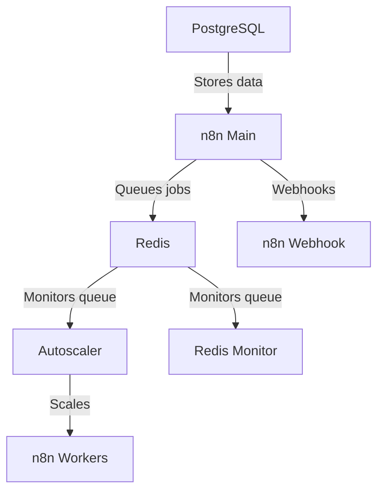

現在cloudflaredを含んでいます。cloudflare.comで設定し、トークンを.envファイルに貼り付けてください。

ステップバイステップの手順についてはこのガイドを参照してください：https://www.reddit.com/r/n8n/comments/1l9mi6k/major_update_to_n8nautoscaling_build_step_by_step/

cloudflaredを使用したくない方のために、cloudflaredなしの元のバージョンはブランチに保存されています。

# n8n オートスケーリングシステム

n8nワークフロー自動化プラットフォーム向けのDockerベースのオートスケーリングソリューション。Redisキューの長さに基づいてワーカーコンテナを動的にスケールします。k8sや他のコンテナスケーリングプロバイダを扱う必要はなく、シンプルなスクリプトが全てを実行し、簡単に設定可能です。

8コア16GBメモリのVPS上で数百の同時実行をテスト済みです。

n8nコードノードからのプロレベルのスクレイピング用にPuppeteerとChromeが組み込まれており、コミュニティノードよりも優れた動作をします。

インストールは簡単で、ファイルをクローンしdocker compose upを実行するだけです。

## アーキテクチャ概要


## 特徴

- キューの長さに基づくn8nワーカーコンテナの動的スケーリング
- 設定可能なスケーリングの閾値と制限
- Redisキューの監視
- Docker Composeを使ったデプロイメント
- すべてのサービスのヘルスチェック

## 前提条件

- DockerおよびDocker Compose。
- 新規ユーザーの場合、docker desktopまたはUbuntu向けのdocker便利スクリプトの使用を推奨します。  
- Cloudflareのドメインとサブドメインを設定してください。

## クイックスタート

1. このリポジトリを任意のフォルダにコピーまたはクローンします
2. .env.exampleを.envにリネームします
3. .envファイル内の環境変数を設定します - デフォルトで動作しますが、新しいパスワードとトークンを設定してください。
4. 実行してください：

   ```bash
   docker network create shark
   ```
5. 実行:
   ```bash
   docker compose up -d
   ```
私たちはステップ4でshark外部ネットワークを作成し、後で他のコンテナを簡単に接続できるようにしています。  
これを行いたくない場合は、docker composeファイル内のsharkネットワークをコメントアウトしてください。  

## 設定

- .envファイルに自分自身のパスワードや暗号化キーを必ず設定してください!!!
- デフォルトでは各ワーカーが同時に10タスクを処理します。docker-compose内で以下を変更可能です：  
   - N8N_CONCURRENCY_PRODUCTION_LIMIT=10
- これらは秒単位で予想される最長のワークフロー実行時間より長く設定してください：  
   - N8N_QUEUE_BULL_GRACEFULSHUTDOWNTIMEOUT=300
   - N8N_GRACEFUL_SHUTDOWN_TIMEOUT=300

### 主要環境変数

| 変数 | 説明 | デフォルト |
|----------|-------------|---------|
| `MIN_REPLICAS` | ワーカーコンテナの最小数 | 1 |
| `MAX_REPLICAS` | ワーカーコンテナの最大数 | 5 |
| `SCALE_UP_QUEUE_THRESHOLD` | スケールアップをトリガーするキュー長 | 5 |
| `SCALE_DOWN_QUEUE_THRESHOLD` | スケールダウンをトリガーするキュー長 | 2 |
| `POLLING_INTERVAL_SECONDS` | キュー長をチェックする頻度（秒） | 30 |
| `COOLDOWN_PERIOD_SECONDS` | スケール操作間の待機時間（秒） | 180 |
| `QUEUE_NAME_PREFIX` | Redisキュープレフィックス | `bull` |
| `QUEUE_NAME` | Redisキュー名 | `jobs` |

### n8n設定

これらのn8n環境変数が設定されていることを確認してください：
- `EXECUTIONS_MODE=queue`
- `QUEUE_BULL_REDIS_HOST=redis`
- `QUEUE_HEALTH_CHECK_ACTIVE=true`

## スケーリング動作

オートスケーラーは：
1. `POLLING_INTERVAL_SECONDS`ごとにRedisキュー長を監視
2. スケールアップ条件：  
   - キュー長 > `SCALE_UP_QUEUE_THRESHOLD`  
   - 現在のレプリカ数 < `MAX_REPLICAS`
3. スケールダウン条件：  
   - キュー長 < `SCALE_DOWN_QUEUE_THRESHOLD`  
   - 現在のレプリカ数 > `MIN_REPLICAS`
4. スケール操作間のクールダウン期間を遵守

## 監視

システムには以下が含まれます：
- Redisキューモニターサービス（`redis-monitor`）
- すべてのサービスのDockerヘルスチェック
- オートスケーラーによる詳細ログ

## トラブルシューティング

- コンテナログの確認：`docker-compose logs [service]`
- Redis接続の確認：`docker-compose exec redis redis-cli ping`
- 手動でキュー長を確認：`docker-compose exec redis redis-cli LLEN bull:jobs:wait`

Webhook URL例：  
WebhookはローカルホストではなくCloudflareのサブドメイン名を使用します。例：  
http://webhook.domain.com/webhook/d7e73b77-6cfb-4add-b454-41e4c91461d8

## ライセンス

MITライセンス - 詳細は[LICENSE](LICENSE)をご覧ください。



---


Tranlated By [Open Ai Tx](https://github.com/OpenAiTx/OpenAiTx) | Last indexed: 2025-07-14


---