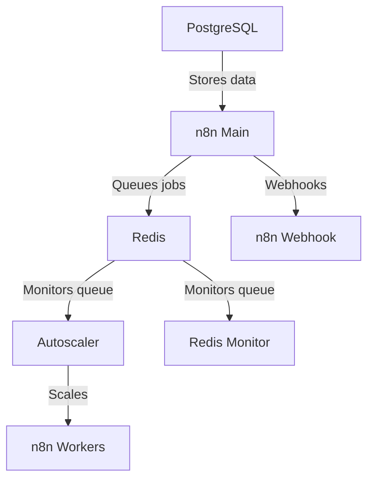

이제 cloudflared가 포함되어 있습니다. cloudflare.com에서 구성하고 .env 파일에 토큰을 붙여넣으세요.  

단계별 지침은 다음 가이드를 참조하세요: https://www.reddit.com/r/n8n/comments/1l9mi6k/major_update_to_n8nautoscaling_build_step_by_step/

cloudflared를 사용하지 않는 분들을 위해 원본 버전은 브랜치에 저장되어 있습니다. 

# n8n 자동 확장 시스템

n8n 워크플로 자동화 플랫폼을 위한 Docker 기반 자동 확장 솔루션입니다. Redis 큐 길이에 따라 워커 컨테이너를 동적으로 확장합니다. k8s나 다른 컨테이너 확장 제공자를 다룰 필요 없이 간단한 스크립트로 모두 실행되며 쉽게 구성할 수 있습니다.

8코어 16GB 램 VPS에서 수백 개의 동시 실행을 테스트했습니다.  

n8n 코드 노드에서 전문 수준의 스크래핑을 위한 Puppeteer와 Chrome이 내장되어 있어 커뮤니티 노드보다 더 잘 작동합니다.  

간단한 설치, 파일을 클론한 후 docker compose up 명령만 실행하세요

## 아키텍처 개요


## 기능

- 큐 길이에 따른 n8n 워커 컨테이너의 동적 확장
- 구성 가능한 확장 임계값 및 한도
- Redis 큐 모니터링
- Docker Compose 기반 배포
- 모든 서비스에 대한 상태 검사

## 사전 요구사항

- Docker 및 Docker Compose.
- 새 사용자라면 docker desktop 또는 우분투용 도커 편의 스크립트 사용을 권장합니다.  
- Cloudflare 도메인 및 서브도메인 설정.

## 빠른 시작

1. 이 저장소를 원하는 폴더에 복사하거나 클론하세요
2. .env.example 파일명을 .env로 변경하세요
3. .env 파일에서 환경 변수를 구성하세요 - 기본값은 사용 가능하지만 새 비밀번호와 토큰을 설정하세요.
4. 실행:

   ```bash
   docker network create shark
   ```
5. 실행:
   ```bash
   docker compose up -d
   ```
우리는 나중에 다른 컨테이너를 쉽게 연결할 수 있도록 4단계에서 shark 외부 네트워크를 생성합니다.  만약 이것을 원하지 않는다면, docker compose 파일에서 shark 네트워크를 주석 처리할 수 있습니다.  

## 설정

- .env 파일에 본인만의 비밀번호와 암호화 키를 반드시 설정하세요!!!
- 기본적으로 각 워커는 한 번에 10개의 작업을 처리하며, docker-compose에서 다음 항목을 수정할 수 있습니다:      
   - N8N_CONCURRENCY_PRODUCTION_LIMIT=10
- 다음 값들은 예상되는 가장 긴 워크플로 실행 시간을 초 단위로 넘기도록 조정하세요:
   - N8N_QUEUE_BULL_GRACEFULSHUTDOWNTIMEOUT=300
   - N8N_GRACEFUL_SHUTDOWN_TIMEOUT=300

### 주요 환경 변수

| 변수 | 설명 | 기본값 |
|----------|-------------|---------|
| `MIN_REPLICAS` | 최소 워커 컨테이너 수 | 1 |
| `MAX_REPLICAS` | 최대 워커 컨테이너 수 | 5 |
| `SCALE_UP_QUEUE_THRESHOLD` | 확장 트리거를 위한 큐 길이 | 5 |
| `SCALE_DOWN_QUEUE_THRESHOLD` | 축소 트리거를 위한 큐 길이 | 2 |
| `POLLING_INTERVAL_SECONDS` | 큐 길이 확인 주기 | 30 |
| `COOLDOWN_PERIOD_SECONDS` | 스케일링 동작 간 대기 시간 | 180 |
| `QUEUE_NAME_PREFIX` | Redis 큐 접두어 | `bull` |
| `QUEUE_NAME` | Redis 큐 이름 | `jobs` |

### n8n 구성

다음 n8n 환경 변수가 설정되어 있는지 확인하세요:
- `EXECUTIONS_MODE=queue`
- `QUEUE_BULL_REDIS_HOST=redis`
- `QUEUE_HEALTH_CHECK_ACTIVE=true`

## 스케일링 동작

오토스케일러는:
1. `POLLING_INTERVAL_SECONDS`마다 Redis 큐 길이를 모니터링합니다.
2. 다음 조건 시 확장합니다:
   - 큐 길이 > `SCALE_UP_QUEUE_THRESHOLD`
   - 현재 복제 수 < `MAX_REPLICAS`
3. 다음 조건 시 축소합니다:
   - 큐 길이 < `SCALE_DOWN_QUEUE_THRESHOLD`
   - 현재 복제 수 > `MIN_REPLICAS`
4. 스케일링 동작 간 쿨다운 기간을 준수합니다.

## 모니터링

시스템은 다음을 포함합니다:
- Redis 큐 모니터 서비스 (`redis-monitor`)
- 모든 서비스에 대한 Docker 헬스 체크
- 오토스케일러의 상세 로그

## 문제 해결

- 컨테이너 로그 확인: `docker-compose logs [서비스명]`
- Redis 연결 확인: `docker-compose exec redis redis-cli ping`
- 수동으로 큐 길이 확인: `docker-compose exec redis redis-cli LLEN bull:jobs:wait`

웹훅 URL 예시:
웹훅은 로컬 호스트가 아닌 클라우드플레어 서브도메인을 사용합니다, 예:
http://webhook.domain.com/webhook/d7e73b77-6cfb-4add-b454-41e4c91461d8


## 라이선스

MIT 라이선스 - 자세한 내용은 [LICENSE](LICENSE)를 참조하세요.



---


Tranlated By [Open Ai Tx](https://github.com/OpenAiTx/OpenAiTx) | Last indexed: 2025-07-14


---